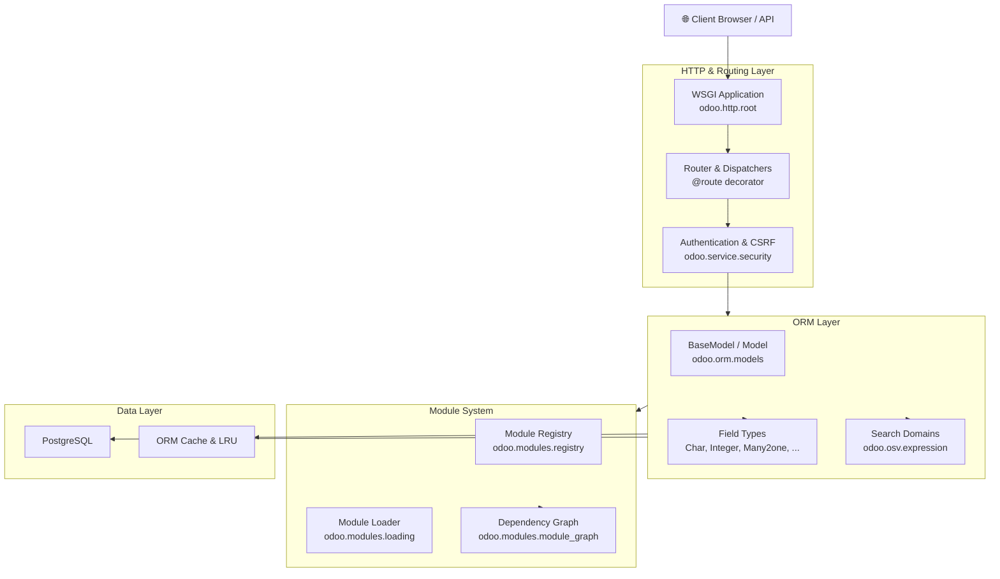

---
slug:1-overview
blog_type:normal
---


Welcome to the Odoo 19.0 codebase. This page serves as your launchpad into one of the largest open-source ERP platforms in the world — a monolithic Python application that covers everything from CRM and accounting to manufacturing and point-of-sale, all woven together by a powerful ORM, a modular architecture, and a WSGI-based HTTP layer. Whether you want to build custom modules, extend existing ones, or simply understand how 2,000+ interdependent packages coalesce into a running server, this is where your journey begins.

## What Is Odoo?

Odoo is a **full-stack business application framework** written primarily in Python, backed by PostgreSQL, and served through a WSGI HTTP layer. At its core, it is an ERP and CRM platform, but its architecture makes it equally valid to think of it as a **low-code development platform** where each business app (sales, inventory, HR, etc.) is a Python module — called an **addon** — that can be installed, extended, or replaced independently. The framework's self-description in the release metadata captures this breadth: *"Odoo is a complete ERP and CRM. The main features are accounting (analytic and financial), stock management, sales and purchases management, tasks automation, marketing campaigns, help desk, POS, etc."* [release.py](odoo/release.py#L15-L21). The entire system is distributed under the **LGPL-3** license [release.py](odoo/release.py#L40), with the server source in this repository and a separate frontend that compiles assets bundled into each addon's `static/` directory.

Sources: [release.py](odoo/release.py#L15-L42), [README.md](README.md#L1-L38)

## Version and Runtime Requirements

Odoo 19.0 is the current major series on the 19.0 branch, as declared in the version metadata using a Python-style version info tuple of `(19, 0, 0, 'final', 0, '')` [release.py](odoo/release.py#L9-L13). The framework enforces strict runtime boundaries:

| Requirement | Minimum | Maximum / Notes |
|---|---|---|
| **Python** | 3.10 [release.py](odoo/release.py#L41) | 3.13 (enforced via assert) [release.py](odoo/release.py#L42) |
| **PostgreSQL** | 13 [release.py](odoo/release.py#L43) | No upper bound declared |
| **Key Python deps** | psycopg2, werkzeug, lxml, Jinja2, gevent, babel, reportlab | 40+ total dependencies [setup.py](setup.py#L25-L73) |

The Python version check happens at import time in the initialization module, aborting immediately if the runtime is too old [init.py](odoo/init.py#L9-L10). An additional garbage collection tuning step adjusts GC thresholds to accommodate the high object-allocation rate of web request processing [init.py](odoo/init.py#L16-L19).

Sources: [release.py](odoo/release.py#L9-L43), [setup.py](setup.py#L1-L78), [init.py](odoo/init.py#L9-L19)

## High-Level Architecture

Understanding Odoo at a structural level means grasping four cooperative layers that every request and every module touches. The following diagram shows how a client request flows from the network through these layers to the database and back.



The **HTTP Layer** ([odoo/http.py](odoo/http.py)) is the WSGI entry point. Every incoming request passes through the `Application.__call__` method, which classifies the request into static assets, no-database routes (auth='none'), or full database-backed dispatch [http.py](odoo/http.py#L15-L91). The **ORM Layer** ([odoo/models/](odoo/models/__init__.py)) provides `BaseModel`, `Model`, `AbstractModel`, and `TransientModel` — the four model types that all addons extend. The **Module System** ([odoo/modules/](odoo/modules/__init__.py)) manages addon discovery, dependency resolution via a directed graph, registry construction, and data loading. Finally, the **Data Layer** is PostgreSQL with psycopg2, augmented by a multi-level ORM cache system.

Sources: [http.py](odoo/http.py#L1-L100), [models/__init__.py](odoo/models/__init__.py#L1-L32), [modules/loading.py](odoo/modules/loading.py#L1-L55), [service/server.py](odoo/service/server.py#L1575-L1610)

## Repository Structure

The repository is organized around a single top-level `odoo/` package that contains the entire server framework, with a separate `addons/` directory for first-party addons maintained alongside the core. The entry point script `odoo-bin` is a thin wrapper that delegates to `odoo.cli.main()`.

```
odoo/                        ← Core server package
├── __init__.py              ← Early init: GC tuning, shortcuts
├── __main__.py              ← Allows `python -m odoo`
├── release.py               ← Version info, metadata
├── http.py                  ← WSGI application, routing, controllers
├── cli/                     ← CLI command framework
│   ├── command.py           ← Base Command class, command discovery
│   ├── server.py            ← Default "server" command
│   ├── scaffold.py          ← Module scaffolding
│   ├── shell.py             ← Interactive ORM shell
│   └── db.py, module.py …   ← Database & module management
├── service/                 ← Server processes & workers
│   ├── server.py            ← ThreadedServer, GeventServer, PreforkServer
│   ├── db.py                ← Database creation/management
│   └── security.py          ← Session token validation
├── models/                  ← ORM public exports
├── orm/                     ← ORM implementation
│   ├── models.py            ← BaseModel (7,100+ lines — the heart)
│   ├── fields.py            ← Base Field class
│   ├── fields_*.py          ← Specialized field types
│   ├── domains.py           ← Domain AST & evaluation
│   ├── environments.py      ← Environment (cursor, user, context)
│   └── registry.py          ← Per-database model registry
├── modules/                 ← Module system
│   ├── loading.py           ← Data/demo file loading
│   ├── module.py            ← Manifest parsing, module discovery
│   ├── module_graph.py      ← Dependency graph resolution
│   └── registry/            ← Registry construction
├── addons/                  ← Core addons (base, tests, etc.)
│   ├── base/                ← The kernel addon — always installed
│   └── test_*/              ← Integration test addons
├── tools/                   ← Utilities (config, i18n, cache, SQL…)
└── _monkeypatches/          ← Third-party library patches
```

The **`base`** addon, located at [odoo/addons/base/](odoo/addons/base/__manifest__.py), is the kernel of the system — it is auto-installed on every database and provides foundational models (`ir.model`, `res.partner`, `res.users`, `ir.ui.view`, etc.), security groups, menus, and the default report infrastructure [base/__manifest__.py](odoo/addons/base/__manifest__.py#L95-L96). Every other addon implicitly or explicitly depends on `base` through the dependency graph [module_graph.py](odoo/modules/module_graph.py#L22-L55).

Sources: [odoo-bin](odoo-bin#L1-L7), [cli/command.py](odoo/cli/command.py#L1-L50), [addons/base/__manifest__.py](odoo/addons/base/__manifest__.py#L1-L100), [module_graph.py](odoo/modules/module_graph.py#L22-L55)

## Entry Point and CLI System

The entire system boots from a single 7-line script. The `odoo-bin` executable imports `odoo.cli` and calls `main()` [odoo-bin](odoo-bin#L1-L7). The CLI framework, defined in [cli/command.py](odoo/cli/command.py), uses a plugin-based architecture where every command is a Python class inheriting from `Command`. Commands are discovered from three sources:

1. **Built-in commands** in `odoo/cli/*.py` — loaded eagerly via `load_internal_commands()` [cli/command.py](odoo/cli/command.py#L82-L86)
2. **Lazy imports** from `odoo.cli.{name}` — loaded on demand when a command is requested [cli/command.py](odoo/cli/command.py#L105-L108)
3. **Addon commands** from `odoo.addons.*/cli/*.py` — discovered by scanning addon paths at runtime [cli/command.py](odoo/cli/command.py#L89-L100)

If no command is specified, the **`server`** command is the default [cli/command.py](odoo/cli/command.py#L129-L133). This command performs pre-flight checks (root user warning, postgres user rejection, configuration reporting), optionally creates an empty database, then delegates to `server.start()` which instantiates the appropriate server class based on configuration [cli/server.py](odoo/cli/server.py#L79-L107).

Sources: [odoo-bin](odoo-bin#L1-L7), [cli/command.py](odoo/cli/command.py#L50-L140), [cli/server.py](odoo/cli/server.py#L79-L107)

## Server Modes

The `start()` function in the server module is the pivotal decision point for which concurrency model to use [service/server.py](odoo/service/server.py#L1575-L1610). Odoo supports three server modes, each with distinct trade-offs:

| Server Mode | Class | Trigger | Best For |
|---|---|---|---|
| **Threaded** | `ThreadedServer` [L462](odoo/service/server.py#L462) | Default (no `--workers`, non-gevent) | Development, small deployments |
| **Prefork** | `PreforkServer` [L867](odoo/service/server.py#L867) | `--workers N` (N > 0) | Production HTTP workloads |
| **Gevent** | `GeventServer` [L755](odoo/service/server.py#L755) | `--gevent` flag or `odoo.evented = True` | Long-polling, WebSockets, live chat |

The selection logic is straightforward: if `odoo.evented` is true, use `GeventServer`; else if `config['workers']` is set, use `PreforkServer`; otherwise default to `ThreadedServer` [service/server.py](odoo/service/server.py#L1579-L1593). In threaded mode, the server also spawns a separate cron thread for scheduled tasks [service/server.py](odoo/service/server.py#L530-L608), while in prefork mode, dedicated `WorkerCron` processes handle cron jobs [service/server.py](odoo/service/server.py#L1390-L1483).

<CgxTip>
In production, always use `--workers` (Prefork mode). The ThreadedServer is single-process with no request isolation — a single unhandled exception can crash the entire server. Prefork mode also provides dedicated cron workers that won't interfere with HTTP request handling.
</CgxTip>

Sources: [service/server.py](odoo/service/server.py#L462-L752), [service/server.py](odoo/service/server.py#L755-L866), [service/server.py](odoo/service/server.py#L867-L1213), [service/server.py](odoo/service/server.py#L1575-L1610)

## The Module System at a Glance

Every Odoo business feature is packaged as an **addon module** — a directory containing a `__manifest__.py` file (the module's identity card), Python models, XML/CSV data files, views, security rules, and static web assets. The module system in [odoo/modules/](odoo/modules/__init__.py) handles the full lifecycle: scanning addon paths, parsing manifests, resolving the dependency graph, constructing per-database registries, and loading data files.

The **dependency graph** is a directed acyclic graph (DAG) where every module must declare its dependencies in the manifest's `'depends'` key. The base module sits at the root — every other module depends on it either directly or transitively [module_graph.py](odoo/modules/module_graph.py#L22-L55). Module states follow a strict lifecycle: `uninstallable` → `uninstalled` → `to install` → `installed` → `to upgrade` → `installed`, or `installed` → `to remove` → `uninstalled` [module_graph.py](odoo/modules/module_graph.py#L34-L40).

<CgxTip>
When creating a new module, always run `odoo-bin scaffold my_module` to generate the standard directory structure. This ensures your manifest, models, views, and security files follow the conventions that the module loader expects. See [Module Scaffolding](18-module-scaffolding) for details.
</CgxTip>

Sources: [modules/loading.py](odoo/modules/loading.py#L1-L55), [modules/module_graph.py](odoo/modules/module_graph.py#L1-L60), [addons/base/__manifest__.py](odoo/addons/base/__manifest__.py#L1-L100)

## Key Directories and Their Roles

| Directory | Purpose | Where to Learn More |
|---|---|---|
| `odoo/http.py` | WSGI app, routing, controllers | [Controller and Route System](14-controller-and-route-system) |
| `odoo/orm/` | ORM engine, fields, domains | [BaseModel and Model Hierarchy](9-basemodel-and-model-hierarchy) |
| `odoo/models/` | Public ORM exports | [Recordset Operations](11-recordset-operations) |
| `odoo/modules/` | Module loading, registry, graph | [Module Loading and Registry](17-module-loading-and-registry) |
| `odoo/service/server.py` | Server processes & workers | [Server Modes and Workers](20-server-modes-and-workers) |
| `odoo/cli/` | CLI command framework | [CLI Commands Reference](4-cli-commands-reference) |
| `odoo/tools/` | Utilities, config, i18n, cache | [Configuration and Tools](22-configuration-and-tools) |
| `odoo/addons/base/` | Kernel module — always installed | [Project Structure and Layout](3-project-structure-and-layout) |

## What's Next?

Now that you have the lay of the land, here is the recommended reading order based on your goals:

- **Get running immediately**: Jump to [Quick Start](2-quick-start) to install dependencies and launch your first Odoo instance.
- **Understand the file layout**: Read [Project Structure and Layout](3-project-structure-and-layout) for a deeper walkthrough of every directory.
- **Master the CLI**: Explore [CLI Commands Reference](4-cli-commands-reference) to learn about `scaffold`, `shell`, `deploy`, and all available commands.
- **Dive into the architecture**: The [Architecture Overview](8-architecture-overview) page provides the comprehensive technical deep-dive that connects all these layers together.

Every page cross-references the exact source files and line numbers, so you can always follow the breadcrumbs back into the code itself.