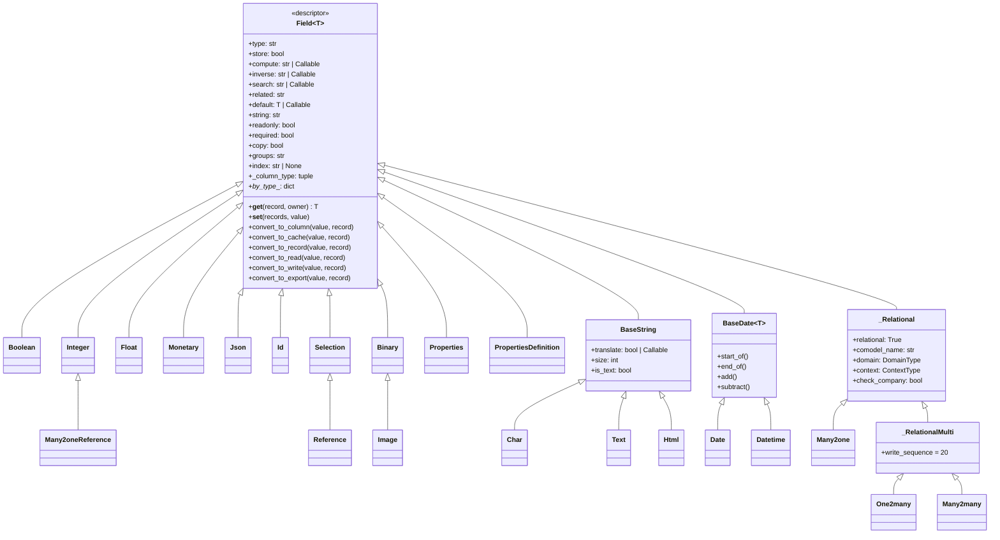
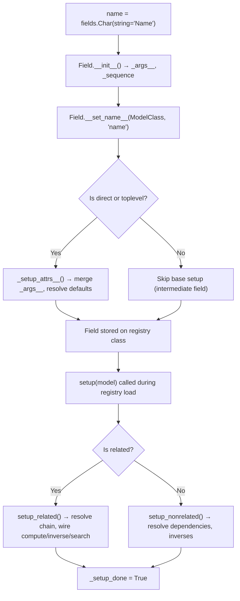
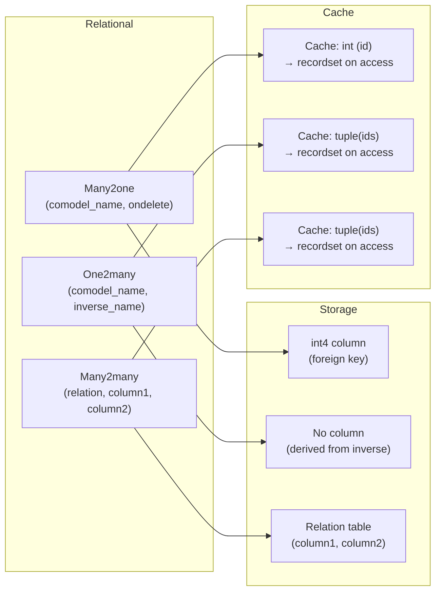
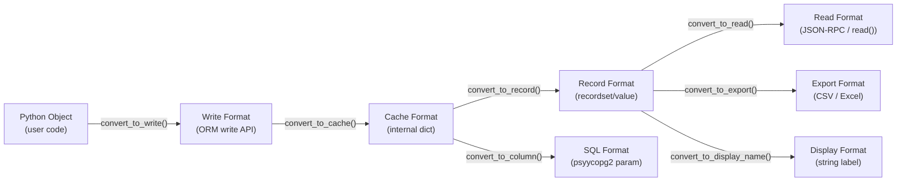

---
slug:10-field-types-and-definitions
blog_type:normal
---


Odoo's field system is the declarative backbone of its ORM — every column, every computed value, every relational link begins life as a field descriptor. This page dissects the `Field` base class and its full taxonomy of concrete types, tracing the lifecycle from Python attribute declaration through database column materialization and cache interaction.

## The Field Foundation: Architecture and Module Layout

The field subsystem was refactored in Odoo 19.0 from a single monolithic `fields.py` into a dedicated package under `odoo/orm/`, splitting each logical category into its own module. The public API is re-exported through `odoo/fields/__init__.py`, which serves as the import surface developers interact with when writing `from odoo import fields`.

Sources: [odoo/fields/__init__.py](odoo/fields/__init__.py#L1-L23)

```
odoo/orm/fields.py              ← Base Field[T] generic class (1940 lines)
odoo/orm/fields_numeric.py       ← Integer, Float, Monetary
odoo/orm/fields_textual.py       ← Char, Text, Html (+ BaseString abstract)
odoo/orm/fields_relational.py    ← _Relational, Many2one, _RelationalMulti, One2many, Many2many
odoo/orm/fields_misc.py          ← Boolean, Json, Id
odoo/orm/fields_temporal.py      ← BaseDate, Date, Datetime
odoo/orm/fields_selection.py     ← Selection
odoo/orm/fields_reference.py     ← Reference, Many2oneReference
odoo/orm/fields_binary.py        ← Binary, Image
odoo/orm/fields_properties.py    ← Properties, Property, PropertiesDefinition
odoo/orm/commands.py             ← Command enum (x2many write operations)
```

The inheritance hierarchy flows from a single generic root:



The `_by_type__` class-level dictionary on `Field` is populated automatically by `__init_subclass__`, registering each concrete subclass by its `type` string — enabling runtime field type lookup and metadata introspection.

Sources: [odoo/orm/fields.py](odoo/orm/fields.py#L329-L346)

## Field Descriptor Protocol and Setup Lifecycle

The `Field` class is a **Python descriptor** (implementing `__get__` and `__set__`), which is the mechanism that transforms a simple class attribute into a full database-aware property. Every field instance progresses through a multi-phase setup lifecycle before it becomes operational.

### Phase 1: Declaration and `__init__`

When a developer writes `name = fields.Char()`, the `Field.__init__` method captures all keyword arguments into an immutable `_args__` dictionary and assigns a globally unique `_sequence` counter. Critically, `__init__` does **not** assign any attributes to `self` beyond `_sequence` and `_args__` — the actual parameter attributes (`store`, `readonly`, `compute`, etc.) are deferred to `_setup_attrs__`. This separation allows the ORM to merge field definitions from multiple inheritance layers before resolving the final attribute values.

Sources: [odoo/orm/fields.py](odoo/orm/fields.py#L314-L318)

### Phase 2: `__set_name__` and Base Setup

Python's descriptor protocol calls `__set_name__(owner, name)` when the field is assigned to a class. This is where the field receives its `model_name`, `name`, and `_module` identity. If the field is on a definition class (not a registry class), it is registered in `owner._field_definitions`. The method then invokes `_setup_attrs__` if the field is "direct" or "toplevel" — meaning it is either a non-related field on a model, or the final merged field on a registry class.

The distinction between **direct** fields (shareable across registries), **toplevel** fields (registry-specific), and intermediate fields (discarded after merging) is a memory optimization. After setup, toplevel fields eagerly discard `_args__` and `_base_fields__` to reduce memory pressure, since those dictionaries are no longer needed.

Sources: [odoo/orm/fields.py](odoo/orm/fields.py#L384-L410)

### Phase 3: `_setup_attrs__` and Attribute Resolution

`_setup_attrs__` calls `_get_attrs()` to build the definitive attribute dictionary, which merges parameters from all base field definitions (in override/MRO order), applies sensible defaults for computed and related fields, and validates constraints. The key default-resolution logic includes:

- **Computed fields**: default to `store=False`, `compute_sudo` matches `store`, `copy=False` (unless stored and explicitly non-readonly), `readonly=True` (unless an inverse exists).
- **Related fields**: default to `store=False`, `compute_sudo=True`, `copy=False`, `readonly=True`.
- **`precompute`**: issues a warning if set on non-computed fields or non-stored fields, then disables it.
- **`company_dependent`**: warns if `required`, `translate`, or an unsupported type; defaults `index` to `'btree_not_null'` and `prefetch` to `'company_dependent'`.
- **Deprecated `group_operator`**: automatically remaps to `aggregator` with a deprecation warning.

After resolution, `self.__dict__.update(attrs)` applies all final attribute values. Non-stored, non-column, or manual fields have `prefetch` forced to `False`. If no `string` label was provided, a human-readable label is synthesized from the field name.

Sources: [odoo/orm/fields.py](odoo/orm/fields.py#L416-L518)

### Phase 4: `setup()` and Complete Initialization

The `setup(model)` method is called during registry finalization and performs the full field initialization that may depend on other models being loaded. It validates extra (unknown) parameters against `_valid_field_parameter`, then delegates to either `setup_related(model)` or `setup_nonrelated(model)`. For related fields, the setup resolves the dot-separated chain, verifies type consistency, establishes the `related_field` reference, and automatically wires up `compute`, `inverse`, and `search` methods.

Sources: [odoo/orm/fields.py](odoo/orm/fields.py#L528-L554), [odoo/orm/fields.py](odoo/orm/fields.py#L606-L666)



## Universal Field Attributes

These attributes are available on every `Field` subclass and form the declarative contract for all field types.

| Attribute | Type | Default | Purpose |
|---|---|---|---|
| `string` | `str` | Auto-generated from field name | User-visible label |
| `help` | `str` | `None` | Tooltip text |
| `store` | `bool` | `True` | Persist to database column |
| `index` | `str \| None` | `None` | Database indexing strategy |
| `readonly` | `bool` | `False` | Prevent user edits |
| `required` | `bool` | `False` | Enforce NOT NULL constraint |
| `copy` | `bool` | `True` | Duplicate on `record.copy()` |
| `default` | `T \| Callable` | `None` | Default value (non-callable values are wrapped in lambda) |
| `compute` | `str \| Callable` | `None` | Compute method; auto-sets `store=False` |
| `inverse` | `str \| Callable` | `None` | Inverse write method |
| `search` | `str \| Callable` | `None` | Custom search implementation |
| `related` | `str` | `None` | Dot-separated field path for related field shortcut |
| `groups` | `str` | `None` | Comma-separated XML IDs of groups with access |
| `company_dependent` | `bool` | `False` | Store per-company values in a shared `ir.property` table |
| `prefetch` | `bool \| str` | `True` | Enable record prefetching for this field |
| `aggregator` | `str` | `None` | Aggregation operator for `read_group` (e.g., `'sum'`, `'count'`) |
| `precompute` | `bool` | `False` | Compute before record creation (stored computed fields only) |

Sources: [odoo/orm/fields.py](odoo/orm/fields.py#L248-L311)

<CgxTip>
The `write_sequence` attribute controls the order in which fields are flushed to the database during `write()`. The base default is `0`, but `Monetary` uses `10` and `_RelationalMulti` uses `20`, ensuring that monetary values are written before x2many commands are processed. This ordering is critical for referential integrity — for instance, a `Many2one` currency field must be persisted before the `One2many` line items that reference it.
</CgxTip>

## Numeric Fields

### Integer

Encapsulates Python `int` values, mapped to PostgreSQL `int4`. Integers exceeding 2^31-1 are automatically converted to `float` during `convert_to_read` to maintain XML-RPC compatibility — a legacy constraint documented explicitly in the source. The field defines `aggregator = 'sum'` by default and uses `falsy_value = 0`.

Sources: [odoo/orm/fields_numeric.py](odoo/orm/fields_numeric.py#L17-L57)

### Float

Encapsulates Python `float` values with configurable precision via the `digits` parameter. The `digits` argument accepts either a `(total, decimal)` tuple or a string referencing a dynamic precision key from `ir.config_parameter`. The column type resolution is nuanced: when `digits` is explicitly set to a falsy value (`0` or `False`), the field maps to `NUMERIC` for unlimited precision; otherwise, the default is `FLOAT8` for performance. The `round`, `is_zero`, and `compare` methods are exposed as static methods wrapping `float_round`, `float_is_zero`, and `float_compare` from `odoo.tools`.

Sources: [odoo/orm/fields_numeric.py](odoo/orm/fields_numeric.py#L60-L183)

### Monetary

A specialized `Float` subclass designed for currency-aware amounts. It introduces `currency_field` — a string naming the `Many2one` field on the same model that references `res.currency`. During `convert_to_cache` and `convert_to_column_insert`, the field retrieves the target currency to apply proper rounding. The `setup_nonrelated` method validates that `currency_field` exists and is a `Many2one` pointing to `res.currency`.

Sources: [odoo/orm/fields_numeric.py](odoo/orm/fields_numeric.py#L184-L316)

| Field | `type` | Column Type | `falsy_value` | `aggregator` |
|---|---|---|---|---|
| `Integer` | `'integer'` | `int4` | `0` | `'sum'` |
| `Float` | `'float'` | `float8` or `numeric` | `0.0` | `'sum'` |
| `Monetary` | `'monetary'` | `numeric` | `0.0` | `'sum'` |

## Textual Fields

All textual fields inherit from `BaseString`, an abstract class that manages translation support, the `is_text = True` flag, and `falsy_value = ''`. The `translate` parameter can be `True`, `False`, or a **callable** that receives a translation function and returns the translated string, enabling custom translation strategies beyond simple boolean toggling.

Sources: [odoo/orm/fields_textual.py](odoo/orm/fields_textual.py#L33-L103)

### Char

Variable-length character field. Column type is `varchar` with a length determined by `pg_varchar()` (defaults to unlimited). The `trim` attribute defaults to `True`, stripping leading/trailing whitespace. The `size` parameter, while deprecated, is still accepted for backward compatibility. Char fields use a dedicated `_column_type` property that dynamically generates the varchar specification.

Sources: [odoo/orm/fields_textual.py](odoo/orm/fields_textual.py#L465-L529)

### Text

Unlimited-length text field, mapping directly to PostgreSQL `text`. No `size` constraint is applied. Unlike `Char`, there is no trimming behavior.

Sources: [odoo/orm/fields_textual.py](odoo/orm/fields_textual.py#L530-L544)

### Html

Rich-text HTML field stored as PostgreSQL `text`, with comprehensive sanitization capabilities controlled by a matrix of boolean flags:

| Sanitization Flag | Default | Purpose |
|---|---|---|
| `sanitize` | `True` | Master toggle for all sanitization |
| `sanitize_tags` | `True` | Whitelist HTML tags |
| `sanitize_attributes` | `True` | Whitelist tag attributes |
| `sanitize_style` | `False` | Sanitize inline style attributes |
| `sanitize_form` | `True` | Sanitize form elements |
| `sanitize_overridable` | `False` | Allow `base.group_sanitize_override` to bypass sanitization |
| `strip_style` | `False` | Remove style attributes entirely (not just sanitize) |
| `strip_classes` | `False` | Remove class attributes |

The `Html` class also provides utility static methods: `escape` (HTML entity escaping), `is_empty` (checks if HTML contains only whitespace/markup), `to_plaintext` (strips tags), and `from_plaintext` (wraps in `<p>` tags).

Sources: [odoo/orm/fields_textual.py](odoo/orm/fields_textual.py#L545-L705)

## Boolean, JSON, and Id

### Boolean

Maps to PostgreSQL `bool` with `falsy_value = False`. The `_condition_to_sql` override translates boolean domain conditions (e.g., `= True`, `= False`) into SQL, handling the Odoo convention where `False` in domains can mean "either false or unset."

Sources: [odoo/orm/fields_misc.py](odoo/orm/fields_misc.py#L22-L54)

### Json

Stores arbitrary JSON data in a PostgreSQL `jsonb` column. The field explicitly documents its limitations: searching, indexing, and mutating values are not supported. During `convert_to_column`, values are wrapped with `PsycopgJson` for proper psycopg2 serialization. The `convert_to_record` method returns a **deep copy** of the value, preventing cache mutations from leaking to callers — a critical invariant for mutable JSON data.

Sources: [odoo/orm/fields_misc.py](odoo/orm/fields_misc.py#L55-L87)

### Id

A special-case field for the `id` pseudo-column. It is always `readonly` and has `prefetch = False` (since record IDs are already loaded). Its `type` is `'integer'`, intentionally conflicting with the `Integer` field, but it never generates a database column. The `to_sql` method directly returns the identifier without flushing, leveraging the fact that the `id` field is always available.

Sources: [odoo/orm/fields_misc.py](odoo/orm/fields_misc.py#L89-L136)

## Temporal Fields

Both `Date` and `Datetime` inherit from `BaseDate[T]`, a generic abstract class providing shared temporal arithmetic: `start_of`, `end_of`, `add`, and `subtract` — all delegating to `odoo.tools.date_utils`. The `BaseDate` class also implements `property_to_sql` for temporal property access in domain expressions (e.g., `create_date.month_number`).

Sources: [odoo/orm/fields_temporal.py](odoo/orm/fields_temporal.py#L27-L104)

### Date

Encapsulates `datetime.date`, stored as PostgreSQL `date`. Provides static factory methods `today()` and `context_today(record, timestamp)` (timezone-aware), plus conversion utilities `to_date(value)` and `to_string(value)`. The `from_string` method is maintained as an alias for backward compatibility.

Sources: [odoo/orm/fields_temporal.py](odoo/orm/fields_temporal.py#L106-L190)

### Datetime

Encapsulates `datetime.datetime`, stored as PostgreSQL `timestamp`. Provides `now()` for current UTC timestamp, `today()` for midnight of current day, and `context_timestamp(record, timestamp)` for converting to the user's timezone. The `expression_getter` override handles datetime-specific properties like `year`, `month`, `day`, `hour`, and `minute` — mapping them to SQL `EXTRACT` expressions.

Sources: [odoo/orm/fields_temporal.py](odoo/orm/fields_temporal.py#L191-L295)

| Field | `type` | Column Type | Python Type | Key Static Methods |
|---|---|---|---|---|
| `Date` | `'date'` | `date` | `datetime.date` | `today()`, `context_today()`, `to_date()`, `to_string()` |
| `Datetime` | `'datetime'` | `timestamp` | `datetime.datetime` | `now()`, `today()`, `context_timestamp()`, `to_datetime()`, `to_string()` |

## Selection Field

Encapsulates a choice from a predefined list of `(value, label)` pairs. The `selection` parameter can be a static list, a method name (string), or a callable that returns the selection list dynamically — evaluated each time `get_description()` is called, enabling context-sensitive option lists.

The `ondelete` parameter maps selection values to deletion policies, controlling what happens when a selection option is removed by a module update. The `validate` attribute (default `True`) enforces that written values exist in the selection list. The `_default_group_expand` method provides automatic group expansion for `read_group`, producing one group per selection option in definition order.

Sources: [odoo/orm/fields_selection.py](odoo/orm/fields_selection.py#L20-L242)

## Relational Fields

Relational fields form the most complex subsystem within the field taxonomy. They share a common abstract parent `_Relational`, which introduces `comodel_name`, `domain`, `context`, `bypass_search_access`, and `check_company` attributes. The `relational = True` class attribute serves as the type-level discriminant.

Sources: [odoo/orm/fields_relational.py](odoo/orm/fields_relational.py#L33-L42)

### Many2one

A foreign-key relationship stored as PostgreSQL `int4`. The `ondelete` parameter specifies the database-level action when the referenced record is deleted (e.g., `'set null'`, `'cascade'`, `'restrict'`). The `delegate` flag, when `True`, creates an implicit `_inherits` delegation, making the comodel's fields accessible directly on the parent model.

The `convert_to_cache` method stores **only the integer ID** (or `None`), while `convert_to_record` reconstructs the full recordset using the model's registry. This cache format is critical for performance — the ORM avoids materializing full recordsets until values are actually accessed. The `join` method produces a `LEFT JOIN` SQL fragment, enabling the query engine to traverse many2one relationships in search domains without loading intermediate records.

Sources: [odoo/orm/fields_relational.py](odoo/orm/fields_relational.py#L213-L548)

### One2many

A virtual reverse of a `Many2one`, identified by its `inverse_name` (the name of the `Many2one` field on the comodel that points back). One2many fields **do not create database columns** — their values are derived by querying the comodel with a domain filtering on the inverse field. The `copy` attribute defaults to `False` for One2many, since blindly duplicating related records is rarely desirable.

The `setup_inverses` method registers bidirectional relationships between the One2many and its inverse Many2one, enabling the ORM to maintain cache consistency across both sides of the relationship when either is modified.

Sources: [odoo/orm/fields_relational.py](odoo/orm/fields_relational.py#L836-L1198)

### Many2many

A symmetric many-to-many relationship backed by a dedicated **relation table** (not a model table). The table structure is controlled by four parameters:

- `relation`: table name (auto-generated from model names if omitted)
- `column1`: column referencing the current model (auto-generated)
- `column2`: column referencing the comodel (auto-generated)
- `ondelete`: deletion policy (defaults to `'cascade'`)

The `update_db_foreign_keys` method ensures the relation table has proper foreign key constraints to both models. The `read` method queries the relation table to retrieve linked record IDs, and `write_real` processes Command tuples to synchronize the relation table state.

Sources: [odoo/orm/fields_relational.py](odoo/orm/fields_relational.py#L1199-L1726)

### The Command Protocol for x2many Fields

All x2many operations (One2many and Many2many writes) use the `Command` enum, an `IntEnum` mapping operation codes to semantic methods:

| Command Code | Constant | Tuple Format | Description |
|---|---|---|---|
| `0` | `CREATE` | `(0, 0, {values})` | Create a new linked record |
| `1` | `UPDATE` | `(1, id, {values})` | Write values on an existing linked record |
| `2` | `DELETE` | `(2, id, 0)` | Delete the linked record from the database |
| `3` | `UNLINK` | `(3, id, 0)` | Remove the relation (record persists) |
| `4` | `LINK` | `(4, id, 0)` | Add a relation to an existing record |
| `5` | `CLEAR` | `(5, 0, 0)` | Unlink all records from the relation |
| `6` | `SET` | `(6, 0, [ids])` | Replace all relations with the given set |

Sources: [odoo/orm/commands.py](odoo/orm/commands.py#L11-L131)



## Reference Fields

### Reference

A pseudo-relational field that stores values as a `varchar` in the format `"model_name,id"` — no foreign key constraint exists in the database. It extends `Selection` (inheriting its selection list mechanism to define which models are valid targets) and overrides conversion methods to parse and reconstruct the composite string format. The `convert_to_record` method returns an actual recordset by splitting the stored string and looking up the record in the target model.

Sources: [odoo/orm/fields_reference.py](odoo/orm/fields_reference.py#L14-L58)

### Many2oneReference

Similar to `Reference` but stores the model name and record ID in **separate fields** on the same model. The `model_field` attribute names the field storing the target model name, while the Many2oneReference field itself stores only the integer ID (extending `Integer`). This separation allows more efficient querying and indexing on the ID component. The `_update_inverses` method manages cache consistency when the model field changes.

Sources: [odoo/orm/fields_reference.py](odoo/orm/fields_reference.py#L59-L119)

## Binary and Image Fields

### Binary

Encapsulates arbitrary binary content, stored as base64-encoded strings. The `attachment` parameter (default `True`) controls whether the binary data is stored as an `ir.attachment` record (preferred for large files) or directly in a column of the model's table. The `column_type` is a cached property that returns `None` when `attachment=True` (no column needed) or `('bytea', 'bytea')` otherwise. The field depends on context key `'bin_size'` — when present, reads return the file size as a human-readable string instead of the actual content.

Sources: [odoo/orm/fields_binary.py](odoo/orm/fields_binary.py#L30-L246)

### Image

A `Binary` subclass that adds automatic image processing: resizing to `max_width` × `max_height` (default 0 = no limit) and optional resolution verification (`verify_resolution = True`). The `_image_process` method handles dimension detection and resizing before storage, and the `_process_related` override ensures that related image values are resized when propagated through a `related` field.

Sources: [odoo/orm/fields_binary.py](odoo/orm/fields_binary.py#L247-L367)

## Properties and PropertiesDefinition

### Properties

A JSONB-backed field implementing a **dynamic schema** pattern — the field's structure is defined by a separate container record rather than by the field definition itself. The `definition` parameter names the `PropertiesDefinition` field on a related model that defines the schema, and `definition_record_field` names the `Many2one` field on the current model pointing to the container.

The field is computed-editable by design: `store=True`, `readonly=False`, `precompute=True`, with a `compute` method that populates default property values when the container changes. Cache format is a dict `{name: value}` or `None`. The `write_sequence = 10` ensures properties are written after the definition record field is persisted.

Sources: [odoo/orm/fields_properties.py](odoo/orm/fields_properties.py#L32-L106)

### PropertiesDefinition

Defines the schema for `Properties` fields on child records. Stored as `jsonb`, each definition entry specifies a property name, type (char, integer, selection, many2one, many2many, etc.), and type-specific parameters. The `_validate_properties_definition` method enforces structural requirements: `name` and `type` keys are mandatory, and type-specific parameter keys are validated against `PROPERTY_PARAMETERS_MAP`.

Sources: [odoo/orm/fields_properties.py](odoo/orm/fields_properties.py#L844-L1064)

## Complete Field Type Reference

| Field Class | `type` String | PostgreSQL Column | Cache Format | Relational | Special Notes |
|---|---|---|---|---|---|
| `Id` | `'integer'` | — (virtual) | id | No | Always readonly, no prefetch |
| `Boolean` | `'boolean'` | `bool` | `bool` | No | |
| `Integer` | `'integer'` | `int4` | `int` | No | XML-RPC overflow → float |
| `Float` | `'float'` | `float8` / `numeric` | `float` | No | `digits` controls precision |
| `Monetary` | `'monetary'` | `numeric` | `float` | No | Requires `currency_field` |
| `Char` | `'char'` | `varchar` | `str` | No | `trim=True` by default |
| `Text` | `'text'` | `text` | `str` | No | |
| `Html` | `'html'` | `text` | `str` | No | Full sanitization matrix |
| `Selection` | `'selection'` | `varchar` | `str` | No | Dynamic selection lists |
| `Date` | `'date'` | `date` | `date` | No | |
| `Datetime` | `'datetime'` | `timestamp` | `datetime` | No | |
| `Json` | `'json'` | `jsonb` | dict/list | No | No search/index support |
| `Binary` | `'binary'` | `bytea` / `ir.attachment` | base64 `str` | No | `attachment=True` default |
| `Image` | `'binary'` | `bytea` / `ir.attachment` | base64 `str` | No | Auto-resize on write |
| `Many2one` | `'many2one'` | `int4` | `int` | Yes | FK with `ondelete` policy |
| `One2many` | `'one2many'` | — (virtual) | `tuple(ids)` | Yes | `inverse_name` required |
| `Many2many` | `'many2many'` | relation table | `tuple(ids)` | Yes | Auto-gen relation table |
| `Reference` | `'reference'` | `varchar` | `"model,id"` | Pseudo | No FK constraint |
| `Many2oneReference` | `'many2one_reference'` | `int4` | `int` | Pseudo | Separate `model_field` |
| `Properties` | `'properties'` | `jsonb` | `dict` | No | Dynamic schema |
| `PropertiesDefinition` | `'properties_definition'` | `jsonb` | `list[dict]` | No | Schema validator |

<CgxTip>
Every field type defines its own `column_type` property (or `_column_type` class attribute) specifying the `(type_ident, type_spec)` pair used in PostgreSQL `CREATE TABLE` statements. Company-dependent fields override `column_type` to return `('jsonb', 'jsonb')` regardless of their base type, since all per-company values are stored in a single `ir.property` table rather than in the model's own table. This is why `COMPANY_DEPENDENT_FIELDS` restricts the set of types eligible for `company_dependent=True` — only those with well-defined conversion to/from JSON serialization.
</CgxTip>

## Value Conversion Pipeline

Every field type implements a chain of `convert_to_*` methods that transform values between the ORM's internal representations. Understanding this pipeline is essential for debugging serialization issues and implementing custom field types.



- **`convert_to_column`**: Transforms a value from write format into a psycopg2-compatible parameter for SQL queries. This is the boundary between Python and PostgreSQL.
- **`convert_to_cache`**: Transforms a value into the internal cache representation. For relational fields, this strips recordsets down to bare IDs. For textual fields, this handles translation-aware value storage.
- **`convert_to_record`**: Reconstructs a rich Python object from the cache format. For relational fields, this materializes recordsets using the model registry and shares the caller's prefetch context.
- **`convert_to_read`**: Produces the format returned by `BaseModel.read()` and sent over JSON-RPC. Relational fields return `[id, display_name]` pairs here.
- **`convert_to_export`**: Produces values suitable for CSV/Excel export.

Sources: [odoo/orm/fields.py](odoo/orm/fields.py#L983-L1084)

## Next Steps

With the full field taxonomy established, the natural progression is to understand how field values are read, written, and queried in bulk through the recordset abstraction. Continue to **[Recordset Operations](11-recordset-operations)** to see how the ORM orchestrates field-level operations across multi-record batched access patterns. For a deeper understanding of how fields are declared on models and resolved through the inheritance chain, revisit **[BaseModel and Model Hierarchy](9-basemodel-and-model-hierarchy)**.