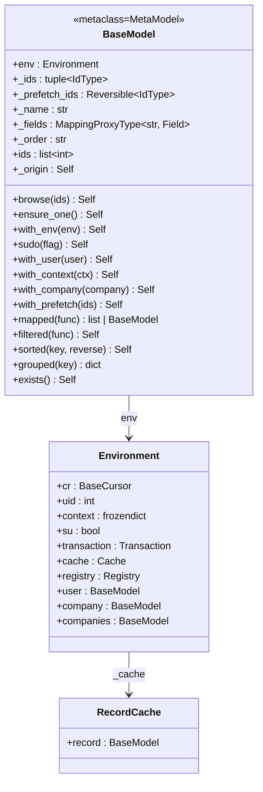
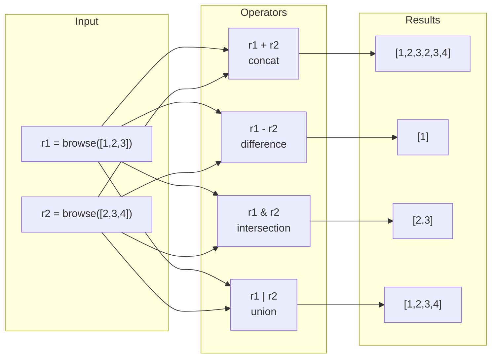

---
slug:11-recordset-operations
blog_type:normal
---


A recordset is the fundamental currency of Odoo's ORM. Every model instance is an ordered collection of records — not individual row objects — and all CRUD, search, and traversal operations consume and produce recordsets. This page dissects the recordset abstraction from its internal memory layout through its operator overloads, environment-switching mechanisms, and functional combinators that form the backbone of every Odoo business workflow.

## The Recordset Data Model

A recordset in Odoo 19 is an instance of `BaseModel` — or one of its concrete subclasses `Model`, `AbstractModel`, `TransientModel` — that wraps three pieces of state: a reference to an `Environment`, a tuple of record IDs, and a reversible iterable of prefetch IDs. These three slots, defined via `__slots__`, are the entire in-memory footprint of a recordset [models.py](odoo/orm/models.py#L362).

```python
__slots__ = ['env', '_ids', '_prefetch_ids']
```

The `env` attribute anchors the recordset to a specific database cursor (`cr`), user (`uid`), immutable context (`frozendict`), and superuser flag (`su`). The `_ids` tuple stores the actual record identifiers — real integer IDs for persisted records or `NewId` sentinel objects for in-memory-only records. The `_prefetch_ids` attribute drives Odoo's read-ahead optimization: when iterating or accessing fields on a large recordset, the ORM batches database reads in chunks of `PREFETCH_MAX` size rather than issuing one query per record [models.py](odoo/orm/models.py#L6481-L6500).

Crucially, records have no standalone representation. A single record is simply a recordset of length one — `res.partner(7,)` — and the framework consistently treats singleton and multi-record contexts through the same code paths [models.py](odoo/orm/models.py#L353-L357).



## Recordset Construction and Identity

### browse()

The `browse()` method is the primary constructor for recordsets from raw IDs. It accepts an integer, an iterable of IDs, or nothing at all, normalizes the input to a tuple, and returns a new recordset with its prefetch set initialized to the same IDs [models.py](odoo/orm/models.py#L5881-L5896).

```python
@api.private
def browse(self, ids: int | typing.Iterable[IdType] = ()) -> Self:
    if not ids:
        ids = ()
    elif ids.__class__ is int:
        ids = (ids,)
    else:
        ids = tuple(ids)
    return self.__class__(self.env, ids, ids)
```

The type dispatch on `ids.__class__ is int` avoids the overhead of `isinstance` for the most common single-ID case. The resulting recordset carries its own IDs as the prefetch set, meaning any field access will attempt to batch-read across the entire set.

### The `ids` Property and Origin Tracking

The `.ids` property returns a **list** of real integer IDs, unwrapping any `NewId` sentinels via the `OriginIds` helper. This is a read-only projection — mutating the returned list has no effect on the recordset [models.py](odoo/orm/models.py#L5902-L5907).

For virtual records created with `new()`, the `_origin` property unwraps the `NewId` wrappers back to their underlying real IDs (or an empty tuple for purely virtual records), returning a recordset of the actual database-backed records they were derived from [models.py](odoo/orm/models.py#L6460-L6467).

### ensure_one()

A guard method that unpacks the internal `_ids` tuple with single-value destructuring. If the tuple does not contain exactly one element, it raises `ValueError("Expected singleton")`. This is deliberately faster than `len(self) != 1` because it short-circuits on successful unpack without computing length [models.py](odoo/orm/models.py#L5928-L5940).

## Set-Theoretic Operators

Odoo overloads Python's binary operators to perform recordset algebra. Every operator validates model consistency — mixing recordsets from different models raises `TypeError` — and preserves insertion order in the result where semantically meaningful.

| Operator | Method | Semantics | Order | Duplicates |
|---|---|---|---|---|
| `+` | `__add__` / `concat()` | Concatenation | Preserved | Kept |
| `-` | `__sub__` | Difference | Left operand order | Removed |
| `&` | `__and__` | Intersection | Left operand order | Removed |
| `\|` | `__or__` / `union()` | Union | First-occurrence order | Removed |
| `==` | `__eq__` | Equivalence (unordered) | N/A | N/A |
| `<, <=, >, >=` | `__lt__`, etc. | Subset / superset (by ID) | N/A | N/A |

### Concatenation and Union

`concat()` is the workhorse behind `+`, performing simple list extension without deduplication — it keeps every ID in order, including duplicates [models.py](odoo/orm/models.py#L6546-L6559). `union()` (exposed as `|`) uses `OrderedSet` to deduplicate while preserving first-occurrence order [models.py](odoo/orm/models.py#L6591-L6604). Both accept variadic arguments for chaining: `records.concat(other1, other2)`.

```python
# concat: preserves order AND duplicates
r1 = model.browse([1, 2])
r2 = model.browse([2, 3])
r1 + r2  # model.browse([1, 2, 2, 3])

# union: preserves first-occurrence order, deduplicates
r1 | r2  # model.browse([1, 2, 3])
```

### Difference and Intersection

Subtraction (`-`) preserves the left operand's ordering while filtering out any IDs present in the right operand, using a `set` for O(1) membership testing [models.py](odoo/orm/models.py#L6561-L6571). Intersection (`&`) similarly iterates the left operand but keeps only IDs present in the right, again using `OrderedSet` to maintain order [models.py](odoo/orm/models.py#L6573-L6583).

### Comparison Operators

Equality (`==`) compares model names and ID sets — order-independent. The relational operators (`<`, `<=`, `>`, `>=`) perform subset/superset checks on ID sets. Notably, `<=` and `>=` have fast-path optimizations for null and singleton recordsets before falling through to the general set comparison [models.py](odoo/orm/models.py#L6606-L6652).

### Hashing and Deep Copy

Recordsets are hashable via `(model_name, frozenset(ids))`, making them usable as dictionary keys. `__deepcopy__` returns `self` directly — recordsets are immutable by convention and shared across the framework [models.py](odoo/orm/models.py#L6660-L6664).



## Environment Switching

Every environment switch creates a **new recordset** — the original is never mutated. All switching methods delegate to `with_env()`, which constructs a fresh instance sharing the same `_ids` and `_prefetch_ids` but bound to the target `Environment` [models.py](odoo/orm/models.py#L5942-L5949).

### with_context()

The most frequently used environment modifier. It merges either a provided context dict or the current context with keyword overrides. A critical behavioral detail: when no explicit `allowed_company_ids` is passed, the method **preserves** the existing `allowed_company_ids` from the current context, preventing accidental company drift [models.py](odoo/orm/models.py#L6018-L6053).

```python
# Reset context entirely
r2 = records.with_context({}, key2=True)
# r2.env.context is {'key2': True}

# Extend current context
r2 = records.with_context(key2=True)
# r2.env.context is {'key1': True, 'key2': True, ...}
```

As of 19.0, passing `force_company` in the context triggers a `DeprecationWarning`; `with_company()` should be used instead [models.py](odoo/orm/models.py#L6038-L6048).

### sudo() and with_user()

`sudo(flag=True)` enables superuser mode by creating a new environment with `su=True`, bypassing all access rights checks. If the flag already matches the current state, `self` is returned unchanged — avoiding unnecessary object allocation [models.py](odoo/orm/models.py#L5951-L5976). `with_user(user)` creates a new environment with the specified user in non-superuser mode (unless the user is the superuser itself) [models.py](odoo/orm/models.py#L5978-L5986).

### with_company()

Modifies the context's `allowed_company_ids` by moving the target company to position zero, effectively changing `env.company`. If the company is already the first in the list, `self` is returned unchanged. This method correctly handles the multi-company scenario by preserving the full list of allowed companies and inserting the new one at the front [models.py](odoo/orm/models.py#L5988-L6016).

<CgxTip>
**Environment switch sharing**: All `with_*` methods preserve the same `_prefetch_ids` as the original recordset. This means field accesses on the switched recordset benefit from the same batched prefetch strategy, avoiding redundant database queries across environment boundaries.
</CgxTip>

## Indexing and Field Access

Recordsets implement `__getitem__` with a dual dispatch: integer or slice keys return sub-recordsets, while string keys delegate to the field's descriptor getter [models.py](odoo/orm/models.py#L6672-L6690).

```python
inst = model.search(dom)
inst[3]        # fourth record as singleton recordset
inst[10:20]    # subset as recordset
inst['name']   # field value from first record (via field.__get__)
```

Integer indexing wraps the ID in a single-element tuple and browses it. Slicing passes the sliced `_ids` tuple directly to `browse()`. String access always reads from the **first** record in the recordset — accessing a field on a multi-record set reads the field on record `self[0]`, not on all records.

`__setitem__` similarly delegates to the field descriptor's `__set__`, which triggers the full write pipeline including inversion, constraint checking, and recomputation scheduling [models.py](odoo/orm/models.py#L6692-L6695).

## Functional Combinators

### mapped()

The workhorse transformation method. `mapped()` accepts either a callable or a dot-separated field path string and applies it across all records in the recordset [models.py](odoo/orm/models.py#L6125-L6181).

When given a **string**, the path is split on dots. All but the final segment are traversed as relational field accesses, and the final segment is read. If the final field is relational, the results are unioned into a single recordset. If non-relational, a flat list of values is returned. For large recordsets exceeding `PREFETCH_MAX`, an explicit `fetch()` call is issued before mapping to ensure all data is preloaded [models.py](odoo/orm/models.py#L6155-L6170).

When given a **callable**, it executes the function for each record. If all return values are `BaseModel` instances, they are unioned; otherwise, a list is returned. For empty recordsets, the callable receives the empty recordset itself to determine the return type [models.py](odoo/orm/models.py#L6172-L6181).

```python
records.mapped('name')                              # list of names
records.mapped('partner_id')                        # recordset of partners (unioned)
records.mapped('partner_id.bank_ids')               # recordset of all banks, deduplicated
records.mapped(lambda r: r.field1 + r.field2)       # list of computed values
```

### filtered()

Returns a sub-recordset containing only records satisfying a predicate. The predicate can be a callable, a dot-separated field path (evaluated for truthiness), or a `Domain` object (which delegates to `filtered_domain()`) [models.py](odoo/orm/models.py#L6183-L6213).

For string predicates containing a dot (e.g., `"partner_id.is_company"`), the implementation uses `mapped()` internally to resolve the path and checks for any truthy result. For single-field strings (e.g., `"active"`), it directly accesses the field descriptor to avoid the overhead of `mapped()` [models.py](odoo/orm/models.py#L6204-L6208).

```python
records.filtered(lambda r: r.company_id == env.company)
records.filtered("partner_id.is_company")
records.filtered(Domain([('active', '=', True)]))
```

### sorted()

Orders the recordset by a key function or a SQL-like order specification string. When `key` is a string, it is parsed by `_sorted_order_to_function()` which supports field names with optional `ASC`/`DESC` directions and `NULLS FIRST`/`NULLS LAST` modifiers, comma-separated for multi-key sorting [models.py](odoo/orm/models.py#L6260-L6289).

The order parser creates a `ReversibleComparator` wrapper that handles `NULLS` positioning and direction reversal without creating separate sort functions. For `many2one` fields, the sorting delegates recursively to the related model's order, with cycle detection via a context key `__m2o_order_seen_sorted` [models.py](odoo/orm/models.py#L6291-L6342).

```python
records.sorted(key=lambda r: r.name)
records.sorted('name DESC, id')         # multi-field, with direction
records.sorted()                         # uses model's default _order
```

### grouped()

Eagerly partitions the recordset by a key into a dictionary of key → recordset pairs. Unlike `itertools.groupby`, it does not require pre-sorted input but trades laziness for completeness — all records are visited [models.py](odoo/orm/models.py#L6223-L6247).

The implementation uses a `defaultdict(list)` to accumulate IDs per key, then constructs each sub-recordset with `functools.partial(type(self), self.env, prefetch_ids=self._prefetch_ids)`, ensuring all resulting recordsets share the same prefetch set for efficient subsequent field access [models.py](odoo/orm/models.py#L6242-L6247).

```python
by_state = records.grouped('state')
# {'draft': res.partner(1, 5, 9), 'done': res.partner(2, 3, 7)}

by_type = records.grouped(lambda r: r.company_id.id)
# {1: res.partner(...), 2: res.partner(...)}
```

### filtered_domain()

Combines the domain engine with in-memory filtering. It constructs a `Domain` predicate from the given domain expression and tests each record, returning only those that satisfy the domain while preserving the original order [models.py](odoo/orm/models.py#L6249-L6258).

This is particularly useful when you have already fetched records and need to re-filter them by a different criterion without an additional database round-trip.

## Iteration Protocol

The `__iter__` method yields singleton recordsets, one per ID. For recordsets larger than `PREFETCH_MAX` whose prefetch set is identical to their ID set (i.e., the initial browse set), the iteration automatically splits into sub-chunks of `PREFETCH_MAX` size, assigning each sub-chunk as the prefetch set for its elements [models.py](odoo/orm/models.py#L6481-L6500). This is the mechanism that makes large-batch operations efficient without manual batching.

`__reversed__` provides the same chunking logic but iterates in reverse order, wrapping the prefetch iterable in `ReversedIterable` to maintain correct prefetch semantics [models.py](odoo/orm/models.py#L6502-L6521).

```python
for record in large_recordset:
    # Each `record` is a singleton recordset
    # Field accesses trigger batched reads of PREFETCH_MAX records
    pass
```

<CgxTip>
**Prefetch chunking in iteration**: When iterating over a recordset with more than `PREFETCH_MAX` records, the `__iter__` method automatically splits the IDs into chunks and assigns each chunk as the `_prefetch_ids` for the yielded singletons. This means `record.some_field` inside the loop triggers a single `SELECT` for up to `PREFETCH_MAX` records rather than one query per record. For explicit control, use `with_prefetch()` to set a custom prefetch set.
</CgxTip>

## Boolean and Container Semantics

`__bool__` returns `True` only if `_ids` is non-empty — a fast tuple truthiness check. This enables idioms like `if records:` instead of `if len(records) > 0:` [models.py](odoo/orm/models.py#L6473-L6475).

`__contains__` has a dual signature: if the item is a `BaseModel`, it checks whether the item is a singleton of the same model with an ID present in `self._ids`. If the item is a string, it checks whether the model has a field with that name — enabling `if 'field_name' in model:` [models.py](odoo/orm/models.py#L6523-L6540).

## Record Validation and Persistence

### exists()

Returns the subset of records that actually exist in the database. It partitions `_ids` into `NewId` instances (which are treated as existing by convention) and real IDs, then executes a single `SELECT` to verify which real IDs still exist in the table [models.py](odoo/orm/models.py#L5542-L5559).

```python
if record.exists():
    record.write({'name': 'Updated'})
```

### flush_model() and flush_recordset()

These methods process pending computations and dirty field writes to the database. `flush_model()` operates on the entire model (all dirty records), while `flush_recordset()` is scoped to the records in `self` [models.py](odoo/orm/models.py#L6350-L6383). The internal `_flush()` method groups dirty records by their exact set of modified fields (using a bitmask for efficient grouping), batches updates in groups of 1000, and calls `_write_multi()` for each batch [models.py](odoo/orm/models.py#L6385-L6430).

### Cache Invalidation

`invalidate_model()` and `invalidate_recordset()` remove cached field values when they no longer correspond to database state. Both accept optional field name filters and a `flush` parameter (default `True`) that ensures dirty writes are committed before invalidation [models.py](odoo/orm/models.py#L6706-L6722). The `modified()` method notifies the dependency system that specific fields have changed, triggering cascading recomputation of stored fields that depend on them [models.py](odoo/orm/models.py#L6753-L6763).

## Operation Summary Reference

| Method | Returns | Database Hit | Preserves Order | Deduplicates |
|---|---|---|---|---|
| `browse(ids)` | `Self` | No | N/A | No |
| `filtered(func)` | `Self` | No (unless field path) | Yes | N/A |
| `filtered_domain(dom)` | `Self` | No | Yes | N/A |
| `mapped(func)` | `list` or `Self` | On field access | Relational: no | Relational: yes |
| `sorted(key)` | `Self` | On field access | By sort key | N/A |
| `grouped(key)` | `dict` | On field access | Within groups | N/A |
| `+` / `concat()` | `Self` | No | Yes | No |
| `\|` / `union()` | `Self` | No | First-occurrence | Yes |
| `&` | `Self` | No | Left operand | Yes |
| `-` | `Self` | No | Left operand | N/A |
| `exists()` | `Self` | Yes (single query) | Yes | N/A |
| `with_context()` | `Self` | No | N/A | N/A |
| `sudo()` | `Self` | No | N/A | N/A |

## Next Steps

Understanding recordset operations is foundational for writing efficient Odoo code. To continue exploring the ORM layer, consult [Field Types and Definitions](10-field-types-and-definitions) for how field access within recordsets triggers caching and database reads, [Search Domains and Query Engine](12-search-domains-and-query-engine) for the domain language used by `filtered_domain()` and `search()`, and [BaseModel and Model Hierarchy](9-basemodel-and-model-hierarchy) for the full class hierarchy and inheritance mechanics that give recordsets their model-specific behavior.