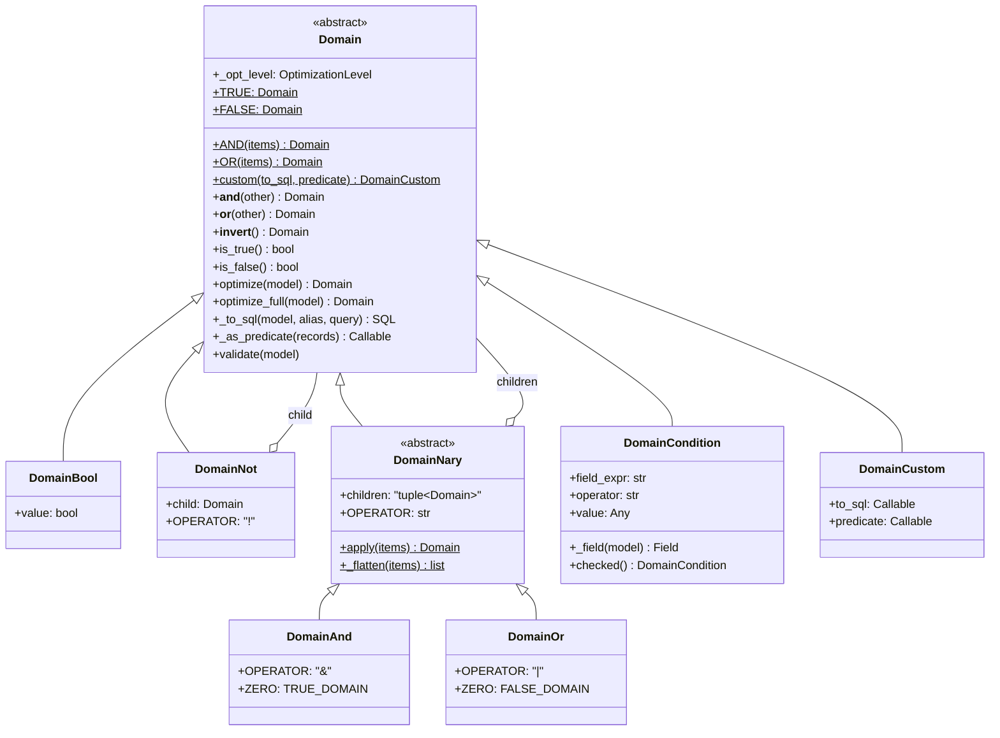
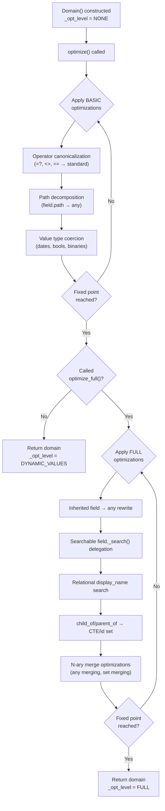

---
slug:12-search-domains-and-query-engine
blog_type:normal
---


This page documents Odoo 19's search domain system — the mechanism by which high-level filter expressions are parsed, optimized, and compiled into parameterized PostgreSQL queries. In version 19.0, the legacy list-based domain representation has been superseded by a fully typed AST system (`Domain` class hierarchy) while maintaining backward compatibility at the boundary. Understanding this pipeline is essential for writing efficient record queries, custom search logic, and record rule expressions.

## The Two-Layer Domain Architecture

Odoo domains employ a deliberately non-recursive, two-level abstract syntax. At the **first level**, a domain is a boolean expression composed of logical operators (`!`, `&`, `|`) applied in Polish (prefix) notation over *conditions*. At the **second level**, each condition is a triple `(field, operator, value)` using infix notation. This separation exists by design: a domain can never serve as a value operand within a condition, which eliminates ambiguity at the cost of a slightly unintuitive syntax [domains.py](odoo/orm/domains.py#L4-L58).

```python
# First level: boolean operators in prefix notation
['&', '!', ('user_id', '=', 4), '|', ('partner_id', 'in', [1, 2]), ('state', '=', 'draft')]
# Equivalent to: (NOT (user_id = 4)) AND ((partner_id IN [1,2]) OR (state = 'draft'))
```

The domain `[]` (empty list) is semantically equivalent to `True` — it matches all records. Multiple conditions without explicit operators are implicitly joined with `&` (AND): `[('a', '=', 1), ('b', '=', 2)]` is the same as `['&', ('a', '=', 1), ('b', '=', 2)]`.

Sources: [domains.py](odoo/orm/domains.py#L3-L58), [expression.py](odoo/osv/expression.py#L4-L57)

## Domain AST Class Hierarchy

In Odoo 19, domains are represented internally as an immutable abstract syntax tree built from the `Domain` class hierarchy. The factory method `Domain()` dispatches construction to the appropriate subclass based on the input arguments. All `Domain` objects are **immutable** — attempting attribute assignment raises `TypeError` [domains.py](odoo/orm/domains.py#L311-L315).



The hierarchy supports both the modern Pythonic API (using `&`, `|`, `~` operators) and the legacy list-based API. When iterated, a `Domain` yields its equivalent Polish-notation list, ensuring full backward compatibility with code that expects list domains [domains.py](odoo/orm/domains.py#L374-L386).

Sources: [domains.py](odoo/orm/domains.py#L196-L472), [domains.py](odoo/orm/domains.py#L525-L738)

## Condition Operators Reference

Conditions use one of the operators from `STANDARD_CONDITION_OPERATORS`. The ORM also recognizes non-standard operators (`=?`, `<>`, `==`) that are canonicalized to standard form during optimization [domains.py](odoo/orm/domains.py#L81-L124).

| Operator | Description | Value Type | SQL Translation |
|----------|-------------|------------|-----------------|
| `=` | Equality | scalar, `SQL`, `OrderedSet` | `field = %s` |
| `!=` | Inequality | scalar | `field != %s` (with NULL handling) |
| `in` | Membership in collection | `list`, `OrderedSet`, `set` | `field IN %s` |
| `not in` | Exclusion from collection | `list`, `OrderedSet`, `set` | `field NOT IN %s` (with NULL handling) |
| `<`, `>`, `<=`, `>=` | Inequality comparisons | scalar, `SQL` | `field OP %s` (with NULL handling) |
| `like` | Case-sensitive substring match (auto-wrapped with `%`) | `str` | `field LIKE %s` |
| `ilike` | Case-insensitive substring match (auto-wrapped, with unaccent) | `str` | `field ILIKE %s` |
| `not like` | Negation of `like` | `str` | `field NOT LIKE %s` |
| `not ilike` | Negation of `ilike` | `str` | `field NOT ILIKE %s` |
| `=like` | Exact case-sensitive pattern match (no auto-wrapping) | `str` | `field LIKE %s` |
| `=ilike` | Exact case-insensitive pattern match (no auto-wrapping) | `str` | `field ILIKE %s` |
| `any` | Sub-domain on relational field (with record rules) | `Domain`, `Query`, `SQL` | `EXISTS (subquery)` |
| `not any` | Negation of `any` | `Domain`, `Query`, `SQL` | `NOT EXISTS (subquery)` |
| `any!` | `any` bypassing record rules | `Domain`, `Query`, `SQL` | `EXISTS (subquery)` |
| `not any!` | `not any` bypassing record rules | `Domain`, `Query`, `SQL` | `NOT EXISTS (subquery)` |
| `=?` *(non-std)* | Equality if value is truthy, else TRUE | any | Rewritten: `not val OR field = val` |
| `child_of` *(non-std)* | Transitive closure of parent-child | `int`, `list` | Recursive CTE or id set |
| `parent_of` *(non-std)* | Transitive closure upward | `int`, `list` | Recursive CTE or id set |

<CgxTip>
**Inequality operators and NULL semantics.** Odoo does *not* use SQL's three-valued logic directly for `!=`, `not in`, `<`, etc. When a field has no falsy value (i.e., `falsy_value is None`), the negation of `field = x` becomes `field != x OR field IS NULL`. This is computed during `_negate()` on `DomainCondition` to ensure that records with unset fields are correctly included or excluded depending on the operator's polarity. See the `_INVERSE_INEQUALITY` mapping at [domains.py](odoo/orm/domains.py#L163-L169).
</CgxTip>

<CgxTip>
**Internal operators `any!` and `not any!`** bypass ir.rule record rules on the comodel during sub-query generation. They exist for internal use by the ORM (e.g., inherited fields with `bypass_search_access=True`) and are **not accepted** in domain list syntax — only in direct `DomainCondition` construction with `internal=True`. Attempting `Domain([('a', 'any!', dom)])` raises `ValueError` [domains.py](odoo/orm/domains.py#L125-L125).
</CgxTip>

Sources: [domains.py](odoo/orm/domains.py#L81-L169), [domains.py](odoo/orm/domains.py#L1250-L1270), [domains.py](odoo/orm/domains.py#L854-L867)

## The Modern Domain API

### Construction Methods

The `Domain` factory method supports multiple construction patterns. It uses `__new__` override to dispatch to the correct subclass without calling `__init__` on intermediate types, which is why it is intentionally not marked as an ABC despite being abstract [domains.py](odoo/orm/domains.py#L199-L275).

```python
from odoo import Domain

# From a legacy list (backward compatible)
d1 = Domain([('state', '=', 'draft'), '|', ('priority', 'in', ['1', '2']), ('user_id', '=', False)])

# From individual condition arguments
d2 = Domain('state', '=', 'draft')

# Using boolean operators (Pythonic)
d3 = Domain('state', '=', 'draft') & Domain('company_id', '=', 1)
d4 = Domain('state', 'in', ['draft', 'sent']) | Domain('priority', '=', '1')
d5 = ~Domain('active', '=', True)  # NOT (active = True)

# Using static factory methods
d6 = Domain.AND([Domain('a', '=', 1), Domain('b', '=', 2)])
d7 = Domain.OR([Domain('a', '=', 1), Domain('b', '=', 2)])

# Constants
d8 = Domain.TRUE   # matches everything
d9 = Domain.FALSE  # matches nothing

# Domain + list concatenation (legacy, equivalent to &)
d10 = Domain('a', '=', 1) + [('b', '=', 2)]
```

### Operator Overloading

The `Domain` class overloads Python's bitwise operators for domain composition. These always produce new immutable `Domain` instances [domains.py](odoo/orm/domains.py#L317-L331).

| Operator | Method | Semantics | Example |
|----------|--------|-----------|---------|
| `&` | `__and__` | Logical AND | `d1 & d2` → `DomainAnd(d1, d2)` |
| `\|` | `__or__` | Logical OR | `d1 \| d2` → `DomainOr(d1, d2)` |
| `~` | `__invert__` | Logical NOT | `~d1` → `DomainNot(d1)` |
| `+` | `__add__` | Concatenation (legacy) | `d1 + [...]` → list or `DomainAnd` |

The `+` operator exists for backward compatibility with the legacy pattern of concatenating domain lists. When the right operand is a `Domain`, it behaves identically to `&`. When it is a list, it returns a plain list (not a `Domain`) — this asymmetry is intentional but deprecated [domains.py](odoo/orm/domains.py#L337-L356).

### Python-Side Filtering with `_as_predicate`

Every `Domain` can produce a callable predicate for in-memory filtering via `_as_predicate(records)`. This is used by `BaseModel.filtered_domain()` to filter cached recordsets without hitting the database. The predicate traverses the AST recursively: `DomainAnd` uses `all()`, `DomainOr` uses `any()`, and `DomainNot` negates its child's predicate [domains.py](odoo/orm/domains.py#L408-L416).

Sources: [domains.py](odoo/orm/domains.py#L206-L386), [domains.py](odoo/orm/domains.py#L566-L704)

## The Optimization Pipeline

Domain optimization is a **multi-pass fixed-point transformation** that progressively rewrites the AST from `OptimizationLevel.NONE` through `BASIC`, `DYNAMIC_VALUES`, and `FULL`. Each level applies a specific set of rewrite rules until no further changes occur (or the iteration cap of 1000 is hit). The `optimize()` method stops at `DYNAMIC_VALUES`; `optimize_full()` continues to `FULL` [domains.py](odoo/orm/domains.py#L176-L193).



### Optimization Levels

| Level | Purpose | Key Transformations |
|-------|---------|-------------------|
| `NONE` (0) | Initial state, no optimization | — |
| `BASIC` (1) | Syntactic normalization | `<>` → `!=`, `==` → `=`, `=?` → conditional, `=` with collection → `in`, path decomposition (`a.b.c` → `a any (b any (c OP val))`), value type coercion for dates/datetime/booleans |
| `DYNAMIC_VALUES` (2) | Context-sensitive value resolution | Relative date expressions (`context_today`, `datetime.today()`), dynamic date comparisons |
| `FULL` (3) | Complete query preparation | Inherited field delegation via `any`, searchable field `_search()` method, `child_of`/`parent_of` hierarchy expansion, display_name string search on relational fields, `any`/`not any` merging for fewer subqueries |

### Condition-Level Optimizations (via Decorators)

Individual optimizations are registered using the `@operator_optimization` and `@field_type_optimization` decorators, which store functions keyed by operator name or field type in the `_OPTIMIZATIONS_FOR` dictionary [domains.py](odoo/orm/domains.py#L1104-L1113).

```python
# Canonicalize non-standard operators
@operator_optimization(['=?'])        # → not val OR field = val
@operator_optimization(['<>'])         # → !=
@operator_optimization(['=='])         # → =
@operator_optimization(['=', '!='])    # collections → 'in'

# Validate and coerce values for specific operators
@operator_optimization(['in', 'not in'])       # OrderedSet conversion
@operator_optimization(['any', 'not any', ...]) # Domain sub-query optimization
@operator_optimization([...like'])              # String validation

# Field-type specific transformations
@field_type_optimization(['many2one', 'one2many', 'many2many'])  # display_name search
@field_type_optimization(['boolean'])                              # bool IN [True, False] → TRUE
@field_type_optimization(['date'])                                # date string → date object
@field_type_optimization(['datetime'])                            # datetime string → datetime object
@field_type_optimization(['binary'])                              # attachment ID resolution
```

### N-ary Merge Optimizations

At the `DomainNary` level, children are sorted by `(field, operator, operator_category)` to group similar conditions together. Merge optimizations then combine adjacent compatible conditions to reduce the number of SQL clauses and subqueries [domains.py](odoo/orm/domains.py#L651-L668).

The most significant merge optimization combines multiple `any` conditions on the same relational field into a single subquery:

```python
# Before optimization (two subqueries):
a any (f = 8) OR a any (g = 5)
# After optimization (one subquery):
a any (f = 8 OR g = 5)

# For many2one fields specifically, AND can also be merged:
a any (f = 8) AND a any (g = 5)  →  a any (f = 8 AND g = 5)
```

This is registered via `@nary_condition_optimization(['any'], ['many2one', 'one2many', 'many2many'])` at [domains.py](odoo/orm/domains.py#L1952-L1972).

Sources: [domains.py](odoo/orm/domains.py#L176-L193), [domains.py](odoo/orm/domains.py#L447-L474), [domains.py](odoo/orm/domains.py#L921-L979), [domains.py](odoo/orm/domains.py#L1104-L1200)

## SQL Generation: From Domain to Query

### The `Query` Object

The `Query` class (from `odoo.tools`) represents a parameterized SQL `SELECT` statement. It accumulates `WHERE` clauses via `add_where()` and manages `JOIN` operations, `ORDER BY`, `LIMIT`, and `OFFSET`. Each `_to_sql()` call returns an `SQL` object — an immutable, composable representation of a SQL fragment with bound parameters [domains.py](odoo/orm/domains.py#L469-L471).

### The `_search` Pipeline

The complete path from a domain expression to an executable SQL query flows through `BaseModel._search()`, which orchestrates domain parsing, optimization, SQL generation, and security rule application [models.py](odoo/orm/models.py#L5321-L5392).

```mermaid
flowchart LR
    A["model.search(domain)"] --> B["model.search_fetch(domain, ...)"]
    B --> C["model._search(domain, offset, limit, order)"]
    C --> D["Domain(domain)\nparse & validate"]
    D --> E["Inject active_test filter\nif applicable"]
    E --> F["domain.optimize_full(model)\nBASIC → DYNAMIC_VALUES → FULL"]
    F --> G{"domain.is_false()?"}
    G -- Yes --> H["Return empty query"]
    G -- No --> I["Query(env, table, table_sql)"]
    I --> J{"domain.is_true()?"}
    J -- Yes --> K["Skip WHERE clause"]
    J -- No --> L["domain._to_sql(model, alias, query)\n→ SQL object"]
    L --> M["query.add_where(sql)"]
    M --> N["Apply ir.rule security domain"]
    N --> O["Add ORDER BY, LIMIT, OFFSET"]
    O --> P["Return Query object"]
    P --> Q["query is executed\nby search_fetch"]
```



The `_to_sql()` method is implemented per domain node type:

- **`DomainAnd`**: joins children with `SQL(" AND ")` [domains.py](odoo/orm/domains.py#L670-L674)
- **`DomainOr`**: joins children with `SQL(" OR ")` [domains.py](odoo/orm/domains.py#L707-L710)
- **`DomainNot`**: wraps child SQL with `SQL("(%s) IS NOT TRUE", condition)` [domains.py](odoo/orm/domains.py#L570-L572)
- **`DomainCondition`**: delegates to `model._condition_to_sql(field, alias, query)` on the field instance [domains.py](odoo/orm/domains.py#L469-L471)
- **`DomainCustom`**: invokes its user-provided `to_sql` callable [domains.py](odoo/orm/domains.py#L737-L785)

### How `search` and `search_count` Use `_search`

Both `search()` and `search_count()` are thin wrappers around `_search()`. The `search()` method delegates to `search_fetch()`, which calls `_search()` to get a `Query` object, then executes it to fetch record IDs and populate the cache [models.py](odoo/orm/models.py#L1361-L1410). The `search_count()` method simply returns `len(query)` [models.py](odoo/orm/models.py#L1347-L1359).

```python
# search_count: just count the query
query = self._search(domain, limit=limit)
return len(query)

# search → search_fetch: execute query and fetch fields
query = self._search(domain, offset=offset, limit=limit, order=order or self._order)
# ... execute query, create recordset, fetch fields to cache
```

Sources: [models.py](odoo/orm/models.py#L5321-L5392), [models.py](odoo/orm/models.py#L1340-L1410), [domains.py](odoo/orm/domains.py#L570-L674), [domains.py](odoo/orm/domains.py#L737-L785)

## Domain Composition and the Security Layer

### Active Test Injection

The `_search` method automatically injects an `active_test` filter when the model has an `_active_name` field and the domain doesn't already reference it. This ensures inactive records are excluded by default unless explicitly requested [models.py](odoo/orm/models.py#L5354-L5361).

```python
if (
    self._active_name
    and active_test
    and self.env.context.get('active_test', True)
    and not any(leaf.field_expr == self._active_name for leaf in domain.iter_conditions())
):
    domain &= Domain(self._active_name, '=', True)
```

### Record Rule Composition

After the domain's own WHERE clause is added, the security layer from `ir.rule` is applied. The security domain is computed independently (under `sudo` with `active_test=False`), optimized separately, and added as an additional WHERE clause. If the security domain is `FALSE`, the query returns no results immediately [models.py](odoo/orm/models.py#L5371-L5379).

The separation between the user domain and the security domain means they are optimized and compiled independently, then combined at the SQL level via `AND`. This is critical for performance: the ORM does not merge the two domains into a single AST, avoiding unnecessary re-optimization of the security rules.

Sources: [models.py](odoo/orm/models.py#L5349-L5380)

## `DomainCustom`: Escaping to Raw SQL

For scenarios where the standard condition operators are insufficient, `Domain.custom()` creates a domain node that directly produces SQL via a user-provided callable. This is the extension point for field types that need specialized query patterns [domains.py](odoo/orm/domains.py#L287-L299).

```python
from odoo import Domain, SQL

Domain.custom(
    to_sql=lambda model, alias, query: SQL(
        "COALESCE(%s.transfer_date, %s.create_date) > %s",
        SQL.identifier(alias, "transfer_date"),
        SQL.identifier(alias, "create_date"),
        query.bind(model.env.context.get('cutoff_date')),
    ),
    predicate=lambda record: (
        record.transfer_date or record.create_date
    ) > record.env.context.get('cutoff_date'),
)
```

The optional `predicate` callable enables Python-side evaluation via `filtered_domain()`, ensuring that the same logic works both in-database and in-memory. The `SQL` class from `odoo.tools.sql` provides safe, composable SQL construction with automatic parameter binding [sql.py](odoo/tools/sql.py#L46-L174).

Sources: [domains.py](odoo/orm/domains.py#L287-L299), [sql.py](odoo/tools/sql.py#L46-L174)

## The Legacy Expression Module (Deprecated)

The `odoo.osv.expression` module contains the pre-19.0 domain processing code. Its core class `expression` (lowercase) has been deprecated in favor of direct `Domain` usage. The module's functions — `normalize_domain()`, `AND()`, `OR()`, `distribute_not()`, `is_false()`, and `domain_combine_anies()` — now emit `DeprecationWarning` and delegate to the new `Domain` API internally [expression.py](odoo/osv/expression.py#L168-L280).

The legacy `expression` class, when instantiated, still performs the full parse-optimize-compile pipeline but wraps the modern `Domain` object for backward compatibility [expression.py](odoo/osv/expression.py#L427-L466).

| Legacy API | Modern Replacement | Status |
|------------|-------------------|--------|
| `expression(domain, model)` | `Domain(domain).optimize_full(model)` + `Query` | Deprecated since 19.0 |
| `normalize_domain(domain)` | `Domain(domain)` | Deprecated since 19.0 |
| `AND(domains)` | `Domain.AND(domains)` | Deprecated since 19.0 |
| `OR(domains)` | `Domain.OR(domains)` | Deprecated since 19.0 |
| `distribute_not(domain)` | `Domain(domain)` (negation is pushed automatically) | Deprecated since 19.0 |
| `is_false(model, domain)` | `Domain(domain).is_false()` | Deprecated since 19.0 |
| `domain_combine_anies(domain, model)` | `Domain(domain).optimize(model)` | Deprecated since 19.0 |
| `prettify_domain(domain)` | (No direct replacement) | Deprecated since 19.0 |

Sources: [expression.py](odoo/osv/expression.py#L122-L474), [expression.py](odoo/osv/expression.py#L427-L466)

## Module File Map

| File | Role |
|------|------|
| [odoo/orm/domains.py](odoo/orm/domains.py) | Core `Domain` AST hierarchy, optimization engine, operator definitions |
| [odoo/osv/expression.py](odoo/osv/expression.py) | Legacy domain expression module (deprecated), `expression` class wrapper |
| [odoo/orm/models.py](odoo/orm/models.py#L5321-L5392) | `BaseModel._search()` — the query orchestration entry point |
| [odoo/tools/sql.py](odoo/tools/sql.py) | `SQL` class — composable, parameterized SQL fragments |
| [odoo/tools/query.py](odoo/tools/query.py) | `Query` class — `SELECT` statement builder with joins, ordering, limits |

## Next Steps

Having understood how domains are parsed, optimized, and compiled into SQL, the natural progression is to explore the surrounding ORM infrastructure:

- **[Recordset Operations](11-recordset-operations)** — how `search()` results become recordsets, and how `filtered_domain()` applies domains in-memory
- **[Field Types and Definitions](10-field-types-and-definitions)** — how field types define their own `_search()` methods and influence domain optimization via `field_type_optimization`
- **[BaseModel and Model Hierarchy](9-basemodel-and-model-hierarchy)** — the `BaseModel` class that hosts `_search()`, `_field_to_sql()`, and the access control methods that interact with the domain engine