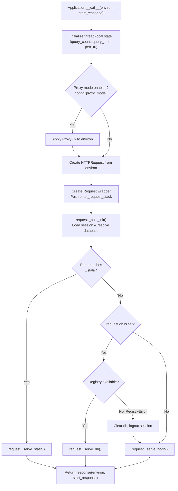
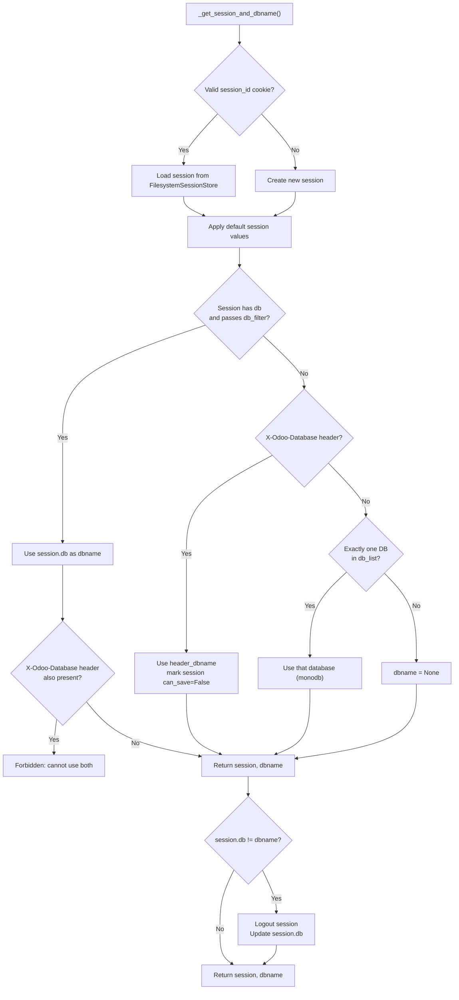
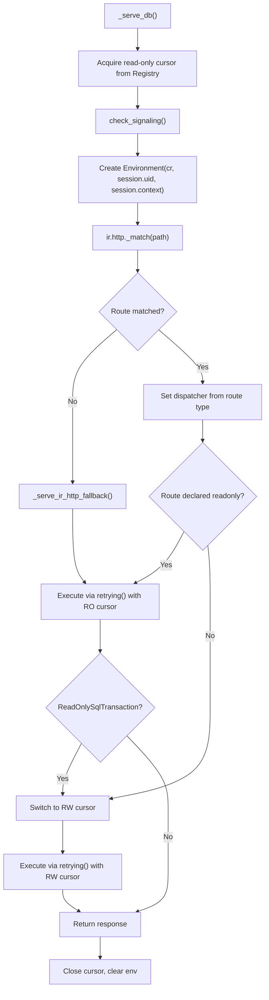
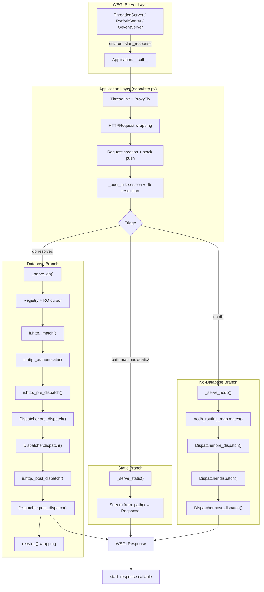

---
slug:13-wsgi-application-and-request-lifecycle
blog_type:normal
---

Every HTTP request entering Odoo passes through a precisely orchestrated pipeline — from raw WSGI bytes to a fully initialized ORM environment with an authenticated user, and back to an HTTP response. This document traces that entire journey, revealing the layered architecture that makes it work. Understanding this lifecycle is essential for anyone building controllers, debugging request failures, or extending Odoo's HTTP layer.

## The WSGI Contract and Server Bootstrap

Odoo's HTTP layer conforms to [PEP 3333](https://www.python.org/dev/peps/pep-3333), the Python WSGI specification. The `Application` class in `odoo/http.py` implements the `__call__(self, environ, start_response)` method that serves as the callable entry point passed to any WSGI-compliant server. At the module level, a singleton instance `root = Application()` is created at import time, and this object is handed to one of Odoo's server implementations during startup.

The server bootstrap chain depends on the configured mode. The `ThreadedServer` (development mode) wraps the `Application` instance in a `ThreadedWSGIServerReloadable` — a patched Werkzeug threaded server that supports hot-reload via `serve_forever` [running in a daemon thread](/odoo/service/server.py#L623-L629). For production, `PreforkServer` spawns `WorkerHTTP` child processes that each accept connections on the shared listening socket and feed them through the same `Application.__call__` method. Regardless of server mode, the WSGI contract remains identical: the server parses the HTTP request into a CGI-style `environ` dictionary and a `start_response` callable, then invokes `Application.__call__`.

Sources: [odoo/http.py](/odoo/http.py#L2669-L2871), [odoo/service/server.py](/odoo/service/server.py#L462-L465), [odoo/service/server.py](/odoo/service/server.py#L623-L629)

## Application Entry Point: `Application.__call__`

The `__call__` method is where every request begins its life inside Odoo. It performs five critical operations before dispatching: thread-local state initialization, optional proxy mode handling, request wrapping, request routing, and exception containment.

On entry, the method resets per-thread bookkeeping: `query_count`, `query_time`, `perf_t0`, and `cursor_mode`. When `proxy_mode` is enabled and the `X-Forwarded-Host` header is present, Werkzeug's `ProxyFix` middleware is applied to rewrite the `environ` so that URL routing works correctly behind reverse proxies. The raw `environ` is then wrapped in an `HTTPRequest` (a Werkzeug `Request` subclass), and an `odoo.http.Request` is constructed and pushed onto the thread-local `_request_stack`, making it accessible as the global `http.request` throughout the controller layer.

Sources: [odoo/http.py](/odoo/http.py#L2781-L2867)

## The Three Dispatch Branches

After the request is wrapped, `Application.__call__` routes it into one of three branches based on URL path and database availability. This triage is the first architectural decision point in the lifecycle.

| Branch | Trigger Condition | Method | Database Required | ORM Available |
|--------|-------------------|--------|-------------------|---------------|
| **Static** | Path matches `/<module>/static/<path>` | `Request._serve_static()` | No | No |
| **No-DB** | No database resolved in session/cookie | `Request._serve_nodb()` | No | No |
| **DB** | A database is associated with the request | `Request._serve_db()` | Yes | Yes |

### Static File Serving

When the URL path matches the `/<module>/static/<resource>` pattern, `Application.get_static_file()` resolves the module's static directory from its manifest, constructs the file path via `werkzeug.security.safe_join`, and `Request._serve_static()` streams it using the `Stream.from_path()` helper. In debug mode (`assets` in `session.debug`), cache max-age is set to `0` to prevent stale asset caching; otherwise it uses `STATIC_CACHE` (one week). This branch short-circuits entirely — no database connection, no ORM, no session save.

### No-Database Dispatch

When no database can be resolved — either because no session cookie exists, the `db_filter` rejects the session's stored database, or multiple databases are available and none is specified — the request is dispatched via `Request._serve_nodb()`. This method uses the `nodb_routing_map`, a cached `werkzeug.routing.Map` containing only routes declared with `@route(auth='none')` from server-wide modules. The matching process follows the standard pattern: bind the map to the environ, match, set the dispatcher, call `pre_dispatch` → `dispatch` → `post_dispatch`. Only controllers explicitly marked as not requiring authentication can be reached through this branch.

### Database-Bound Dispatch

The most complex branch is `Request._serve_db()`, which opens a database registry, manages cursors, and delegates to the ORM layer. This is covered in detail in the following sections.

Sources: [odoo/http.py](/odoo/http.py#L2820-L2841), [odoo/http.py](/odoo/http.py#L2188-L2207), [odoo/http.py](/odoo/http.py#L2209-L2234)

## Session Resolution and Database Discovery

Before any dispatch branch executes, `Request._post_init()` calls `_get_session_and_dbname()` to establish the session and determine the target database. This is the critical "identity resolution" phase.

Session storage uses a `FilesystemSessionStore` that scatters session files across 4,096 subdirectories (using the first two characters of the base64 session ID) to avoid filesystem bottlenecks. Session keys are 84-character base64url-safe strings providing approximately 218 bits of entropy. The database discovery priority is: (1) session cookie's stored database (if it passes `db_filter`), (2) the `X-Odoo-Database` request header, (3) automatic single-database detection (monodb mode), or (4) `None` — which routes to the no-DB branch.

<CgxTip>
When the `X-Odoo-Database` header is used for database selection, the session is marked `can_save = False`, making it effectively stateless. This mechanism exists for scenarios like the Odoo mobile app or API integrations where session persistence is unnecessary.
</CgxTip>

Sources: [odoo/http.py](/odoo/http.py#L1769-L1821), [odoo/http.py](/odoo/http.py#L965-L1066)

## Database-Bound Request Processing: `_serve_db`

The `_serve_db` method is the most architecturally significant piece of the request lifecycle. It bridges the stateless HTTP layer and the stateful ORM, managing database cursors, registry loading, route matching, authentication, and dispatch — all while handling the delicate read-only vs. read-write cursor distinction.

The method first acquires a **read-only cursor** from the registry. This single cursor is reused across three operations: `check_signaling` (detecting registry invalidation from other workers), route matching via `ir.http._match`, and optionally fallback serving. If a route is matched and declared as `readonly` (or if no route matched and fallback is attempted), the request proceeds with the read-only cursor wrapped in `service.model.retrying()`.

If the matched route requires read-write access, or if a `ReadOnlySqlTransaction` exception is raised during read-only execution (meaning the controller attempted a write despite its declaration), `_serve_db` closes the read-only cursor, opens a new read-write cursor, rebinds the environment, and retries the dispatch.

The `_serve_ir_http` method (called when a route matches) delegates to four `ir.http` model methods in sequence: `_authenticate`, `_pre_dispatch`, `Dispatcher.dispatch`, and `_post_dispatch`. This is the ORM-level hooking mechanism that allows modules like `website` and `portal` to inject behavior at every stage of request processing.

Sources: [odoo/http.py](/odoo/http.py#L2236-L2355), [odoo/service/model.py](/odoo/service/model.py#L160-L242)

## The Dispatcher Architecture

Dispatchers are the mechanism that translates raw HTTP payloads into controller method calls and serializes the results back into HTTP responses. Odoo defines three dispatcher types, each registered in the `_dispatchers` dictionary by its `routing_type` string.

| Dispatcher | `routing_type` | Content Types | Body Parsing | CSRF Protection |
|-----------|----------------|---------------|--------------|-----------------|
| `HttpDispatcher` | `'http'` | form-urlencoded, multipart, any | Query string + form fields merged | Yes (on unsafe methods) |
| `JsonRPCDispatcher` | `'jsonrpc'` | application/json, application/json-rpc | JSON-RPC 2.0 envelope | No (token validated by caller) |
| `Json2Dispatcher` | `'json2'` | application/json | Raw JSON body | No (token validated by caller) |

All dispatchers inherit from the abstract `Dispatcher` base class, which defines the `pre_dispatch`, `dispatch`, `post_dispatch`, and `handle_error` contract. When a route rule is matched, `_set_request_dispatcher` instantiates the appropriate dispatcher class. A compatibility check ensures the request's `Content-Type` matches the route's declared type — if not, a `415 UnsupportedMediaType` response is returned with the expected MIME types in the `Accept` header.

**HttpDispatcher** merges query string parameters, form data, and file uploads into `request.params`, then validates the CSRF token for unsafe HTTP methods (everything except GET, HEAD, OPTIONS, TRACE). The CSRF token is an HMAC-SHA1 of the session ID prefix and a timestamp, keyed by the `database.secret` configuration parameter.

**JsonRPCDispatcher** parses the JSON-RPC 2.0 envelope (ignoring the `method` field since routing is path-based), extracts named `params`, and delegates to `ir.http._dispatch`. **Json2Dispatcher** (introduced as a simpler JSON alternative) parses raw JSON and merges it with path arguments, returning JSON-serialized responses.

<CgxTip>
The `Json2Dispatcher` uses `is_compatible_with` logic that also matches when `content_length` is `None` or zero, making it the default dispatcher for JSON routes that may receive empty bodies. This is a subtle but important distinction from `JsonRPCDispatcher`, which requires an explicit JSON content type.
</CgxTip>

Sources: [odoo/http.py](/odoo/http.py#L2362-L2440), [odoo/http.py](/odoo/http.py#L2441-L2510), [odoo/http.py](/odoo/http.py#L2512-L2605), [odoo/http.py](/odoo/http.py#L2607-L2662), [odoo/http.py](/odoo/http.py#L2165-L2183)

## Exception Handling and Error Containment

The `Application.__call__` method wraps the entire dispatch pipeline in a `try/except/finally` block that provides two guarantees: (1) every exception is logged at the appropriate level, and (2) every exception produces a valid WSGI response.

The exception logging strategy is tiered. `HTTPException` subtypes are not logged (they are normal control flow). `SessionExpiredException` is logged at `INFO`. `AccessError` is logged at `WARNING` (with traceback only in dev mode). `UserError` is logged at `WARNING`. Everything else is logged at `ERROR` with a full traceback via `_logger.exception`.

If the caught exception does not already have an `error_response` attribute (set by inner handlers), the dispatcher's `handle_error` method is invoked to produce one. For `HttpDispatcher`, this converts `SessionExpiredException` to a redirect to `/web/login` (with session rotation if the user was previously authenticated), passes through `HTTPException` instances as-is, converts `UserError` to appropriate HTTP error responses, and falls back to `500 Internal Server Error` for unhandled exceptions. The `JsonRPCDispatcher` and `Json2Dispatcher` serialize errors into structured JSON-RPC error responses with proper status codes.

The `finally` block always pops the request from `_request_stack`, ensuring thread-local state is cleaned up even under catastrophic failure.

Sources: [odoo/http.py](/odoo/http.py#L2843-L2867), [odoo/http.py](/odoo/http.py#L2479-L2510)

## Post-Dispatch: Response Finalization and Session Persistence

The `Dispatcher.post_dispatch` method handles three finalization tasks that execute after every successful dispatch. First, it calls `Request._save_session()` which persists the session if it has been modified. Session persistence includes a rotation mechanism: sessions are automatically rotated every 3 hours (`SESSION_ROTATION_INTERVAL`) by changing the session ID while preserving the first 42 bytes (the stored portion), which maintains CSRF token validity during the transition window. Second, it injects any headers that were accumulated in the `FutureResponse` object during request processing — this is the mechanism by which controllers can set headers on responses they don't directly construct. Third, it calls `root.set_csp(response)` which injects `X-Content-Type-Options: nosniff` on all responses and a restrictive `Content-Security-Policy: default-src 'none'` header on image responses.

Sources: [odoo/http.py](/odoo/http.py#L2424-L2431), [odoo/http.py](/odoo/http.py#L2130-L2163), [odoo/http.py](/odoo/http.py#L2769-L2779)

## Transaction Retries via `service.model.retrying`

Both the static dispatch and database-bound dispatch wrap their execution in `service.model.retrying(func, env)`, which provides automatic retry logic for PostgreSQL concurrency failures. The function catches `LockNotAvailable` and `SerializationFailure` errors (up to `MAX_TRIES_ON_CONCURRENCY_FAILURE = 5` attempts), clearing the ORM cache between retries via `env.cache.invalidate()`. For non-retriable exceptions, it attaches an `error_response` generated by `ir.http._handle_error`, ensuring the exception is always convertible to a valid HTTP response when it propagates up to `Application.__call__`.

Sources: [odoo/service/model.py](/odoo/service/model.py#L28-L160)

## Complete Lifecycle Summary

The following diagram consolidates every layer of the request lifecycle from WSGI entry to response:

## Request Context Throughout the Lifecycle

The `Request` object is the central context carrier throughout the lifecycle. Initially populated with the raw HTTP request and a `FutureResponse` for deferred header injection, it gains additional state as the lifecycle progresses:

| Property | Set During | Description |
|----------|-----------|-------------|
| `httprequest` | Construction | Wrapped Werkzeug request |
| `future_response` | Construction | Header accumulator for deferred injection |
| `dispatcher` | Construction → `_set_request_dispatcher` | Initially `HttpDispatcher`, replaced after route match |
| `session` | `_post_init` | Loaded or created session |
| `db` | `_post_init` | Resolved database name |
| `registry` | `_serve_db` | Database registry (ORM metadata) |
| `env` | `_serve_db` | `Environment(cr, uid, context)` for ORM access |
| `params` | `Dispatcher.dispatch` | Deserialized request parameters |
| `geoip` | Construction | GeoIP lookup from remote address |

Sources: [odoo/http.py](/odoo/http.py#L1769-L1777), [odoo/http.py](/odoo/http.py#L1779-L1821)

## Next Steps

Having understood the full request lifecycle, you are well-positioned to explore the specific mechanisms that operate within it:

- **[Controller and Route System](14-controller-and-route-system)** — How `@route` decorators define URL patterns and how the routing map is constructed and matched
- **[JSON-RPC and HTTP Dispatchers](16-json-rpc-and-http-dispatchers)** — Deep dive into the JSON-RPC 2.0 protocol implementation and the `json2` dispatcher variant
- **[Session Management and CSRF](15-session-management-and-csrf)** — Session storage format, rotation strategy, and CSRF token generation/validation in detail
- **[Prefork and Gevent Architecture](21-prefork-and-gevent-architecture)** — How the server layer affects the WSGI application's concurrency model and worker lifecycle