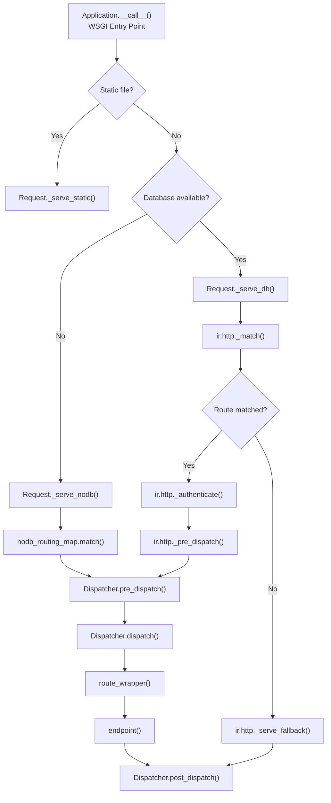
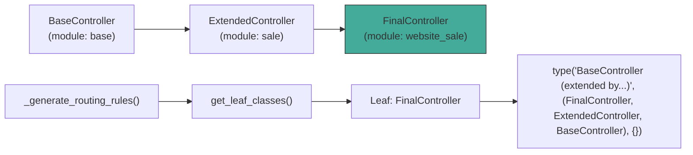

---
slug:14-controller-and-route-system
blog_type:normal
---


The Controller and Route system is the bridge between incoming HTTP requests and your business logic in Odoo. It is the primary interface through which module developers expose web endpoints, serve HTML pages, handle form submissions, and provide JSON APIs. This page dissects the routing architecture from decorator to dispatcher, covering the inheritance model that makes Odoo's extensibility possible at the HTTP layer.

## Architectural Overview

Odoo's HTTP routing is not a simple decorator-to-function mapping. It is a multi-stage pipeline that resolves controller inheritance across installed modules, merges routing metadata through the method resolution order, matches incoming URLs against Werkzeug routing maps, authenticates the request, and dispatches through a type-specific dispatcher—all before your controller method ever executes. The entire system lives in a single, densely-engineered module whose docstring contains the canonical call graph [odoo/http.py](/odoo/odoo/blob/19.0/odoo/http.py#L1-L127).



## The `Controller` Base Class

Every HTTP endpoint in Odoo is defined as a method on a class that inherits from `odoo.http.Controller`. This base class serves two critical purposes: it registers subclasses into a module-indexed registry via `children_classes` (a `defaultdict(list)` keyed by addon module name), and it provides access to the current request's `env` through a property [odoo/http.py](/odoo/odoo/blob/19.0/odoo/http.py#L676-L724).

The registration happens in `__init_subclass__`, which is triggered at class definition time. When a controller class is defined inside an addon module, its module name is extracted from `__module__` (which follows the pattern `odoo.addons.<module_name>...`) and stored in `Controller.children_classes`. Controllers defined outside the `odoo.addons` namespace are stored under an empty string key, placing them outside the extension mechanism.

```python
# odoo/http.py L710-L718
children_classes = collections.defaultdict(list)  # indexed by module

@classmethod
def __init_subclass__(cls):
    super().__init_subclass__()
    if Controller in cls.__bases__:
        path = cls.__module__.split('.')
        module = path[2] if path[:2] == ['odoo', 'addons'] else ''
        Controller.children_classes[module].append(cls)
```

The `env` property delegates to `request.env`, making ORM access convenient but conditional on the existence of a current request [odoo/http.py](/odoo/odoo/blob/19.0/odoo/http.py#L720-L723).

## The `@route` Decorator

The `route` decorator is the most visible surface of the routing system. It transforms an ordinary controller method into a routed endpoint by attaching metadata and wrapping it in a closure [odoo/http.py](/odoo/http.py#L725-L819).

### Core Parameters

| Parameter | Type | Default | Description |
|-----------|------|---------|-------------|
| `route` | `str` or `Iterable[str]` | — | URL path(s) the endpoint serves. Supports Werkzeug routing syntax with `<converter:name>` variables. |
| `type` | `str` | `'http'` | Request type: `'http'`, `'jsonrpc'`, or `'json2'`. Determines which `Dispatcher` handles the request. |
| `auth` | `str` | `'user'` | Authentication requirement: `'user'`, `'public'`, `'none'`, or `'bearer'`. |
| `methods` | `Iterable[str]` | `None` (all) | Allowed HTTP verbs (e.g., `['GET', 'POST']`). |
| `cors` | `str` | `None` | `Access-Control-Allow-Origin` header value for CORS. |
| `csrf` | `bool` | `True` for http, `False` for jsonrpc | Whether CSRF token validation is enforced. |
| `readonly` | `bool` or `Callable` | `False` | Route opens a read-only cursor/replica when `True`. |
| `save_session` | `bool` | `True` (except bearer) | Whether the session cookie is set and the session is persisted. |
| `captcha` | `str` | `None` | Captcha action name; requests are validated against captcha if set. |

The decorator performs several sanitization steps: it renames the deprecated `type='json'` to `'jsonrpc'` with a `DeprecationWarning`, it converts the legacy `method` (singular) parameter to `methods` (plural), and it defaults `save_session` to `False` for `auth='bearer'` to enforce statelessness on token-authenticated requests [odoo/http.py](/odoo/odoo/blob/19.0/odoo/http.py#L754-L777).

Internally, the decorator creates a `route_wrapper` closure that filters keyword arguments against the endpoint's signature, calls the original endpoint, and coerces the result through `Response.load()` for `type='http'` routes (for `jsonrpc` and `json2` types, the raw return value passes through) [odoo/http.py](/odoo/odoo/blob/19.0/odoo/http.py#L780-L796).

### ROUTING_KEYS: What Gets Propagated to Werkzeug

Not every `@route` parameter flows into the Werkzeug routing rule. Only the keys in `ROUTING_KEYS` are propagated directly to the underlying `werkzeug.routing.Rule` [odoo/http.py](/odoo/odoo/blob/19.0/odoo/http.py#L292-L303):

```python
ROUTING_KEYS = {
    'defaults', 'subdomain', 'build_only', 'strict_slashes', 'redirect_to',
    'alias', 'host', 'methods',
}
# 'websocket' is added conditionally for Werkzeug >= 2.0.2
```

Parameters like `type`, `auth`, `csrf`, `cors`, and `readonly` are consumed by Odoo's dispatch pipeline and never reach Werkzeug's rule matching.

## Routing Rule Generation and Controller Inheritance

The most architecturally significant function in the routing system is `_generate_routing_rules`, which implements a two-fold algorithm executed at routing map build time [odoo/http.py](/odoo/odoo/blob/19.0/odoo/http.py#L819-L924).

### The Two-Fold Algorithm

**Fold 1 — Inheritance Resolution.** For each controller class defined in the set of installed modules, the algorithm walks the inheritance tree to find leaf classes (classes with no valid subclasses). It then dynamically constructs a synthetic class that combines the entire inheritance chain in reverse MRO order, producing a single composite controller per endpoint [odoo/http.py](/odoo/odoo/blob/19.0/odoo/http.py#L838-L872).



**Fold 2 — Route Metadata Merging.** For each method on the composite controller, the algorithm walks the MRO (excluding `Controller` and `object`) in reverse ancestor-first order. At each class that defines the method, it retrieves the `original_routing` dict attached by the `@route` decorator and merges them into a single accumulated routing dict. Later classes in the chain override earlier values, so the most-derived module's routing arguments win—except for `routes`, which are accumulated as a list [odoo/http.py](/odoo/odoo/blob/19.0/odoo/http.py#L874-L924).

The validation function `_check_and_complete_route_definition` enforces two critical invariants: every method must declare a `type` in its own routing (it cannot be inherited), and overrides must not change the `type` or `readonly` mode established by a parent class [odoo/http.py](/odoo/odoo/blob/19.0/odoo/http.py#L925-L960).

<CgxTip>
**Inheritance Gotcha**: When extending a controller in a child module, you **must** re-apply the `@route` decorator to the overridden method, even if you provide no arguments. The decorator detection in `_generate_routing_rules` checks for the `original_routing` attribute—without it, the method is silently skipped during rule generation and your override never binds to any URL. The system does emit a warning log, but it is easy to miss during development.
</CgxTip>

## The Dispatcher Architecture

Odoo uses a Strategy pattern implemented via an abstract `Dispatcher` base class, with concrete implementations for each `type` value. Dispatchers are registered in the `_dispatchers` dict via `__init_subclass__` [odoo/http.py](/odoo/odoo/blob/19.0/odoo/http.py#L2362-L2440).

### Dispatcher Lifecycle

Every dispatcher follows a four-phase contract:

| Phase | Method | Purpose |
|-------|--------|---------|
| Compatibility | `is_compatible_with(request)` | Class method; determines if the dispatcher handles this request's content type. |
| Pre-dispatch | `pre_dispatch(rule, args)` | Sets CORS headers, handles OPTIONS preflight, configures max content length, and gates session saving. |
| Dispatch | `dispatch(endpoint, args)` | Deserializes the request body into `request.params`, performs security checks (CSRF), and calls the endpoint. |
| Post-dispatch | `post_dispatch(response)` | Saves dirty sessions, injects `FutureResponse` headers, and applies Content-Security-Policy. |

### HttpDispatcher (`type='http'`)

The HTTP dispatcher is always compatible (its `is_compatible_with` returns `True`). Its `dispatch` method merges query-string parameters with form data into `request.params`, then validates the CSRF token for unsafe HTTP methods (`POST`, `PUT`, `DELETE`, etc.) when `csrf=True`. It delegates to `ir.http._dispatch(endpoint)` when a database is available, or calls the endpoint directly for no-db scenarios [odoo/http.py](/odoo/odoo/blob/19.0/odoo/http.py#L2441-L2510).

Its `handle_error` method converts `SessionExpiredException` into a redirect to `/web/login`, passes through `HTTPException` instances unchanged, maps `UserError` to 422 responses, and falls back to 500 for anything else [odoo/http.py](/odoo/odoo/blob/19.0/odoo/http.py#L2493-L2510).

### JsonRPCDispatcher (`type='jsonrpc'`)

The JSON-RPC dispatcher is compatible when the request's `Content-Type` is `application/json` or `application/json-rpc`. It implements JSON-RPC 2.0 with two Odoo-specific deviations: the `method` field in the payload is ignored (the URL handles routing), and the `params` field must be a JSON object, not an array. The `id` field from the request is preserved in the response envelope [odoo/http.py](/odoo/odoo/blob/19.0/odoo/http.py#L2512-L2606).

### Json2Dispatcher (`type='json2'`)

Introduced as a modern JSON alternative, the `json2` dispatcher accepts `application/json` content types and merges the JSON body with URL path arguments. Unlike `jsonrpc`, it does not wrap the response in a JSON-RPC envelope—if the endpoint returns a `Response` object directly, it passes through; otherwise it serializes to JSON. It also provides richer error handling with proper HTTP status codes and structured error bodies [odoo/http.py](/odoo/odoo/blob/19.0/odoo/http.py#L2607-L2668).

### Dispatcher Selection Summary

| Dispatcher | `type` value | Request Content-Type | Response Format | CSRF Default |
|------------|-------------|---------------------|-----------------|-------------|
| `HttpDispatcher` | `'http'` | Any (form, multipart, etc.) | HTML/any (via `Response.load`) | Enabled |
| `JsonRPCDispatcher` | `'jsonrpc'` | `application/json` | JSON-RPC 2.0 envelope | Disabled |
| `Json2Dispatcher` | `'json2'` | `application/json` | Raw JSON or Response | Disabled |

## The Application and Routing Maps

The `Application` class is the WSGI callable that anchors the entire system. It maintains two distinct routing maps, built for different phases of the request lifecycle [odoo/http.py](/odoo/odoo/blob/19.0/odoo/http.py#L2669-L2870).

The **`nodb_routing_map`** is a cached property populated by calling `_generate_routing_rules` with `server_wide_modules` and `nodb_only=True`. This map contains only routes with `auth='none'` and is available before any database connection exists—it handles database selection, authentication, and other bootstrap endpoints. The `Application.get_db_router(db)` method returns either this no-db map (when `db` is falsy) or delegates to `ir.http.routing_map()` for database-aware routing [odoo/http.py](/odoo/odoo/blob/19.0/odoo/http.py#L2742-L2762).

## Request Dispatching: The Full Pipeline

The `Application.__call__` method implements the top-level routing decision tree, which is the actual runtime path every request follows [odoo/http.py](/odoo/odoo/blob/19.0/odoo/http.py#L2788-L2870).

### Static File Handling

If the URL matches `/<module>/static/<path>`, the request is served directly from the filesystem via `Request._serve_static()`. No authentication, no ORM, no database—just a file stream with appropriate cache headers [odoo/http.py](/odoo/odoo/blob/19.0/odoo/http.py#L2693-L2725).

### No-Database Requests

When no database is selected (new session, no `X-Odoo-Database` header, or monodb filter rejected), the framework uses the `nodb_routing_map`. Only `auth='none'` routes are eligible. The pipeline is abbreviated: match → pre_dispatch → dispatch → post_dispatch, without any ORM interaction [odoo/http.py](/odoo/odoo/blob/19.0/odoo/http.py#L2788-L2870).

### Database-Aware Requests

When a database is available, the full pipeline activates through `Request._serve_db()`. The framework opens a registry, manages cursor lifecycle (read-only for matching, potentially read-write for dispatching), and delegates to the ORM model `ir.http` for route matching (`_match`), authentication (`_authenticate`), and dispatching (`_dispatch`). If no route matches, `ir.http._serve_fallback` attempts alternative content delivery (e.g., attachment URLs, CMS pages) [odoo/http.py](/odoo/odoo/blob/19.0/odoo/http.py#L1-L127).

The `service.model.retrying` context manager wraps the entire database-aware execution path, recovering from serialization errors and write-in-readonly errors by retrying with appropriate cursor modes [odoo/http.py](/odoo/odoo/blob/19.0/odoo/http.py#L82-L88).

## Practical Controller Patterns

### Defining a Basic HTTP Controller

```python
from odoo import http

class MyController(http.Controller):
    @http.route('/my/page', type='http', auth='user')
    def my_page(self):
        records = request.env['my.model'].search([])
        return request.render('my_module.template', {'records': records})
```

### Extending a Controller Across Modules

When module B extends a controller from module A, the route merging algorithm combines both decorators. Omitted arguments in the child's `@route` keep the parent's values:

```python
# Module: sale
class SaleController(http.Controller):
    @http.route('/shop/confirm', type='http', auth='user', methods=['POST'])
    def confirm(self):
        # Original implementation
        pass

# Module: website_sale
class WebsiteSaleController(SaleController):
    @http.route(auth='public')  # Inherits '/shop/confirm' and methods=['POST'], overrides auth
    def confirm(self):
        # Extended implementation, now accessible to public users
        return super().confirm()
```

<CgxTip>
**Route merging is additive for paths**: When a child class provides its own `route` parameter, it **replaces** the parent's routes entirely—it does not add to them. If you need the child to serve both the original and new paths, explicitly list all paths in the child's `@route('/original', '/new')`.
</CgxTip>

## Thread-Local Request Access

The current request is stored in a Werkzeug `LocalStack` at `odoo.http.request`, providing thread-safe per-request access from anywhere in the call stack. The `borrow_request()` context manager temporarily removes the request from the stack—useful when making internal sub-requests where the inner request must not pollute the outer request's state [odoo/http.py](/odoo/odoo/blob/19.0/odoo/http.py#L1425-L1438).

## Next Steps

Having understood how routes are registered and dispatched, the logical next topics in the catalog are:
- **[Session Management and CSRF](15-session-management-and-csrf)** — deep dive into session storage, rotation, and CSRF token generation/validation that was referenced throughout this page.
- **[JSON-RPC and HTTP Dispatchers](16-json-rpc-and-http-dispatchers)** — detailed exploration of the JSON-RPC 2.0 implementation and the `json2` dispatcher's error handling strategies.
- **[WSGI Application and Request Lifecycle](13-wsgi-application-and-request-lifecycle)** — the broader context of how the WSGI entry point, threading model, and request/response objects interact with the routing pipeline described here.