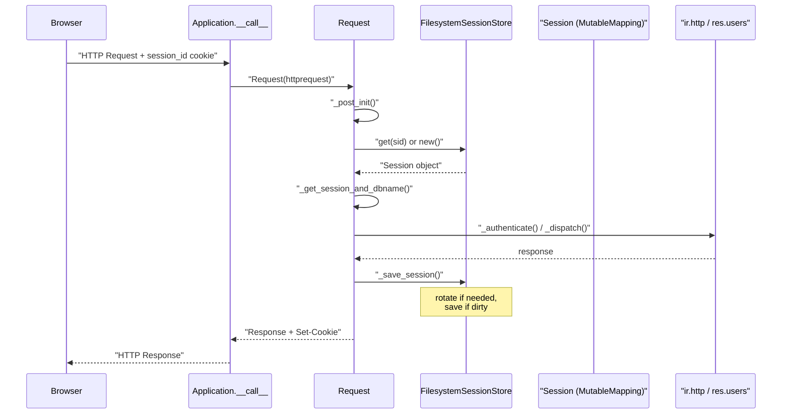
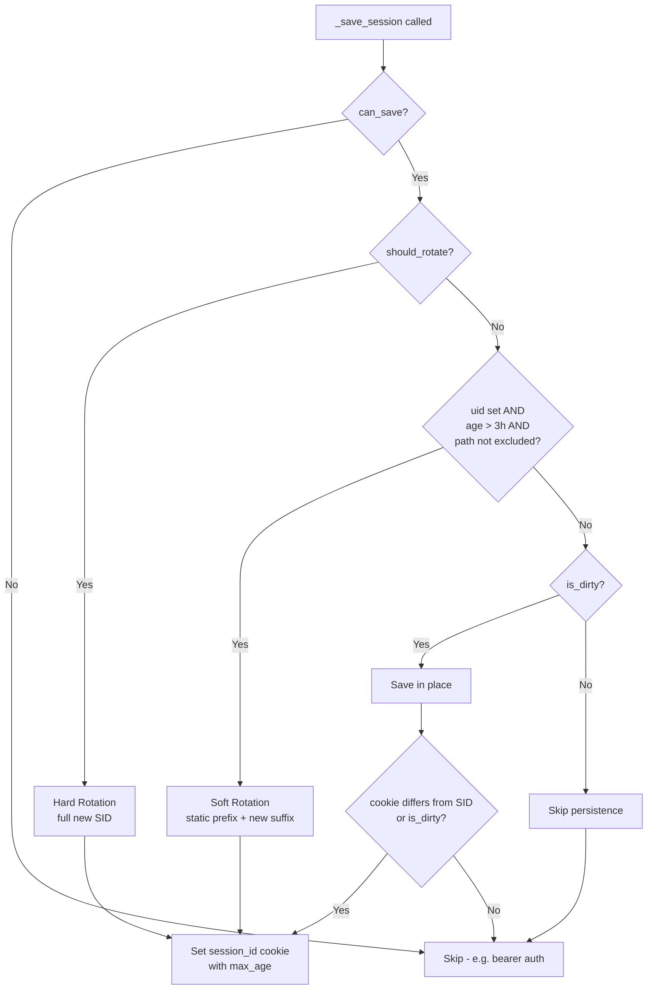
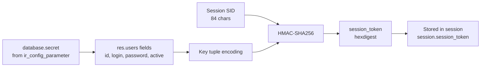
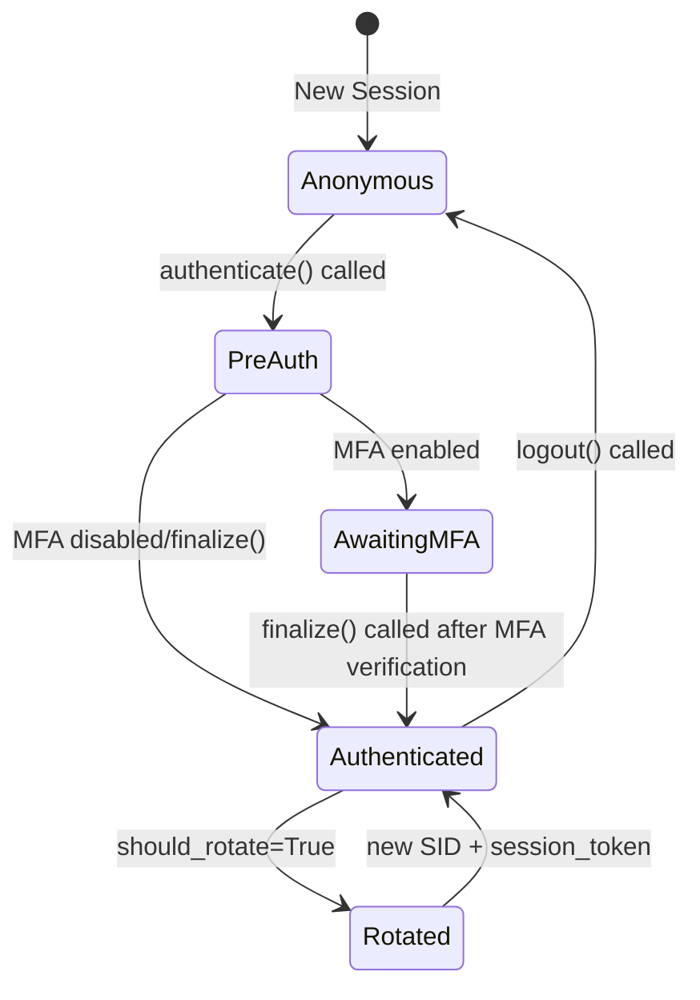

---
slug:15-session-management-and-csrf
blog_type:normal
---


This page dissects Odoo 19's session management subsystem and its integrated CSRF protection mechanism. Sessions in Odoo are not merely cookie-based state holders—they are a layered security boundary encompassing filesystem-persisted state, cryptographic session tokens, automatic key rotation, and HMAC-based CSRF defenses. Understanding this subsystem is essential for building secure controllers, debugging authentication flows, and designing custom authentication integrations.

## Session Architecture Overview

Odoo's session system is composed of three collaborating components: a **filesystem-backed session store** with sharded directory layout, a **`Session` data structure** implementing `MutableMapping`, and a **`Request` object** that orchestrates session loading, validation, and persistence within the WSGI lifecycle. The `Application` class initializes a single `FilesystemSessionStore` instance as a cached property, storing session files under the directory configured by `odoo.tools.config.session_dir` [Sources: odoo/http.py](/odoo/http.py#L2739-L2743).



The `Session` class uses `__slots__` for memory efficiency and stores its payload in a private `__data` dict. Every mutation goes through `__setitem__`, which round-trips values through JSON serialization and sets an `is_dirty` flag—ensuring that only genuinely changed sessions are written back to disk [Sources: odoo/http.py](/odoo/http.py#L1107-L1132). The default session payload, produced by `get_default_session()`, contains `uid`, `db`, `login`, `context`, `debug`, `session_token`, `create_time`, and `_trace` [Sources: odoo/http.py](/odoo/http.py#L234-L245).

## Session Storage: FilesystemSessionStore

The `FilesystemSessionStore` extends Werkzeug's `sessions.FilesystemSessionStore` with three critical enhancements: **directory sharding**, **retro-compatible path migration**, and **identifier-based batch operations**. Session files are scattered across 4,096 subdirectories (64²) using the first two characters of the base64-encoded session ID as the shard key, which prevents any single directory from accumulating an unmanageable number of files [Sources: odoo/http.py](/odoo/http.py#L967-L974).

| Capability | Method | Purpose |
|---|---|---|
| Session retrieval | `get(sid)` | Loads session; migrates legacy flat paths to sharded layout |
| Session persistence | `save(session)` | Creates shard directory if needed, delegates to parent |
| Soft rotation | `rotate(session, env, soft=True)` | Keeps first 42 bytes of SID static, replaces trailing bytes |
| Hard rotation | `rotate(session, env, soft=False)` | Deletes old session, generates entirely new SID |
| Garbage collection | `vacuum(max_lifetime)` | Removes session files older than threshold |
| Batch existence check | `get_missing_session_identifiers(ids)` | Efficiently checks which of many session prefixes still exist on disk |
| Batch deletion | `delete_from_identifiers(ids)` | Removes session files matching given 42-char prefixes |
| Key generation | `generate_key()` | Produces 84-char base64url key with ~217.9 bits of entropy |

Session IDs are 84-character base64url-encoded strings produced by hashing `str(time.time()) + os.urandom(64)` with SHA-512 and trimming the last byte to prevent base64 padding. The `STORED_SESSION_BYTES` constant (42) defines how many leading bytes of the SID remain static—this prefix is used for CSRF token computation and for correlating sessions in the database [Sources: odoo/http.py](/odoo/http.py#L326-L328, #L1047-L1064).

<CgxTip>
The `get()` method performs retro-compatible migration: if a session file exists at the old flat path but not at the new sharded path, it renames the file transparently. This ensures zero-downtime upgrades from older Odoo versions that used Werkzeug's default flat storage [Sources: odoo/http.py](/odoo/http.py#L991-L1003).
</CgxTip>

## Session Lifecycle and Rotation

Odoo implements a sophisticated session rotation strategy that balances security against race conditions from concurrent browser requests. The `_save_session()` method on `Request` is the central decision point—it runs during `Dispatcher.post_dispatch()` and applies a priority cascade [Sources: odoo/http.py](/odoo/http.py#L2130-L2163):



| Rotation Type | Trigger | SID Behavior | Use Case |
|---|---|---|---|
| **Hard rotation** | `session.should_rotate = True` (login, logout, MFA) | Entire SID regenerated | Privilege boundary changes |
| **Soft rotation** | `SESSION_ROTATION_INTERVAL` (3h) elapsed for authenticated session | First 42 bytes preserved; trailing bytes regenerated | Periodic security refresh |
| **None** | No rotation needed | SID unchanged | Unauthenticated or frequent-polling paths |

The soft rotation mechanism handles concurrent requests elegantly: when multiple requests arrive simultaneously with the same old cookie, the first one to rotate writes a `next_sid` field into the old session file. Subsequent requests detect `next_sid` and adopt it rather than creating duplicate new sessions—a form of distributed coordination via the filesystem [Sources: odoo/http.py](/odoo/http.py#L1005-L1037).

| Constant | Value | Purpose |
|---|---|---|
| `SESSION_LIFETIME` | 7 days (604,800s) | Default max age of session cookie and vacuum threshold |
| `SESSION_ROTATION_INTERVAL` | 3 hours (10,800s) | Time before automatic soft rotation |
| `SESSION_DELETION_TIMER` | 120 seconds | Grace period before old session file is deleted after rotation |
| `SESSION_ROTATION_EXCLUDED_PATHS` | `/websocket/on_closed`, `/websocket/peek_notifications`, `/websocket/update_bus_presence` | Paths exempt from auto-rotation to avoid disrupting long-polling |

The session cookie's `max_age` is dynamically computed via `get_session_max_inactivity()`, which reads the `sessions.max_inactivity_seconds` config parameter from `ir.config_parameter`, falling back to `SESSION_LIFETIME` (7 days) [Sources: odoo/http.py](/odoo/http.py#L449-L459).

## Session Authentication and Token Verification

When a request reaches `_serve_db()`, the session's `uid` is used to construct an Odoo environment. The `check_session()` function in `odoo.service.security` verifies the session's integrity by comparing the stored `session_token` against a freshly computed HMAC [Sources: odoo/service/security.py](/odoo/service/security.py#L13-L33).

The session token is computed by `res.users._compute_session_token(sid)`, which is ORM-cached by SID. It retrieves the user's `id`, `login`, `password`, and `active` fields via a direct SQL query (including the `database.secret` from `ir_config_parameter`), then computes an HMAC-SHA256 over the full session ID using a key derived from those field values [Sources: odoo/addons/base/models/res_users.py](/odoo/addons/base/models/res_users.py#L829-L884).



The `check_session()` function performs a two-step validation with **legacy fallback**: it first compares against the current token format (named-tuple key), and if that fails, it checks against the legacy format (raw-tuple key). If the legacy check succeeds, the token is transparently upgraded to the new format, enabling smooth migrations [Sources: odoo/service/security.py](/odoo/service/security.py#L13-L33).

<CgxTip>
The `_compute_session_token` method is decorated with `@tools.ormcache('sid')`, meaning tokens are cached per session ID. When a user changes their password, the ORM cache is cleared, which automatically invalidates all existing session tokens across all devices—forcing re-authentication globally [Sources: odoo/addons/base/models/res_users.py](/odoo/addons/base/models/res_users.py#L851-L856).
</CgxTip>

## CSRF Protection Mechanism

Odoo's CSRF protection is a **HMAC-based token system** bound to both the session identity and a time window. It is enforced exclusively by the `HttpDispatcher` for `type='http'` routes. The `JsonRPCDispatcher` does not perform CSRF validation—JSON-RPC endpoints rely on the session token mechanism and the `SameSite` cookie policy instead [Sources: odoo/http.py](/odoo/http.py#L2441-L2477).

### Token Generation

The `Request.csrf_token()` method generates tokens using HMAC-SHA1 over the concatenation of the session's static prefix (first 42 bytes of the SID) and a maximum timestamp. The `database.secret` config parameter serves as the HMAC key [Sources: odoo/http.py](/odoo/http.py#L1904-L1924).

```
token = hmac_sha1(database.secret, session.sid[:42] + max_ts) + "o" + max_ts
```

The `time_limit` parameter controls token validity: the default is 48 hours (matching the parent framework), while `None` sets a 1-year expiry using `CSRF_TOKEN_SALT` as a BREACH mitigation salt. The timestamp in the token serves a dual purpose: it limits the token's validity window and acts as a nonce to prevent BREACH-style compression attacks [Sources: odoo/http.py](/odoo/http.py#L227-L228).

### Token Validation

The `Request.validate_csrf()` method reverses the process: it splits the token on the `"o"` separator, reconstructs the message, recomputes the HMAC, and performs a **constant-time comparison** via `consteq()` to prevent timing attacks. If the embedded timestamp has expired, validation fails immediately [Sources: odoo/http.py](/odoo/http.py#L1926-L1952).

### Enforcement Point

CSRF enforcement happens inside `HttpDispatcher.dispatch()`, which runs after route matching and authentication but before the controller endpoint is called:

1. The HTTP method is checked against `SAFE_HTTP_METHODS` (`GET`, `HEAD`, `OPTIONS`, `TRACE`)—safe methods bypass CSRF entirely [Sources: odoo/http.py](/odoo/http.py#L224-L225).
2. The route's `csrf` routing key is checked (defaults to `True` for `type='http'` routes) [Sources: odoo/http.py](/odoo/http.py#L2462).
3. The `csrf_token` parameter is extracted from request params and validated.
4. On failure, a `BadRequest` exception is raised with message "Session expired (invalid CSRF token)".

| Scenario | Behavior |
|---|---|
| `GET`/`HEAD`/`OPTIONS`/`TRACE` | CSRF check skipped entirely |
| `POST` with valid `csrf_token` param | Request proceeds to endpoint |
| `POST` with missing `csrf_token` param | `BadRequest` raised with `MISSING_CSRF_WARNING` logged |
| `POST` with invalid `csrf_token` param | `BadRequest` raised with "CSRF validation failed" logged |
| `@route(csrf=False)` on endpoint | CSRF check skipped regardless of method |
| `@route(type='jsonrpc')` endpoint | No CSRF check (JSON-RPC dispatcher doesn't enforce it) |

## Authentication Flow: Login, MFA, and Logout

The `Session.authenticate()` method orchestrates the full login flow with integrated multi-factor authentication support. It delegates to `res.users.authenticate()`, then conditionally finalizes based on MFA status [Sources: odoo/http.py](/odoo/http.py#L1198-L1235).



The `authenticate()` method stores intermediate credentials as `pre_login` and `pre_uid` in the session without committing `uid` or `session_token`. If MFA is enabled (detected via `user._mfa_url()` returning a truthy value), the session remains in a partial state until `finalize()` is called after the second factor is verified. The `finalize()` method promotes the partial session to a fully authenticated one: it pops `pre_login`/`pre_uid`, sets `uid`, `db`, `login`, `context`, computes a new `session_token`, and flags the session for hard rotation [Sources: odoo/http.py](/odoo/http.py#L1237-L1255).

The `logout()` method clears all session data, resets to the default session template, preserves the `db` and `debug` values (optionally), and triggers a hard rotation. It also calls `ir.http._post_logout()` to allow modules to perform cleanup [Sources: odoo/http.py](/odoo/http.py#L1257-L1266).

## Session Database Resolution

The `_get_session_and_dbname()` method implements a priority-based database resolution strategy with explicit conflict handling between session cookies and header-based database selection [Sources: odoo/http.py](/odoo/http.py#L1783-L1821):

| Priority | Source | Behavior |
|---|---|---|
| 1 | `session.db` (from cookie) + `db_filter()` match | Use session's database |
| 2 | `X-Odoo-Database` header + `db_filter()` match | Use header's database; session becomes stateless (`can_save=False`) |
| 3 | Single database in filtered list | Auto-select (monodb mode) |
| 4 | No match | `dbname` remains `None`; session.db is cleared |

If both the session cookie and the `X-Odoo-Database` header specify databases, and they differ, a `Forbidden` exception is raised—preventing database confusion attacks. When `db_filter()` rejects the session's stored database (e.g., after a hostname change or filter reconfiguration), the session is automatically logged out with a warning [Sources: odoo/http.py](/odoo/http.py#L1799-L1818).

## Device Tracking and Audit Trail

The `Session.update_trace()` method maintains a `_trace` array in the session that records device fingerprints (platform, browser, IP address) with first and last activity timestamps. It deduplicates entries by platform/browser/IP combination and only flags the session as dirty when a trace is created or updated after one hour of inactivity, minimizing unnecessary disk writes. Sessions can opt out of tracing by setting `_trace_disable=True`, though this flag is only settable through server-side logic, not by end users [Sources: odoo/http.py](/odoo/http.py#L1271-L1306).

## Stateless Sessions: Bearer Authentication

When a route is decorated with `@route(auth='bearer')`, the `save_session` routing key defaults to `False`, which causes `Dispatcher.pre_dispatch()` to set `session.can_save = False`. This means the session is never persisted to disk and no `session_id` cookie is sent in the response—enabling truly stateless API authentication via `Authorization: Bearer <token>` headers. This is the recommended pattern for REST API endpoints consumed by external systems [Sources: odoo/http.py](/odoo/http.py#L2391-L2392, #L798-L799).

## Session-Related Error Handling

The `SessionExpiredException` (HTTP 403) is raised when session integrity cannot be verified. The `HttpDispatcher.handle_error()` method intercepts this exception: if the user was connected (`session.uid is not None`), it performs a hard rotation to invalidate the compromised session, then redirects to `/web/login` with the original URL as a `redirect` parameter. If the user was not connected, it simply redirects to login without rotation [Sources: odoo/http.py](/odoo/http.py#L2479-L2498, #L342-L347).

## Configuration Reference

| Parameter | Location | Default | Description |
|---|---|---|---|
| `sessions.max_inactivity_seconds` | `ir.config_parameter` | 604,800 (7 days) | Max inactivity before session cookie expires |
| `database.secret` | `ir.config_parameter` | Auto-generated | HMAC key for CSRF tokens and session tokens |
| `session_dir` | `odoo.tools.config` | `$data_dir/sessions` | Filesystem path for session storage |
| `--proxy_mode` | CLI flag | `False` | Enables `X-Forwarded-*` header processing |

## Next Steps

Having understood how sessions are created, rotated, and protected, the natural progression is to explore how requests are dispatched through these session-protected routes:

- **[Controller and Route System](14-controller-and-route-system)** — How `@route()` decorators define endpoints and how the routing map is built from controller inheritance hierarchies
- **[JSON-RPC and HTTP Dispatchers](16-json-rpc-and-http-dispatchers)** — Deep dive into the `JsonRPCDispatcher` and `Json2Dispatcher` which bypass CSRF in favor of session token validation
- **[WSGI Application and Request Lifecycle](13-wsgi-application-and-request-lifecycle)** — The full WSGI entry point showing where session loading fits in the request pipeline
- **[Security and Access Control](23-security-and-access-control)** — How ACLs, record rules, and group-based permissions layer on top of session authentication