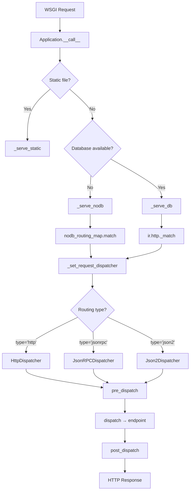

---
slug:16-json-rpc-and-http-dispatchers
blog_type:normal
---


Odoo's request dispatching system is the bridge between raw HTTP bytes and controller endpoints. It transforms incoming requests — regardless of protocol — into typed parameter dictionaries, passes them through authentication and CSRF gates, invokes the correct controller method, and serializes the result back into an HTTP response. The architecture hinges on a **pluggable dispatcher pattern** where three concrete dispatcher classes — `HttpDispatcher`, `JsonRPCDispatcher`, and `Json2Dispatcher` — are registered by their routing type key in a module-level `_dispatchers` dictionary and selected dynamically at request time.

Sources: [http.py](odoo/http.py#L2362-L2364)

## Dispatcher Architecture Overview

The dispatcher system lives entirely within `odoo/http.py` and is composed of an abstract base class `Dispatcher` and three concrete implementations. Each dispatcher encapsulates the full lifecycle of request processing for a specific content type: deserialization, validation, endpoint invocation, and error handling. The `Application.__call__` WSGI entry point selects the appropriate dispatcher after the routing phase resolves a matching `@route`-decorated endpoint, and the selected dispatcher then drives the request through its `pre_dispatch` → `dispatch` → `post_dispatch` pipeline.



Sources: [http.py](odoo/http.py#L2788-L2871), [http.py](odoo/http.py#L2161-L2223)

## The Abstract Dispatcher Base Class

The `Dispatcher` ABC at line 2364 defines the contract that all three dispatchers fulfill. It is registered into the `_dispatchers` dictionary via `__init_subclass__`, which maps `cls.routing_type` (a string like `'http'` or `'jsonrpc'`) to the concrete class. This auto-registration pattern means that any new dispatcher added to the module is immediately available for route matching without additional wiring.

Sources: [http.py](odoo/http.py#L2362-L2380)

### The Dispatch Lifecycle: pre_dispatch → dispatch → post_dispatch

The base class implements three lifecycle methods that concrete subclasses may override selectively. `pre_dispatch` handles cross-cutting concerns common to all routing types: session save policy propagation (controlled by the `save_session` routing key), CORS header injection, and `max_content_length` enforcement. Crucially, if a CORS preflight (`OPTIONS`) request arrives, `pre_dispatch` short-circuits by returning a `204 No Content` response immediately, before any controller logic runs.

Sources: [http.py](odoo/http.py#L2387-L2418)

`dispatch` is the sole required abstract method — each dispatcher must implement its own request body deserialization logic. `post_dispatch` performs session persistence and CSP header injection via `root.set_csp(response)` and `request._inject_future_response(response)`. This is where any deferred headers accumulated during the request (stored in `request.future_response`) are flushed into the final HTTP response.

Sources: [http.py](odoo/http.py#L2428-L2437)

### Error Handling Contract

Each dispatcher also implements `handle_error`, which is called from the `Application.__call__` catch-all exception handler when an unmanaged exception occurs. The error response produced by `handle_error` is attached to the exception as `exc.error_response` and returned as a WSGI application. This separation ensures that JSON-RPC errors produce `application/json` bodies while HTTP errors produce HTML or browser-appropriate responses.

Sources: [http.py](odoo/http.py#L2439-L2441)

## Dispatcher Selection: Content-Type vs. Route Type Resolution

The dispatcher is not chosen based on the incoming `Content-Type` header alone. Instead, the route's declared `type` takes priority, and the framework validates that the request is compatible. The method `_set_request_dispatcher` at line 2221 first reads the routing type from the matched endpoint, then calls `dispatcher_cls.is_compatible_with(request)` to verify that the incoming request's MIME type matches what the route expects. If they disagree, Odoo raises an `UnsupportedMediaType` exception (HTTP 415) with an `Accept` header listing the expected MIME types — a precise diagnostic that tells the client exactly what went wrong.

Sources: [http.py](odoo/http.py#L2221-L2240)

| Dispatcher | `routing_type` | Expected MIME Types | `is_compatible_with` Logic |
|---|---|---|---|
| `HttpDispatcher` | `'http'` | `application/x-www-form-urlencoded`, `multipart/form-data`, `*/*` | Always returns `True` (fallback) |
| `JsonRPCDispatcher` | `'jsonrpc'` | `application/json`, `application/json-rpc` | Checks `request.httprequest.mimetype` |
| `Json2Dispatcher` | `'json2'` | `application/json` | Checks mimetype or empty body |

Sources: [http.py](odoo/http.py#L2441-L2445), [http.py](odoo/http.py#L2512-L2517), [http.py](odoo/http.py#L2607-L2612)

<CgxTip>
`HttpDispatcher.is_compatible_with` always returns `True`, making it the universal fallback. If you register a `type='jsonrpc'` route but a client sends a form-encoded POST, Odoo raises a 415 with the correct `Accept` header rather than silently misrouting. This content-negotiation guard is critical for API correctness.
</CgxTip>

## HttpDispatcher: Form-Encoded Web Requests

`HttpDispatcher` handles the traditional web request pattern — browser-initiated form submissions and URL-encoded query strings. Its `dispatch` method merges `request.get_http_params()` (which combines query string `args`, form data, and uploaded files) with the route path parameters extracted by the URL router into a single `request.params` dictionary.

Sources: [http.py](odoo/http.py#L2441-L2474)

### CSRF Protection Gate

Before endpoint invocation, `HttpDispatcher` enforces CSRF protection for all unsafe HTTP methods (`POST`, `PUT`, `DELETE`, `PATCH`). It pops the `csrf_token` parameter from `request.params` and validates it via `request.validate_csrf(token)`. If the token is missing, Odoo logs a detailed warning containing the full request path and the `MISSING_CSRF_WARNING` message — this is the message developers commonly see when calling Odoo endpoints from external scripts without a session. If the token is present but invalid, a more specific "CSRF validation failed" warning is logged. Both cases result in a `400 Bad Request` with the message "Session expired (invalid CSRF token)".

Sources: [http.py](odoo/http.py#L2458-L2472)

Safe methods — `GET`, `HEAD`, `OPTIONS`, `TRACE` — bypass CSRF validation entirely, as defined by the module-level `SAFE_HTTP_METHODS` tuple at line 225.

Sources: [http.py](odoo/http.py#L224-L225)

### Endpoint Invocation Path

After CSRF validation, `HttpDispatcher` delegates to `ir.http._dispatch(endpoint)` when a database is available, or calls `endpoint(**request.params)` directly in database-free contexts. The `ir.http._dispatch` wrapper is defined in the `base` module and applies additional framework-level preprocessing before invoking the raw endpoint. The endpoint's return value can be a `Response` object, a string (HTML), a `Stream`, or a QWeb template tuple — the `Response` class handles normalization.

Sources: [http.py](odoo/http.py#L2473-L2475), [http.py](odoo/http.py#L1484-L1485)

### Error Handling for HTTP Routes

`HttpDispatcher.handle_error` treats four exception categories distinctly: `SessionExpiredException` triggers a redirect to `/web/login` with the original URL preserved as a `redirect` parameter, performing a session rotation to invalidate the compromised session ID. `HTTPException` instances (like `NotFound`, `BadRequest`) are returned directly. `UserError` is mapped to a `422 Unprocessable Entity` response. All other exceptions produce an `InternalServerError` (500).

Sources: [http.py](odoo/http.py#L2478-L2497)

## JsonRPCDispatcher: JSON-RPC 2.0 over HTTP

`JsonRPCDispatcher` implements a JSON-RPC 2.0 compliant protocol with two deliberate deviations from the specification: the `method` field in the request payload is ignored (the HTTP URL path already routes the request), and only named parameters are supported — the `params` member must be a JSON Object, not a JSON Array. This design reflects Odoo's REST-adjacent philosophy where URL routing supersedes RPC method namespacing.

Sources: [http.py](odoo/http.py#L2512-L2594)

### Request Processing Protocol

The `dispatch` method parses the JSON body via `request.get_json_data()` and extracts the `id` field for response correlation. The `params` object is merged with URL path arguments into `request.params`. Unlike `HttpDispatcher`, no CSRF validation occurs — the JSON-RPC protocol relies on the `database.secret`-based session authentication instead.

Sources: [http.py](odoo/http.py#L2565-L2578)

The response envelope follows the JSON-RPC 2.0 spec:

```json
// Successful response
{"jsonrpc": "2.0", "result": { ... }, "id": 1}

// Error response
{"jsonrpc": "2.0", "error": {"code": 200, "message": "...", "data": {"code": "...", "debug": "..."}}, "id": 1}
```

Errors from `serialize_exception` include the `code` (an Odoo-specific string like `"odoo.exceptions.AccessDenied"`), the `message` (end-user-friendly), and the `debug` field (full Python traceback, only in debug mode). Three specific error codes are used: `0` for generic server errors, `404` for `NotFound`, and `100` for `SessionExpiredException`.

Sources: [http.py](odoo/http.py#L2536-L2555), [http.py](odoo/http.py#L2583-L2594), [http.py](odoo/http.py#L466-L483)

### Context Override Mechanism

A special `context` key can be included in the `params` object of a JSON-RPC request. When present, this context dictionary replaces the session context for the duration of the endpoint call — it is popped from the params before the endpoint is invoked. This allows RPC clients to override language, timezone, or other context parameters on a per-request basis without modifying the session.

Sources: [http.py](odoo/http.py#L2535-L2555)

## Json2Dispatcher: The Modern JSON Endpoint

`Json2Dispatcher` (routing type `'json2'`) is the newest dispatcher and represents a streamlined JSON API approach. Unlike `JsonRPCDispatcher`, it does not wrap the response in a JSON-RPC 2.0 envelope — it returns the endpoint result directly as JSON. It also accepts requests with no body (empty `content_length`), making it compatible with simple GET requests that expect JSON responses.

Sources: [http.py](odoo/http.py#L2607-L2668)

### Key Differences from JsonRPCDispatcher

| Feature | `JsonRPCDispatcher` | `Json2Dispatcher` |
|---|---|---|
| Response envelope | JSON-RPC 2.0 wrapper with `jsonrpc`, `id`, `result`/`error` | Raw JSON (endpoint result directly) |
| Request body required | Yes | No (supports empty body) |
| `method` field handling | Accepted but ignored | Not expected |
| Error response format | JSON-RPC error object in envelope | Serialized exception with HTTP status code |
| Request ID tracking | Yes (`self.request_id`) | No |

### Error Handling: HTTP Status Codes in JSON

`Json2Dispatcher.handle_error` produces properly typed HTTP error responses rather than always returning HTTP 200 with an error object. `UserError` and `SessionExpiredException` use their `http_status` attribute (typically 400 or 403). `HTTPException` subclasses use their `.code` property. Unhandled exceptions produce a 500 response. The response body is always a JSON-serialized exception object from `serialize_exception`.

Sources: [http.py](odoo/http.py#L2635-L2668)

## Legacy RPC Dispatch: dispatch_rpc

Separate from the WSGI dispatcher hierarchy, Odoo maintains a legacy `dispatch_rpc` function at line 425 that handles XML-RPC style calls from the Odoo desktop client. This function dispatches to three service modules based on the `service_name` parameter: `'common'` (version, auth), `'db'` (database management), and `'object'` (model method execution). It operates outside the WSGI request lifecycle entirely — it uses `borrow_request()` to temporarily remove the current request from the thread-local stack and runs with `uid=None` and `dbname=None`.

Sources: [http.py](odoo/http.py#L425-L448)

| Service | Module | Methods | Purpose |
|---|---|---|---|
| `common` | `odoo.service.common` | `version`, `authenticate`, `about` | Server info and authentication |
| `db` | `odoo.service.db` | `create_database`, `drop`, `dump`, `restore`, `list` | Database lifecycle management |
| `object` | `odoo.service.model` | `execute`, `execute_kw` | Remote model method invocation |

The `object` service's `dispatch` function at [model.py](odoo/service/model.py#L109-L138) unpacks the traditional 7-parameter tuple `(db, uid, password, model, method, *args)` and delegates to `call_kw`, which validates method accessibility (no private methods, no underscore-prefixed names), constructs the appropriate recordset, applies the `context` override from kwargs, and invokes the method with automatic retry on PostgreSQL serialization failures (up to 5 attempts).

Sources: [service/model.py](odoo/service/model.py#L109-L138), [service/common.py](odoo/service/common.py#L56-L63)

<CgxTip>
The legacy `dispatch_rpc` still uses the old 7-parameter credential tuple `(db, uid, password, model, method, args, kwargs)` for the `object` service, unlike the WSGI JSON-RPC dispatchers which rely on session-based authentication. When writing new integrations, prefer the `jsonrpc` or `json2` routing types which are session-aware and CSRF-protected by default.
</CgxTip>

## Dispatch Integration with the Request Lifecycle

The dispatcher is not invoked in isolation — it sits at the heart of Odoo's layered request processing pipeline. For database-bound requests, the full sequence is: `Application.__call__` → `Request._serve_db` → `ir.http._match` (URL routing) → `_set_request_dispatcher` (content type validation) → `ir.http._authenticate` → `ir.http._pre_dispatch` → `Dispatcher.pre_dispatch` → `Dispatcher.dispatch` → `ir.http._dispatch` → endpoint → `ir.http._post_dispatch` → `Dispatcher.post_dispatch`. For database-free requests, the pipeline is shorter: `_serve_nodb` skips the `ir.http` ORM layer entirely.

Sources: [http.py](odoo/http.py#L2277-L2304)

The `service.model.retrying` wrapper (distinct from `retrying` in `service/model.py`) manages cursor lifecycle and handles `SerializationError` / `ReadOnlySqlTransaction` recovery. When a read-only cursor encounters a write attempt, the wrapper automatically retries with a read/write cursor — the `readonly` routing key controls this behavior, and it can be a callable for dynamic decisions based on the controller instance.

Sources: [http.py](odoo/http.py#L2243-L2277)

## Route Type Declaration and Dispatcher Binding

The `@route` decorator at line 725 accepts a `type` key (defaulting to `'http'`) that determines which dispatcher handles the endpoint. This type is propagated through the routing rule system and stored in `endpoint.routing['type']`. The `_generate_routing_rules` function at line 819 handles the two-fold algorithm of resolving which method in the controller inheritance tree binds to each URL, while `_check_and_complete_route_definition` at line 925 ensures that route type and read/write mode consistency is maintained across inheritance overrides.

Sources: [http.py](odoo/http.py#L725-L818), [http.py](odoo/http.py#L819-L924), [http.py](odoo/http.py#L925-L959)

```python
# HTTP route (default) — handled by HttpDispatcher
@http.route('/web/login', type='http', auth='none', methods=['GET', 'POST'])
def web_login(self, *args, **kwargs):
    ...

# JSON-RPC route — handled by JsonRPCDispatcher
@http.route('/web/session/get_session_info', type='jsonrpc', auth='user')
def get_session_info(self):
    ...

# JSON2 route — handled by Json2Dispatcher
@http.route('/api/partners', type='json2', auth='user')
def list_partners(self):
    return self.env['res.partner'].search_read([])
```

## Next Steps

Having understood how requests are deserialized and dispatched, the natural continuation is to explore the controller and route system that defines the endpoints these dispatchers invoke. See [Controller and Route System](14-controller-and-route-system) for the full routing rule resolution algorithm. For the broader WSGI lifecycle that wraps dispatcher invocation, see [WSGI Application and Request Lifecycle](13-wsgi-application-and-request-lifecycle). To understand how sessions and CSRF tokens are managed before the dispatcher runs, see [Session Management and CSRF](15-session-management-and-csrf). Finally, for context on how cursor management and retry logic operate within dispatch, see [Prefork and Gevent Architecture](21-prefork-and-gevent-architecture).