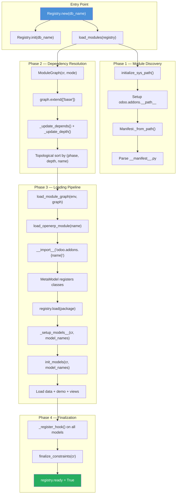
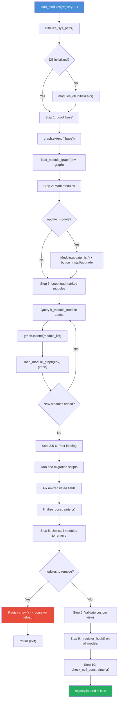

---
slug:17-module-loading-and-registry
blog_type:normal
---


The module system is the architectural backbone of Odoo's extensibility. Every business capability — from CRM to accounting — arrives as a self-contained module (also called an addon) that declares its models, views, data, and dependencies through a manifest file. This document traces the complete lifecycle from module discovery through Python import, dependency resolution, model registration, and final schema initialization, grounding every claim in the source code of Odoo 19.

## Architectural Overview

At the center of Odoo's module system sits the **Registry** — a per-database singleton that maps model names (like `res.partner`) to their corresponding Python classes. Surrounding it are three cooperating subsystems: **manifest discovery** (finding and parsing `__manifest__.py` files), the **dependency graph** (topologically sorting modules by their `depends` declarations), and the **loading pipeline** (a multi-step process that imports Python code, registers models, and initializes database schemas).



## Source File Layout

The module system is spread across four key files, each with a distinct responsibility within the loading pipeline.

Sources: [loading.py](odoo/modules/loading.py#L1-L5), [module.py](odoo/modules/module.py#L1-L2), [module_graph.py](odoo/modules/module_graph.py#L1-L3), [registry.py](odoo/orm/registry.py#L1-L5)

| File | Responsibility |
|------|---------------|
| `odoo/modules/registry/__init__.py` | **Backward-compatibility shim** — re-exports `Registry` from `odoo.orm.registry` so existing imports remain valid |
| `odoo/modules/module.py` | **Manifest discovery & Python import** — the `Manifest` class parses `__manifest__.py`, `initialize_sys_path()` configures `odoo.addons.__path__`, and `load_openerp_module()` performs the actual `__import__` |
| `odoo/modules/module_graph.py` | **Dependency resolution** — `ModuleGraph` builds a topologically sorted collection of `ModuleNode` instances, respecting `depends` chains and depth calculations |
| `odoo/modules/loading.py` | **Loading pipeline orchestrator** — `load_modules()` is the master function called during registry creation, delegating to `load_module_graph()` for per-module processing |
| `odoo/orm/registry.py` | **Registry core** — the `Registry` class itself, a per-database model container that stores the model-to-class mapping, field dependency graphs, caches, and signaling infrastructure |

## The Registry: A Per-Database Model Container

The `Registry` class is defined as a `Mapping[str, type["BaseModel"]]`, meaning it behaves like a dictionary where keys are model names (e.g. `"res.partner"`) and values are the corresponding model classes. There is exactly one `Registry` instance per database, and all instances are stored in a class-level LRU cache called `Registry.registries`.

Sources: [registry.py](odoo/orm/registry.py#L86-L92)

```python
class Registry(Mapping[str, type["BaseModel"]]):
    """ Model registry for a particular database.

    The registry is essentially a mapping between model names and model classes.
    There is one registry instance per database.
    """
```

### Registry Lifecycle States

Every registry transitions through three boolean flags during its lifetime. These flags control what operations are permitted at each stage.

Sources: [registry.py](odoo/orm/registry.py#L122-L124)

| Flag | Initial Value | Purpose |
|------|:---:|----------|
| `_init` | `True` | Indicates the registry is undergoing initialization and has not yet completed module loading |
| `ready` | `False` | Set to `True` only after all modules are loaded, model setup is complete, and hooks have run |
| `loaded` | `False` | Set to `True` once `load_modules()` finishes; gates final model setup |

The `init()` method sets up all internal data structures — the model dictionary, SQL constraints, field dependency collectors, cache containers, inter-process signaling sequences, and database connections. After `load_modules()` completes, the `new()` classmethod sets `ready = True` and signals other processes about the new registry via `signal_changes()`.

Sources: [registry.py](odoo/orm/registry.py#L233-L261), [registry.py](odoo/orm/registry.py#L225-L228)

### LRU Cache and Concurrency

The `registries` class property returns an `LRU` mapping sized according to available memory (approximately 15 MB per registry slot). Access is protected by `threading.RLock` via the `@locked` decorator, ensuring that concurrent workers cannot corrupt the cache during creation or deletion.

Sources: [registry.py](odoo/orm/registry.py#L96-L111), [registry.py](odoo/orm/registry.py#L93-L94)

```python
@lazy_classproperty
def registries(cls) -> LRU[str, Registry]:
    """ A mapping from database names to registries. """
    size = config.get('registry_lru_size', None)
    if not size:
        avgsz = 15 * 1024 * 1024
        limit_memory_soft = config['limit_memory_soft'] if config['limit_memory_soft'] > 0 else (2048 * 1024 * 1024)
        size = (limit_memory_soft // avgsz) or 1
    return LRU(size)
```

<CgxTip>
When multiple prefork workers start simultaneously, only the first one to commit the upgrade transaction proceeds with module loading. Other workers encounter a serialization error, retry, and find an already-upgraded registry — this is enforced by a critical-section `DELETE FROM ir_config_parameter` transaction in `Registry.new()`.
</CgxTip>

## Manifest Discovery and the Module Path

Before any module can be loaded, Odoo must locate it on disk. The `initialize_sys_path()` function configures the Python import path for addons by appending several directories to `odoo.addons.__path__` in a specific priority order.

Sources: [module.py](odoo/modules/module.py#L140-L173)

### Addons Path Resolution Order

The function iterates through these directories, appending each readable path that is not already present in `odoo.addons.__path__`:

Sources: [module.py](odoo/modules/module.py#L145-L152)

| Priority | Directory Source | Description |
|:--------:|-----------------|-------------|
| 1 | `tools.config.addons_data_dir` | Data directory for custom/third-party addons |
| 2 | `tools.config['addons_path']` | Explicit addons paths from configuration |
| 3 | `tools.config.addons_community_dir` | Community addons directory |

After configuring paths, the function installs a custom `UpgradeHook` on `sys.meta_path` (index 0) to handle the `odoo.upgrade` namespace for migration scripts, and freezes the path finders to prevent invalidation.

Sources: [module.py](odoo/modules/module.py#L154-L172)

### The Manifest Class

The `Manifest` class is a `Mapping[str, typing.Any]` that wraps a parsed `__manifest__.py` dictionary. Each instance is created with an absolute filesystem path and the raw manifest content (parsed via `ast.literal_eval` for safety). The class provides lazy, cached properties for frequently accessed fields like `description`, `version`, `icon`, and `static_path`.

Sources: [module.py](odoo/modules/module.py#L175-L314)

Key discovery methods on `Manifest`:

| Method | Purpose |
|--------|---------|
| `Manifest._from_path(path)` | Reads `__manifest__.py` from a directory; returns `None` if not found |
| `Manifest.for_addon(module_name)` | Looks up a module's manifest by name across all addons paths (with LRU cache of 10,000 entries) |
| `Manifest.all_addon_manifests()` | Scans all addons directories and returns a sorted list of every discoverable `Manifest` |

The manifest content is validated by `_load_manifest()`, which applies defaults from `_DEFAULT_MANIFEST`, ensures required keys exist, and validates the version format against the current Odoo series.

Sources: [module.py](odoo/modules/module.py#L276-L329), [module.py](odoo/modules/module.py#L414-L470)

<CgxTip>
Module names must match the regex `^\w{1,256}$`. If a module directory name does not conform, `_from_path()` silently skips it, which can cause confusing "module not found" errors during installation.
</CgxTip>

## The Dependency Graph: ModuleGraph and ModuleNode

Modules declare dependencies in their manifest's `depends` key. The `ModuleGraph` class resolves these into a topologically sorted collection, ensuring that `base` (which has no dependencies) is always loaded first, and that every module is loaded after all of its transitive dependencies.

Sources: [module_graph.py](odoo/modules/module_graph.py#L206-L210)

### ModuleNode

Each node in the graph is a `ModuleNode` instance carrying both manifest data and database state. Its key computed properties define its position in the loading order.

Sources: [module_graph.py](odoo/modules/module_graph.py#L137-L203)

| Property | Computation | Purpose |
|----------|------------|---------|
| `depth` | Longest path from `self` to `base` along dependency edges | Ensures deep dependency chains load before dependents |
| `phase` | `1` if self has no dependents, `0` otherwise | Ensures leaf modules load before their dependents |
| `order_name` | `str(depth)` zero-padded to 4 digits + module name | Lexicographic sort key for final ordering |
| `demo_installable` | `demo` flag from manifest, and `installable` is `True` | Controls whether demo data should be loaded |

### Sorting Algorithm

`ModuleGraph` sorts modules by the tuple `(module.phase, module.depth, module.name)`. Since phase `0` sorts before `1` and lower depth values sort before higher ones, the effective loading order is: **modules with dependents first (phase 0), shallower modules first, alphabetically within the same depth**.

Sources: [module_graph.py](odoo/modules/module_graph.py#L224-L226)

The `extend(names)` method adds modules to the graph by: (1) creating `ModuleNode` instances from database state, (2) updating dependency edges via `_update_depends()`, (3) computing depths via `_update_depth()`, and (4) removing modules that cannot be loaded (uninstallable, or with missing dependencies) via `_remove()`.

Sources: [module_graph.py](odoo/modules/module_graph.py#L230-L308)

## The Loading Pipeline: load_modules() in Detail

The `load_modules()` function is the master orchestrator. It is called exclusively from `Registry.new()` and implements a multi-phase loading sequence. Understanding this pipeline is essential for debugging installation failures, hook timing issues, and upgrade anomalies.

Sources: [loading.py](odoo/modules/loading.py#L340-L359)



### Step 1: Load the Base Module

The `base` module is the foundation of every Odoo instance. It defines the framework models (`ir.model`, `ir.module.module`, `res.users`, etc.) and must be loaded before any other module can compute its dependencies. The graph is created in `mode='update'` if `update_module=True`, otherwise `mode='load'`.

Sources: [loading.py](odoo/modules/loading.py#L383-L412)

```python
# STEP 1: LOAD BASE
graph = ModuleGraph(cr, mode='update' if update_module else 'load')
graph.extend(['base'])
if not graph:
    _logger.critical('module base cannot be loaded! (hint: verify addons-path)')
    raise ImportError('Module `base` cannot be loaded!')
```

After loading base, the function captures the current state of translated and company-dependent fields from the database (these are needed later to detect field property changes during upgrades).

Sources: [loading.py](odoo/modules/loading.py#L393-L401)

### Step 2: Mark Modules for Install/Upgrade

When `update_module=True`, the system queries `ir.module.module` to find modules marked for installation or upgrade via the CLI flags (`-i`, `-u`, `--reinit`). It then calls `button_install()` or `button_upgrade()` on the corresponding records, which triggers dependency resolution in the ORM layer — marking transitive dependencies as "to install" automatically.

Sources: [loading.py](odoo/modules/loading.py#L423-L448)

For `reinit_modules`, the system additionally computes downstream dependencies (modules that depend on the specified modules) and adds them to `registry._reinit_modules` so they get re-initialized during loading.

Sources: [loading.py](odoo/modules/loading.py#L441-L444)

### Step 3: Iterative Module Loading Loop

This is the core loop where modules are actually loaded. It iterates because installing one module can cause additional modules to be marked "to install" (via auto-install or dependency resolution). The loop breaks only when no new modules appear in a full pass.

Sources: [loading.py](odoo/modules/loading.py#L452-L468)

```python
while True:
    if update_module:
        states = ('installed', 'to upgrade', 'to remove', 'to install')
    else:
        states = ('installed', 'to upgrade', 'to remove')
    env.cr.execute("SELECT name from ir_module_module WHERE state IN %s", [states])
    module_list = [name for (name,) in env.cr.fetchall() if name not in graph]
    if not module_list:
        break
    graph.extend(module_list)
    updated_modules_count = len(registry.updated_modules)
    load_module_graph(env, graph, update_module=update_module, ...)
    if len(registry.updated_modules) == updated_modules_count:
        break
```

### load_module_graph(): Per-Module Processing

For each `ModuleNode` in the graph, `load_module_graph()` executes a precise sequence of operations. Modules already present in `registry._init_modules` are skipped.

Sources: [loading.py](odoo/modules/loading.py#L148-L153)

The per-module lifecycle for modules with an `update_operation` (install, upgrade, or reinit):

| Stage | Action | Detail |
|-------|--------|--------|
| 1 | **Pre-migration** | Run `migrations.migrate_module(package, 'pre')` for upgrades |
| 2 | **Python import** | Call `load_openerp_module(package.name)` which does `__import__('odoo.addons.{name}')` |
| 3 | **Pre-init hook** | If `pre_init_hook` is in manifest, call it after incremental model setup (install only) |
| 4 | **Model registration** | `registry.load(package)` — instantiates all model classes defined in the module and adds them to the registry |
| 5 | **Model setup** | `_setup_models__(cr, [])` (incremental) then `init_models(cr, model_names, ...)` — creates/updates database tables |
| 6 | **Data loading** | `load_data(env, ..., 'init', kind='data', ...)` — processes XML/CSV data files |
| 7 | **Demo loading** | `load_demo(env, package, ...)` — processes demo data files if applicable |
| 8 | **Post-migration** | `migrations.migrate_module(package, 'post')` |
| 9 | **Translation update** | `module._update_translations(...)` |
| 10 | **Post-init hook** | If `post_init_hook` is in manifest, call it (install only) |
| 11 | **View validation** | `_validate_module_views(module_name)` (upgrade only) |
| 12 | **Test execution** | If `test_enable`, run `at_install` test suite for the module |

Sources: [loading.py](odoo/modules/loading.py#L159-L273)

### Steps 3.5–6: Post-Loading Finalization

After all modules are loaded, the pipeline performs a series of cleanup and verification operations:

- **Step 3.5**: Run end-of-migration scripts for all modules in the graph.
- **Step 5**: Uninstall modules marked "to remove" — executes their `uninstall_hook`, calls `module_uninstall()`, and if any modules were removed, **recursively creates a new Registry** (this is the only path that triggers a recursive reload).
- **Step 5.5**: Re-check models whose schema may have been affected by sibling module upgrades.
- **Step 6**: Validate custom views for every model in the registry.

Sources: [loading.py](odoo/modules/loading.py#L497-L581)

### Steps 9–10: Final Hooks and Validation

After all data loading and view validation, the system iterates over every model in the registry and calls `_register_hook()`. This is the point where models can perform one-time setup that requires a fully populated registry (such as registering custom SQL functions, setting up computed field dependencies, or initializing server-wide state). Finally, `check_null_constraints()` verifies that all not-null database constraints are properly set.

Sources: [loading.py](odoo/modules/loading.py#L588-L598)

```python
# STEP 9: call _register_hook on every model
for model in env.values():
    model._register_hook()
env.flush_all()

# STEP 10: check that we can trust nullable columns
registry.check_null_constraints(cr)
```

## Model Registration: From Python Import to the Registry

The bridge between Python module loading and the registry is the `MetaModel` metaclass. When `load_openerp_module()` executes `__import__('odoo.addons.{module_name}')`, Python imports the module's Python package. Model classes defined within those packages use `MetaModel` as their metaclass, which automatically registers them in a class-level dictionary keyed by module name.

Sources: [module.py](odoo/modules/module.py#L491-L535), [registry.py](odoo/orm/registry.py#L366-L396)

The `registry.load(package)` method then iterates over all model classes associated with the module name, calling `model_classes.add_to_registry(self, model_def)` for each one. This method creates the actual class instance and adds it to `registry.models[model_name]`.

Sources: [registry.py](odoo/orm/registry.py#L388-L394)

```python
def load(self, module: module_graph.ModuleNode) -> list[str]:
    from . import models
    model_names = []
    for model_def in models.MetaModel._module_to_models__.get(module.name, []):
        model_cls = model_classes.add_to_registry(self, model_def)
        model_names.append(model_cls._name)
    return model_names
```

### Incremental vs. Full Model Setup

The `_setup_models__()` method supports two modes: **full setup** (when `model_names=None`) and **incremental setup** (when specific model names are provided). During module loading, incremental setup is preferred for performance — only the models directly touched by the current module and their dependents need re-setup.

Sources: [registry.py](odoo/orm/registry.py#L398-L406)

<CgxTip>
The `_register_hook()` is called **exactly once** per registry load, never during incremental model setups. The `registry.ready` flag gates this behavior — hooks only run after the full loading pipeline completes, preventing premature initialization of models that depend on others not yet loaded.
</CgxTip>

## Manifest Hooks Reference

The manifest file supports several lifecycle hooks that allow module authors to execute custom Python code at precise points during the loading pipeline.

| Hook Key | Timing | Context | Typical Use |
|----------|--------|---------|-------------|
| `post_load` | Immediately after Python import, before any model/data initialization | Server-wide, not per-registry | Monkey-patching, registering global utilities |
| `pre_init_hook` | After models are set up, before data loading (install only) | Full `env` available | Creating custom database tables, pre-populating data |
| `post_init_hook` | After data loading, before tests (install only) | Full `env` available | Post-data cleanup, creating records that depend on loaded data |
| `uninstall_hook` | During module uninstallation (Step 5) | Full `env` available | Cleaning up custom tables, removing files |

Sources: [module.py](odoo/modules/module.py#L507-L512), [loading.py](odoo/modules/loading.py#L180-L185), [loading.py](odoo/modules/loading.py#L240-L243), [loading.py](odoo/modules/loading.py#L540-L544)

## Inter-Process Signaling and Cache Invalidation

When a registry is modified in one worker process, other workers need to be notified. The `Registry` class implements a signaling mechanism using database sequences (`orm_signaling_registry` for full reload, `orm_signaling_{cache}` for cache invalidation).

Sources: [registry.py](odoo/orm/registry.py#L289-L295)

The `check_signaling()` method is called at the beginning of each HTTP request. It compares the locally cached sequence numbers against the database sequences. If a mismatch is detected, the registry is reloaded or caches are cleared as appropriate.

Sources: [registry.py](odoo/orm/registry.py#L1061-L1064)

| Flag | Mechanism | Effect |
|------|-----------|--------|
| `registry_invalidated` | Thread-local flag set when models are modified | Triggers full registry reload in other workers |
| `cache_invalidated` | Set of cache names to clear | Triggers selective cache invalidation without full reload |

The `manage_changes()` context manager provides a transactional wrapper: registry and cache invalidations are accumulated during the context and either committed via `signal_changes()` or discarded via `reset_changes()` if an exception occurs.

Sources: [registry.py](odoo/orm/registry.py#L1139-L1142)

## Failure Recovery: reset_modules_state

If the loading pipeline fails partway through, modules may be left in transient states ("to install", "to upgrade", "to remove") indefinitely. The `reset_modules_state()` function exists as a safety net: it rolls back these transient states to their stable equivalents.

Sources: [loading.py](odoo/modules/loading.py#L611-L633)

```python
def reset_modules_state(db_name: str) -> None:
    cr.execute("UPDATE ir_module_module SET state='installed' WHERE state IN ('to remove', 'to upgrade')")
    cr.execute("UPDATE ir_module_module SET state='uninstalled' WHERE state='to install'")
```

This function is called from the `except` block in `Registry.new()`, ensuring that a failed registry load never leaves the database in an inconsistent state that would block cron jobs or subsequent installation attempts.

Sources: [loading.py](odoo/modules/loading.py#L208-L210)

## Next Steps

Understanding the module loading and registry system is the foundation for exploring the patterns that build upon it. The following pages dive deeper into related topics:

- **[Inheritance and Extension Patterns](19-inheritance-and-extension-patterns)** — how modules extend models defined by other modules through `_inherit`, `_inherits`, and mixin patterns
- **[Module Scaffolding](18-module-scaffolding)** — how to create new modules with the correct manifest structure and file layout
- **[Upgrade and Migration Framework](25-upgrade-and-migration-framework)** — the migration script system referenced during Steps 1 and 3.5 of the loading pipeline
- **[Server Modes and Workers](20-server-modes-and-workers)** — how multi-worker deployments interact with the registry LRU cache and signaling mechanism
- **[BaseModel and Model Hierarchy](9-basemodel-and-model-hierarchy)** — the `BaseModel` class that all registered models inherit from