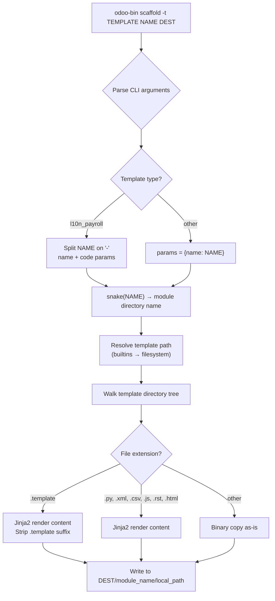
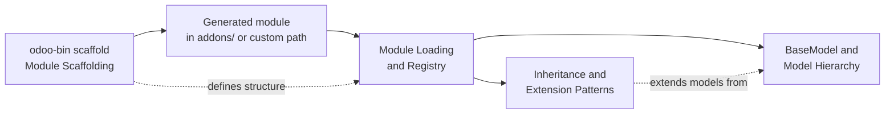

---
slug:18-module-scaffolding
blog_type:normal
---


Module scaffolding is Odoo's built-in mechanism for rapidly generating a fully structured module skeleton from the command line. Rather than manually creating directories, manifest files, and boilerplate code, developers invoke the `scaffold` command and receive a ready-to-customize foundation that follows Odoo's architectural conventions. This page dissects the scaffolding engine, documents every built-in template, and explains how to author and consume custom templates.

## The Scaffold Command

The entry point is the `Scaffold` class inside `odoo/cli/scaffold.py`, which extends the base `Command` class from [command.py](odoo/cli/command.py#L20-L37). The CLI registration system in `Command.__init_subclass__` automatically discovers the `Scaffold` class and registers it under the name `scaffold` in the global `commands` dictionary. The invocation signature is:

```
odoo-bin scaffold [-t TEMPLATE] NAME [DEST]
```

| Argument | Flag | Default | Description |
|---|---|---|---|
| `name` | positional | — | The human-readable name of the module to create |
| `dest` | positional (optional) | `.` | Target directory where the module folder will be created |
| `-t` / `--template` | optional | `default` | A built-in template name or a filesystem path to a custom template |

When executed, the `run` method at [scaffold.py#L20-L49](odoo/cli/scaffold.py#L20-L49) parses arguments, applies a special name-splitting rule for the `l10n_payroll` template (splitting on `-` to extract a country name and code), and delegates rendering to the `template.render_to()` method. The destination module directory name is always **snake-cased** via the `snake()` utility function at [scaffold.py#L57-L67](odoo/cli/scaffold.py#L57-L67), which converts any input like `"MyModule"` into `"my_module"`.



Sources: [scaffold.py](odoo/cli/scaffold.py#L20-L49), [command.py](odoo/cli/command.py#L20-L37)

## Template Resolution and the `template` Class

The `template` class at [scaffold.py#L87-L99](odoo/cli/scaffold.py#L87-L99) implements a two-stage resolution strategy. Given an identifier string, it first checks whether a directory with that name exists under the built-in templates root (`odoo/cli/templates/`). If not found, it treats the identifier as an absolute or relative filesystem path. If neither resolves to a valid directory, the process exits with an error. This design means any directory on disk that mirrors the expected structure can serve as a template — no registration or configuration file is required.

The built-in templates path is computed by the `builtins` lambda at [scaffold.py#L52-L55](odoo/cli/scaffold.py#L52-L55), which joins `odoo/cli/templates/` with the provided template name. The `__init__` method of the `Scaffold` class dynamically lists available built-in templates by scanning that directory (excluding `base`) and embeds them in the command's epilog text for help output.

Sources: [scaffold.py](odoo/cli/scaffold.py#L87-L99), [scaffold.py](odoo/cli/scaffold.py#L52-L55)

## Jinja2 Rendering Engine

The scaffolding system creates a dedicated `jinja2.Environment` at [scaffold.py#L84-L86](odoo/cli/scaffold.py#L84-L86) with two custom filters:

- **`snake`** — Converts strings to `snake_case` (e.g., `"MyModule"` → `"my_module"`). Implementation at [scaffold.py#L57-L67](odoo/cli/scaffold.py#L57-L67) uses a regex to insert spaces before uppercase characters preceded by non-uppercase letters, then lowercases and joins with underscores.
- **`pascal`** — Converts strings to `PascalCase` (e.g., `"my_module"` → `"MyModule"`). Implementation at [scaffold.py#L68-L72](odoo/cli/scaffold.py#L68-L72) splits on underscores/whitespace, capitalizes each segment, and concatenates.

These filters are available in all template files through the standard Jinja2 `|` syntax, such as `{{ name|snake }}` and `{{ name|pascal }}`. The `render_to` method at [scaffold.py#L112-L138](odoo/cli/scaffold.py#L112-L138) applies rendering to **both file paths and file contents** for recognized text formats (`.py`, `.xml`, `.csv`, `.js`, `.rst`, `.html`, `.template`). Files with any other extension — images, fonts, compiled assets — are copied verbatim as binary data without rendering.

<CgxTip>
The `.template` extension is stripped from output filenames. A file named `__manifest__.py.template` in the template directory becomes `__manifest__.py` in the generated module. This convention allows you to keep template files importable by Python without triggering accidental imports of generated modules.
</CgxTip>

Sources: [scaffold.py](odoo/cli/scaffold.py#L84-L86), [scaffold.py](odoo/cli/scaffold.py#L112-L138)

## Built-in Template: `default`

The `default` template is the standard starting point for any Odoo module. It produces the canonical directory structure and pre-populates each file with commented-out boilerplate that demonstrates Odoo's core patterns.

```
my_module/                        ← snake-cased from NAME
├── __init__.py                   ← imports controllers, models
├── __manifest__.py               ← module declaration
├── controllers/
│   ├── __init__.py               ← from . import controllers
│   └── controllers.py            ← HTTP controller stub (commented)
├── models/
│   ├── __init__.py               ← from . import models
│   └── models.py                 ← Model stub with computed field (commented)
├── demo/
│   └── demo.xml                  ← 5 demo records loop (commented)
├── security/                     ← empty directory (for ir.model.access.csv)
└── views/
    ├── views.xml                 ← list/form views + actions + menus (commented)
    └── templates.xml             ← QWeb listing/object templates (commented)
```

The manifest at [__manifest__.py.template](odoo/cli/templates/default/__manifest__.py.template#L1-L34) declares a dependency on `base`, registers `views/views.xml` and `views/templates.xml` in the `data` list, and places `demo/demo.xml` under `demo`. The `security/ir.model.access.csv` entry is included but commented out, signaling to developers where ACL definitions belong.

The model stub at [models.py.template](odoo/cli/templates/default/models/models.py.template#L1-L18) demonstrates a persistent model with a `Char`, `Integer`, `Float` (with `@api.depends` compute), and `Text` field — providing a compact reference for the most common field types and the computed field pattern. The controller stub at [controllers.py.template](odoo/cli/templates/default/controllers/controllers.py.template#L1-L25) shows three route patterns: an index route, a list route that renders a QWeb template with a recordset, and a detail route with a model-based path parameter.

Notably, **all code in the default template is commented out**. This is by design — the scaffolded module loads without side effects and without defining any models or views until the developer actively uncomments and customizes the relevant sections.

Sources: [__manifest__.py.template](odoo/cli/templates/default/__manifest__.py.template#L1-L34), [__init__.py.template](odoo/cli/templates/default/__init__.py.template#L1-L3), [models.py.template](odoo/cli/templates/default/models/models.py.template#L1-L18), [controllers.py.template](odoo/cli/templates/default/controllers/controllers.py.template#L1-L25), [views.xml.template](odoo/cli/templates/default/views/views.xml.template#L1-L63), [templates.xml.template](odoo/cli/templates/default/views/templates.xml.template#L1-L25), [demo.xml.template](odoo/cli/templates/default/demo/demo.xml.template#L1-L13)

## Built-in Template: `theme`

The `theme` template at [odoo/cli/templates/theme/](odoo/cli/templates/theme/__manifest__.py.template#L1-L25) generates a website theme module with a fundamentally different structure from the default template. Theme modules do not define models or controllers — they focus exclusively on frontend assets, QWeb snippets, and configuration options.

```
my_theme/
├── __init__.py                   ← empty (coding declaration only)
├── __manifest__.py               ← depends on 'website', category 'Theme'
├── demo/
│   └── pages.xml                 ← demo page content
├── static/
│   └── src/
│       └── scss/                 ← empty SCSS directory for stylesheets
└── views/
    ├── options.xml               ← theme customization options panel
    └── snippets.xml              ← website builder snippet definitions
```

The manifest declares `website` as its sole dependency and registers two view files: `views/options.xml` (theme configuration panel) and `views/snippets.xml` (drag-and-drop building blocks). The `static/src/scss/` directory is created empty, providing the conventional location where developers add SCSS stylesheets that Odoo's asset bundler will compile.

Sources: [__manifest__.py.template](odoo/cli/templates/theme/__manifest__.py.template#L1-L25), [__init__.py.template](odoo/cli/templates/theme/__init__.py.template#L1-L2)

## Built-in Template: `l10n_payroll`

The `l10n_payroll` template at [odoo/cli/templates/l10n_payroll/](odoo/cli/templates/l10n_payroll/__manifest__.py.template#L1-L37) is a specialized scaffold for localization payroll modules. It has unique parameter handling: the `name` argument must follow the `CountryName-CountryCode` format (e.g., `Belgium-BE`), which the `run` method splits into separate `name` and `code` parameters at [scaffold.py#L36-L41](odoo/cli/scaffold.py#L36-L41). The generated module directory is then named `l10n_{code}_hr_payroll` (e.g., `l10n_be_hr_payroll`), as enforced by the special-case in `render_to` at [scaffold.py#L124-L125](odoo/cli/scaffold.py#L124-L125).

```
l10n_xx_hr_payroll/
├── __init__.py                   ← from . import models
├── __manifest__.py               ← depends on 'hr_payroll', country-specific
├── data/
│   ├── hr_salary_rule_category_data.xml.template
│   ├── hr_payroll_structure_type_data.xml.template
│   ├── hr_payroll_structure_data.xml.template
│   ├── hr_rule_parameters_data.xml.template
│   ├── hr_salary_rule_data.xml.template
│   └── l10n_{code}_hr_payroll_demo.xml.template
├── models/
│   ├── __init__.py               ← imports hr_payslip, hr_version, hr_payslip_worked_days
│   ├── hr_payslip.py             ← inherits hr.payslip, adds compute functions
│   ├── hr_payslip_worked_days.py
│   └── hr_version.py
└── views/
    ├── hr_payroll_report.xml
    └── report_payslip_templates.xml
```

The manifest uses the `{{code|upper}}` and `{{name|pascal}}` filters to generate values like `'countries': ['BE']` and `'name': 'Belgium - Payroll'`. The model layer demonstrates the inheritance extension pattern — `hr_payslip.py` at [hr_payslip.py.template](odoo/cli/templates/l10n_payroll/models/hr_payslip.py.template#L1-L30) inherits from `hr.payslip` and overrides `_get_data_files_to_update` and `_get_base_local_dict` to inject country-specific salary computation rules. This template is the most comprehensive built-in scaffold, producing a module that can immediately participate in Odoo's payroll localization framework.

Sources: [__manifest__.py.template](odoo/cli/templates/l10n_payroll/__manifest__.py.template#L1-L37), [__init__.py.template](odoo/cli/templates/l10n_payroll/__init__.py.template#L1-L4), [hr_payslip.py.template](odoo/cli/templates/l10n_payroll/models/hr_payslip.py.template#L1-L30), [scaffold.py](odoo/cli/scaffold.py#L36-L41)

## Template Comparison

| Feature | `default` | `theme` | `l10n_payroll` |
|---|---|---|---|
| **Invocation** | `scaffold MyModule` | `scaffold -t theme MyTheme` | `scaffold -t l10n_payroll Belgium-BE` |
| **Core dependency** | `base` | `website` | `hr_payroll` |
| **Models layer** | ✅ (commented stub) | ❌ | ✅ (3 model extensions) |
| **Controllers layer** | ✅ (commented stub) | ❌ | ❌ |
| **Views** | ✅ list/form/template | ✅ options/snippets | ✅ payroll reports |
| **Demo data** | ✅ (commented loop) | ✅ demo pages | ✅ demo records |
| **Static assets** | ❌ | ✅ SCSS directory | ❌ |
| **Security directory** | ✅ (empty) | ❌ | ❌ |
| **Code active by default** | ❌ All commented | ✅ | ✅ |
| **Naming convention** | `snake(name)` | `snake(name)` | `l10n_{code}_hr_payroll` |
| **Special params** | `name` only | `name` only | `name` + `code` (split on `-`) |

## Custom Template Authoring

Any directory on the filesystem can serve as a custom template. The resolution chain — builtins first, then filesystem path — means you can either place your template alongside the built-ins or reference it by absolute/relative path using the `-t` flag:

```bash
# Option A: reference by filesystem path
odoo-bin scaffold -t /path/to/my_template MyModule

# Option B: reference by name if placed in templates dir
odoo-bin scaffold -t my_template MyModule
```

To author a custom template, create a directory with any structure you want the generated module to mirror. Name files with the `.template` suffix when they contain Jinja2 expressions (the suffix will be stripped in output). The following template variables and filters are available in all template files:

| Variable / Filter | Type | Description |
|---|---|---|
| `{{ name }}` | string | The module name as provided on the CLI |
| `{{ code }}` | string | Country code (only for `l10n_payroll` template) |
| `\| snake` | filter | Convert to `snake_case` |
| `\| pascal` | filter | Convert to `PascalCase` |

Files with extensions `.py`, `.xml`, `.csv`, `.js`, `.rst`, `.html`, and `.template` are rendered through Jinja2. All other files are copied as binary data without modification, making it straightforward to bundle static assets like images or compiled fonts within a template.

<CgxTip>
When designing a custom template for team use, version it in a separate Git repository and reference it by path. This ensures the scaffolding standard evolves independently of the Odoo source tree and can be shared across projects without modifying the framework.
</CgxTip>

Sources: [scaffold.py](odoo/cli/scaffold.py#L87-L99), [scaffold.py](odoo/cli/scaffold.py#L131-L138)

## The Scaffolding Lifecycle in Context

Scaffolding is the first step in the module development pipeline. Once a skeleton is generated, the module enters the loading and registry phase managed by Odoo's module system, where its manifest is parsed, models are loaded into the ORM registry, and data files are applied to the database. Understanding this downstream relationship is critical because the scaffolded structure directly determines how the module loader processes it.



The `__manifest__.py` `data` and `demo` lists control the order in which XML and CSV files are loaded. The `depends` list determines the availability of base models that can be inherited. The `__init__.py` import chain dictates which Python model classes are discovered by the registry. All of these connections originate from the scaffold's directory layout.

For developers continuing past scaffolding, the recommended reading progression within the *Deep Dive* section is:

- **[Module Loading and Registry](17-module-loading-and-registry)** — to understand how your scaffolded module is discovered, parsed, and loaded into the running Odoo instance
- **[Inheritance and Extension Patterns](19-inheritance-and-extension-patterns)** — to learn how to build upon the models and views defined in module dependencies
- **[BaseModel and Model Hierarchy](9-basemodel-and-model-hierarchy)** — to understand the ORM foundation that the scaffolded model stubs extend from
