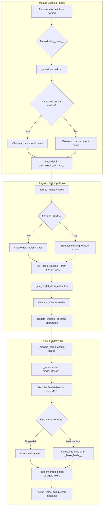
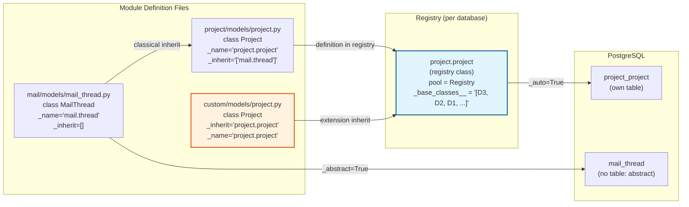

---
slug:19-inheritance-and-extension-patterns
blog_type:normal
---


Odoo's inheritance system is one of its most distinctive architectural features, enabling deep modular customization without modifying original source code. Unlike traditional Python inheritance, Odoo overlays three distinct mechanisms—classical extension, prototypical extension, and delegation inheritance—onto a metaclass-driven registry that resolves model definitions into unified, per-database model classes at server startup. Understanding these patterns is essential for any developer building modules that extend or compose existing models.

## The Three Model Base Classes

All Odoo models descend from one of three base classes, each defined by a specific combination of the `_abstract`, `_transient`, and `_auto` class attributes. These classes form the entry points for the inheritance system and determine both the Python MRO behavior and the database persistence strategy.

`AbstractModel` is literally an alias for `BaseModel` itself, set at module scope after the `BaseModel` class completes definition. It defaults to `_abstract=True` and `_auto=False`, meaning no database table is created. Abstract models serve as reusable mixin blueprints—they define fields and methods that are copied into every concrete model that inherits from them, but they never exist as standalone records in the database.

`Model` is the standard base class for persisted business objects. It sets `_auto=True`, `_abstract=False`, and `_register=False`. The `_register=False` here is counter-intuitive but critical: it means `Model` itself is not a "model definition" that the registry system collects. Instead, it is a Python-only base class, and only concrete subclasses that set `_name` (either explicitly or through the `MetaModel.__new__` convention) become registered model definitions.

`TransientModel` extends `Model` and adds `_transient=True`. Transient models are persisted to the database but are automatically vacuumed based on configurable age and count limits. They enforce log access columns and provide simplified access rights where users can only access records they created.

Sources: [models.py](odoo/orm/models.py#L7043-L7057), [models_transient.py](odoo/orm/models_transient.py#L10-L21), [models.py](odoo/orm/models.py#L370-L392)

## Metaclass Registration and Model Definition Resolution

The `MetaModel` metaclass is the gateway through which every model class passes during creation. Its `__new__` method performs several crucial preparatory steps before the class object even exists. First, it collects field definitions by initializing an empty `_field_definitions` list on the class attributes—this list is populated later by the `Field.__set_name__` protocol when the class body is executed. Similarly, it initializes `_table_object_definitions` for SQL constraint and index objects.

For classes with `_register=True` (the default), the metaclass resolves the `_module` attribute from the Python module path, asserting that it begins with `odoo.addons.`. It then normalizes the `_inherit` attribute: if it is a single string, it is promoted to a list, and if no explicit `_name` is provided but `_inherit` is set to a single model name, that name becomes the `_name`. If neither `_name` nor `_inherit` is provided, the metaclass generates a `_name` from the class name by inserting dots before uppercase letters (converting `CamelCase` to `camel.case`).

During `__init__`, the metaclass records the model definition in a module-level mapping `_module_to_models__`, grouping all definitions by their source module. For non-abstract models that are not self-inheriting (i.e., `_name` is not in `_inherit`), it also injects the magic `id` field and optionally the log access fields (`create_uid`, `create_date`, `write_uid`, `write_date`) when `_log_access` is enabled.

Sources: [models.py](odoo/orm/models.py#L225-L300), [model_classes.py](odoo/orm/model_classes.py#L142-L157)

```mermaid
classDiagram
    direction TB

    class MetaModel {
        <<metaclass>>
        +_module_to_models__: defaultdict
        +__new__(meta, name, bases, attrs)
        +__init__(name, bases, attrs)
    }

    class BaseModel {
        <<abstract>>
        +_abstract: bool = True
        +_auto: bool = False
        +_register: bool = False
        +_inherit: str|list = ()
        +_inherits: frozendict = {}
        +_name: str = None
        +_table: str = ''
    }

    class AbstractModel {
        <<alias>>
        = BaseModel
    }

    class Model {
        +_auto: bool = True
        +_abstract: Literal[False] = False
        +_register: bool = False
    }

    class TransientModel {
        +_transient: bool = True
        +_transient_max_count
        +_transient_max_hours
    }

    MetaModel ..> BaseModel : metaclass of
    BaseModel <|-- AbstractModel : alias
    BaseModel <|-- Model : extends
    Model <|-- TransientModel : extends

    class ModelDefinition {
        <<module file>>
        +_name = "my.model"
        +_inherit = [...]
        +_inherits = {...}
    }

    ModelDefinition ..> Model : Python inherits
```

## Pattern 1: Classical Inheritance via `_inherit` with `_name`

When a model definition sets both `_inherit` (listing parent model names) and a distinct `_name`, the system performs **classical inheritance**: it creates a brand new model with its own database table, while inheriting fields and methods from the listed parents. This is the Odoo equivalent of subclassing in traditional OOP—a new entity is created that extends the behavior of its ancestors.

The resolution happens inside `add_to_registry` in [model_classes.py](odoo/orm/model_classes.py#L152-L230). When the target model name is not yet in the registry, a new registry class is created via `type(name, (model_def,), {...})`, initialized with a fresh `_fields__` dictionary, an empty `_inherit_children` set, and a reference to the registry itself (the presence of `pool` is what distinguishes a "registry class" from a "model definition class"). The parent models specified in `_inherit` (plus `base` for all non-base models) are resolved from the registry, and each parent's definition class is added to the `_base_classes__` tuple using a `LastOrderedSet` to preserve insertion order while preventing duplicates.

The actual Python MRO modification is deferred to `_prepare_setup`, which assigns `model_cls.__bases__ = model_cls._base_classes__` only when necessary, since this is a computationally expensive operation. This lazy assignment means that during module loading, classes accumulate their base definitions efficiently, and the MRO is finalized in a single pass when field setup begins.

Crucially, the system enforces type consistency: `_check_model_extension` prevents an abstract model from being transformed into a concrete one, and `_check_model_parent_extension` prevents an abstract model from inheriting a non-abstract parent. These guards protect the semantic integrity of the model hierarchy across module boundaries.

Sources: [model_classes.py](odoo/orm/model_classes.py#L172-L230), [model_classes.py](odoo/orm/model_classes.py#L233-L258), [model_classes.py](odoo/orm/model_classes.py#L329-L347)

## Pattern 2: Extension (In-Place) Inheritance via `_inherit` without `_name`

When a model definition sets `_inherit` to a single model name (as a string, or a list containing only that name) without providing a separate `_name`, the system performs **extension inheritance**: it modifies the existing model in-place rather than creating a new one. This is the most common pattern in Odoo module development and is the mechanism by which third-party modules customize models defined in other modules without forking them.

In `MetaModel.__new__`, when `_inherit` is a string, it is normalized to a list and also used as the default `_name`. Later, in `add_to_registry`, when `name in parent_names` evaluates to `True` (because the model name appears in its own `_inherit` list), the function retrieves the existing `model_cls` from the registry instead of creating a new one. The extension's definition class is then prepended to the existing model's `_base_classes__`, and `_init_model_class_attributes` is called again to re-merge attributes like `_description`, `_table`, `_log_access`, and `_inherits` from the new definition class into the registry class.

The field resolution in `_setup` processes this correctly because it iterates over `model_cls._model_classes__`—the tuple of non-registry classes in the MRO—in reverse order. Since the extending definition class is added to the front of `_base_classes__`, its fields are encountered first in the reversed iteration and thus take precedence over fields defined in earlier extensions or the original model. When multiple definitions contribute the same field name, the system creates a composite field via `Field(_base_fields__=tuple(fields_))`, preserving the entire override chain for dependency resolution and computed field traversal.

Sources: [models.py](odoo/orm/models.py#L234-L240), [model_classes.py](odoo/orm/model_classes.py#L173-L177), [model_classes.py](odoo/orm/model_classes.py#L261-L298), [model_classes.py](odoo/orm/model_classes.py#L349-L416)

| Aspect | Classical Inheritance | Extension Inheritance |
|--------|----------------------|----------------------|
| `_name` attribute | Distinct from `_inherit` values | Same as (or absent; derived from) `_inherit` |
| Database table | New table created | Existing table reused |
| Result in registry | New model entry | Existing model entry modified |
| Primary use case | Specialized variants of existing models | Cross-module customization |
| Field conflict resolution | Local definition wins | Latest extension's definition wins |
| `_inherits` merging | Combined from all parents | Updated from extending definition |

## Pattern 3: Delegation Inheritance via `_inherits`

Delegation inheritance (distinct from the classical `_inherit`) uses the `_inherits` attribute—a `frozendict` mapping parent model names to the many2one field names that link to them. This pattern implements **composition-based inheritance**: the child model exposes all fields of its parent models as if they were its own, but the actual data remains stored on the parent records. The child only holds a foreign key reference.

The `_check_inherits` function validates every `_inherits` entry by verifying that the corresponding field exists on the model, is of type `many2one`, and carries the `delegate=True` marker along with `required=True` and `ondelete` of either `'cascade'` or `'restrict'`. These constraints ensure referential integrity: when a child record is deleted, its parent records can be cascade-deleted or the operation can be restricted if parents are shared.

Field exposure happens in `_add_inherited_fields`, which iterates over all `_inherits` entries, retrieves every field from each parent model's field registry, and creates synthetic "inherited" fields on the child for any that aren't already defined locally. These inherited fields are implemented internally as **related fields** with `related=f"{parent_fname}.{name}"`, meaning a read on `child.inherited_field` transparently resolves to `child.parent_id.inherited_field`. The system sets `inherited=True` and `related_sudo=False` to ensure that access rights on the parent model are properly enforced during these cross-record field accesses.

<CgxTip>
When multiple `_inherits` parents define fields with the same name, the field from the **last** parent in the `_inherits` dictionary iteration order wins, as later iterations overwrite earlier ones in the `to_inherit` dictionary. Since Python 3.7+, `frozendict` preserves insertion order, making this deterministic but potentially surprising.
</CgxTip>

The `_init_model_class_attributes` function also maintains a reverse mapping by adding the child model's name to each parent's `_inherits_children` set. This bidirectional tracking is used by the registry's `descendants()` method to cascade setup invalidation and field recomputation across the delegation graph.

Sources: [models.py](odoo/orm/models.py#L407-L425), [model_classes.py](odoo/orm/model_classes.py#L465-L508), [model_classes.py](odoo/orm/model_classes.py#L268-L298)



## Field Resolution and Override Chains

The field resolution algorithm in `_setup` is the heart of Odoo's inheritance mechanism. It begins by computing `_model_classes__`—the tuple of all classes in the model's MRO that are **not** registry classes (identified by the absence of a `pool` attribute). This filters out the dynamically created registry class itself, leaving only the original definition classes contributed by each module.

The algorithm then iterates these definition classes in **reverse MRO order** (via `reversed(model_cls._model_classes__)`), collecting `_field_definitions` from each. For each field name, it accumulates a list of all definitions. If a field appears only once and is directly defined on the target model (not inherited), it is assigned directly. Otherwise, a composite field is created using `Field(_base_fields__=tuple(fields_))`, which stores the entire override chain as an immutable tuple of field objects.

This composite field design is critical for computed fields and dependency resolution. When a computed field is overridden, each definition in the chain may contribute different `depends` specifications, and the field resolution system must be able to traverse all of them to build the complete dependency graph. The `_base_fields__` tuple enables this by preserving the full history of every field definition.

Sources: [model_classes.py](odoo/orm/model_classes.py#L349-L416), [model_classes.py](odoo/orm/model_classes.py#L480-L508)

## The Registry Class vs. Definition Class Distinction

A fundamental concept in Odoo's inheritance architecture is the separation between **model definition classes** and **registry classes**. Definition classes are the Python classes written by developers in module files—they carry `_register=True`, belong to specific modules, and are never directly instantiated as model classes. Registry classes are dynamically created by `add_to_registry` and stored in the `Registry` instance. They carry a `pool` attribute (the registry reference) and are the actual classes that the ORM instantiates to create recordsets.

The helper functions `is_model_definition` and `is_model_class` distinguish between these two kinds of classes by checking for the presence or absence of the `pool` attribute. This distinction permeates the entire setup pipeline: field definitions are collected from definition classes, but fields are stored on registry classes; attributes like `_description` and `_table` are merged from definition classes into registry classes; and the Python `__bases__` of registry classes are set to definition classes to ensure that method resolution traverses the correct chain.

<CgxTip>
When debugging inheritance issues, remember that `model_cls.__bases__` contains definition classes (not other registry classes). The registry class itself is never in any other class's `__bases__`. Method calls on recordsets resolve through the Python MRO of the registry class, which delegates to definition classes—this is how overriding a method in an extending module replaces the original implementation.
</CgxTip>

Sources: [model_classes.py](odoo/orm/model_classes.py#L142-L157), [model_classes.py](odoo/orm/model_classes.py#L178-L209)

## Structural Overview of the Inheritance Pipeline



## Setup Invalidation and Cascading Updates

When `add_to_registry` processes a new model definition, it doesn't immediately recompute fields. Instead, it marks impacted models by setting `_setup_done__ = False` on the target model and all its descendants (found via the `_inherit` and `_inherits` hierarchies using `registry.descendants()`). This lazy invalidation ensures that the expensive `_setup` and `_setup_fields` calls happen only once per model, after all module definitions have been loaded into the registry.

The `_prepare_setup` method acts as a gate: if `_setup_done__` is already `True` and `__bases__` matches `_base_classes__`, it returns immediately. Otherwise, it performs the base class assignment and resets memoized constraint and onchange method caches. This design means that adding a new extension module for an existing model only triggers re-setup for that model and its dependents, not the entire registry.

Sources: [model_classes.py](odoo/orm/model_classes.py#L224-L230), [model_classes.py](odoo/orm/model_classes.py#L329-L347)

## Inheritance Constraints and Validation Rules

The Odoo inheritance system enforces several constraints to prevent logically invalid model hierarchies. Understanding these rules is essential for avoiding `TypeError` exceptions during module loading.

**Abstract-to-concrete transformation is forbidden.** If a model was originally defined as abstract (e.g., by inheriting from `AbstractModel` or setting `_abstract=True`), no subsequent extension can set `_abstract=False` without also providing a distinct `_name`. The check in `_check_model_extension` catches this at registration time.

**Transient-to-permanent and permanent-to-transient transformations are forbidden.** The `_transient` flag must remain consistent across all extensions of a model. An extension cannot convert a `Model` into a `TransientModel` or vice versa, as this would imply incompatible database table semantics and vacuum policies.

**Abstract models cannot inherit non-abstract models.** The `_check_model_parent_extension` function prevents an abstract model from listing a concrete model in its `_inherit`, since this would create an impossible situation where an abstract blueprint depends on a specific database table.

**`_inherits` foreign key fields must meet strict requirements.** Every entry in `_inherits` must have a corresponding `many2one` field on the child model marked as `delegate=True`, `required=True`, and with `ondelete` set to `'cascade'` or `'restrict'`. This is enforced by `_check_inherits` before field setup begins.

Sources: [model_classes.py](odoo/orm/model_classes.py#L233-L258), [model_classes.py](odoo/orm/model_classes.py#L465-L477)

## Summary of Inheritance Attribute Behaviors

| Attribute | Type | Default | Purpose |
|-----------|------|---------|---------|
| `_name` | `str` | `None` | Model's technical name (dot-notation); required for registry |
| `_inherit` | `str \| list[str]` | `()` | Parent models for classical/extension inheritance |
| `_inherits` | `frozendict[str, str]` | `frozendict()` | Delegation inheritance mapping `{parent_model: m2o_field}` |
| `_abstract` | `bool` | `True` | No database table; fields are copied to children |
| `_transient` | `bool` | `False` | Temporary records with automatic vacuum |
| `_auto` | `bool` | `False` | Automatically create and manage database table |
| `_register` | `bool` | `False` | Whether this class is a model definition for the registry |
| `_inherit_children` | `OrderedSet[str]` | (auto) | Names of models that inherit this model via `_inherit` |
| `_inherits_children` | `set[str]` | (auto) | Names of models that delegate to this model via `_inherits` |

Sources: [models.py](odoo/orm/models.py#L370-L428), [models.py](odoo/orm/models.py#L392-L407)

## Next Steps

Having understood how models are extended and composed, the natural progression is to explore how these models are discovered and loaded into the registry at startup. See [Module Loading and Registry](17-module-loading-and-registry) for the complete lifecycle from module manifest scanning to registry finalization. For the foundational model class hierarchy that these inheritance patterns build upon, revisit [BaseModel and Model Hierarchy](9-basemodel-and-model-hierarchy). To understand how the fields defined through inheritance are stored and queried, continue to [Field Types and Definitions](10-field-types-and-definitions).