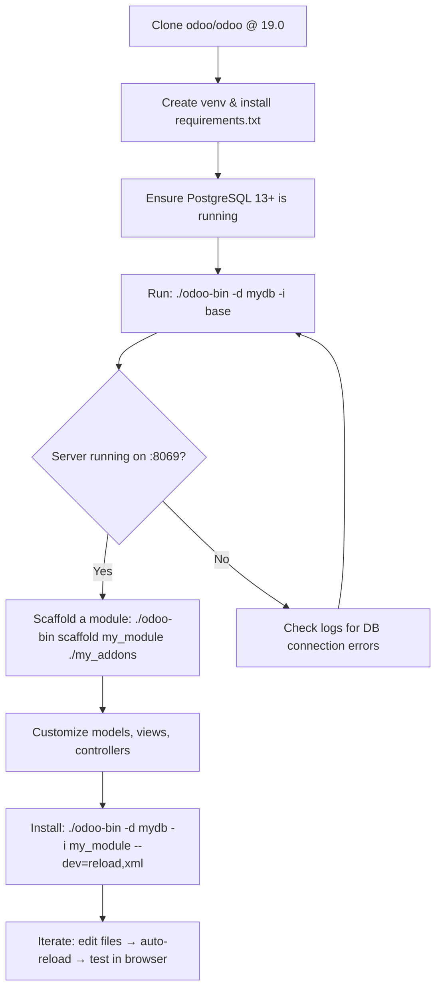

---
slug:2-quick-start
blog_type:normal
---


This guide walks you through getting Odoo 19.0 up and running from the source repository — from cloning and installing dependencies to launching the server and scaffolding your first custom module. It is the fastest path from zero to a working Odoo development environment.

## Prerequisites

Odoo 19.0 has precise version requirements. Before you begin, ensure your system meets these constraints. The release metadata in [odoo/release.py](odoo/release.py#L39-L42) defines the exact boundaries:

| Dependency | Minimum Version | Maximum Version | Notes |
|---|---|---|---|
| **Python** | 3.10 | 3.13 | Both bounds are enforced at import time |
| **PostgreSQL** | 13 | — | The `MIN_PG_VERSION` constant gates database creation |

Beyond these hard requirements, Odoo pulls in a substantial dependency tree. The [requirements.txt](requirements.txt#L1-L101) file pins over 50 packages with version-conditional specifications keyed on the Python version you run. Key dependencies include **psycopg2** (database adapter), **Werkzeug** (WSGI toolkit), **Jinja2** (templating), **gevent** (async concurrency), **lxml** (XML processing), and **reportlab** (PDF generation). Most of these ship as system packages on Ubuntu 24.04 and Debian 12, which are the officially supported platforms.

You will also need system-level dependencies for compilation (C headers for psycopg2, lxml, Pillow) and **Node.js** if you plan to work on frontend assets, though that is outside the pure Python dependency scope.

## Repository Layout at a Glance

Understanding the top-level structure helps orient you before any commands are run. The [project root](.) is organized into clear zones of responsibility:

```
odoo/                          ←  Core framework source (Python packages)
├── cli/                       ←  CLI command implementations (server, scaffold, shell, etc.)
│   └── templates/             ←  Jinja2 module templates for scaffolding
├── addons/                    ←  First-party addon modules (base, test_*, etc.)
├── models/                    ←  ORM layer (models.py, fields, etc.)
├── http.py                    ←  HTTP routing and controllers
├── service/                   ←  Server lifecycle (db, server, model services)
├── modules/                   ←  Module loading, registry, migration
├── tools/                     ←  Utilities (config, convert, sql, i18n, etc.)
├── tests/                     ←  Test framework and loaders
├── release.py                 ←  Version metadata (19.0.0)
└── fields/                    ←  Field type system

addons/                        ←  Community / third-party addon directory
odoo-bin                       ←  Entry point script (→ odoo.cli.main())
setup.py                       ←  Package installer (pip install -e .)
requirements.txt               ←  Pinned Python dependencies
ruff.toml                      ←  Linting configuration
```

The entire framework lives inside the `odoo/` Python package. The separate `addons/` directory at the root is an additional addon path that the server scans alongside `odoo/addons/` for installable modules.

## Installation

### Step 1 — Clone the Repository

```bash
git clone -b 19.0 https://github.com/odoo/odoo.git
cd odoo
```

### Step 2 — Create and Activate a Virtual Environment

```bash
python3 -m venv .venv
source .venv/bin/activate
```

Using a virtual environment isolates Odoo's dependencies from your system Python, preventing version conflicts.

### Step 3 — Install Python Dependencies

```bash
pip install -r requirements.txt
```

This installs all pinned packages declared in [requirements.txt](requirements.txt). If you plan to use LDAP authentication, also install the optional extra:

```bash
pip install -e ".[ldap]"
```

The [setup.py](setup.py#L71-L73) file declares this as an `extras_require` for `python-ldap`, which is not installed by default due to system-level library dependencies.

### Step 4 — Install PostgreSQL

Ensure PostgreSQL 13+ is running and accessible. Create a database user with superuser privileges (needed for database creation and management):

```bash
sudo -u postgres createuser --superuser $USER
createdb $USER
```

### Step 5 — Start the Server

The entry point is the [odoo-bin](odoo-bin#L1-L7) script — a minimal launcher that delegates everything to the CLI framework:

```bash
./odoo-bin -d mydb --addons-path=addons,odoo/addons -i base
```

This command starts the server with three essential flags explained below. When you run `odoo-bin` without specifying a subcommand, the [command dispatcher](odoo/cli/command.py#L119-L129) defaults to the `server` command, which initializes configuration, checks for root/postgres user risks, and starts the HTTP server.


Sources: [odoo-bin](odoo-bin#L1-L7), [odoo/cli/command.py](odoo/cli/command.py#L109-L139), [odoo/cli/server.py](odoo/cli/server.py#L95-L119)

## Essential CLI Options

The Odoo CLI is built on a layered configuration system defined in [odoo/tools/config.py](odoo/tools/config.py#L157-L170). It uses a `ChainMap` with a strict priority order: **runtime options → CLI arguments → environment variables → config file → defaults**. This means a CLI flag always overrides a config file value, which always overrides a default.

The [server command](odoo/cli/server.py#L122-L128) accepts all options defined in the `configmanager`. Here are the options you will use most frequently during development:

| Option | Short | Purpose | Example |
|---|---|---|---|
| `--config` | `-c` | Path to configuration file | `-c ~/.odoorc` |
| `--database` | `-d` | Target database name(s) | `-d mydb` |
| `--init` | `-i` | Install modules (comma-separated) | `-i base,sale` |
| `--update` | `-u` | Update/reload modules | `-u sale` |
| `--addons-path` | — | Addon search directories | `--addons-path=addons,odoo/addons,my_modules` |
| `--http-port` | `-p` | HTTP listen port (default: 8069) | `-p 8080` |
| `--dev` | — | Enable developer features | `--dev=all` |
| `--with-demo` | — | Include demo data in new databases | `--with-demo` |
| `--stop-after-init` | — | Exit after initialization | `--stop-after-init` |
| `--save` | `-s` | Persist current config to file | `-s` |

### Developer Mode

The `--dev` flag accepts a comma-separated list of features. The full set is defined at [config.py#L420-L430](odoo/tools/config.py#L420-L430):

| Feature | Effect |
|---|---|
| `access` | Log tracebacks for access rights errors |
| `reload` | Auto-restart server on source code changes |
| `qweb` | Log compiled QWeb XML on template errors |
| `xml` | Load views from source files instead of the database |
| `werkzeug` | Enable Werkzeug HTML debugger on HTTP errors |
| `all` | Enable all of the above |

For day-to-day development, `--dev=reload,xml` is the most practical combination: it gives you live reloading and source-file views without the noise of access right logging.

<CgxTip>
**Configuration priority in practice**: If you set `db_host` in a config file and also pass `--db_host` on the command line, the CLI value wins. Environment variables like `PGHOST` sit between the two — they override config files but are overridden by CLI flags. See the ChainMap at [config.py#L164-L170](odoo/tools/config.py#L164-L170).
</CgxTip>

Sources: [odoo/tools/config.py](odoo/tools/config.py#L157-L170), [odoo/tools/config.py](odoo/tools/config.py#L199-L498), [odoo/cli/server.py](odoo/cli/server.py#L31-L119)

## Creating Your First Module

Odoo ships a built-in scaffolding command that generates a complete module skeleton. This is the fastest way to start a new addon with the correct directory structure and boilerplate.

### The Scaffold Command

```bash
./odoo-bin scaffold my_module /path/to/addons
```

The [Scaffold command](odoo/cli/scaffold.py#L10-L49) lives in `odoo/cli/scaffold.py` and renders Jinja2 templates from the [templates/](odoo/cli/templates/) directory. It accepts two arguments: the module **name** and an optional **destination directory** (defaults to `.`). You can also specify a template with `-t`:

```bash
./odoo-bin scaffold -t default my_module ./my_addons
./odoo-bin scaffold -t theme my_theme ./my_addons
```

Three built-in templates are available:

| Template | Purpose |
|---|---|
| `default` | Standard module with models, controllers, and views |
| `theme` | Website theme module with static assets and snippets |
| `l10n_payroll` | Localization payroll module with salary rule structures |

### Generated Module Structure

When you scaffold a module named `my_module` with the default template, the command produces this directory tree from the [default template](odoo/cli/templates/):

```
my_module/
├── __init__.py                 ←  Package init (imports models, controllers)
├── __manifest__.py             ←  Module metadata and declarations
├── controllers/
│   ├── __init__.py
│   └── controllers.py          ←  HTTP controller routes (commented out)
├── demo/
│   └── demo.xml                ←  Demo data (only loaded with --with-demo)
├── models/
│   ├── __init__.py
│   └── models.py               ←  ORM model definitions (commented out)
├── security/                   ←  (empty) Access rights and record rules
└── views/
    ├── templates.xml           ←  QWeb templates (commented out)
    └── views.xml               ←  Form/list views and actions (commented out)
```

The scaffolded files are intentionally **commented out**. This is a deliberate design choice: it gives you the correct structure and patterns to follow without polluting your registry with a non-functional model on first run. You uncomment and modify the code as needed.

### The Manifest File

The generated [`__manifest__.py`](odoo/cli/templates/default/__manifest__.py.template#L1-L32) is the module's identity card. Key fields include:

| Field | Purpose |
|---|---|
| `name` | Human-readable module name |
| `version` | Module version string |
| `depends` | List of modules this one depends on (always includes `base`) |
| `data` | Files loaded at every module installation/update |
| `demo` | Files loaded only in demonstration mode |

### Wiring It Up

Once your module is scaffolded and customized, install it by adding its parent directory to the addons path and using the `--init` flag:

```bash
./odoo-bin -d mydb \
  --addons-path=my_addons,addons,odoo/addons \
  -i my_module \
  --dev=reload,xml
```

The server will discover `my_module` in `my_addons/`, install it into `mydb`, and start watching for file changes due to `--dev=reload`.

<CgxTip>
**Scaffolded code is a reference, not a starting point**: The templates in [odoo/cli/templates/default/](odoo/cli/templates/) demonstrate idiomatic patterns — model inheritance from `models.Model`, controller routing with `@http.route`, and QWeb view definitions. Study them even if you replace the contents entirely.
</CgxTip>

Sources: [odoo/cli/scaffold.py](odoo/cli/scaffold.py#L10-L49), [odoo/cli/templates/default/__init__.py.template](odoo/cli/templates/default/__init__.py.template#L1-L3), [odoo/cli/templates/default/__manifest__.py.template](odoo/cli/templates/default/__manifest__.py.template#L1-L32), [odoo/cli/templates/default/models/models.py.template](odoo/cli/templates/default/models/models.py.template#L1-L18), [odoo/cli/templates/default/controllers/controllers.py.template](odoo/cli/templates/default/controllers/controllers.py.template#L1-L25)

## Development Workflow Overview

The following diagram illustrates the complete quick-start workflow from environment setup to running a custom module:



This loop — scaffold, customize, install with `--dev=reload` — is the core development cadence for every Odoo module.

## Verifying Your Setup

After following the steps above, confirm everything is working with these checks:

| Check | Command | Expected Outcome |
|---|---|---|
| **Server starts** | `./odoo-bin -d mydb -i base --stop-after-init` | Exits with code 0, database created |
| **Module discovery** | `./odoo-bin --help` | Lists all available CLI commands |
| **Scaffold works** | `./odoo-bin scaffold test_module /tmp` | Creates `test_module/` directory |
| **HTTP responds** | `curl http://localhost:8069` | Returns HTML (Odoo database management page) |

If the server refuses to start, check the two safety guards in [server.py](odoo/cli/server.py#L31-L44): running as `root` produces a warning, and running with `db_user=postgres` causes an immediate abort. Both are intentional security measures.

## What's Next

With your environment running, you can explore these paths depending on your interests:

- **Understand the codebase layout** → [Project Structure and Layout](3-project-structure-and-layout)
- **Master all CLI commands** → [CLI Commands Reference](4-cli-commands-reference)
- **Learn the underlying architecture** → [Architecture Overview](8-architecture-overview)
- **Dive into the ORM** → [BaseModel and Model Hierarchy](9-basemodel-and-model-hierarchy)
- **Build HTTP endpoints** → [Controller and Route System](14-controller-and-route-system)
- **Contribute back** → See the [CONTRIBUTING.md](CONTRIBUTING.md) guidelines for pull request requirements and stable-series change restrictions