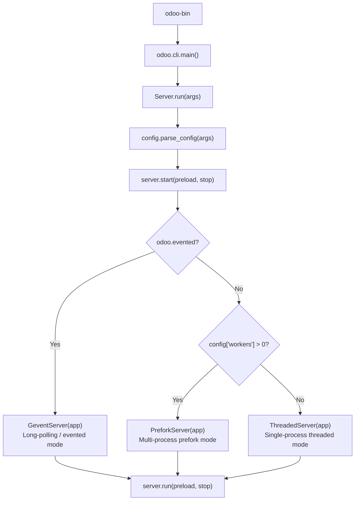
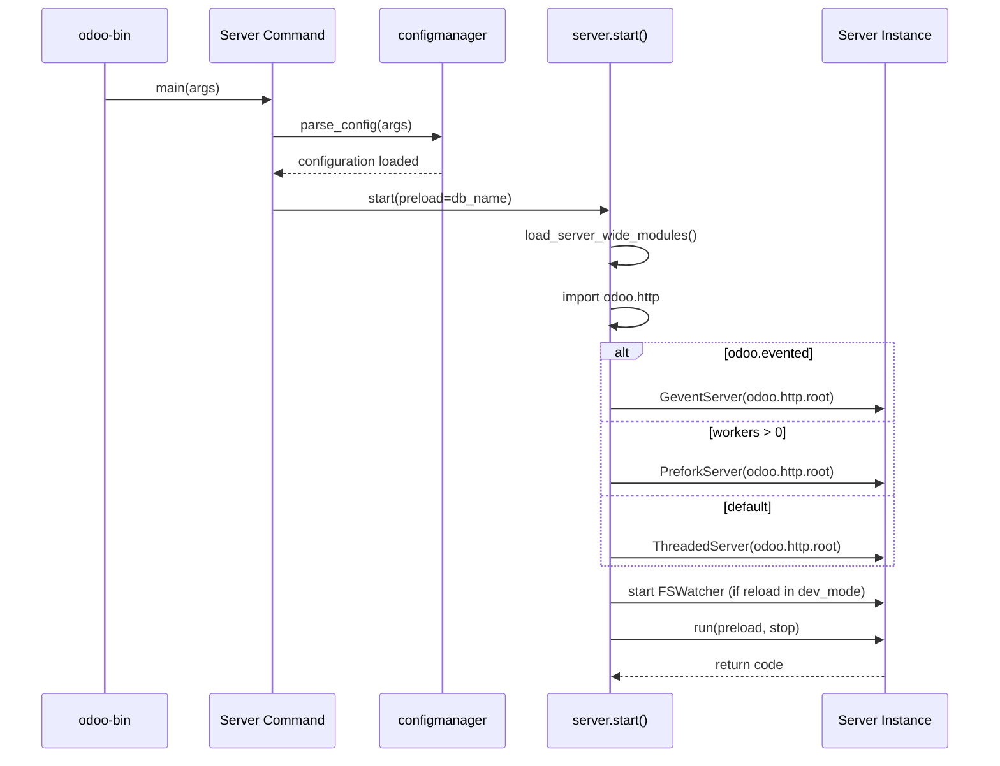

---
slug:20-server-modes-and-workers
blog_type:normal
---

Odoo's server runtime is not monolithic — it selects one of three distinct execution models based on configuration flags, each optimized for a different operational profile. Understanding which mode activates and how its workers behave is essential for tuning performance, debugging production incidents, and designing deployment architectures. This page dissects the mode-selection mechanism, the three server implementations, and the worker lifecycle that powers each one.

## Mode Selection: The Dispatch Mechanism

The entire mode-selection decision lives inside the module-level `start()` function in [server.py](odoo/service/server.py#L1575-L1623). When the CLI `server` command executes ([server.py CLI](odoo/cli/server.py#L106-L109)), it calls `server.start(preload=config['db_name'], stop=stop)`, which applies a three-way conditional branch:

The `odoo.evented` flag is set externally (when Odoo is launched in gevent-only mode), while `config['workers']` reads the `--workers` CLI option, which defaults to `0` and is **POSIX-only** ([config.py](odoo/tools/config.py#L458-L461)). All three server classes inherit from `CommonServer`, which provides shared socket management, signal registration, and a stop-hook system ([server.py](odoo/service/server.py#L416-L460)).

## The Three Server Modes

### ThreadedServer — Development and Single-Process Default

When `--workers` is `0` (the default) and the server is not in evented mode, Odoo instantiates `ThreadedServer` ([server.py](odoo/service/server.py#L462-L752)). This is the mode you get when you run `odoo-bin` without any multiprocessing flags. It operates as a single-process, multi-threaded application using Werkzeug's `ThreadedWSGIServer` as its HTTP backbone.

Internally, `ThreadedServer` spawns two subsystems: an HTTP server thread pool (via `http_spawn()` at [line 623](odoo/service/server.py#L623-L629)) and a cron runner (via `cron_spawn()` at [line 608](odoo/service/server.py#L608-L621)). The cron system uses a "Steve Reich timing style" with jitter-based staggering to mitigate the thundering herd problem — all workers bind to a PostgreSQL `NOTIFY` channel and wake on a schedule with deliberate temporal spread ([line 531-L541](odoo/service/server.py#L531-L541)).

<CgxTip>
On 64-bit Linux systems, the ThreadedServer automatically sets `MALLOC_ARENA_MAX=2` via `mallopt()` to prevent glibc's per-core memory arenas from inflating virtual memory usage — a critical adjustment since Python's GIL negates the concurrency benefit of multiple arenas ([line 1594-L1613](odoo/service/server.py#L1594-L1613)).
</CgxTip>

The cron concurrency is governed by `--max-cron-threads` (default `2`), which limits how many cron jobs execute simultaneously within the single process ([config.py](odoo/tools/config.py#L441-L443)).

### PreforkServer — Production Multi-Process Mode

When `--workers` is set to a positive integer, Odoo switches to `PreforkServer` ([server.py](odoo/service/server.py#L867-L1213)), a multi-process architecture inspired by Gunicorn. This is the recommended mode for production deployments. The master process never handles HTTP requests itself — it exclusively manages a pool of forked worker processes.

The prefork architecture maintains two separate worker registries: `self.workers_http` and `self.workers_cron` ([line 878-L879](odoo/service/server.py#L878-L879)). The master process runs an event loop ([line 1198-L1205](odoo/service/server.py#L1198-L1205)) that continuously processes signals, reaps zombie workers, enforces timeouts, and spawns new workers as needed.

Worker spawning uses `os.fork()` ([line 918-L920](odoo/service/server.py#L918-L920)), which means each worker inherits the parent's preloaded registry but gets its own memory space, database connections, and Python interpreter state. The master tracks each worker's generation counter and can gracefully reload by forking a new master process, passing the listening socket via `ODOO_HTTP_SOCKET_FD` environment variable ([line 1091-L1101](odoo/service/server.py#L1091-L1101)).

<CgxTip>
Graceful reload in PreforkServer uses a two-process handshake: the old master forks a child that calls `_reexec()`, passes the HTTP socket file descriptor to the new process via environment, and then waits for a `SIGHUP` from the new server confirming it has started — achieving zero-downtime reload with a 60-second timeout ([line 1091-L1120](odoo/service/server.py#L1091-L1120)).
</CgxTip>

### GeventServer — Evented Long-Polling Mode

When `odoo.evented` is `True`, the `GeventServer` activates ([server.py](odoo/service/server.py#L755-L865)). This mode uses `gevent.pywsgi.WSGIServer` (with a custom `ProxyHandler` subclass) to handle long-lived connections efficiently — it is the backbone of Odoo's real-time features including web notifications, live chat (discuss), and the bus system.

The gevent server listens on a separate port (default `8072`, configured via `--gevent-port` in [config.py](odoo/tools/config.py#L261-L262)) and runs a periodic watchdog that checks memory limits and parent process liveness ([line 775-L780](odoo/service/server.py#L775-L780)). If the soft memory limit is exceeded or the parent PID changes, the gevent worker self-terminates with `SIGTERM` to force a respawn ([line 761-L770](odoo/service/server.py#L761-L770)).

The `ProxyHandler` includes special handling for WebSocket upgrade requests — it disables HTTP chunked encoding when a `101 Switching Protocols` response is detected and exposes the raw TCP socket in the WSGI environ ([line 795-L834](odoo/service/server.py#L795-L834)).

## Mode Comparison

| Characteristic | ThreadedServer | PreforkServer | GeventServer |
|---|---|---|---|
| **Activation** | `--workers 0` (default) | `--workers N` (N > 0) | `odoo.evented = True` |
| **Concurrency model** | Threads (single process) | Processes (forked) | Greenlets (coroutines) |
| **HTTP server** | Werkzeug ThreadedWSGIServer | Werkzeug BaseWSGIServer (custom) | gevent.pywsgi.WSGIServer |
| **Default port** | 8069 | 8069 | 8072 |
| **Platform** | All | POSIX only | All |
| **Memory isolation** | Shared (one process) | Per-worker (forked) | Shared (one process) |
| **Reload mechanism** | Process restart (SIGHUP → phoenix) | Graceful fork-and-reload | Process respawn |
| **Use case** | Development, testing | Production | Long-polling, realtime |

## Worker Classes: HTTP and Cron

The `PreforkServer` manages two worker types, both extending the base `Worker` class ([server.py](odoo/service/server.py#L1215-L1346)):

### WorkerHTTP

`WorkerHTTP` ([line 1347-L1388](odoo/service/server.py#L1347-L1388)) processes standard HTTP requests. Each worker accepts connections on the shared listening socket (managed by the master process via `accept(2)`) and routes them through the WSGI stack. Workers enforce `--limit-request` (default 65536) — after processing this many requests, the worker terminates and is respawned to prevent memory leaks from accumulating ([config.py](odoo/tools/config.py#L492-L495)).

### WorkerCron

`WorkerCron` ([line 1390-L1489](odoo/service/server.py#L1390-L1489)) exclusively executes scheduled cron jobs. It iterates over databases returned by `cron_database_list()` and processes cron tasks for each one ([line 1425-L1463](odoo/service/server.py#L1425-L1463)). Cron workers have their own dedicated timeout setting via `--limit-time-real-cron` (default `-1`, meaning it falls back to `--limit-time-real`) ([config.py](odoo/tools/config.py#L488-L491)).

The base `Worker` class provides the core lifecycle: `run()` → `start()` → `_runloop()` → `process_work()`, with periodic `check_limits()` calls that enforce both memory and time constraints ([line 1260-L1282](odoo/service/server.py#L1260-L1282)). When limits are exceeded, the worker is killed by the master and respawned fresh.

## Multiprocessing Configuration Options

All multiprocessing-related options are defined in the "Multiprocessing options" group within `_build_cli()` ([config.py](odoo/tools/config.py#L456-L496)):

| Option | Default | Description |
|---|---|---|
| `--workers` | `0` | Number of worker processes; 0 disables prefork mode (POSIX only) |
| `--limit-memory-soft` | `2048 MiB` | Max virtual memory per worker before restart after current request |
| `--limit-memory-hard` | `2560 MiB` | Hard memory cap; allocations fail above this threshold (POSIX only) |
| `--limit-memory-soft-gevent` | (falls back to soft) | Separate soft memory limit for the gevent worker (POSIX only) |
| `--limit-memory-hard-gevent` | (falls back to hard) | Separate hard memory limit for the gevent worker (POSIX only) |
| `--limit-time-cpu` | `60` seconds | Max CPU time per request (POSIX only) |
| `--limit-time-real` | `120` seconds | Max wall-clock time per request |
| `--limit-time-real-cron` | `-1` (use real) | Max wall-clock time per cron job; `0` for no limit |
| `--limit-request` | `65536` | Max requests per worker before forced restart (POSIX only) |

Additionally, HTTP service options ([config.py](odoo/tools/config.py#L255-L272)) control the network layer: `--http-port` (8069), `--gevent-port` (8072), `--http-interface` (0.0.0.0), `--no-http` to disable HTTP entirely, and `--proxy-mode` to activate reverse proxy header rewriting.

## Signal Handling and Graceful Shutdown

Each server mode implements its own signal strategy, but they share common patterns:

- **ThreadedServer** increments a quit counter on `SIGINT`/`SIGTERM`; the first signal triggers graceful shutdown via `KeyboardInterrupt`, while the second forces immediate exit with `os._exit(0)` ([line 475-L485](odoo/service/server.py#L475-L485)). `SIGHUP` sets the global `server_phoenix` flag, causing the process to re-exec itself after shutdown ([line 486-L489](odoo/service/server.py#L486-L489)).
- **PreforkServer** uses a non-blocking pipe (`pipe_new()` at [line 892-L901](odoo/service/server.py#L892-L901)) to signal the master's event loop, since Python doesn't throw `EINTR` on interrupted syscalls. Signals are queued (up to 5 deep) and processed in the main loop ([line 958-L980](odoo/service/server.py#L958-L980)). Graceful shutdown signals workers with `SIGINT`, waits for them to finish, then kills any survivors with `SIGTERM` ([line 1122-L1158](odoo/service/server.py#L1122-L1158)).
- **GeventServer** uses a greenlet-based watchdog for memory/parent monitoring and delegates all request handling to the gevent event loop ([line 775-L780](odoo/service/server.py#L775-L780)).

## Filesystem Watcher and Auto-Reload

When `reload` is present in `--dev` mode (but not in evented mode), the server starts a filesystem watcher to detect source code changes ([line 1625-L1637](odoo/service/server.py#L1625-L1637)). Two implementations exist in a priority order:

1. **FSWatcherInotify** ([line 367-L407](odoo/service/server.py#L367-L407)) — uses Linux's `inotify` for efficient kernel-level file change notification
2. **FSWatcherWatchdog** ([line 344-L362](odoo/service/server.py#L344-L362)) — falls back to Python's `watchdog` library for cross-platform polling

Both extend `FSWatcherBase` and call `handle_file()` on detected changes, which triggers a server restart for the ThreadedServer mode.

## Startup Sequence Summary

## Key Takeaways for Developers

Choose your server mode based on the deployment context: **ThreadedServer** for development simplicity, **PreforkServer** for production isolation and reliability, and **GeventServer** for real-time long-polling workloads. The `--workers` count should generally match the number of available CPU cores, and memory/time limits should be tuned to your workload's characteristics. For production, always use prefork mode with a reverse proxy (nginx) sitting in front, with `--proxy-mode` enabled to ensure correct header forwarding.

Sources: [server.py](odoo/service/server.py#L1575-L1648), [config.py](odoo/tools/config.py#L456-L496), [cli/server.py](odoo/cli/server.py#L106-L109), [server.py](odoo/service/server.py#L416-L460), [server.py](odoo/service/server.py#L867-L1213), [server.py](odoo/service/server.py#L462-L752), [server.py](odoo/service/server.py#L755-L865), [config.py](odoo/tools/config.py#L255-L272)

---

**Next in your reading journey**: To understand the internal concurrency architecture that powers the prefork and gevent modes in depth, continue to [Prefork and Gevent Architecture](21-prefork-and-gevent-architecture). For the full picture of how the server is configured, see [Configuration and Tools](22-configuration-and-tools). To understand how HTTP requests are routed once they reach a worker, revisit [WSGI Application and Request Lifecycle](13-wsgi-application-and-request-lifecycle).