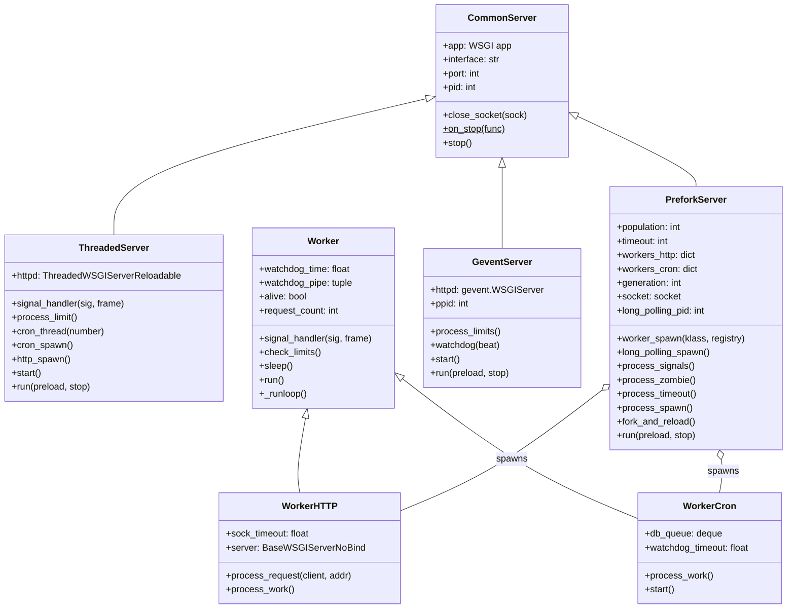
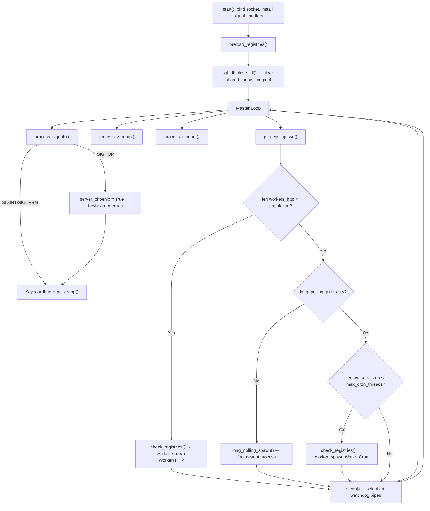
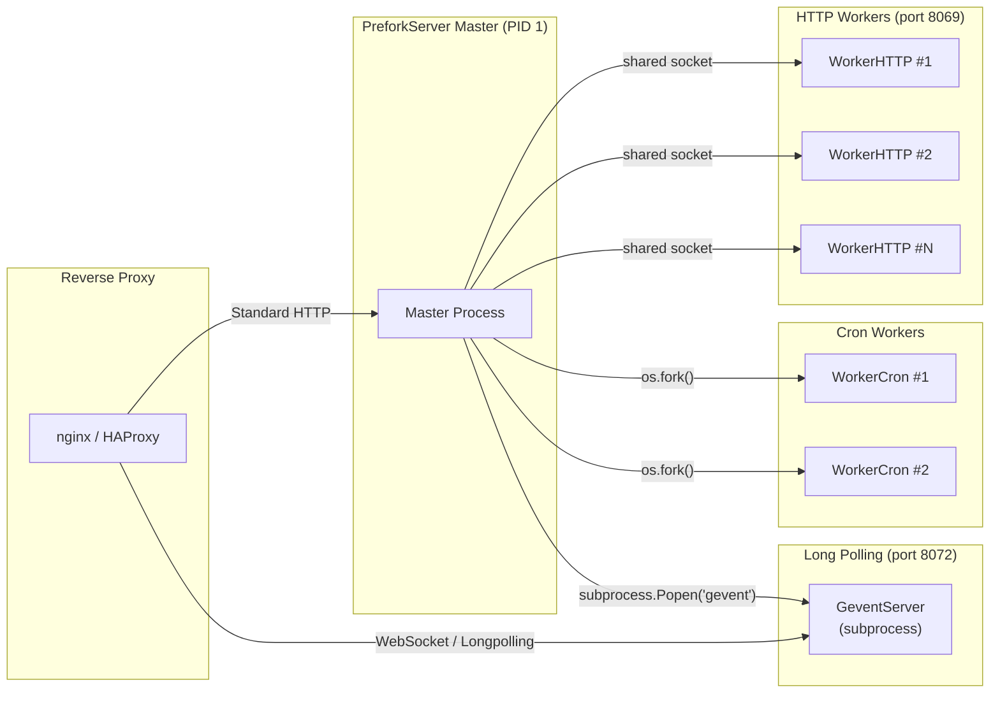

---
slug:21-prefork-and-gevent-architecture
blog_type:normal
---

Odoo's server runtime is not a monolithic process — it is a deliberately polymorphic architecture that selects its concurrency model at startup based on configuration flags. This document dissects the three server implementations — **ThreadedServer**, **PreforkServer**, and **GeventServer** — their shared lineage through `CommonServer`, and the worker classes that carry out actual request processing. Understanding this topology is essential for anyone tuning production deployments, diagnosing worker exhaustion, or extending Odoo's network layer.

## Server Selection and the Common Ancestor

When the Odoo binary starts, the `start()` function in [server.py](odoo/service/server.py#L1575-L1648) performs the critical dispatch: if `odoo.evented` is truthy, a `GeventServer` is instantiated; if `config['workers']` is non-zero, a `PreforkServer` is created; otherwise, a `ThreadedServer` serves as the fallback. All three inherit from [CommonServer](odoo/service/server.py#L416-L460), which stores the WSGI application reference, interface/port configuration, and provides a shared `stop()` method that iterates registered cleanup functions via the `_on_stop_funcs` class-level list. This inheritance factor means socket lifecycle management and shutdown orchestration are uniform across every mode.

## The ThreadedServer — Development Baseline

[ThreadedServer](odoo/service/server.py#L462-L755) is the default single-process server, designed primarily for development and low-traffic scenarios. It launches the HTTP listener inside a daemon thread via [http_spawn()](odoo/service/server.py#L623-L629), using the custom [ThreadedWSGIServerReloadable](odoo/service/server.py#L252-L324) — a patched Werkzeug `ThreadedWSGIServer` that supports socket inheritance for hot-reload. Cron processing is handled by [cron_spawn()](odoo/service/server.py#L608-L621), which creates up to `max_cron_threads` daemon threads, each running the [cron_thread()](odoo/service/server.py#L530-L607) loop. The cron implementation uses PostgreSQL `LISTEN/NOTIFY` on the `cron_trigger` channel with a deliberate "chorus effect" jitter (`SLEEP_INTERVAL + number % 10`) to mitigate the thundering herd problem when all cron threads wake simultaneously.

A notable detail in [start()](odoo/service/server.py#L1575-L1648) at the `ThreadedServer` branch: on 64-bit Linux systems, Odoo sets `MALLOC_ARENA_MAX=2` via `mallopt()` to prevent glibc's per-core memory arenas from inflating virtual memory usage beyond `limit_memory_soft`, an optimization that has zero impact on single-threaded Python due to the GIL but can cause premature worker recycling in threaded mode.

## The PreforkServer — Production Multiprocessing

[PreforkServer](odoo/service/server.py#L867-L1214) is the production-grade server, explicitly documented as "Multiprocessing inspired by (g)unicorn." It uses `accept(2)` as the dispatching mechanism between worker processes, with a planned future migration to an intelligent first-line HTTP parser dispatcher. The architecture follows a master-worker model where a single master process manages a pool of forked child processes.

### Master Process Lifecycle

The master's [run()](odoo/service/server.py#L1182-L1214) method enters an infinite loop after preloading registries and clearing the database connection pool (`sql_db.close_all()`) to prevent shared state across forks. Each iteration performs five critical operations:

1. **Signal processing** via [process_signals()](odoo/service/server.py#L958-L980): `SIGINT`/`SIGTERM` trigger shutdown, `SIGHUP` sets the `server_phoenix` flag for graceful reload, `SIGQUIT` dumps stacks, `SIGUSR1`/`SIGUSR2` log ORM cache stats, and `SIGTTIN`/`SIGTTOU` dynamically adjust the worker population up or down.

2. **Zombie reaping** via [process_zombie()](odoo/service/server.py#L981-L997): uses `os.waitpid(-1, os.WNOHANG)` to collect terminated child processes. A critical exit code of 3 triggers an immediate exception, aborting the entire server.

3. **Timeout enforcement** via [process_timeout()](odoo/service/server.py#L998-L1008): compares each worker's `watchdog_time` against its configured timeout, sending `SIGKILL` to unresponsive workers.

4. **Worker spawning** via [process_spawn()](odoo/service/server.py#L1009-L1034): ensures the `workers_http` pool stays at `config['workers']` capacity and the `workers_cron` pool stays at `config['max_cron_threads']` capacity. It also spawns the gevent long-polling process if absent. Before each spawn cycle, it checks registry signaling for any modules requiring reload.

5. **Sleep with watchdog** via [sleep()](odoo/service/server.py#L1035-L1049): uses `select()` on the wakeup pipe and all worker watchdog pipes, updating `watchdog_time` for any worker that sends a heartbeat ping.

### Worker Spawn and Fork Semantics

The [worker_spawn()](odoo/service/server.py#L917-L929) method increments a `generation` counter and calls `os.fork()`. In the parent process, the worker object is registered in both the generic `self.workers` dictionary and the type-specific registry (`workers_http` or `workers_cron`). In the child process, `worker.run()` is called and `sys.exit(0)` ensures clean termination. The long-polling gevent process is spawned differently via [long_polling_spawn()](odoo/service/server.py#L930-L935), using `subprocess.Popen` to execute a separate `odoo-bin gevent` command — this is a full process spawn rather than a fork, ensuring complete isolation of the evented runtime.

### Graceful Reload — Fork and Phoenix

The most sophisticated lifecycle operation is [fork_and_reload()](odoo/service/server.py#L1091-L1121). When `SIGHUP` is received, the master forks itself. The child process (the old server) enters a polling loop waiting for a `SIGHUP` signal from the new server. The parent process (the new server) preserves the HTTP listening socket by clearing its `FD_CLOEXEC` flag, passing its file descriptor via the `ODOO_HTTP_SOCKET_FD` environment variable, and calling `_reexec()` which uses `os.execve()` to replace itself with a fresh process. This zero-downtime reload mechanism ensures the listening socket is never closed during the transition.

## The GeventServer — Evented Long Polling

[GeventServer](odoo/service/server.py#L755-L866) serves a fundamentally different role: it is the event-driven counterpart dedicated to long-polling and WebSocket connections. It runs on a separate port controlled by `config['gevent_port']` and is automatically launched as a subprocess by `PreforkServer.long_polling_spawn()`, or directly when `odoo.evented` is set.

The server uses gevent's `WSGIServer` with a custom [ProxyHandler](odoo/service/server.py#L793-L843) that extends `WSGIHandler`. This handler addresses three critical requirements: it extracts the client address from proxy-modified environment variables (supporting `proxyfix`), it disables chunked transfer encoding when the server responds with HTTP 101 (Switching Protocols) to accommodate WebSocket upgrades, and it injects the raw TCP socket into the WSGI environment for downstream WebSocket handlers.

A greenlet-based [watchdog()](odoo/service/server.py#L775-L780) runs in the background, checking every 4 seconds whether the parent process has changed (indicating the master was restarted) and whether virtual memory exceeds `limit_memory_soft_gevent` (falling back to `limit_memory_soft`). If either condition triggers, the gevent process self-terminates via `SIGTERM`, and the `PreforkServer` master will respawn it.

## Worker Architecture — The Execution Engine

Both worker types inherit from the abstract [Worker](odoo/service/server.py#L1215-L1346) base class, which provides the complete lifecycle machinery. Each worker creates two non-blocking pipes: a `watchdog_pipe` for sending heartbeats to the master, and an `eintr_pipe` that works with `signal.set_wakeup_fd()` to safely interrupt the `select()` call when signals arrive — Python's default behavior of simulating `SA_RESTART` would otherwise prevent signal handling during blocking I/O.

The [check_limits()](odoo/service/server.py#L1260-L1282) method enforces four constraints per request cycle: parent PID verification (suicide if orphaned), maximum request count (`limit_request`), virtual memory soft limit, and per-request CPU time via `RLIMIT_CPU`. The CPU limit is set dynamically: each call to `check_limits()` reads the current `RUSAGE_SELF` cumulative CPU time and sets `RLIMIT_CPU` to `current_cpu + limit_time_cpu`, effectively making the limit apply per-unit-of-work rather than globally.

### WorkerHTTP — Synchronous Request Processing

[WorkerHTTP](odoo/service/server.py#L1347-L1389) handles the `accept()` → process → respond cycle. In [process_work()](odoo/service/server.py#L1378-L1385), it calls `self.multi.socket.accept()` on the shared non-blocking socket and delegates to [process_request()](odoo/service/server.py#L1360-L1377), which sets the socket to blocking mode with a configurable 2-second timeout (overridable via `ODOO_HTTP_SOCKET_TIMEOUT`), enables `TCP_NODELAY`, sets `FD_CLOEXEC`, and processes the request through [BaseWSGIServerNoBind](odoo/service/server.py#L125-L137) — a patched Werkzeug server that accepts an externally managed socket rather than creating its own.

### WorkerCron — Database-Aware Job Processing

[WorkerCron](odoo/service/server.py#L1390-L1490) is architecturally richer. During [start()](odoo/service/server.py#L1465-L1482), it calls `os.nice(10)` to lower its scheduling priority, closes the shared HTTP socket (cron workers have no business accepting HTTP connections), and establishes a dedicated PostgreSQL connection to the `postgres` database where it executes `LISTEN cron_trigger`. The [process_work()](odoo/service/server.py#L1425-L1463) method maintains a `db_queue` (an `OrderedSet`-backed deque) that prioritizes databases notified via PostgreSQL's `NOTIFY` mechanism before processing the full database list. Each database's jobs are processed by `IrCron._process_jobs(db_name)`, and in multi-database configurations, cursors are closed after each database to prevent connection pool exhaustion.

<CgxTip>
**Watchdog Pipe Duality**: The master's `sleep()` method monitors all worker watchdog pipes via `select()`. When a worker's `_runloop()` sends a ping through its `watchdog_pipe`, the master records the timestamp. If a worker hangs (e.g., on a blocking database call), it stops sending heartbeats, and the master's `process_timeout()` will `SIGKILL` it after the configured timeout. This is a pure userspace watchdog — no kernel timers or `wait3()` polling involved.

</CgxTip>

<CgxTip>
**Fork Safety and Cursor Pooling**: Immediately before entering the main loop, `PreforkServer.run()` calls `sql_db.close_all()` to empty the cursor pool. This is critical because forked child processes share their parent's file descriptors — a PostgreSQL cursor created before the fork would be used concurrently by multiple workers, leading to protocol desynchronization and data corruption.

</CgxTip>

## Concurrency Model Comparison

| Dimension | ThreadedServer | PreforkServer | GeventServer |
|---|---|---|---|
| **Concurrency primitive** | OS threads (GIL-bound) | OS processes (`os.fork()`) | Greenlets (cooperative) |
| **HTTP workers** | Unlimited (thread-per-request) | `config['workers']` | Single event loop |
| **Cron execution** | Daemon threads (`max_cron_threads`) | Forked `WorkerCron` processes | Not applicable |
| **Memory isolation** | Shared address space | Per-process isolation | Shared address space |
| **WebSocket / long-polling** | Blocks a thread per connection | Spawns gevent subprocess | Native support |
| **Graceful reload** | In-process via `_reexec()` | Fork-and-phoenix with socket inheritance | Killed and respawned by master |
| **Signal handling** | Direct `signal.signal()` | Pipe-based wakeup (`pipe_ping`) | gevent signal handling |
| **Production readiness** | Development only | Primary production mode | Dedicated long-polling port |
| **Key config keys** | `max_cron_threads` | `workers`, `limit_time_real`, `limit_request` | `gevent_port`, `limit_memory_soft_gevent` |

## Key Configuration Parameters

| Parameter | Default | Scope | Purpose |
|---|---|---|---|
| `workers` | `0` | PreforkServer | Number of HTTP worker processes |
| `limit_time_real` | `60` | All servers | Maximum wall-clock seconds per request before worker kill |
| `limit_time_real_cron` | `None` | PreforkServer/Cron | Override timeout for cron workers specifically |
| `limit_request` | `8196` | PreforkServer | Maximum requests before worker recycling |
| `limit_time_cpu` | `60` | PreforkServer | CPU seconds allowed per request (via `RLIMIT_CPU`) |
| `limit_memory_soft` | `2048MiB` | All servers | Virtual memory soft limit triggering worker suicide |
| `limit_memory_soft_gevent` | `None` | GeventServer | Gevent-specific memory soft limit (falls back to `limit_memory_soft`) |
| `limit_time_worker_cron` | `0` | Threaded/Prefork | Maximum cron worker lifetime in seconds (0 = unlimited) |
| `max_cron_threads` | `2` | All servers | Maximum cron worker threads (Threaded) or processes (Prefork) |
| `gevent_port` | `8072` | GeventServer | Port for the long-polling/evented server |
| `http_enable` | `True` | PreforkServer | Whether to spawn HTTP workers and long-polling process |

## Production Deployment Topology

In a typical production deployment, `PreforkServer` serves as the master orchestrator. It binds the HTTP socket on port 8069 (or 80/443 behind a reverse proxy), spawns `workers` number of `WorkerHTTP` processes that compete for connections via `accept()`, spawns `max_cron_threads` number of `WorkerCron` processes that coordinate via PostgreSQL `LISTEN/NOTIFY`, and launches a single `GeventServer` subprocess on port 8072 dedicated to WebSocket and long-polling connections. A reverse proxy (nginx, HAProxy) sits in front, routing standard HTTP requests to port 8069 and upgrading `/websocket` and `/longpolling` endpoints to port 8072.

## Next Steps

For the broader context of how these servers fit into Odoo's startup sequence and CLI dispatch, see [Server Modes and Workers](20-server-modes-and-workers). To understand the WSGI application that all three servers wrap — including routing, session management, and request dispatch — consult [WSGI Application and Request Lifecycle](13-wsgi-application-and-request-lifecycle). For tuning guidance on the configuration parameters referenced throughout this document, see [Configuration and Tools](22-configuration-and-tools).