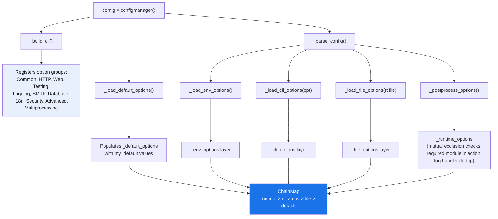
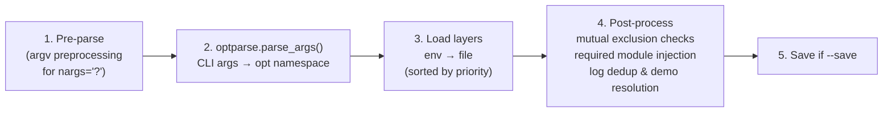
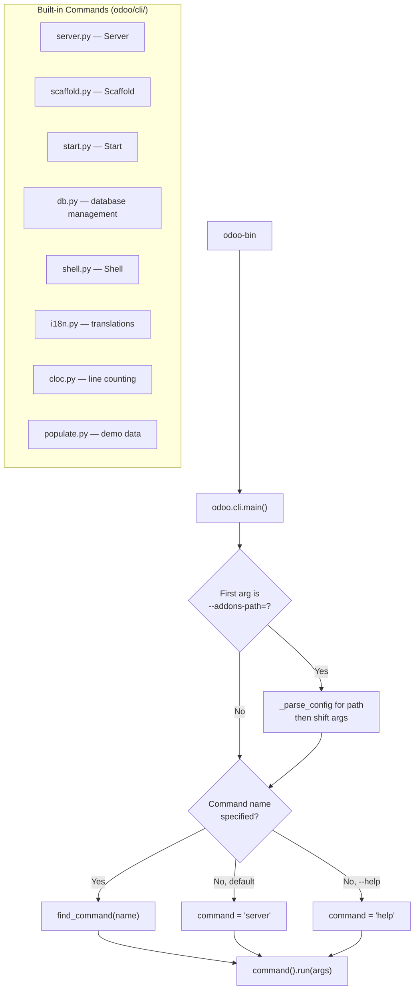

---
slug:22-configuration-and-tools
blog_type:normal
---


Odoo 19 ships a layered configuration architecture that reconciles five distinct option sources into a single unified `ChainMap`. Understanding this system is essential for anyone deploying Odoo in production, developing custom modules, or integrating Odoo into existing infrastructure. This page covers the configuration manager internals, the full option catalog, the CLI command framework, and programmatic configuration patterns.

## Configuration Architecture Overview

At the heart of Odoo's configuration system lies the `configmanager` class in [config.py](odoo/tools/config.py#L157), instantiated once as the module-level singleton `config` at [line 1063](odoo/tools/config.py#L1063). During `__init__`, it builds an `optparse.OptionParser` with a custom option class hierarchy, loads hardcoded defaults, and performs an initial pre-parse of `sys.argv`. The resulting options dictionary is a `collections.ChainMap` that merges five layers in strict priority order.



The five source layers stored as separate dictionaries are composed via `collections.ChainMap` at [lines 164–170](odoo/tools/config.py#L164-L170):

| Layer | Dictionary | Source | Priority |
|---|---|---|---|
| Runtime | `_runtime_options` | Post-processing overrides, dependency injection | **Highest** |
| CLI | `_cli_options` | Command-line arguments (`sys.argv`) | |
| Environment | `_env_options` | `ODOO_RC`, `PGDATABASE`, `PGUSER`, `ODOO_DEV`, etc. | |
| File | `_file_options` | `~/.odoorc` or custom `-c` config file | |
| Default | `_default_options` | Hardcoded `my_default` values in option definitions | **Lowest** |

Sources: [config.py](odoo/tools/config.py#L157-L170), [config.py](odoo/tools/config.py#L500-L523)

## Option Definition and Custom Option Types

Odoo extends `optparse.Option` with a three-tier class hierarchy to control which option sources each setting can participate in. The base `_OdooOption` at [line 40](odoo/tools/config.py#L40) introduces `my_default`, `file_loadable`, `file_exportable`, `cli_loadable`, and `env_name` attributes — none of which exist in standard `optparse`. Two subclasses further restrict visibility: `_FileOnlyOption` at [line 120](odoo/tools/config.py#L120) can never be set via CLI or environment (sensitive values like `admin_passwd`, `proxy_access_token`), and `_PosixOnlyOption` at [line 132](odoo/tools/config.py#L132) is excluded on non-POSIX systems (workers, CPU limits, request limits).

Custom type-checker methods on `configmanager` validate and transform values at parse time:

| Type checker | Method | Behavior |
|---|---|---|
| `addons_path` | [`_check_addons_path`](odoo/tools/config.py#L785) | Validates paths exist, normalizes with `_normalize()` |
| `upgrade_path` | [`_check_upgrade_path`](odoo/tools/config.py#L799) | Same path normalization as addons |
| `comma` | [`_check_comma`](odoo/tools/config.py#L843) | Splits comma-separated strings into lists |
| `bool` | [`_check_bool`](odoo/tools/config.py#L833) | Accepts `true`/`false`/`1`/`0` strings |
| `without_demo` | [`_check_without_demo`](odoo/tools/config.py#L851) | Inverts boolean, maps to `with_demo` internally |
| `path` | [`_check_path`](odoo/tools/config.py#L847) | Normalizes via `expanduser`/`expandvars`/`realpath` |

The companion `parse()` method at [line 859](odoo/tools/config.py#L859) and `format()` method at [line 884](odoo/tools/config.py#L884) provide bidirectional serialization, used both when reading config files and when writing them back with `save()`.

<CgxTip>
**Critical**: The `--save` flag (`-s`) writes the resolved configuration back to `~/.odoorc`. However, options marked `file_exportable=False` (sensitive defaults like `admin_passwd`, proxy tokens, and binary paths) are silently excluded from persistence. See the guard at [line 942](odoo/tools/config.py#L942).
</CgxTip>

Sources: [config.py](odoo/tools/config.py#L40-L135), [config.py](odoo/tools/config.py#L773-L888)

## Complete Configuration Option Catalog

The following table organizes every option registered in `_build_cli()` by its option group. Values reflect defaults as coded in the 19.0 branch.

### Common Options

| Flag | Destination | Default | Description |
|---|---|---|---|
| `-c`, `--config` | `config` | `~/.odoorc` | Alternate config file path |
| `-s`, `--save` | `save` | `False` | Save config to rc file |
| `-i`, `--init` | `init` | `[]` | Modules to install |
| `-u`, `--update` | `update` | `[]` | Modules to update |
| `--reinit` | `reinit` | `[]` | Modules to reinitialize |
| `--with-demo` | `with_demo` | `False` | Install demo data |
| `--without-demo` | `with_demo` | `True` | Skip demo data (default) |
| `--skip-auto-install` | `skip_auto_install` | `False` | Skip `auto_install` modules |
| `-P`, `--import-partial` | `import_partial` | `''` | File for resumable large imports |
| `--pidfile` | `pidfile` | `''` | PID file location |
| `--addons-path` | `addons_path` | `[]` | Additional addon directories |
| `--upgrade-path` | `upgrade_path` | `[]` | Additional upgrade script directories |
| `--pre-upgrade-scripts` | `pre_upgrade_scripts` | `[]` | Scripts run before `-u` module loading |
| `--load` | `server_wide_modules` | `['base', 'rpc', 'web']` | Server-wide modules |
| `-D`, `--data-dir` | `data_dir` | Platform-dependent | Odoo data storage directory |

Sources: [config.py](odoo/tools/config.py#L222-L253)

### HTTP Service Configuration

| Flag | Destination | Default | Description |
|---|---|---|---|
| `--http-interface` | `http_interface` | `0.0.0.0` | Listen address |
| `-p`, `--http-port` | `http_port` | `8069` | Main HTTP port |
| `--gevent-port` | `gevent_port` | `8072` | Gevent worker port |
| `--no-http` | `http_enable` | `True` | Disable HTTP entirely |
| `--proxy-mode` | `proxy_mode` | `False` | Enable reverse proxy WSGI wrappers |
| `--x-sendfile` | `x_sendfile` | `False` | Delegate large file delivery to web server |

Sources: [config.py](odoo/tools/config.py#L256-L272)

### Database Options

| Flag | Destination | Default | Env Variable | Description |
|---|---|---|---|---|
| `-d`, `--database` | `db_name` | `[]` | `PGDATABASE` | Target database(s) |
| `-r`, `--db_user` | `db_user` | `''` | `PGUSER` | Database username |
| `-w`, `--db_password` | `db_password` | `''` | `PGPASSWORD` | Database password |
| `--db_host` | `db_host` | `''` | `PGHOST` | Database host |
| `--db_port` | `db_port` | `None` | `PGPORT` | Database port |
| `--db_replica_host` | `db_replica_host` | `None` | `PGHOST_REPLICA` | Replica host |
| `--db_replica_port` | `db_replica_port` | `None` | `PGPORT_REPLICA` | Replica port |
| `--db_sslmode` | `db_sslmode` | `prefer` | `PGSSLMODE` | SSL mode |
| `--db_app_name` | `db_app_name` | `odoo-{pid}` | `PGAPPNAME` | Application name |
| `--db_maxconn` | `db_maxconn` | `64` | — | Max PostgreSQL connections |
| `--db_maxconn_gevent` | `db_maxconn_gevent` | `None` | — | Max connections for gevent |
| `--db-template` | `db_template` | `template0` | — | Database creation template |

Sources: [config.py](odoo/tools/config.py#L368-L396)

### Multiprocessing Options (POSIX Only)

| Flag | Destination | Default | Description |
|---|---|---|---|
| `--workers` | `workers` | `0` | Worker count (0 = no prefork) |
| `--limit-memory-soft` | `limit_memory_soft` | 2048 MiB | Soft memory limit per worker |
| `--limit-memory-hard` | `limit_memory_hard` | 2560 MiB | Hard memory limit per worker |
| `--limit-memory-soft-gevent` | `limit_memory_soft_gevent` | inherits soft limit | Soft limit for gevent worker |
| `--limit-memory-hard-gevent` | `limit_memory_hard_gevent` | inherits hard limit | Hard limit for gevent worker |
| `--limit-time-cpu` | `limit_time_cpu` | `60s` | Max CPU time per request |
| `--limit-time-real` | `limit_time_real` | `120s` | Max wall time per request |
| `--limit-time-real-cron` | `limit_time_real_cron` | `-1` | Max wall time per cron job |
| `--limit-request` | `limit_request` | 65536 | Max requests per worker |

Sources: [config.py](odoo/tools/config.py#L456-L496)

### Advanced and Developer Options

| Flag | Destination | Default | Description |
|---|---|---|---|
| `--dev` | `dev_mode` | `[]` | Developer features (`access`, `reload`, `qweb`, `xml`, `replica`, `werkzeug`, `all`) |
| `--stop-after-init` | `stop_after_init` | `False` | Stop after initialization |
| `--osv-memory-count-limit` | `osv_memory_count_limit` | `0` | Max transient model records |
| `--transient-age-limit` | `transient_age_limit` | `1.0h` | Transient record TTL |
| `--max-cron-threads` | `max_cron_threads` | `2` | Concurrent cron threads |
| `--limit-time-worker-cron` | `limit_time_worker_cron` | `0` | Cron worker restart interval |
| `--unaccent` | `unaccent` | `False` | Enable `unaccent` PG extension |
| `--no-database-list` | `list_db` | `True` | Hide database manager |

Sources: [config.py](odoo/tools/config.py#L410-L454)

### Logging and SMTP Options

| Flag | Destination | Default | Description |
|---|---|---|---|
| `--logfile` | `logfile` | `''` (stderr) | Log file path |
| `--syslog` | `syslog` | `False` | Send logs to syslog |
| `--log-handler` | `log_handler` | `[':INFO']` | Per-module log levels |
| `--log-level` | `log_level` | `info` | Legacy global log level |
| `--log-db` | `log_db` | `''` | Logging database |
| `--smtp` | `smtp_server` | `localhost` | SMTP server |
| `--smtp-port` | `smtp_port` | `25` | SMTP port |
| `--email-from` | `email_from` | `''` | Sender email address |

Sources: [config.py](odoo/tools/config.py#L318-L365)

### File-Only Options (Not Exposed via CLI)

These options live exclusively in the config file or are set programmatically:

| Destination | Default | Description |
|---|---|---|
| `admin_passwd` | `admin` | Master password (hashed with pbkdf2_sha512) |
| `csv_internal_sep` | `,` | CSV import field separator |
| `import_file_maxbytes` | 10 MiB | Max import file size |
| `import_file_timeout` | 3s | Import URL fetch timeout |
| `import_url_regex` | `^(?:http\|https)://` | Allowed URL pattern for imports |
| `reportgz` | `False` | Gzip-compressed QWeb PDF reports |
| `websocket_keep_alive_timeout` | 3600s | WebSocket keep-alive |
| `websocket_rate_limit_burst` | 10 | WebSocket burst limit |
| `websocket_rate_limit_delay` | 0.2s | WebSocket rate delay |

Sources: [config.py](odoo/tools/config.py#L207-L219)

## Configuration File Format

The configuration file uses Python's `RawConfigParser` format with a single `[options]` section. When `--save` is used, the `save()` method at [line 931](odoo/tools/config.py#L931) serializes all exportable options, creating parent directories as needed and setting file permissions to `0o600` for newly created files. During loading, `_load_file_options()` at [line 896](odoo/tools/config.py#L896) gracefully handles missing files and unknown options — unknown keys are stored as raw strings with a warning.

```ini
# ~/.odoorc
[options]
addons_path = /opt/odoo/custom_addons,/opt/odoo/odoo/addons
db_host = localhost
db_port = 5432
db_user = odoo
db_password = secret
http_port = 8069
workers = 4
limit_memory_soft = 2147483648
limit_memory_hard = 2684354560
proxy_mode = True
logfile = /var/log/odoo/odoo-server.log
```

The config file path resolution follows a deterministic cascade defined in [`_load_default_options()`](odoo/tools/config.py#L500-L523): Windows uses `<exe_dir>/odoo.conf`; POSIX systems check `~/.odoorc` first, falling back to the legacy `~/.openerp_serverrc` with a deprecation warning, then defaulting to `~/.odoorc`. The environment variable `ODOO_RC` (via `env_name` on the `--config` option) overrides all of these.

Sources: [config.py](odoo/tools/config.py#L896-L963)

## Option Resolution Flow

The `parse_config()` method at [line 550](odoo/tools/config.py#L550) is the canonical entry point. It orchestrates a strict four-phase pipeline:



The `_postprocess_options()` method at [line 646](odoo/tools/config.py#L646) enforces several critical invariants: it prevents `syslog` and `logfile` from coexisting, requires `--update` when `--i18n-overwrite` is set, prevents multi-database usage with `--init` or `--update`, ensures `base` and `web` are always present in `server_wide_modules`, deduplicates log handlers, expands `all` and `replica` in `dev_mode`, and transforms `--test-file` into equivalent `--test-tags` entries. Any violation triggers `parser.error()` and halts startup.

<CgxTip>
**Critical**: The `-i` and `-u` flags accept `all` as a magic value. When `--update=all` is used, the postprocessor expands it to `{'base': True}` at [line 676](odoo/tools/config.py#L676), which triggers a full registry rebuild. Similarly, `--dev=all` expands to `['access', 'qweb', 'reload', 'xml']` at [line 702](odoo/tools/config.py#L702).
</CgxTip>

Sources: [config.py](odoo/tools/config.py#L550-L720)

## CLI Command Framework

Odoo's CLI is not monolithic — it uses a command pattern implemented in [odoo/cli/command.py](odoo/cli/command.py#L20). The `Command` base class at [line 20](odoo/cli/command.py#L20) uses `__init_subclass__` to auto-register subclasses into the global `commands` dictionary keyed by their `name` attribute. The `main()` dispatcher at [line 109](odoo/cli/command.py#L109) performs a single pre-parse for `--addons-path` (needed to discover addon-provided commands), then resolves the command name falling back to `server` when none is specified.



The built-in commands shipped in the `odoo/cli/` directory cover the essential operational surface:

| Command | File | Purpose |
|---|---|---|
| `server` (default) | [server.py](odoo/cli/server.py#L122) | Full Odoo server startup with prefork/gevent |
| `scaffold` | [scaffold.py](odoo/cli/scaffold.py#L10) | Generate module skeleton from Jinja2 templates |
| `start` | [start.py](odoo/cli/start.py#L13) | Quick-start with auto-detected addons path |
| `shell` | [shell.py](odoo/cli/shell.py) | Interactive Python REPL with ORM pre-loaded |
| `db` | [db.py](odoo/cli/db.py) | Database create, drop, dump, restore |
| `help` | [help.py](odoo/cli/help.py) | Display command-specific help |
| `i18n` | [i18n.py](odoo/cli/i18n.py) | Translation import/export |
| `cloc` | [cloc.py](odoo/cli/cloc.py) | Count lines of code |
| `populate` | [populate.py](odoo/cli/populate.py) | Generate demo/population data |

Addon modules can contribute commands by placing a `cli/{command_name}.py` file containing a `Command` subclass — the `load_addons_commands()` function at [line 68](odoo/cli/command.py#L68) discovers these from the addons path at runtime.

Sources: [command.py](odoo/cli/command.py#L20-L140), [server.py](odoo/cli/server.py#L95-L128)

## Programmatic Configuration (WSGI Integration)

For production deployments behind Gunicorn or uWSGI, Odoo provides a WSGI configuration pattern demonstrated in [setup/odoo-wsgi.example.py](setup/odoo-wsgi.example.py). The approach imports `odoo.tools.config` as `conf` and uses dict-style assignment to override options before calling `application.initialize()`.

```python
from odoo.http import root as application
from odoo.tools import config as conf

conf['addons_path'] = './odoo/addons,./custom_addons'
conf['db_name'] = 'production'
conf['db_host'] = 'db.internal'
conf['workers'] = 8

application.initialize()
```

The `__setitem__` method at [line 968](odoo/tools/config.py#L968) automatically runs string values through the registered type parser, so `conf['workers'] = '8'` is equivalent to `conf['workers'] = 8`. After `initialize()`, Gunicorn picks up the standard WSGI app with its own worker/timeout configuration specified in the same file. This pattern allows complete separation of Odoo's internal configuration from the process manager's configuration.

The admin password system uses passlib's `CryptContext` with pbkdf2_sha512 (600,000 rounds) as the preferred scheme and plaintext as a deprecated fallback, defined at [line 21](odoo/tools/config.py#L21). The `verify_admin_password()` method at [line 1021](odoo/tools/config.py#L1021) transparently re-hashes passwords when the stored hash uses an outdated scheme.

Sources: [odoo-wsgi.example.py](setup/odoo-wsgi.example.py), [config.py](odoo/tools/config.py#L965-L1032)

## Path Resolution and Data Directories

The `configmanager` exposes several computed path properties that abstract away platform differences. The `root_path` cached property at [line 977](odoo/tools/config.py#L977) resolves to the `odoo/` package parent directory. From there, `addons_base_dir` ([line 981](odoo/tools/config.py#L981)) points to `odoo/addons/` (enterprise), while `addons_community_dir` ([line 985](odoo/tools/config.py#L985)) resolves to the sibling `addons/` directory (community). The `data_dir` default is platform-aware: Linux uses `/var/lib/odoo`, macOS and Windows use `appdirs.user_data_dir()`, and headless environments fall back to `appdirs.site_data_dir()`.

Sources: [config.py](odoo/tools/config.py#L500-L523), [config.py](odoo/tools/config.py#L976-L1016)

## Next Steps

For a complete reference of all CLI flags in practice, see [CLI Commands Reference](4-cli-commands-reference). To understand how the configuration drives server behavior in prefork and gevent modes, proceed to [Server Modes and Workers](20-server-modes-and-workers). For the broader system context, revisit [Architecture Overview](8-architecture-overview).