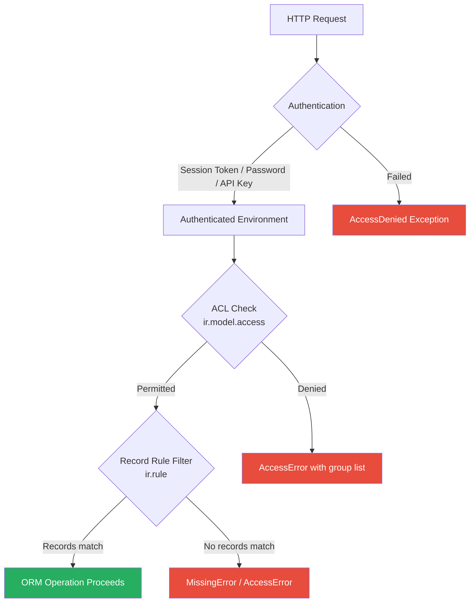
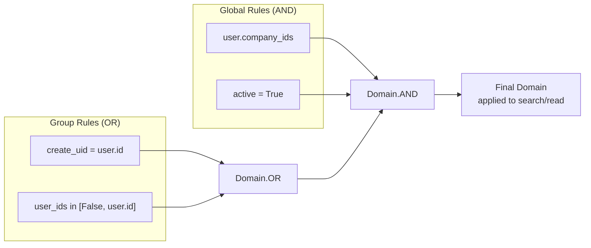

---
slug:23-security-and-access-control
blog_type:normal
---

Odoo 19.0 enforces a layered security model that operates at four distinct levels: **authentication**, **model-level access control**, **record-level filtering**, and **application-level identity verification**. These layers are not independent silos—they form a pipeline where every ORM operation must pass through all applicable gates before reaching the database. This document dissects each layer's architecture, its implementation in the codebase, and the contracts that bind them together.

## Authentication and Session Management

Every request entering Odoo must be authenticated before any business logic executes. The `res.users` model (`_inherits = {'res.partner': 'partner_id'}`) serves as the central authentication authority, storing login credentials, password hashes, and session token metadata while delegating personal data to `res.partner` through model inheritance [Sources: [res_users.py](/odoo/addons/base/models/res_users.py#L155-L166)].

The credential verification pipeline starts at `_check_credentials`, which supports password-based authentication and API key authentication. Password hashing uses a configurable **passlib CryptContext** with bcrypt as the default KDF. The work factor is controlled by the `password.hashing.rounds` system parameter, defaulting to 600,000 rounds—aligned with current OWASP guidance for bcrypt cost factors [Sources: [res_users.py](/odoo/addons/base/models/res_users.py#L79-L79), [res_users.py](/odoo/addons/base/models/res_users.py#L1193-L1203)].

Session tokens are computed deterministically from a session ID and a set of user-specific field values via `_compute_session_token`. This method is cached per session ID (`@tools.ormcache('sid')`), meaning token validation is a constant-time hash comparison rather than a database lookup [Sources: [res_users.py](/odoo/addons/base/models/res_users.py#L851-L853)].

A critical design property: the entire `res.users` model is decorated with `_allow_sudo_commands = False`. This means that even when using `env.su`, the ORM will not bypass security checks on user records themselves, preventing privilege escalation through the superuser flag [Sources: [res_users.py](/odoo/addons/base/models/res_users.py#L167-L167)].

## Access Groups and the Privilege Hierarchy

Groups are the atomic unit of access assignment in Odoo. The `res.groups` model implements a **directed acyclic graph** of group relationships through two symmetric fields: `implied_ids` (groups this group grants) and `implied_by_ids` (groups that grant this group). The transitive closures are computed via `all_implied_ids` and `all_implied_by_ids`, enabling efficient hierarchical access queries [Sources: [res_groups.py](/odoo/addons/base/models/res_groups.py#L69-L77)].

Odoo 19.0 introduces `res.groups.privilege`, a categorization model that groups multiple related access groups under a named privilege. Privileges have a `category_id` linking to `ir.module.category`, a `placeholder` string for UI display, and a `sequence` for ordering. This allows module authors to define privilege bundles (e.g., "Export" with sub-groups "Allowed") that present a cleaner abstraction than raw group assignment [Sources: [res_groups_privilege.py](/odoo/addons/base/models/res_groups_privilege.py#L4-L14), [base_groups.xml](/odoo/addons/base/security/base_groups.xml#L3-L15)].

### The Three User Archetypes

The base module defines three mutually exclusive role groups that partition all users into distinct security tiers:

| Group | XML ID | Purpose | Implied Groups |
|-------|--------|---------|----------------|
| **Administrator** | `base.group_system` | Full settings access, sanitize bypass | `group_erp_manager`, `group_sanitize_override` |
| **Internal User** | `base.group_user` | Standard employee access | (default user group) |
| **Portal** | `base.group_portal` | External collaborator with limited scope | (none) |
| **Public** | `base.group_public` | Unauthenticated website visitor | (none) |

Disjointness is enforced at the database level: `_check_disjoint_groups` on `res.groups` and `_check_user_disjoint_groups` on `res.users` prevent any user from simultaneously belonging to two archetypes. The check is implemented with a scalable query that searches for violating users rather than iterating all group members [Sources: [res_groups.py](/odoo/addons/base/models/res_groups.py#L82-L100), [base_groups.xml](/odoo/addons/base/security/base_groups.xml#L34-L82)].

The `has_groups` method accepts a **group expression** string using boolean operators, enabling complex group checks in a single call: `user.has_groups('base.group_system | base.group_erp_manager')` [Sources: [res_users.py](/odoo/addons/base/models/res_users.py#L1034-L1034)].

## Model Access Control (ACL)

Model-level access control is the first security gate an ORM operation encounters. Implemented by `ir.model.access`, ACLs define coarse-grained permissions: **can the user interact with this model at all?** Each ACL record grants or denies four CRUD operations independently [Sources: [ir_model.py](/odoo/addons/base/models/ir_model.py#L2059-L2072)].

### ACL Record Structure

| Field | Type | Purpose |
|-------|------|---------|
| `name` | Char | Human-readable identifier |
| `model_id` | Many2one → `ir.model` | Target model (required) |
| `group_id` | Many2one → `res.groups` | Group this ACL applies to (`NULL` = everyone) |
| `perm_read` | Boolean | Grant read access |
| `perm_write` | Boolean | Grant write access |
| `perm_create` | Boolean | Grant create access |
| `perm_unlink` | Boolean | Grant delete access |
| `active` | Boolean | Soft-disable without deletion |

The critical enforcement method is `ir.model.access.check()`. When called with `raise_exception=True` (the default), it raises `AccessError` if the current user lacks the requested access mode. The implementation short-circuits for superuser (`self.env.su`) and uses an ormcached `_get_allowed_models` for high-performance lookups. The cache key includes `self.env.uid` and the access mode, and invalidation is triggered on any ACL create/write/unlink [Sources: [ir_model.py](/odoo/addons/base/models/ir_model.py#L2169-L2204)].

The `_get_allowed_models` method issues a single SQL query joining `ir_model_access` with `ir_model`, filtering by the current user's group IDs (including all implied groups). Group-less ACLs (where `group_id IS NULL`) grant access to **all users**, though the framework emits a deprecation warning when such ACLs are created [Sources: [ir_model.py](/odoo/addons/base/models/ir_model.py#L2149-L2163), [ir_model.py](/odoo/addons/base/models/ir_model.py#L2192-L2197)].

<CgxTip>
ACLs with no `group_id` are a **deprecated pattern** in Odoo 19.0. Every new ACL should specify an explicit group. The system logs a warning (`"Rule has no group, this is a deprecated feature"`) on creation, but continues to function for backward compatibility.
</CgxTip>

## Record Rules (ir.rule)

Record rules are the second security gate—applied **after** ACL clearance. They operate as **row-level security policies** that filter which records a user can see or modify, even when the model itself is accessible. Record rules are defined by `ir.rule` and evaluated as domain expressions against the database [Sources: [ir_rule.py](/odoo/addons/base/models/ir_rule.py#L15-L31)].

### Global vs. Group Rules

The `global` computed field (assigned via `setattr` since `global` is a Python keyword) distinguishes between two rule categories with fundamentally different combination semantics [Sources: [ir_rule.py](/odoo/addons/base/models/ir_rule.py#L269-L277)]:

| Type | Condition | Combination | Use Case |
|------|-----------|-------------|----------|
| **Global** | `groups` is empty | **AND**-ed together | Multi-company isolation, hard constraints |
| **Group** | `groups` is non-empty | **OR**-ed together, then AND-ed with globals | Role-specific record visibility |

The `_compute_domain` method implements this logic explicitly. It first collects global domains from rules matching the model and mode, then collects group domains from rules where the current user's groups overlap the rule's assigned groups. The group domains are combined with `Domain.OR`, then the result is AND-ed with the global domains. The final domain is optimized for the target model [Sources: [ir_rule.py](/odoo/addons/base/models/ir_rule.py#L139-L171)].

### Rule Evaluation Context

The `_eval_context` method provides the namespace available to domain expressions in `domain_force`. This context is deliberately minimal to prevent injection: `user` (current user with empty context to avoid side effects), `company_ids` (IDs of the user's activated companies from the company switcher), and `company_id` (the current company). All domain expressions are validated via `safe_eval` and `Domain.validate()` at write time through the `_check_domain` constraint [Sources: [ir_rule.py](/odoo/addons/base/models/ir_rule.py#L37-L74)].

<CgxTip>
The `_compute_domain` method is ormcached with keys including `self.env.uid`, `self.env.su`, `model_name`, `mode`, and context values from `_compute_domain_keys`. The default context key is `allowed_company_ids`. If you add custom record rules that depend on other context values, you must override `_compute_domain_keys` to include them—otherwise your rules will serve stale cached domains across company switches.
</CgxTip>

### Inherited Model Rules

Record rules automatically propagate through model inheritance. When `_compute_domain` encounters a model with `_inherits` parents, it recursively computes domains for each parent model and wraps them in `Domain(parent_field_name, 'any', domain)`. This ensures that a record rule on `res.partner` is correctly enforced when querying through `res.users` (which inherits from `res.partner`) [Sources: [ir_rule.py](/odoo/addons/base/models/ir_rule.py#L142-L148)].

## Multi-Company Record Isolation

Multi-company security is the most pervasive use of record rules in Odoo. The base module ships with global rules that filter `res.partner`, `res.company`, and `res.users` records by the current user's company context. The partner rule uses `parent_of` to include records from child companies: `[('company_id', 'parent_of', company_ids)]`, with an escape hatch for partners that have internal users (those are always visible) [Sources: [base_security.xml](/odoo/addons/base/security/base_security.xml#L15-L21)].

The company rules demonstrate the global/group tiering pattern clearly. ERP Managers get `[(1,'=',1)]` (see everything), while portal and employee users are restricted to `[('id','in', company_ids)]`. Each group-level rule has `global` explicitly set to `False` [Sources: [base_security.xml](/odoo/addons/base/security/base_security.xml#L127-L153)].

The `_make_access_error` method on `ir.rule` provides multi-company aware error messages. When failing rules reference `company_id` in their domain, the error message suggests specific company switching actions and can even embed a `suggested_company` context in the exception to drive the frontend's company switcher UI [Sources: [ir_rule.py](/odoo/addons/base/models/ir_rule.py#L206-L266)].

## Identity Re-verification for Sensitive Operations

Odoo 19.0 implements an **identity re-verification** pattern for security-sensitive actions. The `check_identity` decorator wraps action methods and enforces that the user has re-entered their password within the last 10 minutes. If the identity check has expired, the decorator intercepts the method call and returns a wizard action (`res.users.identitycheck`) that prompts for password re-entry before replaying the original request [Sources: [res_users.py](/odoo/addons/base/models/res_users.py#L87-L132)].

The decorator serializes the original call context (context, model name, record IDs, method name, arguments, and keyword arguments) into a JSON field on the transient wizard. Only JSON-serializable values are preserved; recordset references are stripped. This pattern is applied to password changes, API key management, and device revocation [Sources: [res_users.py](/odoo/addons/base/models/res_users.py#L1003-L1028)].

## API Key Authentication

API keys provide an alternative authentication mechanism for programmatic access. The `res.users.apikeys` model stores hashed keys using a separate `KEY_CRYPT_CONTEXT` with bcrypt. Keys are generated with a 20-byte random payload split into an 8-hex-digit index (stored for lookup) and the remaining secret. The user-level model `_rpc_api_keys_only` hook allows modules to restrict RPC access to API-key-only authentication, enabling two-factor enforcement at the transport level [Sources: [res_users.py](/odoo/addons/base/models/res_users.py#L1508-L1516), [res_users.py](/odoo/addons/base/models/res_users.py#L308-L310)].

Record rules enforce that users can only read and delete their own keys, while public users are blocked entirely with domain `[(0, '=', 1)]` (a domain that matches nothing) [Sources: [base_security.xml](/odoo/addons/base/security/base_security.xml#L183-L195)].

## Cache Architecture for Security Checks

Both ACLs and record rules rely heavily on `ormcache` for performance. Understanding the invalidation contracts is critical for correct module development:

| Component | Cache Key | Invalidation Trigger |
|-----------|-----------|---------------------|
| `_get_allowed_models` | `(uid, mode)` | ACL create/write/unlink → `clear_cache('stable')` |
| `_compute_domain` | `(uid, su, model_name, mode, context_values)` | Rule create/write/unlink → `clear_cache()` |
| `_get_group_ids` | `(user.id)` | User group write → ORM invalidation |
| `_compute_session_token` | `(sid)` | Never (token is deterministic) |

The `_no_access_rights` constraint on `ir.rule` enforces that every rule must have at least one permission bit checked (`perm_read`, `perm_write`, `perm_create`, or `perm_unlink`), preventing the creation of inert rules [Sources: [ir_rule.py](/odoo/addons/base/models/ir_rule.py#L32-L35)].

## Putting It All Together: The Enforcement Flow

When a user performs a `model.search(domain)` call, the following sequence executes:

1. **ACL Check**: `ir.model.access.check(model_name, 'read')` verifies the user has read permission on the model. Denied → `AccessError` with a list of groups that grant access.
2. **Record Rule Computation**: `ir.rule._compute_domain(model_name, 'read')` computes the filtered domain by AND-ing global rules with OR-ed group rules.
3. **Domain Injection**: The computed record rule domain is prepended to the user's search domain, restricting results to accessible records.
4. **Missing Records**: If the filtered query returns fewer records than expected, `_get_failing` identifies which specific rules failed, producing a detailed diagnostic error for debug mode.

The same pipeline applies to `read`, `write`, `create`, and `unlink`, with the mode parameter switching the evaluated rule set. For write and unlink operations, the record rule is checked against the **target records** to ensure the user owns the operation.

Sources: [ir_rule.py](/odoo/addons/base/models/ir_rule.py#L15-L278), [ir_model.py](/odoo/addons/base/models/ir_model.py#L2059-L2204), [res_groups.py](/odoo/addons/base/models/res_groups.py#L9-L398), [res_users.py](/odoo/addons/base/models/res_users.py#L87-L132), [res_groups_privilege.py](/odoo/addons/base/models/res_groups_privilege.py#L4-L14), [base_groups.xml](/odoo/addons/base/security/base_groups.xml#L1-L119), [base_security.xml](/odoo/addons/base/security/base_security.xml#L1-L200)

---

**Navigation**: This page covers the security enforcement layer. For how these checks integrate into the ORM's CRUD pipeline, see [BaseModel and Model Hierarchy](9-basemodel-and-model-hierarchy). For how the HTTP layer triggers authentication before reaching the ORM, see [Session Management and CSRF](15-session-management-and-csrf). For the module system that loads and registers security files, see [Module Loading and Registry](17-module-loading-and-registry).