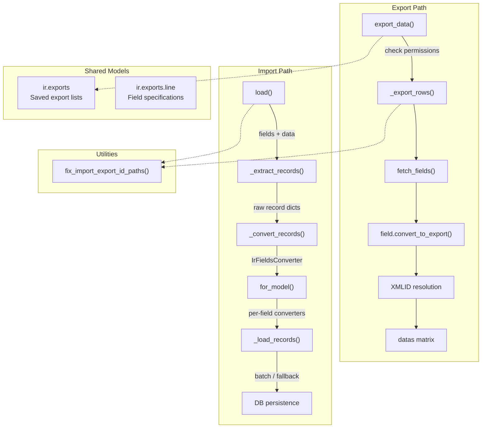

---
slug:24-data-import-and-export
blog_type:normal
---


Odoo 19.0 exposes a unified import/export subsystem rooted entirely in `BaseModel` — the ORM's foundational class. Every persistent model inherits two public entry points, `load()` and `export_data()`, which orchestrate a multi-stage pipeline of extraction, conversion, referencing, and batch persistence. Understanding this pipeline is essential for building reliable data migration tools, custom import wizards, or programmatic bulk operations that respect Odoo's access control, transactional guarantees, and field-type semantics.

Sources: [models.py](/odoo/orm/models.py#L894-L895), [models.py](/odoo/orm/models.py#L880-L892), [ir_exports.py](/odoo/addons/base/models/ir_exports.py#L7-L24)

## Architectural Overview

The import/export architecture follows a symmetric but inverted design: export traverses the ORM graph from records to a flat string matrix, while import reconstructs records from that matrix through extraction, conversion, and batch creation. Both pathways converge on a shared utility — `fix_import_export_id_paths()` — that normalizes dotted field notation (e.g. `partner_id.name`) into slash-separated path lists used throughout the pipeline.



Sources: [models.py](/odoo/orm/models.py#L145-L154), [models.py](/odoo/orm/models.py#L678-L892), [models.py](/odoo/orm/models.py#L894-L1075)

## The Export Pipeline

Export begins at `export_data()`, a thin permission-checked wrapper that normalizes field paths and delegates to `_export_rows()`. This method performs a recursive, cache-aware traversal of the record graph, fetching fields in bulk before iterating, which minimizes query overhead for nested relational paths.

Sources: [models.py](/odoo/orm/models.py#L880-L892)

### Permission Gate

`export_data()` enforces an access-control check before any data leaves the system. Only administrators or users in the `base.group_allow_export` group may invoke it. This is a hard gate — no field-level filtering occurs afterward, so the check is comprehensive rather than per-field.

Sources: [models.py](/odoo/orm/models.py#L881-L883)

### Recursive Row Generation — `_export_rows()`

The `_export_rows(fields)` method accepts a list of field-path lists (e.g. `[['partner_id'], ['partner_id', 'name'], ['id']]`) and returns a list-of-lists string matrix. Its design centers on three concerns: **cache pre-warming**, **multi-line expansion for relational fields**, and **lazy XMLID resolution**.

**Cache pre-warming.** Before iterating records, the method calls `fetch_fields()` which recursively walks the field paths and pre-fetches every required field into the record cache. For `properties` fields, it additionally populates a separate `export_properties_cache` dictionary keyed by property name, since property values are stored as JSON and require special expansion. This strategy eliminates N+1 queries even for deeply nested exports.

**Multi-line expansion.** Relational fields (many2one, one2many) expand into additional rows in the output matrix. When exporting a one2many like `order_line/product_id/name`, each order line produces a separate row — the first row's cells are merged into the parent record's main line, and subsequent rows are appended. Many2many fields behave differently in import-compatibility mode (see below), exporting as comma-separated values in a single cell rather than as multiple rows.

**Lazy XMLID resolution.** External IDs are not resolved during the main traversal. Instead, `_export_rows` stores `(model_name, record_id)` tuples in the matrix, deferring actual XMLID lookup to a post-processing step that groups by model and bulk-resolves via `__ensure_xml_id()`. This reduces database round-trips from O(records × fields) to O(unique_models).

Sources: [models.py](/odoo/orm/models.py#L678-L892)

### Import Compatibility Mode

When the `import_compat` context key is `True` (the default), export output is tailored for round-tripping through the import system. Two key behaviors emerge: `reference` fields export as `"model,id"` strings, and `many2many` fields export as comma-separated display names or XMLIDs in a single cell rather than multi-row expansion. This mode is what the web client's "Export" button uses.

Sources: [models.py](/odoo/orm/models.py#L760-L771)

### Saved Export Configurations — `ir.exports` / `ir.exports.line`

Export field selections can be persisted using the `ir.exports` model, which stores a name, a target resource (model name), and a one2many relation to `ir.exports.line`. Each line records a single field path (e.g. `partner_id/country_id/name`). These saved configurations allow users to recall consistent export layouts without re-selecting fields.

| Model | Field | Purpose |
|---|---|---|
| `ir.exports` | `name` | Human-readable export profile name |
| `ir.exports` | `resource` | Target model name (indexed for lookup) |
| `ir.exports` | `export_fields` | One2many to `ir.exports.line` |
| `ir.exports.line` | `name` | Dot-separated field path string |
| `ir.exports.line` | `export_id` | Many2one back-reference to parent export |

Sources: [ir_exports.py](/odoo/addons/base/models/ir_exports.py#L7-L24)

## The Import Pipeline

Import is orchestrated by the `load(fields, data)` classmethod on `BaseModel`. It accepts a list of field paths and a row-major data matrix, returning a dictionary containing created IDs, validation messages, and a `nextrow` pointer for chunked imports. The method wraps the entire operation in a database savepoint, enabling full rollback on unrecoverable errors.

Sources: [models.py](/odoo/orm/models.py#L894-L1075)

### Stage 1 — Record Extraction via `_extract_records()`

`_extract_records(field_paths, data)` is a generator that yields `(record_dict, info)` tuples. It transforms the flat matrix into a structured representation where relational fields contain nested sub-record lists. The algorithm handles a subtle challenge: **multi-row records**.

When a row contains only one2many values and no top-level field values, it is treated as a continuation of the previous record's one2many data. The method uses `itertools.takewhile` to group these continuation rows, then recursively calls `_extract_records` on the comodel for each relational field. Properties fields receive special handling — their dot-separated paths (e.g. `properties/type`) are pre-parsed, validated against the property definition, and reassembled into property dictionaries before yielding.

Sources: [models.py](/odoo/orm/models.py#L1075-L1197)

### Stage 2 — Record Conversion via `_convert_records()`

`_convert_records(records)` takes the extracted record dicts and converts their string values into database-compatible types. It creates a field converter via `IrFieldsConverter.for_model()` and applies it to each record, collecting warnings and errors through a callback-based logging system. Each yielded result is a triplet: `(database_id, external_id, converted_record)`.

The conversion phase also resolves record identity. If a record provides an `.id` field, the system validates that the database ID exists. If it provides an `id` field (external ID), the system will attempt to look up or create the corresponding record during the flush phase.

Sources: [models.py](/odoo/orm/models.py#L1197-L1252)

### Stage 3 — Batch Persistence

`load()` accumulates converted records into a `batch` list and flushes them periodically. The `flush()` function attempts batch creation via `_load_records()` within a nested savepoint. If batch creation fails (e.g., due to a constraint violation affecting only some rows), it falls back to record-by-record creation. This two-phase strategy balances throughput with error granularity.

Error isolation is precise: each record-by-record attempt gets its own savepoint. On failure, the savepoint is rolled back (preserving transaction integrity) and the error message is enriched with contextual information — row number, field name, and the problematic value. After 10 errors with an error rate exceeding 10%, import halts to prevent flooding the user with unhelpful output.

Sources: [models.py](/odoo/orm/models.py#L945-L1050)

## Field Conversion Engine — `IrFieldsConverter`

The `ir.fields.converter` abstract model is the heart of import type coercion. It implements a strategy pattern where converter methods follow the naming convention `_str_to_<fieldtype>`. The `to_field()` method resolves the appropriate converter using `getattr(self, '_str_to_%s' % field.type)` and returns a partially applied callable. The `for_model()` method composes all field converters into a single function that transforms an entire record dict in one pass.

Sources: [ir_fields.py](/odoo/addons/base/models/ir_fields.py#L44-L206)

### Record Referencing — `db_id_for()`

Relational fields during import must resolve string references to actual database IDs. The `db_id_for()` method handles three reference modes defined by `REFERENCING_FIELDS = {None, 'id', '.id'}`:

| Subfield | Reference Type | Resolution Strategy |
|---|---|---|
| `None` | Display name / name | `name_search(operator='=')` or `name_create()` if enabled |
| `id` | External ID (XMLID) | Qualified lookup in `ir.model.data`, prefixed with `_import_current_module` if unqualified |
| `.id` | Database ID | Direct `int()` parse + `exists()` check |

Before resolution, `db_id_for()` calls `flush()` to ensure any previously queued records are persisted — this is critical when importing interdependent records where a later row references a record created by an earlier row. The method also respects `import_set_empty_fields` and `import_skip_records` context keys, allowing the web client to distinguish between "clear this field" and "skip this record entirely."

Sources: [ir_fields.py](/odoo/addons/base/models/ir_fields.py#L16-L17), [ir_fields.py](/odoo/addons/base/models/ir_fields.py#L478-L594)

### Type-Specific Converters

The converter implements specialized methods for each Odoo field type, each handling the specific parsing rules and locale considerations:

**Boolean** (`_str_to_boolean`): Accepts locale-translated values (`yes`/`no`, `true`/`false` in the user's language) via a cached translation lookup, with case-insensitive matching.

**Date/Datetime** (`_str_to_date`, `_str_to_datetime`): Parses multiple format strings in sequence. Datetime conversion additionally applies the user's timezone input preference (`_input_tz()`), converting from the import timezone to UTC.

**Selection** (`_str_to_selection`): Attempts untranslated value matching first, then falls back to translated label matching against the field's selection options.

**Many2One** (`_str_to_many2one`): Expects a single-element list containing a subfield reference, resolved through `db_id_for()`.

**Many2Many** (`_str_to_many2one`): Comma-splits the reference value, resolves each token independently, and returns either `Command.set()` or `Command.link()` commands depending on the `update_many2many` context flag.

**One2Many** (`_str_to_one2many`): The most complex converter — it recursively calls `for_model()` on the comodel with a nested `parent_fields_hierarchy` context to track the field path for error attribution. Each sub-record is converted independently, yielding either `Command.create()`, `Command.link()`, or `Command.update()` depending on whether a reference was found.

Sources: [ir_fields.py](/odoo/addons/base/models/ir_fields.py#L309-L477), [ir_fields.py](/odoo/addons/base/models/ir_fields.py#L644-L741)

### Error Attribution and Field Path Tracking

The converter maintains a `parent_fields_hierarchy` context key that tracks the nested field path during one2many recursion. When a conversion error occurs deep in the hierarchy, `_get_import_field_path()` reconstructs the full dotted path (e.g. `order_line/product_id/name`) to attribute the error to the correct column in the import UI. This mechanism is critical for usability — without it, errors in nested one2many fields would appear against the wrong column.

Sources: [ir_fields.py](/odoo/addons/base/models/ir_fields.py#L61-L95)

## Field Path Normalization — `fix_import_export_id_paths()`

Both import and export share a single utility for normalizing field path strings. The function handles two ambiguities in Odoo's import/export notation: `.id` (database identifier) must be disambiguated from property field paths (also using dots), and `:id` (external identifier) uses colon notation in the web client.

The function applies two regex substitutions: first, it inserts a `/` separator before `.id` when not already preceded by one (`re.sub(r'([^/])\.id', r'\1/.id', fieldname)`), then replaces `:id` with `/id`. The result is then split on `/` to produce the canonical path list used throughout the pipeline. For example, `partner_id.id` becomes `['partner_id', '.id']` while `partner_id/.id` (already normalized) passes through unchanged.

Sources: [models.py](/odoo/orm/models.py#L145-L154)

## Programmatic Usage Patterns

### Exporting Records

```python
# Export selected partners with nested field paths
partners = env['res.partner'].search([('country_id', '!=', False)])
result = partners.export_data([
    'name', 'email', 'phone',
    'country_id/name',
    'country_id/code',
    'id',  # external ID
])
# result['datas'] is a list-of-lists string matrix
```

Sources: [models.py](/odoo/orm/models.py#L880-L892)

### Importing Records

```python
# Import partners from a data matrix
fields = ['name', 'email', 'country_id/id']
data = [
    ['Acme Corp', 'contact@acme.com', 'base.us'],
    ['Global Tech', 'info@globaltech.com', 'base.be'],
]
result = env['res.partner'].with_context(
    mode='init',
    module='my_module',
).load(fields, data)
# result = {'ids': [1, 2], 'messages': [], 'nextrow': 0}
```

Sources: [models.py](/odoo/orm/models.py#L894-L1075)

### Context Keys for Import Behavior

| Context Key | Default | Effect |
|---|---|---|
| `import_compat` | `True` | Enables import-compatible export format |
| `mode` | `'init'` | Import mode: `init` (create), `update` (upsert) |
| `module` | `'__import__'` | Module prefix for unqualified external IDs |
| `noupdate` | `False` | Mark created XMLIDs as non-updatable |
| `_import_limit` | `∞` | Maximum rows to process (for chunked imports) |
| `_import_current_module` | — | Active module for XMLID qualification |
| `import_flush` | — | Flush callback injected by `load()` |
| `import_set_empty_fields` | `[]` | Field paths that should be cleared on empty value |
| `import_skip_records` | `[]` | Field paths whose empty values skip the record |
| `update_many2many` | — | Use `Command.link` instead of `Command.set` for m2m |
| `name_create_enabled_fields` | `{}` | Fields where `name_create` is allowed during import |

<CgxTip>
The `import_flush` context key is not set by external callers — it is injected by `load()` itself to give `db_id_for()` the ability to force persistence of previously queued batch records before resolving references. This ensures referential integrity when row N references a record created at row N-5.
</CgxTip>

<CgxTip>
The `_extract_records()` generator uses a `limit` parameter (sourced from `_import_limit` context) to support chunked imports. When `nextrow` is non-zero in the return value, the caller should re-invoke `load()` with the data matrix starting at that offset.
</CgxTip>

Sources: [models.py](/odoo/orm/models.py#L915-L920), [ir_fields.py](/odoo/addons/base/models/ir_fields.py#L497-L498), [ir_fields.py](/odoo/addons/base/models/ir_fields.py#L569-L575)

## Next Steps

This page covers the ORM-level import/export primitives. To understand how these are wired into the HTTP layer, see [JSON-RPC and HTTP Dispatchers](16-json-rpc-and-http-dispatchers). For the field types these converters target, consult [Field Types and Definitions](10-field-types-and-definitions). To understand how record identities (XMLIDs) are managed across modules, see [Module Loading and Registry](17-module-loading-and-registry). For access control considerations during exports, see [Security and Access Control](23-security-and-access-control).