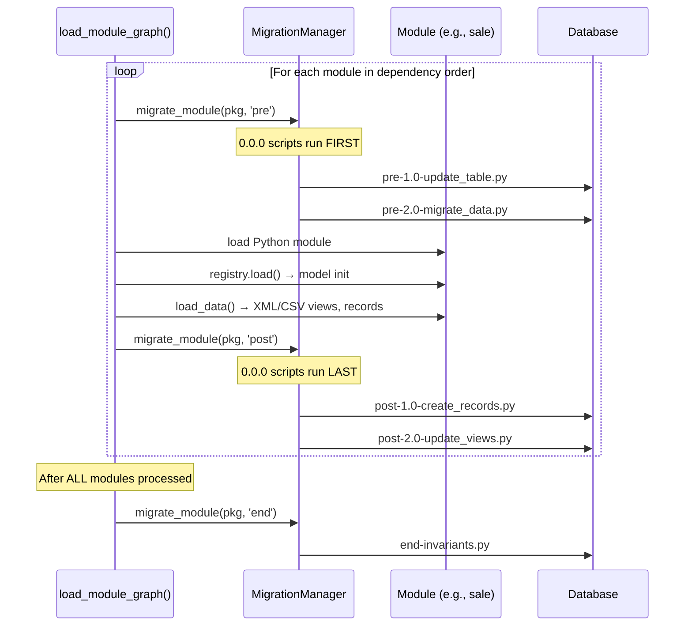
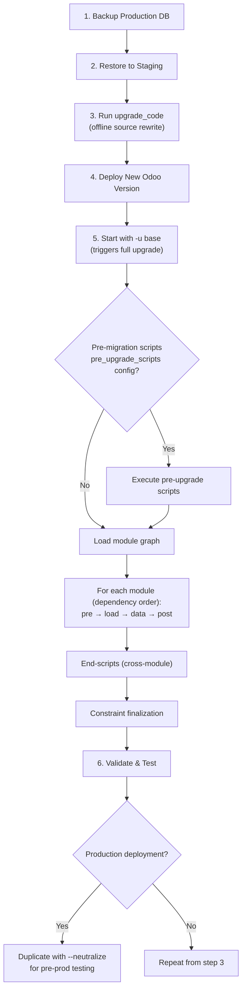

---
slug:25-upgrade-and-migration-framework
blog_type:normal
---

Odoo's upgrade and migration framework is a dual-layer system that handles both **database schema evolution** and **source code adaptation** when transitioning between versions. It is architecturally divided into a runtime migration engine that executes during module loading, and an offline source-code transformation pipeline that rewrites addon code to match new API contracts. Understanding this separation is essential for anyone maintaining custom modules across major Odoo releases or performing production database upgrades.

```mermaid
graph TB
    subgraph "Offline Pipeline"
        UC["odoo-bin upgrade_code<br/>CLI Command"]
        UPG["upgrade_code/*.py<br/>Transformation Scripts"]
        FM["FileManager<br/>& FileAccessor"]
        UC -->|"selects by version range"| UPG
        UPG -->|"reads/writes via"| FM
        FM -->|"lazy read, write on dirty"| ADDONS["Addon Source Files"]
    end

    subgraph "Runtime Pipeline"
        CLI["odoo-bin -u / -d<br/>Server Start"]
        LM["load_modules()<br/>modules/loading.py"]
        MM["MigrationManager<br/>modules/migration.py"]
        DB["PostgreSQL<br/>Database"]
        CLI -->|"update_module=True"| LM
        LM -->|"instantiates"| MM
        MM -->|"pre/post/end scripts"| DB
    end

    subgraph "Safety Layer"
        NEU["neutralize<br/>modules/neutralize.py"]
        DUP["exp_duplicate_database<br/>service/db.py"]
        RST["restore_db<br/>service/db.py"]
        DUP -->|"neutralize_database=True"| NEU
        RST -->|"neutralize_database=True"| NEU
    end
```

## Runtime Migration: The Module Upgrade Engine

When Odoo starts with `-u` or `--update` flags (or when `update_module=True` is passed programmatically), the `load_modules()` function in [loading.py](/odoo/modules/loading.py#L340-L349) orchestrates the entire upgrade lifecycle. The process follows a five-step pipeline that ensures dependencies are satisfied before any module-level migration executes, and that end-scripts run only after every module in the graph has been processed.

### The Five-Step Loading Sequence

The upgrade proceeds through carefully ordered phases within `load_modules()`:

| Step | Phase | Key Operation | Source |
|------|-------|---------------|--------|
| 1 | Base Load | Load `base` module, compute dependency graph | [loading.py#L383-L412](/odoo/modules/loading.py#L383-L412) |
| 2 | State Marking | Mark modules for install/upgrade via `button_upgrade()` | [loading.py#L423-L448](/odoo/modules/loading.py#L423-L448) |
| 3 | Module Graph | Iteratively load remaining modules with `load_module_graph()` | [loading.py#L450-L468](/odoo/modules/loading.py#L450-L468) |
| 3.5 | End Scripts | Execute all `end-` migration scripts after graph completion | [loading.py#L497-L501](/odoo/modules/loading.py#L497-L501) |
| 4–5 | Cleanup | Finalize constraints, uninstall removed modules | [loading.py#L509-L539](/odoo/modules/loading.py#L509-L539) |

Within **Step 3**, `load_module_graph()` at [loading.py#L115-L314](/odoo/modules/loading.py#L115-L314) iterates over every module in the dependency graph and, for each module marked as `to upgrade`, runs the complete per-module migration cycle: pre-migration → model loading → data loading → post-migration → hook execution.

### MigrationManager: Discovery and Execution

The `MigrationManager` class in [migration.py#L58-L88](/odoo/modules/migration.py#L58-L88) is the core engine for discovering and executing database migration scripts. It scans three distinct script locations per module and organizes them by target version:

| Script Location | Path Pattern | Description |
|----------------|---------------|-------------|
| Module `migrations/` | `{module}/migrations/{version}/{stage}-{name}.py` | Standard per-module migrations |
| Module `upgrades/` | `{module}/upgrades/{version}/{stage}-{name}.py` | Odoo internal upgrade scripts |
| Server upgrade path | `odoo/upgrade/{module}/{version}/{stage}-{name}.py` | Server-version-specific scripts |

The discovery logic in `_get_files()` at [migration.py#L97-L147](/odoo/modules/migration.py#L97-L147) aggregates scripts from all three sources. Version strings are validated against the `VERSION_RE` regex at [migration.py#L31-L55](/odoo/modules/migration.py#L31-L55), which supports historical formats including `6.1`, multi-digit versions like `17.0`, SaaS channel identifiers like `saas~14.2`, and four-part versions like `9.0.1.1` (which are scoped to a specific server release). The special version `0.0.0` is recognized as a wildcard that runs on *any* version change.

### Script Execution Stages

Each migration script must expose a `migrate(cr, installed_version)` function with an exact signature validated at [migration.py#L250-L254](/odoo/modules/migration.py#L250-L254). The parameter names must be one of `(cr, version)`, `(cr, _version)`, `(_cr, version)`, or `(_cr, _version)`. The `exec_script()` function at [migration.py#L228-L257](/odoo/modules/migration.py#L228-L257) performs this validation dynamically using `inspect.signature()`.

The three execution stages have distinct semantics and ordering guarantees:

The `pre` stage runs before the module's models and data are loaded, making it ideal for schema changes that must precede ORM initialization. The `post` stage runs after data loading, suitable for data migration and record creation. The `end` stage is deferred until the entire module graph has been processed — this is critical for cross-module migrations that reference models defined in other addons.

### Version Comparison and Script Selection

The `migrate_module()` method at [migration.py#L149-L221](/odoo/modules/migration.py#L149-L221) applies a nuanced version comparison. The `compare()` function at [migration.py#L201-L214](/odoo/modules/migration.py#L201-L214) ensures that "major-less" scripts (e.g., version `2.0` without server prefix) are not re-executed when upgrading to a new Odoo major version. For instance, a script at version `2.0` written for Odoo 9.0.2.0 will not run again during a 9.0→10.0 upgrade because the module version component comparison prevents redundant execution.

## Offline Source Code Migration

The `upgrade_code` CLI command provides an automated, best-effort system for rewriting addon source files to conform to new API patterns. Unlike database migrations that run at server startup, source code migrations execute offline before deployment.

### The upgrade_code CLI

Defined in [upgrade_code.py#L175-L230](/odoo/cli/upgrade_code.py#L175-L230), the `UpgradeCode` command scans addon paths for files matching specified extensions and applies transformation scripts from the `odoo/upgrade_code/` directory. Each script follows a naming convention `{version}-{name}.py` and exposes an `upgrade(file_manager)` function.

| CLI Option | Description |
|-----------|-------------|
| `--script NAME` | Run a single named script |
| `--from VERSION` | Lower bound of script versions to include (inclusive) |
| `--to VERSION` | Upper bound of script versions to include (defaults to current release) |
| `--addons-path PATH` | Comma-separated addon directories |
| `--glob PATTERN` | File glob pattern (default `**/*`) |
| `--dry-run` | List files that would change, without writing |

The script selection logic at [upgrade_code.py#L131-L138](/odoo/cli/upgrade_code.py#L131-L138) uses `parse_version()` to compare script filenames against the specified version range, loading only those that fall within `[from_version, to_version]`.

### FileManager and FileAccessor Architecture

The `FileManager` at [upgrade_code.py#L97-L128](/odoo/cli/upgrade_code.py#L97-L128) provides an iterable collection of `FileAccessor` objects, each representing a source file. Key design characteristics:

- **Lazy content loading**: File content is read on first access via the `content` property at [upgrade_code.py#L84-L88](/odoo/cli/upgrade_code.py#L84-L88), avoiding unnecessary I/O for files that transformation scripts skip.
- **Dirty tracking**: The setter at [upgrade_code.py#L90-L94](/odoo/cli/upgrade_code.py#L90-L94) compares new content against the original and sets a `dirty` flag only when changes occur. Only dirty files are written back at [upgrade_code.py#L165-L170](/odoo/cli/upgrade_code.py#L165-L170).
- **Supported extensions**: `.py`, `.js`, `.css`, `.scss`, `.xml`, `.csv`, `.po`, `.pot` — defined at [upgrade_code.py#L43](/odoo/cli/upgrade_code.py#L43).

The `migrate()` function at [upgrade_code.py#L141-L172](/odoo/cli/upgrade_code.py#L141-L172) orchestrates the full pipeline: it instantiates a `FileManager`, runs each selected script's `upgrade()` function against it, and then writes back only the files that were modified.

### Transformation Scripts Catalog

The `odoo/upgrade_code/` directory contains versioned scripts targeting specific API changes. Each demonstrates a different transformation technique:

| Script | Target Change | Technique |
|--------|--------------|-----------|
| `17.5-00-example.py` | Educational reference | Regex-based find/replace with filtering |
| `18.1-02-route-jsonrpc.py` | `type="json"` → `type="jsonrpc"` | Simple string replacement in controller files |
| `18.2-00-l10n-translate.py` | Localization translation changes | AST/XML processing |
| `18.5-00-domain-dynamic-dates.py` | Domain date expression migration | Full AST transformation with `ast.NodeTransformer` |
| `18.5-00-deprecated-properties.py` | Deprecated property removal | Pattern matching |
| `18.5-00-no-tax-tag-invert.py` | Tax tag sign handling | CSV parsing + XML tree manipulation |

The example script at [17.5-00-example.py](/odoo/upgrade_code/17.5-00-example.py#L1-L77) is extensively documented with Python regex best practices, serving as a template for writing new transformation scripts. A more sophisticated example is `18.5-00-domain-dynamic-dates.py`, which uses `ast.NodeTransformer` subclasses at [18.5-00-domain-dynamic-dates.py#L24-L200](/odoo/upgrade_code/18.5-00-domain-dynamic-dates.py#L24-L200) to parse Python AST nodes, transform `context_today()` and `relativedelta()` calls into Odoo's domain date offset syntax, and `unparse()` the result back to source code.

<CgxTip>
The `upgrade_code` scripts are explicitly **best-effort** tools (documented at [upgrade_code.py#L27-L29](/odoo/cli/upgrade_code.py#L27-L29)). They automate heavy-lifting for common patterns but cannot handle every edge case. Always run with `--dry-run` first and review diffs before deploying rewritten code to production.
</CgxTip>

## Database Neutralization

Neutralization is the process of sanitizing a production database copy so it can be used safely in non-production environments — preventing outgoing emails, disabling scheduled actions, and obfuscating sensitive data. The framework is split between a service layer and a CLI interface.

### Architecture

The `neutralize_database()` function at [neutralize.py#L36-L41](/odoo/modules/neutralize.py#L36-L41) queries `ir_module_module` for all installed modules, then for each module attempts to load and execute a SQL file at `{module}/data/neutralize.sql`. The `get_installed_modules()` query at [neutralize.py#L18-L24](/odoo/modules/neutralize.py#L18-L24) fetches modules in `installed`, `to upgrade`, or `to remove` states. The `get_neutralization_queries()` generator at [neutralize.py#L27-L33](/odoo/modules/neutralize.py#L27-L33) uses `contextlib.suppress(FileNotFoundError)` to gracefully skip modules without neutralization scripts.

The CLI command at [neutralize.py#L14-L54](/odoo/cli/neutralize.py#L14-L54) supports a `--stdout` flag that outputs the complete SQL transaction (`BEGIN; ... COMMIT;`) without executing it, enabling review and auditing of neutralization queries before they touch a database.

### Integration Points

Neutralization is wired into two database service operations:

- **`exp_duplicate_database()`** at [service/db.py#L184-L211](/odoo/service/db.py#L184-L211): When `neutralize_database=True`, the duplicate's registry is loaded and `neutralize_database()` is called within a cursor context, after generating a new `dbuuid`.
- **`restore_db()`** at [service/db.py#L330-L382](/odoo/service/db.py#L330-L382): Same pattern — after loading the dump and optionally regenerating the UUID, neutralization runs if requested.

Both the `load` and `duplicate` CLI subcommands in [cli/db.py](/odoo/cli/db.py#L211-L243) expose `--neutralize` flags that flow through to these service functions.

## Programmatic Migration Entry Points

For automated deployment pipelines, Odoo provides direct programmatic access to the migration system. The `exp_migrate_databases()` function at [service/db.py#L413-L418](/odoo/service/db.py#L413-L418) migrates a list of databases by creating a new `Registry` with `update_module=True` and `upgrade_modules={'base'}`. This triggers the full five-step loading sequence described above, running all applicable migration scripts for every installed module.

The `load_modules()` function accepts granular control parameters at [loading.py#L340-L349](/odoo/modules/loading.py#L340-L349):

| Parameter | Purpose |
|-----------|---------|
| `upgrade_modules` | Explicit set of modules to upgrade (forces state to `to upgrade`) |
| `install_modules` | Modules to install (filters to `uninstalled` state) |
| `reinit_modules` | Modules to reinitialize, including downstream dependents |
| `update_module` | Master switch — must be `True` for any state changes to take effect |

<CgxTip>
The `pre_upgrade_scripts` configuration option, referenced at [loading.py#L390-L391](/odoo/modules/loading.py#L390-L391), allows injecting arbitrary Python migration scripts that run *before* any module processing begins. These execute against the base module's installed version, providing a mechanism for database-wide schema fixes that must precede all module-level migrations.
</CgxTip>

## End-to-End Upgrade Workflow

Combining all components, a complete upgrade from version N to N+1 follows this recommended sequence:

The runtime migration engine (Steps 5–6) and the offline source transformation (Step 3) are independent concerns: source code must be compatible with the target Odoo version *before* the server starts, while database migration scripts execute *during* module loading on the target version. This separation allows for iterative development where source code migrations can be tested in isolation using `--dry-run`, and database migrations can be validated against a neutralized copy before touching production data.

For further understanding of how modules are loaded into the registry and how the dependency graph is constructed, see [Module Loading and Registry](17-module-loading-and-registry). For details on the HTTP request lifecycle that follows module initialization, refer to [WSGI Application and Request Lifecycle](13-wsgi-application-and-request-lifecycle).