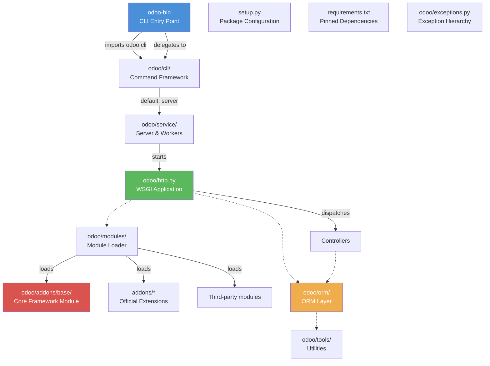
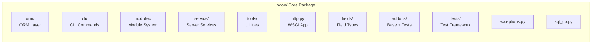

---
slug:3-project-structure-and-layout
blog_type:normal
---


Understanding how the Odoo 19 codebase is organized is the first essential step before diving into development. This page provides a comprehensive map of the repository, explaining the purpose of each top-level directory and key file so you can navigate the codebase with confidence from day one.

## High-Level Architecture

Before examining individual directories, it helps to visualize how the major components relate to one another. Odoo is fundamentally a Python package (`odoo/`) with an entry-point script (`odoo-bin`), a module/addon ecosystem split between two locations, and supporting packaging infrastructure at the root level.



Sources: [odoo-bin](odoo-bin#L1-L7), [command.py](odoo/cli/command.py#L109-L139), [release.py](odoo/release.py#L1-L42)

## Root Directory Overview

The repository root contains the entry-point script, packaging configuration, dependency specifications, and meta files. Here is the complete layout at a glance:

```
odoo/                          # Repository root
├── odoo-bin                   # Main CLI entry point (shebang script)
├── setup.py                   # Python package setup/metadata
├── setup.cfg                  # Linting & install configuration
├── setup/                     # Packaging scripts & WSGI examples
├── requirements.txt           # Pinned dependency versions per Python
├── MANIFEST.in                # sdist packaging manifest
├── ruff.toml                  # Ruff linter/formatter configuration
├── odoo/                      # Core framework Python package
├── addons/                    # Official first-party modules
├── debian/                    # Debian package build files
├── doc/                       # Documentation & legal (minimal in repo)
├── CONTRIBUTING.md            # Contribution guidelines
├── COPYRIGHT                  # Copyright notice
├── LICENSE                    # LGPL-3 license text
├── README.md                  # Project README
└── SECURITY.md                # Security reporting policy
```

Sources: [README.md](README.md), [LICENSE](LICENSE), [MANIFEST.in](MANIFEST.in#L1-L7)

## Entry Point: `odoo-bin`

The `odoo-bin` file at the repository root is the primary way to start Odoo. It is a lightweight Python 3 shebang script that simply delegates to the CLI framework:

```python
#!/usr/bin/env python3
import odoo.cli
if __name__ == "__main__":
    odoo.cli.main()
```

When you run `./odoo-bin` or `python3 odoo-bin`, it imports `odoo.cli.command.main()`, which parses command-line arguments, determines which subcommand to run (defaulting to `server`), and dispatches accordingly. The CLI system supports both built-in commands (from `odoo/cli/`) and addon-provided commands (discovered via `addons/*/cli/*.py`). For example, `./odoo-bin scaffold my_module` invokes the scaffold command, while running without arguments launches the HTTP server.

Sources: [odoo-bin](odoo-bin#L1-L7), [command.py](odoo/cli/command.py#L109-L139), [command.py](odoo/cli/command.py#L59-L90)

## The `odoo/` Core Package

The `odoo/` directory is the heart of the framework. It is a Python namespace package containing every runtime component: the ORM, HTTP layer, module system, CLI commands, tools, and the built-in base module. Below is a detailed breakdown of its subdirectories and key files.

Sources: [release.py](odoo/release.py#L22-L42), [init.py](odoo/init.py#L1-L44)

### Package Initialization and Version

| File | Purpose |
|------|---------|
| `odoo/release.py` | Defines `version_info`, series (`19.0`), version string, Python range (`3.10`–`3.13`), and PostgreSQL minimum (`13`) |
| `odoo/init.py` | First file loaded on `import odoo`; validates Python version, applies monkey patches, exposes `SUPERUSER_ID`, `Command`, `_` and `_lt` shortcuts |
| `odoo/__main__.py` | Enables `python -m odoo` invocation; delegates to `odoo.cli.command.main()` |
| `odoo/exceptions.py` | Defines the core exception hierarchy (`UserError`, `AccessDenied`, `AccessError`, `MissingError`, `ValidationError`, `ConcurrencyError`, etc.) understood by the RPC layer |

The `init.py` file is particularly important: it sets custom garbage collection thresholds, applies library monkey patches as early as possible, and re-exports key symbols (`odoo.Command`, `odoo.SUPERUSER_ID`, `odoo._`) to the top-level `odoo` namespace for convenient access throughout the codebase.

Sources: [release.py](odoo/release.py#L22-L42), [init.py](odoo/init.py#L1-L44), [exceptions.py](odoo/exceptions.py#L1-L138)

### Core Subdirectories



Sources: [release.py](odoo/release.py#L22-L42)

### `odoo/orm/` — The ORM Layer

This is the most architecturally significant subdirectory. It contains the entire Object-Relational Mapping system that powers all database interactions in Odoo. The ORM translates Python model definitions into PostgreSQL table operations and provides the recordset abstraction.

| File | Responsibility |
|------|---------------|
| `models.py` | Core `Model`, `AbstractModel`, and `Model` metaclass definitions |
| `model_classes.py` | Base model class hierarchy |
| `models_transient.py` | Transient models (wizard-like auto-expiring records) |
| `fields.py` | Field descriptor base and registration |
| `fields_numeric.py` | `Integer`, `Float`, `Monetary` field types |
| `fields_textual.py` | `Char`, `Text`, `Html` field types |
| `fields_relational.py` | `Many2one`, `One2many`, `Many2many` field types |
| `fields_selection.py` | `Selection` and `Reference` field types |
| `fields_binary.py` | `Binary` field handling |
| `fields_temporal.py` | `Date`, `Datetime` field types |
| `fields_properties.py` | Property fields (computed, stored) |
| `domains.py` | Search domain parsing and evaluation |
| `environments.py` | `Environment`, cache, and cursor management |
| `commands.py` | The `Command` namespace for relational write operations |
| `identifiers.py` | External ID / XML ID resolution (`ir.model.data`) |
| `registry.py` | Model registry management |
| `utils.py` | `SUPERUSER_ID` and shared utility functions |
| `decorators.py` | ORM method decorators (`depends`, `constrains`, `onchange`, etc.) |
| `table_objects.py` | Low-level SQL table introspection and DDL |
| `types.py` | Type aliases and enums for the ORM |

Sources: [models.py](odoo/orm/models.py), [commands.py](odoo/orm/commands.py), [environments.py](odoo/orm/environments.py)

### `odoo/http.py` — The WSGI Application

Despite being a single file rather than a directory, `odoo/http.py` is one of the largest and most critical files in the entire codebase (~2,870 lines). It implements the complete HTTP request lifecycle: from the WSGI entry point (`Application.__call__`) through static file serving, authentication, session management, request dispatching, CSRF protection, and response serialization.

The file also defines the `Controller` base class and the `@route` decorator that every web controller in Odoo uses. It includes the full dispatcher hierarchy (`HttpDispatcher`, `JsonRPCDispatcher`, `Json2Dispatcher`), session storage (`FilesystemSessionStore`), and the `Request`/`Response` wrapper classes around Werkzeug.

Sources: [http.py](odoo/http.py#L1-L128)

### `odoo/cli/` — Command-Line Interface

The CLI system uses a plugin architecture. Each file in `odoo/cli/` (except `__init__.py` and `templates/`) defines a `Command` subclass that auto-registers itself. The `main()` function in `command.py` resolves the subcommand name and delegates execution.

| File | Command | Description |
|------|---------|-------------|
| `command.py` | *(framework)* | `Command` base class, argument parsing, command discovery and dispatch |
| `server.py` | `server` | Starts the Odoo HTTP server (default command when no subcommand is given) |
| `scaffold.py` | `scaffold` | Generates a new module skeleton from templates |
| `shell.py` | `shell` | Opens an interactive Python shell with ORM access |
| `db.py` | `db` | Database management operations (create, drop, dump, restore) |
| `start.py` | `start` | Starts Odoo as a daemon |
| `help.py` | `help` | Displays help information |
| `module.py` | `module` | Module installation/update operations |
| `deploy.py` | `deploy` | Deployment-related commands |
| `upgrade_code.py` | `upgrade_code` | Runs pre-upgrade code scripts |
| `populate.py` | `populate` | Populates databases with demo/sample data |
| `cloc.py` | `cloc` | Counts lines of code |
| `neutralize.py` | `neutralize` | Strips custom code for testing purposes |
| `obfuscate.py` | `obfuscate` | Obfuscates module code |
| `i18n.py` | `i18n` | Internationalization and translation commands |
| `templates/` | *(shared)* | Jinja2 templates used by the scaffold command |

<CgxTip>
**CLI discovery is two-tiered**: Built-in commands live in `odoo/cli/*.py` and are always available. Addon commands are discovered at `addons/*/cli/*.py` at runtime, meaning any module can extend the CLI by dropping a Python file in its `cli/` subdirectory. This pattern is defined in `load_addons_commands()` in [command.py](odoo/cli/command.py#L68-L89).
</CgxTip>

Sources: [command.py](odoo/cli/command.py#L20-L66), [server.py](odoo/cli/server.py#L122-L128)

### `odoo/modules/` — Module System

This subdirectory handles everything related to discovering, loading, installing, and managing modules (also called "addons"). It implements the dependency graph resolution, registry construction, and upgrade framework.

| File | Responsibility |
|------|---------------|
| `module.py` | Module metadata parsing (`__manifest__.py`), state management |
| `module_graph.py` | Dependency graph construction and topological sorting |
| `loading.py` | Module installation, update, and uninstall orchestration |
| `db.py` | Database-level module state queries |
| `migration.py` | Migration script execution framework |
| `neutralize.py` | Customization stripping for clean testing |
| `registry/` | Registry construction and model loading from module manifests |

Sources: [modules/__init__.py](odoo/modules/__init__.py#L4-L5)

### `odoo/service/` — Server and RPC Services

The `service/` package implements the network protocols and RPC endpoints that allow clients (web browsers, mobile apps, external systems) to communicate with the Odoo server. Each file corresponds to a named RPC service.

| File | RPC Service | Purpose |
|------|-------------|---------|
| `server.py` | — | HTTP/WSGI server startup, prefork worker management |
| `common.py` | `common` | Authentication, version info, and generic RPC methods |
| `db.py` | `db` | Database creation, listing, duplication, and dump/restore over RPC |
| `model.py` | `object` | The `execute_kw` / `execute` RPC endpoint for ORM operations |
| `security.py` | *(internal)* | Password hashing, encryption, and security utilities |

When the Odoo server starts, it loads these services and registers their methods as RPC endpoints accessible via JSON-RPC and XML-RPC protocols.

Sources: [service/__init__.py](odoo/service/__init__.py#L10-L17)

### `odoo/tools/` — Utility Library

This is the largest subdirectory by file count and serves as Odoo's standard library extension. It contains over 40 utility modules covering everything from configuration parsing to PDF generation.

**Key modules for beginners to know:**

| File | Purpose |
|------|---------|
| `config.py` | Parses `odoo.conf` and CLI arguments into a global `config` object |
| `convert.py` | YAML/XML data file parsing (used in module `data/` declarations) |
| `sql.py` | SQL query builder and execution utilities |
| `safe_eval.py` | Safe Python expression evaluator (sandboxed `eval`) |
| `misc.py` | General-purpose helpers (smallest enclosing rectangle, HTML cleaning, etc.) |
| `translate.py` | Translation functions (`_()`, `_lt()`) and i18n tools |
| `cache.py` | In-memory cache utilities |
| `image.py` | Image resizing and optimization |
| `pdf/` | PDF rendering and manipulation |
| `mimetypes.py` | MIME type detection and mapping |
| `profiler.py` | Performance profiling tools |
| `populate.py` | Demo data generation utilities |
| `xml_utils.py` | XML parsing and manipulation helpers |

Sources: [tools/__init__.py](odoo/tools/__init__.py#L1-L21)

### `odoo/fields/` and `odoo/api/`

These two directories serve as import facades that re-export the ORM's field and API definitions to the top-level `odoo` namespace. When you write `from odoo import fields` or `from odoo import api`, these are the modules being loaded.

| Module | Re-exports |
|--------|-----------|
| `odoo/fields/__init__.py` | All field types from `odoo.orm.fields_*` |
| `odoo/api/__init__.py` | `Environment`, `EnvironmentManager`, `depends`, `constrains`, and other decorators |

Sources: [orm/models.py](odoo/orm/models.py)

### `odoo/addons/` — Base Module and Test Suites

The `odoo/addons/` directory contains the `base` module — the **mandatory kernel module** that every Odoo installation requires — along with a comprehensive set of test modules that verify framework behavior.

**The `base` module structure** is the canonical example of how every Odoo module should be organized:

```
odoo/addons/base/
├── __manifest__.py    # Module manifest (metadata, dependencies, data files)
├── __init__.py        # Python imports (models, controllers, etc.)
├── models/            # Python model definitions
├── views/             # XML view definitions
├── data/              # XML/CSV data files (records, demo data)
├── security/          # Access rights (groups, rules, record rules)
├── static/            # Web assets (JS, CSS, images)
├── tests/             # Module-specific tests
├── wizard/            # Transient model definitions (wizards)
├── report/            # Report templates and definitions
├── i18n/              # Translation files (.po)
└── rng/               # RelaxNG schemas for XML validation
```

The `__manifest__.py` file declares the module's name, version, category, dependencies, data files to load, and web asset bundles. The `base` module's manifest describes itself as "The kernel of Odoo, needed for all installation" and declares foundational data files like user groups, security rules, and core model views.

The remaining directories in `odoo/addons/` (prefixed with `test_`) are dedicated test modules covering specific framework areas: ORM operations, HTTP handling, inheritance, access rights, import/export, and more. These are not meant for production use.

Sources: [base/__manifest__.py](odoo/addons/base/__manifest__.py#L5-L12), [modules/module_graph.py](odoo/modules/module_graph.py)

### `odoo/tests/` — Test Framework

The `odoo/tests/` directory provides the testing infrastructure used by all test modules. It extends Python's `unittest` framework with Odoo-specific features like database transaction management, test tagging, and module lifecycle management.

| File | Purpose |
|------|---------|
| `common.py` | `BaseCase` and `TransactionCase` base classes for writing Odoo tests |
| `case.py` | Additional test case mixins (HTTP, mail, etc.) |
| `loader.py` | Test discovery and suite loading |
| `tag_selector.py` | Test tag filtering (`@tagged('slow', '-at_install')`) |
| `suite.py` | Custom test suite composition |
| `result.py` | Custom test result formatting |
| `form.py` | Form simulation helper for testing UI flows |
| `test_cursor.py` | Test cursor for database operations in test isolation |
| `test_module_operations.py` | Tests for module install/uninstall operations |

Sources: [tests/__init__.py](odoo/tests/__init__.py)

### `odoo/_monkeypatches/` — Library Compatibility Patches

This directory contains targeted patches to third-party libraries. These patches are applied during `odoo.init` to fix compatibility issues, adjust behavior for Odoo's needs, or optimize performance. Each file corresponds to a specific library: `werkzeug.py`, `lxml.py`, `psycopg2` (via `csv.py`), `docutils.py`, and others. This approach allows Odoo to maintain control over library behavior without forking upstream packages.

Sources: [init.py](odoo/init.py#L21-L26)

### Remaining Files in `odoo/`

| File | Purpose |
|------|---------|
| `sql_db.py` | Low-level PostgreSQL connection pooling and cursor management |
| `netsvc.py` | Legacy network service dispatcher (historical, minimal in v19) |
| `loglevels.py` | Custom logging level definitions |
| `import_xml.rng` | RelaxNG schema for XML data import validation |
| `osv/expression.py` | Legacy domain expression parser (wrapped by the modern ORM domains) |
| `upgrade/` | Framework for running post-upgrade data migration scripts |
| `upgrade_code/` | Pre-upgrade Python scripts for specific version transitions (e.g., `17.5-01-tree-to-list.py`) |

Sources: [sql_db.py](odoo/sql_db.py), [osv/expression.py](odoo/osv/expression.py)

## The `addons/` Directory

The top-level `addons/` directory is the default location for **official first-party Odoo modules** — the business applications that extend the framework into a full ERP system: CRM, Sales, Accounting, Inventory, HR, and dozens more. During a standard installation, the server scans this directory (along with `odoo/addons/`) to discover available modules.

The separation between `odoo/addons/` (framework-level base and tests) and `addons/` (application-level business modules) is deliberate: the core framework inside `odoo/` can function independently, while the business modules in `addons/` depend on `base` but extend it with domain-specific functionality.

<CgxTip>
**Third-party and custom modules should never be placed inside the repository.** Instead, use the `--addons-path` configuration option to point to an external directory. The CLI's `find_command()` function in [command.py](odoo/cli/command.py#L92-L106) uses the configured addons paths to discover both CLI commands and modules at runtime.
</CgxTip>

Sources: [server.py](odoo/cli/server.py#L46-L68), [command.py](odoo/cli/command.py#L68-L89)

## Packaging and Configuration Files

### `setup.py` — Package Metadata

The `setup.py` file registers Odoo as a Python package for `pip install`. It loads version metadata from `odoo/release.py`, declares all runtime dependencies (40+ packages including `psycopg2`, `werkzeug`, `lxml`, `Jinja2`, `gevent`, `reportlab`, `babel`, and more), and defines an optional `ldap` extra for LDAP authentication support. The `scripts` entry points to `setup/odoo`, which is the installed equivalent of `odoo-bin`.

Sources: [setup.py](setup.py#L10-L78)

### `requirements.txt` — Pinned Dependencies

Unlike most projects, Odoo pins exact dependency versions in `requirements.txt`, with **version constraints per Python version** using environment markers. This is because Odoo officially supports multiple Python versions (3.10 through 3.13) and must ensure compatible library versions for each. For example, `Werkzeug` is pinned to `2.0.2` for Python ≤3.10, `2.2.2` for 3.11, and `3.0.1` for ≥3.12. All pinned versions correspond to packages distributed in Ubuntu 24.04 and Debian 12.

Sources: [requirements.txt](requirements.txt#L1-L101)

### `ruff.toml` — Code Quality Configuration

Odoo uses **Ruff** (v0.15.0+) as its primary linter and formatter, replacing the historical flake8 setup. Key configuration choices visible in `ruff.toml`:

| Setting | Value | Meaning |
|---------|-------|---------|
| `target-version` | `py310` | Minimum Python syntax version |
| `lint.isort.section-order` | `future, standard-library, third-party, first-party, local-folder` | Custom import ordering per Odoo's coding guidelines |
| `lint.isort.known-first-party` | `odoo` | Treat `odoo` as a first-party import |
| `lint.isort.known-local-folder` | `odoo.addons` | Treat addon imports as local-folder |

The configuration enables a comprehensive set of linting rules (BLE, C, COM, E, F, G, I, PLC, PLE, PLW, RUF, SIM, UP, etc.) with intentional ignores for rules like `E501` (line length) and `C901` (complexity), reflecting Odoo's practical coding style.

Sources: [ruff.toml](ruff.toml#L1-L85)

### `setup.cfg` — Additional Configuration

The `setup.cfg` file configures optimized installation (`optimize=1` for `.pyc` bytecode) and legacy flake8 settings for RST documentation validation, defining recognized reStructuredText roles and directives used in docstrings throughout the codebase.

Sources: [setup.cfg](setup.cfg#L1-L35)

## Supporting Directories

| Directory | Purpose |
|-----------|---------|
| `setup/` | Packaging automation scripts (`package.py`), platform-specific package definitions (Debian, Fedora, Windows), WSGI example configuration (`odoo-wsgi.example.py`), and the installed CLI script (`setup/odoo`) |
| `debian/` | Complete Debian package build infrastructure: control file, changelog, init scripts, logrotate config, and post-install hooks |
| `doc/` | Minimal in-repo documentation; primarily the CLA (Contributor License Agreement). User-facing documentation lives in a separate repository |

Sources: [setup/](setup/), [debian/](debian/)

## The Module Anatomy Pattern

Every Odoo module — whether in `odoo/addons/`, `addons/`, or an external path — follows the same structural convention. Understanding this pattern is essential because it repeats across every module in the ecosystem:

```
my_module/
├── __manifest__.py      # REQUIRED — Module metadata and declarations
├── __init__.py          # REQUIRED — Python package initialization
├── models/              # ORM model definitions (Python classes)
│   ├── __init__.py
│   └── my_model.py
├── views/               # QWeb/XML view definitions
├── data/                # Data records (XML, CSV)
├── security/            # Access rights and record rules
│   ├── ir.model.access.csv
│   └── my_module_security.xml
├── static/              # Web assets
│   ├── src/             # JavaScript source
│   ├── css/             # Stylesheets
│   ├── img/             # Images and icons
│   └── description/     # Module icon and description
├── tests/               # Module-specific test files
├── wizard/              # Transient models (multi-step operations)
├── report/              # Report templates (QWeb PDF)
└── i18n/                # Translation (.po) files
```

The `__manifest__.py` file is the module's identity card — it declares the module name, version, summary, category, dependencies, data files to load, web asset bundles, and installation/uninstallation hooks. The `__init__.py` file must import all model files so the ORM can discover and register them.

## Runtime Path Resolution

When Odoo starts, it resolves module paths in a specific order. Understanding this helps avoid confusion about where modules should be placed:

1. **`odoo/addons/`** — Always included; contains `base` and test modules
2. **`addons/`** — Default location for official application modules
3. **`--addons-path`** — Additional directories specified via CLI argument or `odoo.conf`
4. **Environment variable** — The `ODOO_ADDONS_PATH` environment variable can override defaults

The CLI command `find_command()` in `command.py` uses these same paths to discover addon-provided CLI extensions, scanning for `cli/*.py` files within each module directory.

Sources: [command.py](odoo/cli/command.py#L68-L106), [server.py](odoo/cli/server.py#L46-L68)

## Quick Reference: File-to-Feature Map

| What you want to do | Where to look |
|-------------------|--------------|
| Understand the CLI entry point | [odoo-bin](odoo-bin#L1-L7) → [command.py](odoo/cli/command.py#L109-L139) |
| Start the HTTP server | [cli/server.py](odoo/cli/server.py#L95-L119) → [service/server.py](odoo/service/server.py) |
| Trace an HTTP request | [http.py](odoo/http.py#L1-L128) (full WSGI lifecycle documented in module docstring) |
| Define a new model | `odoo/orm/models.py` + any module's `models/` directory |
| Add a new field type | `odoo/orm/fields_*.py` |
| Register a web route | [http.py](odoo/http.py#L676-L725) (`Controller` class + `@route` decorator) |
| Parse a module manifest | [modules/module.py](odoo/modules/module.py) |
| Write a test | [tests/common.py](odoo/tests/common.py) → your module's `tests/` directory |
| Read/write config | [tools/config.py](odoo/tools/config.py) |
| Handle exceptions | [exceptions.py](odoo/exceptions.py#L1-L138) |
| Connect to PostgreSQL | [sql_db.py](odoo/sql_db.py) |

## Where to Go Next

Now that you understand the project layout, you're ready to go deeper into specific subsystems. Here is a recommended reading progression based on your goals:

- **If you want to interact with Odoo via the command line**: Continue to [CLI Commands Reference](4-cli-commands-reference) for a detailed walkthrough of every built-in command and its options.
- **If you want to understand how all these components fit together architecturally**: Jump ahead to [Architecture Overview](8-architecture-overview) for the big-picture view of request flow, module loading, and deployment.
- **If you're ready to start building something**: The [Module Scaffolding](18-module-scaffolding) page shows how the `scaffold` command generates a new module using the templates in [cli/templates/](odoo/cli/templates/), putting the module anatomy pattern into practice.
- **If you're curious about the database layer**: The [BaseModel and Model Hierarchy](9-basemodel-and-model-hierarchy) page explains how classes in `odoo/orm/` are constructed and registered.