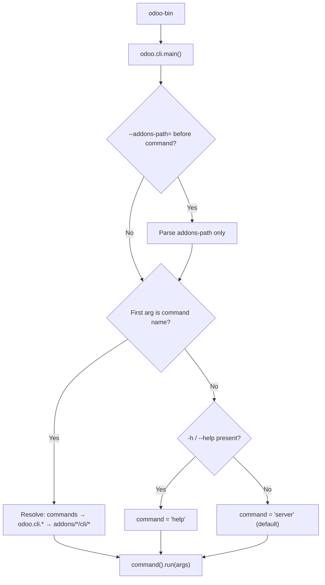
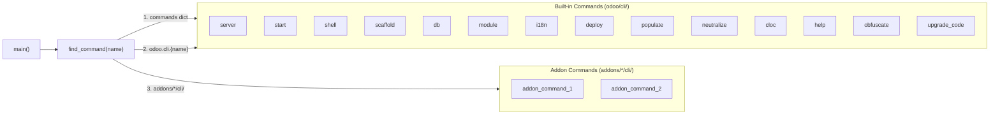

---
slug:4-cli-commands-reference
blog_type:normal
---


Odoo's command-line interface is the primary gateway for server administration, database management, module operations, and development workflows. Every interaction with the Odoo platform — from booting the HTTP server to generating module scaffolding — flows through a single entry point with a layered command discovery architecture that supports both built-in operations and third-party extensions.

## Entry Point and Dispatch Architecture

The entire CLI surface is reachable through a single executable script. The file `odoo-bin` is a thin Python wrapper that delegates to `odoo.cli.main()`, which handles command resolution, addon-path pre-parsing, and fallback defaults in a carefully ordered dispatch chain [odoo-bin](odoo-bin#L1-L7).

The dispatch logic in [`main()`](odoo/cli/command.py#L109-L140) follows three distinct resolution paths. First, if the user provides `--addons-path=` before the command name, it is parsed eagerly so that addon-discovered commands become available. Then, the function determines which command to run: if a bare word (not starting with `-`) is the first argument, it is treated as the command name; if `-h` or `--help` is present without a command, the `help` command is invoked; otherwise, `server` is used as the implicit default. This means `odoo-bin` with no arguments is functionally identical to `odoo-bin server`.



## Command Base Class and Registration

Every CLI command — built-in or addon-provided — must subclass [`Command`](odoo/cli/command.py#L20-L57). The base class enforces a strict naming convention through `__init_subclass__`: the command's `name` must match the module filename (e.g., class `Scaffold` in `scaffold.py` resolves to command name `"scaffold"`), and the name must conform to the regex `^[a-z][a-z0-9_]*$` [odoo/cli/command.py](odoo/cli/command.py#L26-L37). Each subclass automatically registers itself in the global `commands` dictionary upon class definition.

The `Command` class provides a lazy-initialized `parser` property that creates an `argparse.ArgumentParser` with `RawDescriptionHelpFormatter`, using the `prog` string format `odoo-bin [--addons-path=PATH,...] {command_name}` to remind users of the shared option syntax [odoo/cli/command.py](odoo/cli/command.py#L39-L52).

### Addon Command Discovery

Commands from installed addons are discovered via [`load_addons_commands()`](odoo/cli/command.py#L68-L89), which scans the addons path for any `*/cli/{command}.py` file. These addon commands are loaded lazily — only when explicitly requested or when all commands are listed via `help` — avoiding unnecessary imports at startup. The full resolution order in [`find_command()`](odoo/cli/command.py#L92-L106) is: (1) already-loaded built-in commands, (2) import from `odoo.cli.{name}`, (3) scan addon paths.



## Complete Command Reference

The following table summarizes all built-in commands available in Odoo 19.0. Each command supports `--help` for detailed argument listing.

| Command | Source Module | Description | Key Subcommands / Options |
|---|---|---|---|
| `server` | [server.py](odoo/cli/server.py#L122-L128) | Start the Odoo HTTP server (default command) | Inherits all `odoo.tools.config` options |
| `start` | [start.py](odoo/cli/start.py#L13-L14) | Quick-start with auto-detected modules and DB name | `--path`, `-d`/`--database` |
| `shell` | [shell.py](odoo/cli/shell.py#L55-L57) | Interactive Python REPL with Odoo environment | `--shell-interface`, `--shell-file`, `-d` |
| `scaffold` | [scaffold.py](odoo/cli/scaffold.py#L10-L11) | Generate a module skeleton from templates | `-t`/`--template`, `name`, `dest` |
| `db` | [db.py](odoo/cli/db.py#L28-L35) | Database lifecycle management | `init`, `load`, `dump`, `duplicate`, `rename`, `drop` |
| `module` | [module.py](odoo/cli/module.py#L18-L19) | Module install/upgrade/uninstall | `install`, `upgrade`, `uninstall`, `force-demo` |
| `i18n` | [i18n.py](odoo/cli/i18n.py#L27-L28) | Import/export translations, load languages | `import`, `export`, `loadlang` |
| `deploy` | [deploy.py](odoo/cli/deploy.py#L10-L11) | Zip and upload a module to a running instance | `path`, `url`, `--db`, `--login`, `--password` |
| `populate` | [populate.py](odoo/cli/populate.py#L20-L21) | Generate test data by duplicating existing records | `--models`, `--factors`, `--sep`, `-d` |
| `neutralize` | [neutralize.py](odoo/cli/neutralize.py#L14-L15) | Sanitize production DB for testing (block emails, etc.) | `--stdout`, `-d` |
| `cloc` | [cloc.py](odoo/cli/cloc.py#L7-L8) | Count lines of code per module | `-d`/`--database`, `-p`/`--path`, `-v` |
| `help` | [help.py](odoo/cli/help.py#L10-L11) | List all available commands | *(none)* |
| `obfuscate` | [obfuscate.py](odoo/cli/obfuscate.py#L14-L15) | Obfuscate sensitive data in a database | Database shell subcommands: `begin`, `commit`, etc. |
| `upgrade_code` | [upgrade_code.py](odoo/cli/upgrade_code.py#L175-L176) | Apply automated code rewrite scripts for version migration | `--from`, `--to`, `--script`, `--dry-run` |

## Core Commands in Detail

### `server` — Starting the Odoo HTTP Server

The `server` command is the default when no command name is provided. Its [`run()`](odoo/cli/server.py#L125-L127) method delegates to [`main()`](odoo/cli/server.py#L95-L119), which performs a sequence of safety checks before starting: warning if running as root on POSIX systems, aborting if the database user is `postgres`, and logging the full configuration report. It then attempts to auto-create any specified databases (installing `base` for new ones) and starts the WSGI server via `server.start(preload=config['db_name'], stop=stop)` [odoo/cli/server.py](odoo/cli/server.py#L95-L119).

```bash
# Default: start server on port 8069
odoo-bin

# Equivalent explicit command
odoo-bin server

# With database and custom config
odoo-bin -c /etc/odoo/odoo.conf -d mydb
```

### `start` — Quick Development Startup

The [`start`](odoo/cli/start.py#L13-L14) command is designed for developer ergonomics. It auto-detects the project directory, scans for Odoo manifests (`__manifest__.py`), sets `--addons-path` to the parent directory, and derives the database name from the directory name [odoo/cli/start.py](odoo/cli/start.py#L23-L71). If executed inside a virtual environment, it automatically uses the venv path. The command also sets `--db-filter` to restrict the instance to the auto-detected database name, and creates the database if it does not yet exist.

```bash
# Auto-detect modules in current/parent directory, DB = directory name
odoo-bin start

# Specify a custom project path
odoo-bin start --path ~/projects/my_odoo_project

# Override the auto-detected database name
odoo-bin start --database my_custom_db
```

### `shell` — Interactive REPL with Odoo Environment

The [`shell`](odoo/cli/shell.py#L55-L57) command boots the Odoo runtime (including registry and ORM) without starting the HTTP server, then drops into an interactive Python REPL. When a database is specified via `-d`, the shell exposes `env` (an `odoo.api.Environment`), `self` (the current user), `odoo`, and `openerp` as local variables [odoo/cli/shell.py](odoo/cli/shell.py#L130-L151).

It supports multiple REPL backends — `ipython`, `ptpython`, `bpython`, and standard `python` — tried in that order unless `--shell-interface` overrides the preference. The startup script can be customized with `--shell-file` or the `PYTHONSTARTUP` environment variable. When stdin is not a TTY, the shell executes piped input as a script.

```bash
# Basic shell with ORM access
odoo-bin shell -d mydb

# Prefer IPython if available
odoo-bin shell -d mydb --shell-interface ipython

# Run a startup script before entering the REPL
odoo-bin shell -d mydb --shell-file ./setup_shell.py
```

### `scaffold` — Module Skeleton Generation

The [`scaffold`](odoo/cli/scaffold.py#L10-L11) command generates a complete module skeleton using Jinja2 templates. Built-in templates live in `odoo/cli/templates/` and include a `default` template. The command accepts a module `name` (which is snake-cased automatically via [`snake()`](odoo/cli/scaffold.py#L57-L67)) and an optional `dest` directory (defaulting to `.`). Templates are rendered with `snake` and `pascal` case filters, and files with `.template` extensions have that suffix stripped in the output [odoo/cli/scaffold.py](odoo/cli/scaffold.py#L20-L49).

```bash
# Create a module in current directory
odoo-bin scaffold my_module

# Create in a specific directory with a custom template
odoo-bin scaffold my_module /path/to/addons -t my_template

# Use the built-in default template (explicit)
odoo-bin scaffold my_module . -t default
```

### `db` — Database Lifecycle Management

The [`db`](odoo/cli/db.py#L28-L35) command is a subcommand-driven tool for full database lifecycle operations, all filestore-aware. It provides six subcommands, each with dedicated flags [odoo/cli/db.py](odoo/cli/db.py#L37-L197):

| Subcommand | Arguments | Description |
|---|---|---|
| `init` | `database` `--with-demo` `--force` `--language` `--username` `--password` `--country` | Create and initialize a new database with minimum modules |
| `load` | `[-f]` `[-n]` `[database]` `dump_file` | Restore a dump (local file or URL) into a new or existing database |
| `dump` | `database` `[dump_path]` `--format` `--no-filestore` | Create a backup in zip (with filestore) or pg_dump format |
| `duplicate` | `[-f]` `[-n]` `source` `target` | Clone a database including its filestore |
| `rename` | `[-f]` `source` `target` | Rename a database including its filestore |
| `drop` | `database` | Permanently delete a database and its filestore |

The `-f`/`--force` flag (available on `init`, `load`, `duplicate`, `rename`) drops the target database if it already exists. The `-n`/`--neutralize` flag (on `load`, `duplicate`) applies database neutralization after the operation, making the copy safe for testing [odoo/cli/db.py](odoo/cli/db.py#L52-L176).

```bash
# Initialize a new database
odoo-bin db init mydb --with-demo --language en_US --country US

# Load a dump from a URL (auto-names DB from filename)
odoo-bin db load --force https://example.com/backup.zip

# Dump a database to stdout (for piping to pg_restore elsewhere)
odoo-bin db dump mydb --format dump > mydb.pgdump

# Duplicate for testing
odoo-bin db duplicate --force --neutralize prod_db test_db
```

### `module` — Module Install, Upgrade, and Uninstall

The [`module`](odoo/cli/module.py#L18-L19) command provides subcommands for managing modules without the HTTP interface. All subcommands require a single database specified via `-d` [odoo/cli/module.py](odoo/cli/module.py#L93-L109):

| Subcommand | Arguments | Description |
|---|---|---|
| `install` | `MODULE [MODULE...]` | Install named modules; supports `.zip` file paths for data modules |
| `upgrade` | `MODULE [MODULE...]` `[--outdated]` | Upgrade modules; `all` upgrades everything; `--outdated` filters by version |
| `uninstall` | `MODULE [MODULE...]` | Uninstall named modules |
| `force-demo` | *(none)* | Force-install demonstration data |

The `upgrade` subcommand's `--outdated` flag is particularly useful: it compares `installed_version` against `latest_version` on disk and only upgrades modules where the database version is newer than the code version (indicating a downgrade scenario or pending upgrade) [odoo/cli/module.py](odoo/cli/module.py#L168-L180).

```bash
# Install modules (database must already be initialized)
odoo-bin module install -d mydb sale purchase stock

# Upgrade all installed modules
odoo-bin module upgrade -d mydb all

# Upgrade only modules with newer code on disk
odoo-bin module upgrade -d mydb all --outdated

# Uninstall a module
odoo-bin module uninstall -d mydb sale

# Force-load demo data
odoo-bin module force-demo -d mydb
```

### `i18n` — Internationalization Workflows

The [`i18n`](odoo/cli/i18n.py#L27-L28) command manages translations with three subcommands. Language codes follow the XPG/POSIX locale format (e.g., `en_US`, `es_AR`, `sr@latin`) [odoo/cli/i18n.py](odoo/cli/i18n.py#L62-L73):

| Subcommand | Key Options | Description |
|---|---|---|
| `import` | `-l LANG` `[-w]` `FILE [FILE...]` | Import `.po` or `.csv` translation files |
| `export` | `-l LANG [LANG...]` `MODULE [MODULE...]` `[-o FILE]` | Export translations to module `i18n/` directories or a single output file |
| `loadlang` | `-l LANG [LANG...]` | Install language packs into the database |

The `export` subcommand supports `pot` (translation template) as a pseudo-language. When `--output` is specified, translations from all modules are merged into a single file with extensions `.po`, `.pot`, `.tgz`, or `.csv` (stdout is supported with `-`) [odoo/cli/i18n.py](odoo/cli/i18n.py#L176-L200).

```bash
# Load Spanish language into the database
odoo-bin i18n loadlang -d mydb -l es es_AR

# Export French translations for specific modules
odoo-bin i18n export -d mydb -l fr sale purchase stock

# Import a .po file, overwriting existing terms
odoo-bin i18n import -d mydb -l fr -w ./translations/fr.po

# Export a translation template to stdout
odoo-bin i18n export -d mydb -l pot sale purchase -o -
```

## Utility Commands

### `deploy` — Remote Module Deployment

The [`deploy`](odoo/cli/deploy.py#L10-L11) command packages a local module directory as a zip file and uploads it to a running Odoo instance's `/base_import_module/login_upload` endpoint. It requires the `base_import_module` addon to be installed on the target server [odoo/cli/deploy.py](odoo/cli/deploy.py#L62-L85). SSL verification is disabled by default; use `--verify-ssl` for production.

```bash
# Deploy to local instance
odoo-bin deploy ./my_module

# Deploy to a remote instance with credentials
odoo-bin deploy ./my_module https://odoo.example.com --db prod --login admin --password secret
```

### `populate` — Test Data Generation

The [`populate`](odoo/cli/populate.py#L20-L21) command duplicates existing database records to create realistic test datasets. It targets a default set of models (`res.partner`, `product.template`, `account.move`, `sale.order`, `crm.lead`, `stock.picking`, `project.task`) with a default factor of 10,000, meaning each model's records are copied 10,000 times [odoo/cli/populate.py](odoo/cli/populate.py#L13-L15). The factor is propagated: if fewer factors are provided than models, the last factor applies to all remaining models.

```bash
# Populate with default models and factor
odoo-bin populate -d mydb

# Populate only specific models with custom factors
odoo-bin populate -d mydb --models res.partner,sale.order --factors 100,50

# Change the text field separator character
odoo-bin populate -d mydb --sep "-"
```

### `neutralize` — Production Database Sanitization

The [`neutralize`](odoo/cli/neutralize.py#L14-L15) command transforms a production database into a safe testing environment by disabling outgoing emails, resetting passwords, and applying other safety measures. The `--stdout` flag outputs the SQL statements without executing them, useful for auditing what would change [odoo/cli/neutralize.py](odoo/cli/neutralize.py#L17-L54).

```bash
# Neutralize a database in-place
odoo-bin neutralize -d prod_db_copy

# Preview the SQL without executing
odoo-bin neutralize -d prod_db_copy --stdout
```

### `cloc` — Code Metrics

The [`cloc`](odoo/cli/cloc.py#L7-L8) command counts relevant lines of Python, JavaScript, and XML code. It operates in two modes: by filesystem path (`-p`) or by database (`-d`, counting only custom/studio code) [odoo/cli/cloc.py](odoo/cli/cloc.py#L26-L44).

```bash
# Count code in a specific module directory
odoo-bin cloc -p ./my_module

# Count custom code for a database
odoo-bin cloc -d mydb --addons-path ./addons
```

### `upgrade_code` — Automated Source Migration

The [`upgrade_code`](odoo/cli/upgrade_code.py#L175-L176) command applies automated rewrite scripts located in `odoo/upgrade_code/` to help migrate source code between Odoo versions. Each script is named `{version}-{name}.py` and exposes an `upgrade(file_manager)` function [odoo/cli/upgrade_code.py#L1-L29). The `--dry-run` flag previews changes without writing them.

```bash
# Preview code migration changes
odoo-bin upgrade_code --from 18 --to 19 --dry-run

# Apply a specific migration script
odoo-bin upgrade_code --script 19-fix-field-definitions
```

## Shared Configuration Options

All commands share the core configuration system from `odoo.tools.config`. The most commonly used global options, available to every command, include:

| Option | Description |
|---|---|
| `-c` / `--config` | Path to configuration file (default: `odoo.conf`) |
| `-d` / `--database` | Database name |
| `--addons-path` | Comma-separated list of addon directories |
| `-D` / `--data-dir` | Directory for filestore, sessions, etc. |
| `--db_host` | PostgreSQL host |
| `--db_port` | PostgreSQL port |
| `-r` / `--db_user` | PostgreSQL user |
| `-w` / `--db_password` | PostgreSQL password |
| `--db_sslmode` | PostgreSQL SSL mode |
| `--stop-after-init` | Stop the server after initialization (useful for one-off scripts) |
| `--no-http` | Disable the HTTP server (used internally by `module`, `i18n`, `populate`) |

<CgxTip>**Command discovery and `--addons-path`**: If you install a third-party addon that provides a custom CLI command via `my_addon/cli/my_command.py`, you must ensure `--addons-path` includes the directory containing `my_addon` *before* the command name, or the discovery mechanism will not find it. Use `odoo-bin --addons-path=/path/to/addons --help` to verify your custom commands are visible.</CgxTip>

<CgxTip>**Module commands require an initialized database**: The `module install`, `i18n`, and `populate` commands all require a database that has already been created and initialized with the `base` module. Always run `odoo-bin db init <dbname>` first, then use `module install` to add additional modules.</CgxTip>

## CLI Directory Structure

```
odoo/cli/
├── __init__.py          # Exports Command, main; holds COMMAND global
├── command.py           # Command base class, dispatch logic, discovery
├── server.py            # server — HTTP server startup
├── start.py             # start — quick dev startup
├── shell.py             # shell — interactive REPL
├── scaffold.py          # scaffold — module skeleton generator
├── db.py                # db — database lifecycle (init/load/dump/...)
├── module.py            # module — install/upgrade/uninstall
├── i18n.py              # i18n — translation import/export/loadlang
├── deploy.py            # deploy — remote module upload
├── populate.py          # populate — test data generation
├── neutralize.py        # neutralize — production DB sanitization
├── cloc.py              # cloc — code line counting
├── help.py              # help — command listing
├── obfuscate.py         # obfuscate — data masking
├── upgrade_code.py      # upgrade_code — automated code migration
└── templates/           # Built-in scaffold templates
```

## Next Steps

With the CLI reference covered, the natural progression is to explore how the `server` command boots the full application stack:

- **[Server Modes and Workers](20-server-modes-and-workers)** — Understand how the `server` command maps to threading, prefork, and gevent modes
- **[Configuration and Tools](22-configuration-and-tools)** — Deep dive into the `odoo.tools.config` system underlying all CLI options
- **[Project Structure and Layout](3-project-structure-and-layout)** — Learn how `--addons-path` resolves modules and how the scaffold output fits into the broader project architecture