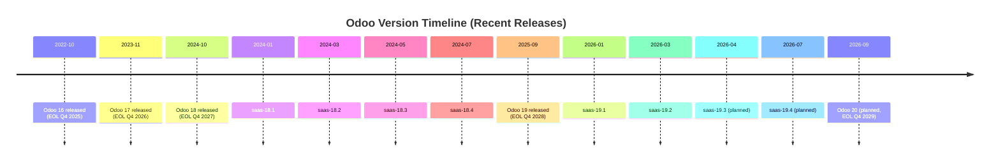

---
slug:5-latest-updates-and-version-history
blog_type:buzz
---

If you have ever tried to figure out which version of Odoo you should be running, or what changed between releases, you know the pain. Odoo releases annually, with quarterly SaaS minor bumps in between, and the gap between what is documented and what developers actually encounter on the ground is often wide. This page is an attempt to bridge that gap, drawing from official sources, recent commits, community issues, and the post-Odoo Experience 2025 chatter.

---

## Odoo's Version Timeline: The Big Picture

Odoo follows a predictable annual cadence: a major on-premise release every October (sometimes September), with SaaS-only minor versions shipping every ~3 months. Each major version has a roughly 3-year support window. The canonical version timeline, maintained by the community, is tracked in [this GitHub Gist by mao-odoo](https://gist.github.com/mao-odoo/42d381faa4790f239de0f676868b9e1b).

A few things worth noting:

- **LTS designation**: Odoo does not officially label versions as "LTS" in the traditional open-source sense, but starting with 19.0, you can create Odoo Online databases in the latest stable version explicitly, as noted on the [trial page](https://www.odoo.com/trial?lts=1).
- **SaaS-only releases**: The `saas-XX.Y` versions are never supported on-premise or on odoo.sh. They exist purely for Odoo Online. This is a frequent source of confusion for self-hosted users who see features in SaaS that they cannot replicate locally.
- **End of life overlap**: At any given time, two major versions are actively receiving bug fixes (e.g., 18.0 and 19.0 both have active support). This gives integrators roughly a year to migrate.

The official [Release Notes page](https://www.odoo.com/page/release-notes) lists versions back to 9.0.

---

## Odoo 19: The AI-Powered Release (September 2025)

Odoo 19 was unveiled at [Odoo Experience 2025](https://www.odoo.com/event/odoo-experience-2025-6601/page/oxp25-introduction) in Brussels, with Fabien Pinckaers delivering the opening keynote. The event drew over 40,000 attendees, 400+ exhibitors, and 400+ talks, making it the largest Odoo Experience to date according to [muchconsulting's recap](https://muchconsulting.com/blog/odoo-2/odoo-experience-2025-highlights-119).

The headline theme, as [muchconsulting](https://muchconsulting.com/blog/odoo-2/odoo-evolution-101) and [multiple partners](https://www.linkedin.com/pulse/odoo-19-ai-whats-new-how-upgrade-odoo-business-solutions-ful8e) have observed, is that AI is no longer a feature, it is the foundation.

### Key Feature Areas

| Area | Notable Additions |
|------|-------------------|
| **AI Copilot** | Native AI agents across all modules -- email drafting, meeting summaries, lead scoring, stock replenishment suggestions. Integrates with ChatGPT, Claude, etc. |
| **Website & eCommerce** | Redesigned builder with dynamic snippets, AI-generated content blocks, automated SEO checks, Google Merchant Center + Gelato + social integrations |
| **POS** | Complete UI overhaul with Dark Mode, configurable presets, combo products, payment terminal support |
| **ESG Module** | New app for tracking carbon emissions (Scope 1/2/3) with CSRD compliance for EU regulations |
| **Finance** | Mobile bank reconciliation, automatic tax suggestions, PEPPOL/SEPA support, virtual expense cards |
| **HR** | Overlapping leave handling, revamped payroll with history, mobile-friendly time-off |
| **Performance** | Frontend caching, read replicas for horizontal DB scaling, offline mode |
| **Manufacturing** | MO splitting by serial numbers, demand forecasting, QR scanning |

As [muchconsulting's Simon Stappen noted](https://muchconsulting.com/blog/odoo-2/odoo-experience-2025-highlights-119): "This makes Odoo ten times faster and puts us within reach of classic SAP scenarios with 10,000+ users." Whether that claim holds up at scale remains to be tested, but the architectural investments in caching and read replicas are real.

### The SaaS Release Cadence for v19

The SaaS versions within Odoo 19 follow the same quarterly rhythm as previous major releases, based on the [version timeline Gist](https://gist.github.com/mao-odoo/42d381faa4790f239de0f676868b9e1b):

| Version | Release Date | EOL |
|---------|-------------|-----|
| saas-19.1 | January 19, 2026 | April 2026 |
| saas-19.2 | March 9, 2026 | June 2026 |
| saas-19.3 | April 2026 (planned) | August 2026 |
| saas-19.4 | July 2026 (planned) | November 2026 |

Odoo has been hosting webinars to walk through the 19.1 and 19.2 changes per-app -- for example, the [Manufacturing Release Highlights webinar](https://www.odoo.com/event/webinar-manufacturing-release-highlights-191-192-10490/register) and the [Project & Timesheet webinar](https://www.odoo.com/event/webinar-project-timesheet-release-highlights-191-and-192-10473).

---

## What Is Landing on Master Right Now

Looking at the commit stream on `odoo/odoo` during late March to early April 2026, the bulk of activity falls into a few clear categories. These commits give us a window into what is likely being baked into `saas-19.3` (planned for April 2026).

### Bug Fixes: The Expected Volume

The vast majority of recent commits are targeted bug fixes, spanning localization, POS, accounting, and the framework itself. Here are the ones that stand out for their depth:

**POS crash with GS1 barcodes on configurable products** -- [commit fa88cfc](https://github.com/odoo/odoo/commit/fa88cfcaa916c3a063c27c4e2b1a0fe87ce431ea) by Pawan Kumar Gupta (`pkgu-odoo`) fixes a crash where scanning a GS1 barcode with a lot number on a configurable product (one with variants) caused a `TypeError` because the configurator tried to look up a product by the lot number instead of the actual barcode. The commit message includes a detailed trace of the bug path through `_barcodeGS1Action` to `handleConfigurableProduct` to `openConfigurator`, which is worth reading for anyone debugging the POS frontend.

**Attachment garbage collection on write failure** -- [commit 8160cb1](https://github.com/odoo/odoo/commit/8160cb1c12827317911183d12d46a9f2e170a407) by Louis Gobert addresses a subtle issue where if an attachment file write fails (e.g., disk full), the file is never marked for garbage collection. This results in orphaned files that block subsequent writes to the same path. The fix adds the file to the GC checklist before the write operation.

**Polish EDI (KSeF) fixes** -- [commit 73e9f47](https://github.com/odoo/odoo/commit/73e9f47fea2781dc3db3b289b4eca3095040bc46) by Leo Gizard fixes three errors in FA(3) XML generation for Polish e-invoicing: a wrong tax code for 5% rate (`zw` instead of `5`), currency conversion in P_15 (always using PLN instead of invoice currency), and an inverted exchange rate direction.

**Jordan EDI POS UUID** -- [commit 549f547](https://github.com/odoo/odoo/commit/549f547749f8c9f4f850fdd8ab2aa286e39e328e) by Louis Gobert ensures POS orders in Jordan have a UUID when submitting to JoFotara, even for orders created before the `l10n_jo_edi_pos` module was installed.

**Tax detail rounding for price-included taxes** -- [commit 50a3045](https://github.com/odoo/odoo/commit/50a3045cc9c805578832f30e52cbebb13b42cb7e) by Laurent Smet fixes `round_tax_details_base_lines` to ignore zero-tax lines, preventing incorrect fallback to tax-excluded mode on invoices that mix price-included and zero-price-excluded taxes.

### New Features and Improvements

**Peppol and Nemhandel Business Level Responses** -- Two significant [ADD] commits by Pierrot (`prro`) implement the response systems for e-invoicing networks:

- [account_peppol_response](https://github.com/odoo/odoo/commit/794931740823527bbf3ccc8b8a3e20b1ef9c327c): Implements three mandatory Peppol BLR types -- acknowledgement, confirmation, and rejection -- for invoices and credit notes. The [Peppol BLR specification](https://docs.peppol.eu/poacc/upgrade-3/profiles/63-invoiceresponse/#introduction-to-openpeppol-and-bis) is the reference.

- [l10n_dk_nemhandel_response](https://github.com/odoo/odoo/commit/be70709bc8b3d8ef825106ed4f57c5da9e61f8b9): Similar system for Denmark's Nemhandel network, with BusinessAccept and BusinessReject responses. Documentation is at the [OIoubl21 site](https://oioubl21.oioubl.dk/Classes/da/ApplicationResponse.html).

Both reference the same IAP PR at [odoo/iap-apps#1364](https://github.com/odoo/iap-apps/pull/1364).

**MRP: Split manufacturing orders by serial** -- [commit 631b95f](https://github.com/odoo/odoo/commit/631b95f8044d9eb982c75c72ca288cc3df6f49d5) by William Henrotin adds a new button to the serial number generation wizard that splits the main manufacturing order into sub-orders, one per serial. This addresses a gap where users could generate serials or split MOs, but not do both simultaneously.

**Translation export fix** -- [commit d4a19fc](https://github.com/odoo/odoo/commit/d4a19fcebcb8ef60dfe6c701814e58fd6413390d) by Dylan Kiss fixes the translation export filter to allow single-letter strings (like `m`, `l`, `g` for units of measure) to be exported. Previously, the filter was too aggressive and rejected these legitimate translatable strings.

### Other Notable Fixes

| Commit | Module | Description |
|--------|--------|-------------|
| [345f5d8](https://github.com/odoo/odoo/commit/345f5d8263f9c4f5e81bf62c8bf9657bf6f75d6c) | hr_livechat | Updated "My Team" filter in live chat agent reports to use hierarchy-based domain |
| [e721d53](https://github.com/odoo/odoo/commit/e721d53099619cebe499e5cc1b945e6e9cd49e81) | iap | Fixed balance display resetting to 0 after saving an iap.account record |
| [ef4ceff](https://github.com/odoo/odoo/commit/ef4ceffc8855d533b41922166d2ec8bed3a879d2) | html_builder | Added overlap to "Bold 10" shape to fix thin line rendering artifact |
| [38b0446](https://github.com/odoo/odoo/commit/38b04461bb4ec3691a591c825ecacde7f5db6a6e) | html_builder | Allow inline elements at root of editable boundaries (fixes paste creating unwanted `p` elements) |
| [8071e60](https://github.com/odoo/odoo/commit/8071e60181075a270ff82f5b78266d9fb6e02a94) | project_timesheet_holidays | Only create timesheets for validated leaves |
| [8c6c501](https://github.com/odoo/odoo/commit/8c6c501b8abe9e3e0b94d5a55443d82667fdcb79) | account | Allow removing some zero-value move lines that lack valid information |

---

## Open Issues Worth Watching

The issue tracker is always a goldmine for understanding where the rough edges are. Several recently opened issues highlight systemic concerns:

**Polish KSeF: JST entity structure not fully exported** -- [issue #257565](https://github.com/odoo/odoo/issues/257565) reports that when invoicing a subordinate unit of a Polish Territorial Self-Government Unit, the KSeF FA(2) XML export only includes the parent entity (Podmiot2) and omits the subordinate unit (Podmiot3). This violates the VAT centralisation requirement in effect since 2017. The reporter links directly to the [official KSeF documentation](https://ksef.podatki.gov.pl/media/0ivha0ua/broszura-informacyjna-dotyczaca-struktury-logicznej-fa-3.pdf). This is on `saas-19.1`.

**stock_account + l10n_ch installation crash** -- [issue #252448](https://github.com/odoo/odoo/issues/252448) is a detailed root cause analysis showing that installing `stock_account` (or any dependent like `point_of_sale`) on a database with Swiss localization crashes with a NOT NULL constraint violation. The chain of failure goes through `chart_template._load_data()` attempting to create an `account.account` record with no `name`, `code`, or `account_type` because the template data is update-only but the target account does not exist. The reporter provides both a primary fix and a defense-in-depth fix. This affects 19.0 Community and Enterprise.

**Access rights regression in Inventory Valuation** -- [issue #257450](https://github.com/odoo/odoo/issues/257450) documents that after generating the first inventory closing entry, non-admin users lose access to Accounting > Review > Inventory Valuation because `ir.model.fields.search` is called without `sudo()`. This is a classic access control regression that affects any deployment with non-admin accounting users.

**Tax calculation discrepancy across v17, v18, v19** -- [issue #250035](https://github.com/odoo/odoo/issues/250035) reports that tax calculations, base amounts, and totals differ between version 17 and versions 18-19 depending on rounding methods. The reporter claims version 17 was correct and subsequent versions introduced regressions. If validated, this would be a significant concern for any business that migrated and relies on tax accuracy.

---

## Closed Issues and Resolution Patterns

Some recently closed issues are worth noting for the patterns they reveal:

- **[AsyncIO Support](https://github.com/odoo/odoo/issues/28764)** -- This feature request from 2018 asking for asyncio support (replacing Gevent) was finally closed in March 2026. The outcome is not clearly documented in the closure, but the fact that it was open for over 7 years before being closed suggests the async story is still not first-class in the framework.

- **[HR Holidays: refused leaves not struck through](https://github.com/odoo/odoo/issues/248868)** -- A missing `is_striked` field in the calendar view was the culprit. Fixed for both 18.0 and 19.0. Simple bug, easy fix, but visible to every HR user.

- **[Blog cover image not displaying](https://github.com/odoo/odoo/issues/173974)** -- Reported in July 2024 on 17.0, this issue about webp conversion breaking blog cover images was still open as of the last update in April 2026. The symptom: cover images become invisible after save, 0-byte duplicate files appear in the filestore. Not a showstopper, but it has been lingering for nearly two years.

---

## Odoo 18 in Retrospect

Since Odoo 19 builds directly on 18, a quick recap is useful. Odoo 18 was [released October 2024](https://www.odoo.com/blog/odoo-news-5/meet-odoo-18-1477) and focused on:

- **Mobile-first UX**: revamped mobile UI, company switcher, web app support
- **Barcode app overhaul**: multi-scan, PWA support, product creation from barcode
- **Website import**: one-click import of existing websites
- **Sales commissions module**: new dedicated module for commission plan management
- **MRP improvements**: product catalog on BOMs/MOs, notes on work orders
- **Discovery Dashboard**: new overview view showing related business processes

The [18.0 release blog post](https://www.odoo.com/blog/odoo-news-5/meet-odoo-18-1477) is the authoritative source for the full feature list.

---

## What Lies Ahead: Odoo 20 (Planned September 2026)

According to the [version timeline Gist](https://gist.github.com/mao-odoo/42d381faa4790f239de0f676868b9e1b), Odoo 20 is planned for September 2026 with an end-of-life target of Q4 2029. Given the trajectory from 16 through 19, expect continued deepening of AI integration (the "AI agents as foundation" pattern), more localization packages, and further performance work around the caching and read-replica infrastructure introduced in 19.

The saas-19.3 release is expected in April 2026, and saas-19.4 in July 2026, which means the `master` branch commits we are seeing now are likely targeting those releases before the 20.0 freeze.

---

## Where to Track Changes

If you are developing on or maintaining an Odoo deployment, these are the key sources:

1. **[odoo/odoo on GitHub](https://github.com/odoo/odoo)** -- The source of truth. Watch the `master` branch for upcoming features, and the version branches (e.g., `19.0`) for stable fixes.
2. **[Runbot](https://runbot.odoo.com/)** -- Shows which branches are actively maintained and building.
3. **[Odoo Release Notes](https://www.odoo.com/page/release-notes)** -- Official per-version release notes (though they tend to be marketing-friendly rather than developer-detailed).
4. **[Version timeline Gist](https://gist.github.com/mao-odoo/42d381faa4790f239de0f676868b9e1b)** -- The most accurate community-maintained source for release dates and EOL timelines.
5. **[OCA Migration Guides](https://github.com/OCA/maintainer-tools/wiki/Migration-to-version-16.0)** -- For module developers migrating between versions.

The gap between what Odoo announces and what actually ships can be significant, especially for SaaS-only features that never reach on-premise. If you are self-hosting, the commit log remains your best friend.