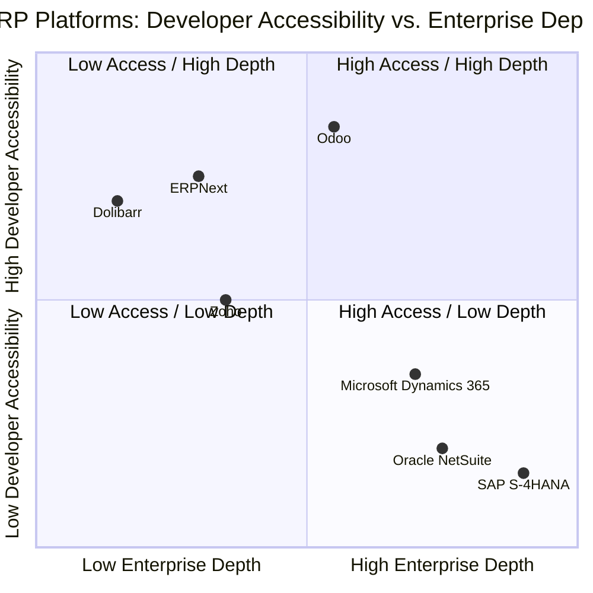
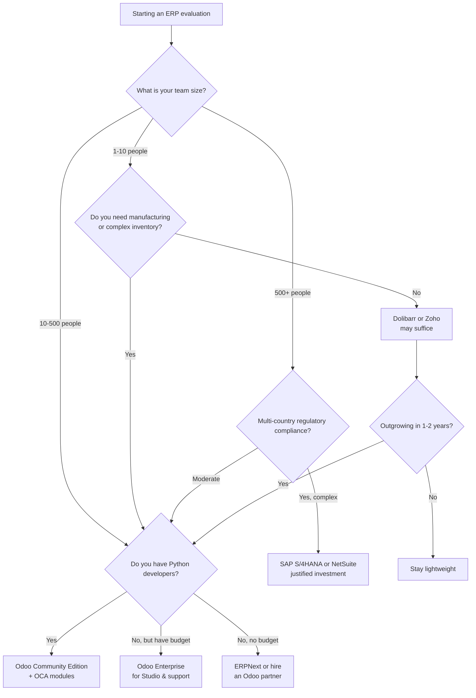

---
slug:6-odoo-vs-sap-and-competitors
blog_type:buzz
---


The ERP market is a minefield of inflated claims, opaque pricing, and vendor lock-in masquerading as "best practices." If you are a developer evaluating platforms -- or an engineering leader deciding where to invest your team's time -- the question is never "which ERP is best." The question is: **which platform's technical tradeoffs align with your organization's constraints, skills, and growth trajectory?**

This page provides a grounded, developer-informed comparison of Odoo against its most frequently cited competitors: SAP, Microsoft Dynamics 365, ERPNext, Dolibarr, Oracle NetSuite, and Zoho. We focus on the dimensions that matter to people who actually build and maintain these systems: architecture, extensibility, developer experience, licensing, and real-world pain points.

---

## The Competitive Landscape at a Glance

Before diving into specifics, here is a high-level positioning map. Think of it as a "choose your own tradeoff" chart:



This is not a "scorecard" -- it is a positioning tool. Odoo occupies a distinctive niche: enterprise-grade breadth with an unusually open developer model. That is its structural advantage, and also the source of its most interesting weaknesses.

---

## Odoo vs SAP: The Elephant in the Room

This is the comparison everyone asks about, and it is also the least useful one if taken at face value. SAP S/4HANA and Odoo are not really competitors in the traditional sense -- they serve fundamentally different organizational contexts.

### Technical Architecture: A Study in Contrasts

| Dimension | Odoo | SAP S/4HANA |
|---|---|---|
| **Language Stack** | Python (backend), JavaScript/OWL (frontend) | ABAP, C++, Java, SAPUI5 |
| **Database** | PostgreSQL (open, portable) | SAP HANA (in-memory, proprietary) |
| **Architecture** | Modular MVC with ORM, WSGI, JSON-RPC | Monolithic tiered with proprietary middleware |
| **Deployment** | On-premise, Odoo.sh, any cloud VPS | On-premise, RISE with SAP, hyperscaler cloud |
| **API Access** | Open JSON-RPC/XML-RPC, REST external | OData, SAP Gateway, proprietary APIs |
| **Source Access** | [Community Edition](https://github.com/odoo/odoo) under LGPLv3 | Proprietary; no source access |

The core technical difference is philosophical. Odoo's stack is built from **commodity open-source components** -- Python, PostgreSQL, standard web protocols -- that any mid-level developer can work with. SAP's stack is built from **proprietary layers** (ABAP, HANA) that require specialized, expensive talent.

As Ermin Trevisan [summarizes on the Odoo forum](https://www.odoo.com/forum/help-1/technical-architecture-for-odoo-12-149657): Odoo follows a clean MVC architecture where models are defined in Python, views in XML/QWeb, and controllers route requests through a WSGI stack. The barrier to entry for a Python developer is measured in days, not months.

SAP, by contrast, requires ABAP developers for backend customization and SAPUI5 specialists for frontend work. The [SAP Learning Hub](https://learning.sap.com/) certification ecosystem is extensive -- and expensive. An ABAP developer commands a significant salary premium over a Python developer doing equivalent work.

### Cost: The Real Numbers

The cost gap is not subtle. According to multiple implementation analyses ([SysGenPro](https://sysgenpro.com/resources/odoo-vs-sap-s-4hana-sme-vs-enterprise-erp), [Infintor](https://www.infintor.com/odoo-19-vs-sap-erp-comparison)), SAP S/4HANA implementations routinely run into six or seven figures:

| Cost Factor | Odoo | SAP S/4HANA |
|---|---|---|
| **License (entry)** | Free (Community) or ~$24-39/user/month (Enterprise) | ~$150+/user/month; often $10,000+/year minimum |
| **Implementation** | 2-6 months; typically SAR 75K-500K | 9-36 months; often $500K+ |
| **Customization** | Python developers, widely available | ABAP consultants, scarce and costly |
| **Annual Maintenance** | ~15-20% of implementation cost | ~20-25% + mandatory support contracts |
| **3-Year TCO (50 users)** | ~$15,000-50,000 | ~$150,000-500,000+ |

**The honest takeaway:** If your organization processes millions of transactions per day across 50 countries with complex regulatory compliance, SAP's depth justifies the cost. For the other 95% of businesses, it does not.

### Where SAP Genuinely Wins

- **High-volume transaction processing.** SAP HANA's in-memory engine is purpose-built for real-time analytics on massive datasets. Odoo's PostgreSQL backend can handle significant load, but it is not optimized for the same scale.
- **Regulatory compliance in regulated industries.** Pre-built compliance packages for banking, pharma, and oil & gas are SAP's real moat.
- **Process standardization.** SAP enforces rigid workflows. For organizations that *want* that rigidity (e.g., to prevent rogue processes), this is a feature, not a bug.

---

## Odoo vs Microsoft Dynamics 365 Business Central

Dynamics 365 is the middle-ground competitor: more enterprise-oriented than Odoo, more accessible than SAP. It thrives in organizations already committed to the Microsoft ecosystem (Office 365, Teams, Azure, Power Platform).

### The Developer Experience Gap

| Dimension | Odoo | Dynamics 365 BC |
|---|---|---|
| **Extension Model** | Python modules with ORM inheritance | AL language (proprietary, C-like) |
| **Customization** | Full code access (Community); Odoo Studio (Enterprise, no-code) | Power Platform + AL extensions |
| **Integration** | Open API, JSON-RPC, thousands of third-party apps | Dataverse API, Power Automate connectors |
| **Learning Curve** | Python developers productive in days | AL developers need 1-3 months ramp-up |
| **Community** | Large open-source community, [OCA](https://github.com/OCA) with 1000+ modules | Microsoft partner ecosystem; limited open-source |

The critical difference: Odoo lets you **write Python**. Dynamics 365 makes you learn **AL**, a domain-specific language that exists only within the Dynamics ecosystem. If your team already has .NET/C# skills, AL feels familiar. But you are still locked into Microsoft's tooling, documentation, and release cadence.

**Pricing reality check:** Dynamics 365 Business Central starts around $70/user/month for the Essentials tier and ~$100/user/month for Premium (which adds manufacturing). As [AccuWeb Hosting notes](https://www.accuwebhosting.com/blog/odoo-vs-alternatives), Odoo's modular pricing means you pay only for the apps you actually use, often at a significantly lower total cost.

---

## Odoo vs ERPNext: The Open-Source Rivalry

[ERPNext](https://erpnext.com/) is Odoo's most direct open-source competitor. Built on the Frappe Framework (Python + MariaDB), it targets the same SME market with a comparable module set. This is where the comparison gets interesting -- and where ideology matters.

### Architecture Comparison

| Dimension | Odoo | ERPNext |
|---|---|---|
| **Framework** | Custom ORM + MVC on PostgreSQL | Frappe Framework on MariaDB |
| **Backend Language** | Python 3 | Python 3 (via Frappe) |
| **Frontend** | OWL framework, QWeb templates | Vue.js (via Frappe) |
| **Module System** | 70+ first-party apps, 14,000+ third-party on Odoo App Store | ~30 built-in doctypes, smaller app ecosystem |
| **Hosting** | Self-host, Odoo.sh, any cloud | Self-host, Frappe Cloud |
| **License** | Community: LGPLv3; Enterprise: proprietary | MIT (fully open source) |

ERPNext's MIT license is genuinely more permissive than Odoo's LGPLv3 Community Edition. If ideological purity matters to you, ERPNext wins. But as a practical matter, Odoo's larger community, more mature module ecosystem, and greater partner network make it the safer bet for production deployments.

### Real-World Pain Points

As [multiple comparison reviews note](https://www.dasolo.ai/blog/odoo-integrations-3/odoo-vs-dolibarr-erp-comparison-100), ERPNext struggles with:

- **Performance on large databases.** Frappe's ORM is less optimized than Odoo's for complex queries with large result sets.
- **Limited third-party integrations.** The app ecosystem is smaller, and finding maintainers for niche integrations is harder.
- **Smaller partner network.** Fewer certified implementers means fewer options if you need professional services.

ERPNext is a legitimate choice for small teams that want a simple, fully open-source system. But if you need manufacturing, advanced inventory, or deep localization, Odoo's maturity shows.

---

## Odoo vs Dolibarr: Lightweight vs. Full-Stack

[Dolibarr](https://www.dolibarr.org/) is not really an Odoo competitor -- it serves a different market. Dolibarr is a lightweight ERP/CRM for freelancers and micro-businesses. It runs on basic shared hosting, requires minimal setup, and covers basic invoicing, CRM, and inventory.

As [Dasolo's comparison](https://www.dasolo.ai/blog/odoo-integrations-3/odoo-vs-dolibarr-erp-comparison-100) bluntly states: "If your business is growing beyond 20 to 30 users or you need processes that go beyond basic invoicing and contact management, you will likely find yourself working around Dolibarr rather than with it."

**When Dolibarr makes sense:** A solo consultant or 5-person agency that needs invoicing, expense tracking, and basic CRM. Total cost: effectively zero.

**When it doesn't:** Any organization with manufacturing requirements, multi-warehouse inventory, e-commerce integration, or more than a handful of concurrent users.

---

## Odoo vs Oracle NetSuite: Scale at a Price

[NetSuite](https://www.netsuite.com/) is a cloud-native ERP built for mid-market and enterprise companies. It offers strong financial management, multi-subsidiary consolidation, and global compliance. It also costs roughly [10-20x more than Odoo](https://boyangcs.com/best-erp-software-systems), with implementations starting around $1,000+/month and setup fees often exceeding $25,000.

The developer story is where NetSuite stumbles hardest. Customization requires **SuiteScript** (JavaScript-based, but entirely proprietary), and the platform is cloud-only -- no self-hosting, no database access, no source code. You are building on Oracle's infrastructure, with Oracle's constraints.

**NetSuite wins when:** You are a mid-market company with complex multi-entity financial consolidation needs and sufficient budget. The tradeoff is total loss of infrastructure control.

---

## Odoo vs Zoho: CRM-Centric vs. ERP-Centric

[Zoho](https://www.zoho.com/) is a strong CRM platform with expanding ERP-adjacent features (Books, Inventory, People). It is affordable and easy to adopt. But as [AccuWeb's analysis](https://www.accuwebhosting.com/blog/odoo-vs-alternatives) points out, Zoho "lacks depth in manufacturing, logistics, and advanced ERP features."

The fundamental distinction: Zoho is a **suite of point solutions** held together by integrations. Odoo is a **single integrated platform** where CRM, inventory, accounting, and manufacturing share the same database and ORM. For developers, this means:

- **In Zoho:** You integrate via APIs between separate products. Data consistency is your problem.
- **In Odoo:** Modules share the same ORM layer. Cross-module consistency is baked into the framework.

---

## What Makes Odoo Structurally Different

Stepping back from individual comparisons, Odoo has three structural characteristics that genuinely differentiate it in this market:

### 1. A Developer-Accessible Architecture

The [odoo/odoo repository on GitHub](https://github.com/odoo/odoo) has nearly **50,000 stars** and over **31,000 forks**. That is not just popularity -- it is a signal that the codebase is approachable. A Python developer can clone the repo, run it locally, and start modifying modules within hours. Try doing that with SAP or NetSuite.

The ORM layer is the key technical innovation. Models are defined as Python classes with declarative field definitions:

```python
from odoo import models, fields

class ProductTemplate(models.Model):
    _name = 'product.template'
    _inherit = 'product.template'

    is environmentally_friendly = fields.Boolean('Eco-Friendly')
```

Inheritance patterns (`_inherit`, `_inherits`) let you extend any model without modifying the original source. This is how the [OCA's 1,000+ community modules](https://github.com/OCA) coexist with core and Enterprise code.

### 2. Modular Deployment That Actually Works

Unlike monolithic ERPs where you deploy everything or nothing, Odoo's module system lets you install exactly what you need. The [module loading and registry](https://www.odoo.com/documentation/19.0/developer/reference/backend/module.html) system resolves dependencies, applies inheritance chains, and builds a coherent application from discrete components.

This is not just a deployment convenience -- it is a **development methodology**. Teams can work on independent modules without stepping on each other's code. CI/CD pipelines can test individual modules. Version control becomes tractable.

### 3. The Dual-License Tension

This is Odoo's most debated structural feature. The [Community Edition (LGPLv3)](https://github.com/odoo/odoo) provides full source access and zero licensing cost. The Enterprise Edition adds proprietary modules (Studio, quality control, field service, advanced reporting) behind a subscription.

As the [OEC.sh breakdown](https://oec.sh/blog/odoo-community-vs-enterprise) documents, Community Edition covers roughly 80% of what most businesses need: CRM, Sales, Inventory, Accounting, Manufacturing, Website, eCommerce, HR, and Project Management. Enterprise adds specialized features that matter in specific verticals.

**The honest assessment:** If you have Python developers on staff, Community Edition is the more powerful platform in absolute terms -- you can build anything Studio does, and more. Enterprise pays for convenience (no-code customization, official support, pre-built features). The choice depends on whether your team's constraint is **development capacity** or **budget for licenses**.

---

## The Problems Odoo Does Not Solve

No analysis is complete without acknowledging structural weaknesses:

**Upgrade fragility.** As [multiple community discussions](https://github.com/odoo/odoo/issues/250035) highlight, custom modules can break between major versions. The [stable series policy](https://github.com/odoo/odoo/wiki/Contributing) explicitly restricts changes to stable branches, but the inheritance model means that private method signature changes in core can silently break dependent modules.

**Tax calculation inconsistencies.** The ongoing [tax rounding issue across versions 17-19](https://github.com/odoo/odoo/issues/250035) demonstrates that even core financial logic can have regressions. For businesses in jurisdictions with strict tax compliance requirements, this is a real risk that requires thorough testing on every upgrade.

**Localization gaps.** Recent issues with [Polish KSeF e-invoicing](https://github.com/odoo/odoo/issues/257095) and [Swiss chart of accounts installation failures](https://github.com/odoo/odoo/issues/252448) show that country-specific modules can harbor significant bugs. The rapid development pace means new localizations sometimes ship before they are fully battle-tested.

**Enterprise feature gating creates community friction.** Features like Studio, advanced reporting, and marketing automation are Enterprise-only. Community users must either build alternatives themselves (which the OCA often does) or accept the limitation. This dual-track creates a maintenance burden for both Odoo S.A. and the community.

---

## Decision Framework

Rather than declaring a "winner," here is a framework for deciding based on your actual constraints:



---

## Summary Table

| Platform | Best For | Developer Access | Starting Cost (per user/month) | License Model |
|---|---|---|---|---|
| **Odoo Community** | SMEs with Python skills | Full source (LGPLv3) | $0 + hosting | Open source |
| **Odoo Enterprise** | SMEs wanting no-code + support | Core open, extras proprietary | ~$24-39 | Subscription |
| **SAP S/4HANA** | Large enterprises, regulated industries | None (proprietary) | $150+ | License + maintenance |
| **Dynamics 365 BC** | Microsoft-ecosystem organizations | AL extensions (proprietary) | ~$70-100 | Subscription |
| **ERPNext** | Small teams, open-source purists | Full source (MIT) | $0 + hosting | Open source |
| **Dolibarr** | Freelancers, micro-businesses | Full source (GPLv3) | $0 + hosting | Open source |
| **NetSuite** | Mid-market, multi-entity finance | SuiteScript only (proprietary) | ~$1,000+ total | Subscription |
| **Zoho** | CRM-first organizations | API-based only | ~$9-50 | Subscription |

---

## Further Reading

- [Odoo Documentation](https://www.odoo.com/documentation/19.0/) -- Official reference for all modules and APIs
- [Odoo Community Association (OCA) on GitHub](https://github.com/OCA) -- 1,000+ community-maintained modules
- [Contributing to Odoo](https://github.com/odoo/odoo/wiki/Contributing) -- Branch targeting, CLA, and stable series policies
- [ERPNext GitHub](https://github.com/frappe/erpnext) -- The primary open-source alternative
- [Dolibarr GitHub](https://github.com/Dolibarr/dolibarr) -- Lightweight ERP/CRM
- [Odoo Community vs Enterprise Analysis (OEC.sh)](https://oec.sh/blog/odoo-community-vs-enterprise) -- Detailed feature gap breakdown

The ERP market rewards informed skepticism. Every vendor -- including Odoo -- will tell you their platform does everything. The truth lives in the constraints: what breaks, what costs extra, and what requires specialized skills you may not have. Use this page as a starting point, not a conclusion. Test against your actual workflows, your actual team, and your actual budget. Then decide.