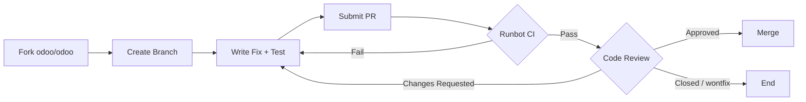

---
slug:7-community-and-ecosystem
blog_type:buzz
---

Understanding Odoo's community requires acknowledging something upfront: this project lives in a state of permanent tension between its open-source identity and its commercial ambitions. The [odoo/odoo](https://github.com/odoo/odoo) repository sits at 49.9k stars and nearly 32k forks on GitHub, making it one of the most-starred business application projects in existence. But raw star counts obscure the real structure -- and the real frictions -- of how this ecosystem actually functions.

## The Governance Model: Open-Core, Tight Control

Odoo is an open-core product. The Community Edition ships under the LGPL-3.0 license and lives on GitHub for anyone to inspect, fork, and contribute to. The Enterprise Edition adds proprietary modules (Studio, advanced accounting, IoT, VoIP, etc.) on top.

What distinguishes Odoo from projects like WordPress or Django is that **the core repository is maintained almost entirely by Odoo S.A.'s internal R&D team**. External pull requests are accepted, but the [Contributing wiki](https://github.com/odoo/odoo/wiki/Contributing) makes the power dynamic clear:

> "No need to create an issue if you're making a PR to fix it. Describe the issue in the PR, it's the same as an issue, but with higher priority!"

Issues without accompanying pull requests are treated with "much lower priority than a Pull Request or an Odoo Enterprise support ticket." This is not unusual for corporate-backed OSS, but it is worth internalizing: **if you want something fixed in core, you generally need to fix it yourself and submit a patch**.

The contribution pipeline is disciplined. PRs must target the correct branch (bug fixes to 17.0/18.0/19.0 stable, features to master only), pass [Runbot](https://runbot.odoo.com) CI, and adhere to strict stable-branch guidelines -- no signature changes to public methods, no data model alterations, no cosmetic changes. The CLA must be signed. Commits should be squashed.

This workflow works well for well-scoped bug fixes. For anything requiring architectural changes or new features, the path narrows considerably -- those must land in master first, which means they will only reach stable in the next major version, potentially years later.

## The Odoo Community Association (OCA): The Real Community Layer

If the core repo is tightly controlled, the [Odoo Community Association (OCA)](https://odoo-community.org) is where the organic OSS community actually lives. The OCA is a Swiss-based non-profit that maintains an entirely separate GitHub organization at [github.com/OCA](https://github.com/OCA) with thousands of repositories.

The numbers are telling:

| Metric | Value |
|--------|-------|
| Odoo Modules | 20,000+ |
| Contributors | 1,117 |
| Members | 664 |
| Countries Represented | 62 |
| Sponsors | 38 |

The OCA fills the gaps that Odoo S.A. leaves -- or chooses not to address. Accounting reports (MIS Builder), vertical-specific modules, integration connectors, localization enhancements, and utility libraries all find their home here. As Ivan Sokolov [noted on LinkedIn](https://www.linkedin.com/posts/ivan-sokolov-x_there-is-a-huge-ongoing-discussion-regarding-activity-7284542618816946176-wlA5), there is ongoing debate about the OCA's importance, but for mid-to-large scale Community Edition deployments, OCA modules are "a crucial part."

The top OCA contributors for May 2025, measured by their [Contributor Indicator](https://odoo-community.org/blog/news-updates-1/ranking-of-top-code-contributors-in-may-2025-203), were dominated by a handful of companies:

| Rank | Contributor | Organization | Points |
|------|-------------|-------------|--------|
| 1 | Pedro M. Baeza | Tecnativa | 378 |
| 2 | Jacques-Etienne Baudoux | BCIM | 163 |
| 3 | Carlos Lopez | Tecnativa | 156 |
| 4 | Denis Roussel | Acsone | 136 |
| 5 | Victor Almau | Tecnativa | 120 |
| 6 | Miquel Raich | Forgeflow | 118 |
| 7 | Enric Tobella | Dixmit | 93 |
| 8 | Holger Brunn | Hunki Enterprises B.V. | 87 |
| 9 | Pilar Vargas | Tecnativa | 71 |
| 10 | Sebastien Alix | Camptocamp | 66 |

Tecnativa, Acsone, Camptocamp, and Forgeflow are the backbone of the OCA. These are Odoo integration partners that have institutionalized their commitment to open-source contributions. The model works: they contribute modules upstream, reduce their own maintenance burden across client deployments, and build reputational capital.

The OCA also runs annual [OCA Days](https://odoo-community.org/event/oca-days-2023-liege-2023-11-06-2023-11-07-143/) events in Liege, Belgium -- code sprints and workshops that are genuinely community-driven, in contrast to Odoo S.A.'s own commercial events.

## The Partner Network: Scale and Commercial Gravity

Odoo's partner ecosystem is massive. According to [Frederick Tubiermont's analysis on LinkedIn](https://www.linkedin.com/posts/fredericktubiermont_ive-compiled-the-top-20-countries-by-activity-7315630048437305344-LgtW), there are approximately **3,316 published partners** on Odoo's website across three tiers:

- **206 Gold Partners**
- **582 Silver Partners**
- **2,528 Ready Partners**

And that is just the published slice. Tubiermont estimates there are close to **6,000 Learning Partners** not listed publicly.

The geographic distribution is notable. The top countries by partner count are:

| Rank | Country | Partner Count |
|------|---------|---------------|
| 1 | USA | 220 |
| 2 | Mexico | 132 |
| 2 | India | 132 |
| 3 | Saudi Arabia | 124 |
| 11 | Belgium | 98 |

Belgium, despite being Odoo's home turf and ranking first in published references (4,078), does not even crack the top 10 in partner count. The growth is clearly concentrated in emerging markets where mid-market ERP demand is surging.

The annual [Odoo Awards](https://www.odoo.com/blog/odoo-news-5/odoo-awards-winners-2025-1860) ceremony -- held in September at Brussels Expo alongside Odoo Experience -- celebrates standout partners. The 2025 winners illustrate the geographic breadth: Process Control (Europe), Bista Solutions (North America), Alwa Peru (Latin America), Advance Insight (Africa), Upward Technologies (MENA), Ksolves India, and ManageWall (APAC). These are not casual resellers; they are running full-scale ERP implementations with hundreds of users.

The partner network, however, operates in a symbiotic but asymmetric relationship with Odoo S.A. Partners generate revenue through implementation services, but they are also the primary vehicle for Enterprise license sales. The recent [July 2025 Enterprise license revision](https://www.quartile.co/en_US/blog/odoo-bits-pieces-1/july-2025-odoo-enterprise-terms-update-full-version-support-25-extra-fee-for-over-3-generations-121) -- which introduced a **25% surcharge** for versions more than three generations behind the latest release -- directly impacts partners who must now manage client expectations around upgrade cycles. As one Japanese partner put it in a detailed analysis: "Every initiative should be implemented at a time when its impact will be greatest, and that timing depends on each market's readiness."

## Events: Where the Ecosystem Breaths

Odoo runs two major annual conferences that anchor the ecosystem's calendar:

**[Odoo Experience](https://www.odoo.com/event/odoo-experience-2025-6601/page/oxp25-themes)** -- Held in Brussels, this is the flagship event. The 2025 edition featured tracks spanning Accounting, Manufacturing, AI, Website & eCommerce, Retail, Restaurants, and a dedicated Developer track. It serves as both a product launchpad (Odoo 19 was previewed here) and a partner networking hub.

**[Odoo Connect](https://www.odoo.com/event/odoo-connect-2025-7518/page/oc25-usa-introduction)** -- The North American counterpart, held in San Francisco in September 2025 with 2,000+ attendees, 100+ talks, and exhibitors from Stripe, Google Cloud, and Avalara. This event signals Odoo's push into the US enterprise market.

These events are polished, well-attended, and commercially effective. They are also firmly controlled by Odoo S.A. -- the agenda, speakers, and sponsorships all flow through the company. If you want an unfiltered community experience, OCA Days is the closer analogue to a traditional OSS conference.

## Translation Infrastructure

One often-overlooked dimension of the Odoo community is its translation system. Odoo ships in 60+ languages, and translations are managed not through GitHub PRs but through a dedicated [Weblate instance](https://github.com/odoo/odoo/wiki/Contributing). The repository itself bears the fingerprints of this infrastructure: the [Odoo Translation Bot](https://github.com/odoo/odoo/commit/b8246647107e3077bda5c83d934997efe2cc9655) commits regularly to sync translations, and source terms are exported weekly.

Recent fixes like [allowing single-letter UoM names in translation exports](https://github.com/odoo/odoo/commit/d4a19fcebcb8ef60dfe6c701814e58fd6413390d) (which harmonized filtering to allow strings containing at least one letter) demonstrate that even the translation pipeline receives active engineering attention. This matters for localization-heavy markets like Japan and Poland, where community translators are essential.

## The Community Forum

Beyond code, the [Odoo Community Forum](https://www.odoo.com/forum) serves as the primary support channel for users who are not on Enterprise support contracts. Organized by functional area (CRM, Sales, Accounting, POS, Website Builder, HR, etc.), it is where functional questions, configuration help, and bug reports from end users accumulate.

The forum is functional but suffers from the usual challenges: duplicate questions, answers that become stale across versions, and limited participation from Odoo S.A. engineers. For developers, the [GitHub Issues](https://github.com/odoo/odoo/issues) tracker and the OCA's own communication channels are more productive venues.

## The Structural Tension

Here is the uncomfortable truth about the Odoo ecosystem: **it is extraordinarily successful commercially, but its open-source community health is mixed**.

On the positive side, the Community Edition is genuinely useful. The LGPL license provides real freedom. The OCA provides thousands of vetted modules. Partners around the world build real businesses on Odoo. The documentation is extensive, the events are well-run, and the release cadence is predictable.

On the negative side, the core repo is not a community-maintained project in the way that Django, PostgreSQL, or even WordPress is. External contributors have limited influence over roadmap decisions. The CLA requirement, the strict stable-branch policies, and the "wontfix" label applied to many community requests all signal that Odoo S.A. views the GitHub repository more as a transparent development window than as a collaborative workspace.

The [July 2025 Enterprise license change](https://www.quartile.co/en_US/blog/odoo-bits-pieces-1/july-2025-odoo-enterprise-terms-update-full-version-support-25-extra-fee-for-over-3-generations-121) crystallized this tension. Expanding support to all versions while penalizing users on older releases is a clever commercial maneuver, but it also revealed how little community input shapes these decisions. As one partner noted: "Odoo's communications are heavily skewed toward the sales side, while showing little interest in nurturing the open-source community."

For developers evaluating whether to invest in the Odoo ecosystem, the pragmatic calculus is this: **use the Community Edition and OCA modules if they fit your needs, but do not expect the core project to bend to your priorities**. If you need influence over direction, the OCA is where your contributions will have the most impact. If you need enterprise features and SLA-backed support, the Partner network (and its commercial relationship with Odoo S.A.) is the path, not the GitHub issue tracker.

The ecosystem works. It is large, global, and growing. But understanding its structure -- who holds the reins, where community contributions actually flow, and where they do not -- is essential before you commit your time or your business to it.