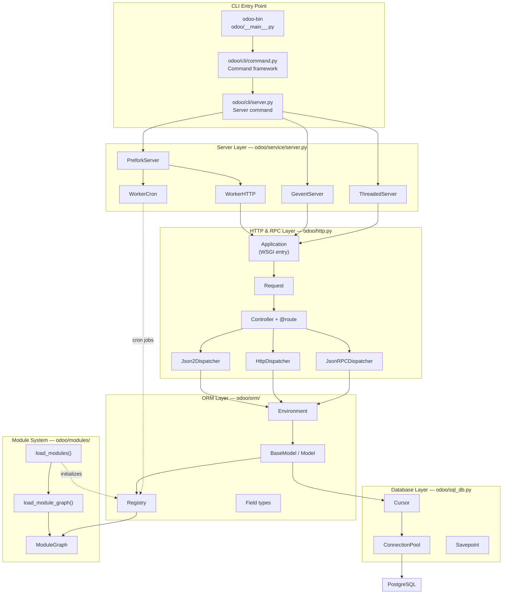
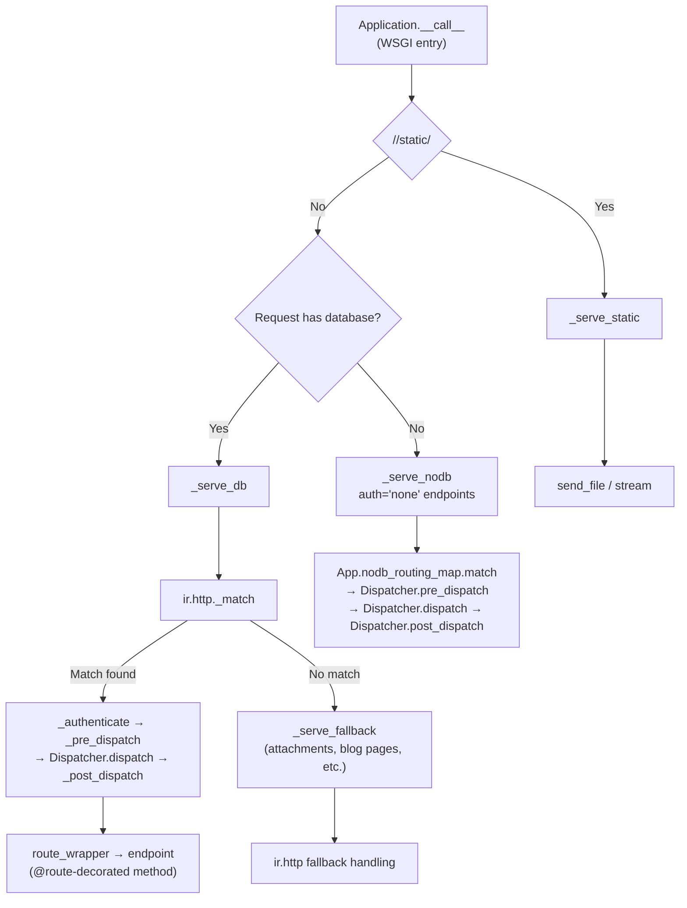

---
slug:8-architecture-overview
blog_type:normal
---


Odoo 19.0 is a full-stack business application framework built on Python and PostgreSQL, orchestrating an ORM layer, an HTTP/RPC server, a modular addon ecosystem, and a PostgreSQL-backed persistence layer into a single cohesive runtime. This page maps the major subsystems, their boundaries, and the data paths that connect them — giving you the mental model needed before diving into any individual layer.

## High-Level System Architecture

At the macro level, Odoo can be understood as five cooperating subsystems arranged in concentric layers around the PostgreSQL database. The CLI entry point bootstraps configuration, the server layer manages process lifecycle and concurrency, the HTTP layer dispatches web and RPC requests, the ORM mediates all data access, and the module system wires everything together at startup.



Sources: [__main__.py](odoo/__main__.py#L1-L4), [server.py](odoo/service/server.py#L462-L873), [http.py](odoo/http.py#L2669-L2871)

## Entry Point and CLI Framework

Execution begins at `odoo-bin`, which delegates to `odoo/__main__.py`. This single line imports and calls `main()` from `odoo.cli.command`, establishing the pluggable command architecture. The `Command` base class uses `__init_subclass__` to automatically register every subclass into a global `commands` dictionary, enabling both internal commands (shipped in `odoo/cli/`) and addon-provided commands (discovered via `load_addons_commands()` scanning each addon's `cli/` directory).

The default command is `Server` in `odoo/cli/server.py`, which performs pre-flight checks (root user warning, PostgreSQL user validation, PID file setup) before calling `odoo.service.server.start()`. This chain — `main()` → `Command.run()` → `server.start()` — is the universal bootstrap path regardless of whether you run the server, a shell, a scaffold generator, or a migration tool.

Sources: [command.py](odoo/cli/command.py#L20-L68), [server.py (cli)](odoo/cli/server.py#L95-L126), [__main__.py](odoo/__main__.py#L1-L4)

## Server Layer — Process Models and Concurrency

The server layer in `odoo/service/server.py` implements three distinct concurrency models, all sharing a common `CommonServer` base that manages socket lifecycle and shutdown hooks. The choice of server determines how requests are handled at the OS level and directly impacts scalability characteristics.

| Server Class | Concurrency Model | Use Case | Worker Types |
|---|---|---|---|
| `ThreadedServer` | One process, multiple threads via `ThreadedWSGIServerReloadable` | Development, testing, small deployments | Thread-based (HTTP + cron daemon thread) |
| `GeventServer` | Coroutine-based via gevent monkey-patching | Long-polling, live chat, websocket | Single-process cooperative multitasking |
| `PreforkServer` | Master process + forked worker children | Production, high concurrency | `WorkerHTTP` and `WorkerCron` processes |

The `PreforkServer` is architecturally the most significant. It follows a (g)unicorn-inspired pattern where a master process accepts connections and manages a pool of forked workers. Two worker classes exist: `WorkerHTTP` processes HTTP requests, while `WorkerCron` exclusively handles scheduled jobs using PostgreSQL `NOTIFY` channels for wake-up signaling — with deliberate jitter ("Steve Reich timing style") to mitigate the thundering herd effect [server.py#L530-L537](odoo/service/server.py#L530-L537). The master monitors worker health via pipes, respawning workers that exceed memory or time limits.

Sources: [server.py](odoo/service/server.py#L416-L755), [server.py](odoo/service/server.py#L867-L873), [server.py](odoo/service/server.py#L1215-L1390)

## HTTP and RPC Dispatch Layer

The `Application` class in `odoo/http.py` is Odoo's WSGI application — a single callable that receives every incoming HTTP request and routes it through a layered dispatch pipeline. The module's extensive docstring (lines 2–127) provides the definitive call graph, which can be summarized as three serving strategies depending on request path and database state.



Three `Dispatcher` subclasses handle different content types: `HttpDispatcher` for standard HTML/HTTP endpoints, `JsonRPCDispatcher` for JSON-RPC 1.0, and `Json2Dispatcher` for the newer JSON-RPC 2.0 protocol. Each deserializes the request body according to `@route(type=...)`, invokes the controller method, and serializes the return value into a `Response`. The `Controller` base class and `@route` decorator together form the public API that module developers interact with most frequently.

Session management is handled by `Session` (a `MutableMapping`) backed by `FilesystemSessionStore`, with session identifiers scattered across 4096 filesystem directories for performance. Sessions carry authentication state (`uid`, `db`, `login`), context preferences, and CSRF tokens, with automatic rotation every 3 hours.

Sources: [http.py](odoo/http.py#L2-L127), [http.py](odoo/http.py#L676-L725), [http.py](odoo/http.py#L2362-L2669), [http.py](odoo/http.py#L965-L1109)

## ORM Layer — The Core Abstraction

The Object-Relational Mapping layer in `odoo/orm/` is the architectural heart of Odoo. Every business entity — contacts, invoices, products — is expressed as a Python class inheriting from `BaseModel`. The ORM provides a comprehensive abstraction over PostgreSQL, handling schema generation, query building, caching, access control, and computed field dependency management within a single coherent framework.

### Model Hierarchy

Three concrete model types exist, all ultimately descending from `BaseModel`:

| Model Type | Python Class | Database Table | Persistence | Typical Use |
|---|---|---|---|---|
| Abstract | `AbstractModel` | None | Transient (in-memory) | Reusable mixins (`mail.thread`, `image.mixin`) |
| Persistent | `Model` | Yes (auto-created) | Permanent | Core business objects |
| Transient | `TransientModel` | Yes | Auto-vacuum (daily) | Wizards, temporary data |

The `MetaModel` metaclass drives model registration. When a model class is defined, `MetaModel.__new__` collects field definitions and `_inherit` declarations, storing them in a module-scoped registry `_module_to_models__`. This deferred registration pattern allows the module loading system to resolve inheritance chains later.

### Environment and Transaction Management

The `Environment` class (in `environments.py`) encapsulates the complete execution context for a single database transaction: a database cursor (`cr`), user ID (`uid`), immutable context dictionary (`context`), and superuser flag (`su`). Environments are read-only after creation — switching user, context, or database requires creating a new environment via `with_user()`, `with_context()`, `sudo()`, or `with_env()`.

Each environment owns a `Transaction` object, which in turn holds a `Cache` — a sophisticated multi-field, per-record cache that tracks both clean and dirty states. The cache supports lazy field fetching (prefetching), computed field invalidation, and dirty flag management, ensuring that the ORM can batch database operations efficiently.

Sources: [models.py](odoo/orm/models.py#L206-L334), [models.py](odoo/orm/models.py#L334-L494), [environments.py](odoo/orm/environments.py#L40-L120), [models/__init__.py](odoo/models/__init__.py#L1-L32)

## Registry — One per Database

The `Registry` class (in `odoo/orm/registry.py`) is the central index mapping model names to their fully-resolved Python classes. Critically, **there is exactly one Registry instance per database**, stored in a process-wide LRU cache at `Registry.registries`. The registry is populated during module loading and provides:

- **Model resolution**: `registry['res.partner']` returns the `Model` class for that model
- **Field trigger trees**: A `TriggerTree` data structure encoding the full transitive closure of computed field dependencies, used for efficient recomputation when fields are modified
- **Schema lifecycle**: `init_models()` calls `_auto_init()` on each model to create or migrate database tables
- **Inter-process signaling**: PostgreSQL `NOTIFY`/`LISTEN` channels coordinate cache and registry invalidation across worker processes

When a module is installed, updated, or uninstalled, the registry is marked as invalidated. The `check_signaling()` method, called at the start of each request, detects this and triggers a full registry reload — ensuring all workers eventually converge to the same state.

Sources: [registry.py](odoo/orm/registry.py#L86-L140), [registry.py](odoo/orm/registry.py#L399-L513), [registry.py](odoo/orm/registry.py#L1021-L1097)

## Module System — Dependency Graph and Loading

The module system in `odoo/modules/` governs how addons are discovered, ordered, and initialized. Each module declares its dependencies in a `__manifest__.py` file, and the `ModuleGraph` class resolves these into a topologically-sorted loading order based on `(phase, depth, name)` tuples — where `phase` distinguishes initialization stages and `depth` measures the longest dependency chain from the `base` module.

The `load_modules()` function is the master orchestrator: it reads the current module states from the database, builds the dependency graph, determines which modules need installing, updating, or upgrading, and then calls `load_module_graph()` to process them in order. For each module, the loader executes data files (views, security rules, demo data), calls model setup hooks, and registers any new models into the registry.

Sources: [loading.py](odoo/modules/loading.py#L115-L340), [module_graph.py](odoo/modules/module_graph.py#L137-L267)

## Database Connectivity Layer

The `odoo/sql_db.py` module provides a connection pooling layer built on `psycopg2`. The `ConnectionPool` maintains a configurable pool of `PsycoConnection` instances (default max: 64), borrowed and returned by the ORM's cursor factory. Two separate pools exist — one for read/write connections and one for read-only replica connections — enabling basic read scaling.

The `Cursor` class wraps a psycopg2 cursor with Odoo-specific instrumentation: automatic SQL logging with query categorization (`FROM` vs `INTO`), connection debugging, savepoint management via context managers, and thread-local transaction tracking. The `BaseCursor` abstract class manages pre-commit and post-commit hooks, ensuring that ORM-level flush operations integrate cleanly with raw SQL transactions.

Sources: [sql_db.py](odoo/sql_db.py#L604-L743), [sql_db.py](odoo/sql_db.py#L156-L280), [sql_db.py](odoo/sql_db.py#L4-L8)

## Core Source Layout

```
odoo/
├── __main__.py                  # Entry point → cli.command.main()
├── cli/                         # Command-line framework
│   ├── command.py               # Command base class + registry
│   ├── server.py                # Default "server" command
│   ├── scaffold.py              # Module scaffolding generator
│   ├── shell.py                 # Interactive Python shell
│   └── ...                      # db, deploy, i18n, migrate, etc.
├── service/
│   ├── server.py                # ThreadedServer, GeventServer, PreforkServer
│   ├── common.py                # RPC version 1 endpoints (login, version)
│   ├── model.py                 # RPC model dispatch
│   └── security.py              # Password hashing
├── http.py                      # WSGI Application, Request, Controller, Route
├── sql_db.py                    # ConnectionPool, Cursor, Savepoint
├── models/                      # Public ORM exports
├── orm/
│   ├── models.py                # BaseModel, Model, MetaModel (~7000 lines)
│   ├── environments.py          # Environment, Transaction, Cache
│   ├── registry.py              # Registry, TriggerTree
│   ├── fields.py                # Field base class
│   ├── fields_*.py              # Specialized field types
│   ├── domains.py               # Domain expression parsing
│   └── ...
├── modules/
│   ├── loading.py               # Module graph executor
│   ├── module_graph.py          # ModuleGraph, ModuleNode
│   ├── module.py                # Manifest parsing
│   ├── registry/                # Registry initialization stub
│   └── migration.py             # Migration framework
├── addons/                      # First-party addon modules
│   └── base/                    # Foundation module (always installed)
└── netsvc.py                    # Logging infrastructure
```

Sources: [__main__.py](odoo/__main__.py#L1-L4), [server.py](odoo/service/server.py#L416-L873), [http.py](odoo/http.py#L2669-L2871)

## Request Lifecycle — End to End

Tracing a single HTTP request through the entire stack reveals how the layers interconnect. When a browser requests `/web/webclient/load_menus`, the flow passes through every subsystem:

1. **Socket acceptance**: The `PreforkServer` master (or `ThreadedServer`) accepts the TCP connection and dispatches to a worker
2. **WSGI invocation**: The worker calls `Application.__call__()`, which wraps the raw WSGI environ in an Odoo `Request`
3. **Database resolution**: The request's session cookie identifies the database; a read-only cursor is opened via `ConnectionPool.borrow()`
4. **Registry lookup**: The cursor is used to retrieve the `Registry` for the identified database
5. **Environment creation**: An `Environment` is constructed from the cursor, session user, and context
6. **Route matching**: `ir.http._match()` resolves the URL to a `@route`-decorated controller method
7. **Authentication and authorization**: `ir.http._authenticate()` verifies the user satisfies the route's `auth=` requirement
8. **Dispatch**: The `HttpDispatcher` calls the controller method within a managed transaction, with automatic serialization error recovery
9. **Response serialization**: The controller's return value is wrapped in a `Response` with appropriate headers (CSP, CORS)
10. **Transaction cleanup**: The cursor commits or rolls back, and the connection returns to the pool

<CgxTip>
The critical insight for debugging Odoo is that **the Registry is the single source of truth for what models exist and how they relate**. When inheritance seems broken, when fields are missing, or when computed fields don't recompute, the root cause is almost always a stale registry. The `check_signaling()` method at the start of each request handles this automatically in production, but during development with `ThreadedServer` and auto-reload, registry inconsistencies can surface if module code changes aren't fully picked up.
</CgxTip>

## Where to Go Next

This overview has mapped the territory. Each subsystem has its own dedicated deep-dive page in this documentation:

- **ORM internals**: Start with [BaseModel and Model Hierarchy](9-basemodel-and-model-hierarchy) to understand how models are defined, then proceed to [Field Types and Definitions](10-field-types-and-definitions) and [Recordset Operations](11-recordset-operations)
- **HTTP layer**: [WSGI Application and Request Lifecycle](13-wsgi-application-and-request-lifecycle) traces the full request path in detail, while [Controller and Route System](14-controller-and-route-system) covers the developer-facing routing API
- **Module system**: [Module Loading and Registry](17-module-loading-and-registry) explains how addons are wired into the framework at startup
- **Deployment**: [Server Modes and Workers](20-server-modes-and-workers) provides configuration guidance for choosing between Threaded, Gevent, and Prefork modes

For a broader introduction before diving deeper, revisit [Project Structure and Layout](3-project-structure-and-layout) or [CLI Commands Reference](4-cli-commands-reference) to understand the developer tooling.