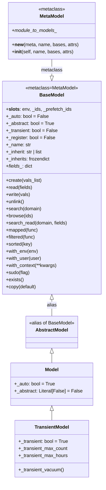
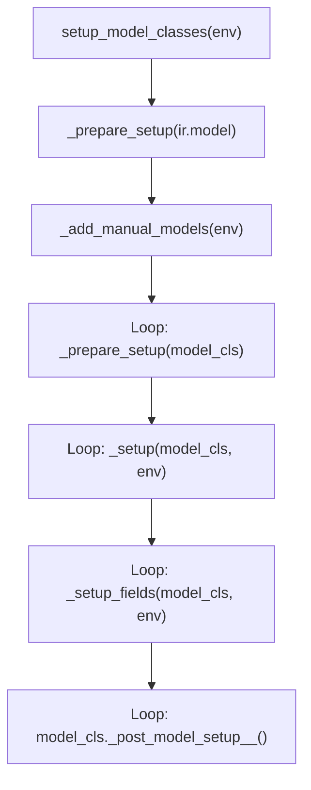

---
slug:9-basemodel-and-model-hierarchy
blog_type:normal
---


Every record in Odoo — whether a partner, an invoice, or a wizard — is an instance of a model class rooted in `BaseModel`. Understanding this hierarchy is the prerequisite for making sense of field definitions, recordset operations, search domains, and every other ORM subsystem. This page traces the architectural spine from the metaclass that manufactures model classes down to the three concrete model variants developers use daily.

Sources: [models/__init__.py](/odoo/models/__init__.py#L1-L32)

## The Three Model Variants

Odoo provides exactly three model super-classes, each a thin specialization layer over `BaseModel`. They differ in whether they persist to the database and what access-control policy they enforce.

| Super-class | Database Table | Access Rights | Typical Use |
|---|---|---|---|
| `AbstractModel` | No | N/A | Shared mixins (`mail.thread`, `image.mixin`) |
| `Model` | Yes (auto-created) | Full CRUD via `ir.model.access` / `ir.rules` | Business objects (`res.partner`, `sale.order`) |
| `TransientModel` | Yes (auto-vacuumed) | Owner-only + superuser | Wizards, temporary dialogs |

`AbstractModel` is literally an alias — `AbstractModel = BaseModel` at line 7043 of `models.py` — so it inherits every method `BaseModel` defines. `Model` overrides three structural attributes: `_auto = True`, `_register = False`, and `_abstract = False`, which together instruct the ORM to create a PostgreSQL table and register the class as a concrete model.

Sources: [models.py](/odoo/orm/models.py#L7043-L7061), [models_transient.py](/odoo/orm/models_transient.py#L10-L27)

## Class Hierarchy Diagram



The diagram reveals a key design insight: **the entire behavioral surface of every Odoo model lives in `BaseModel`** (over 6600 lines). The subclasses exist solely to flip structural switches that control database persistence and lifecycle.

## MetaModel: The Class Factory

Before any model class exists, Python's metaclass machinery runs `MetaModel.__new__` and `MetaModel.__init__`. These two methods perform the critical bootstrapping that turns a Python class definition into something the ORM can recognize and register.

During `__new__`, the metaclass enforces the naming convention: every class must live under `odoo.addons.<module>`, and its `_name` is auto-derived from the class name by inserting dots before uppercase characters (e.g., `ResPartner` → `res.partner`) if `_name` is not explicitly declared. It also initializes the `_field_definitions` and `_table_object_definitions` lists that collect field and constraint objects as they are assigned to the class body.

During `__init__`, the metaclass does two things. First, it registers the model definition in a module-level registry (`_module_to_models__`), mapping each Odoo module name to the list of model classes it defines. Second, for non-abstract models with `_auto` enabled, it injects the **magic fields**: `id`, `create_uid`, `create_date`, `write_uid`, and `write_date` — collectively known as `MAGIC_COLUMNS`. The `id` field is always a `fields.Id` instance; the four log-access fields are `Many2one` and `Datetime` fields marked `readonly`.

Sources: [models.py](/odoo/orm/models.py#L206-L310)

## From Model Definition to Registry Class

The distinction between a **model definition** and a **model class** (also called a registry class) is fundamental. A model definition is the Python class a developer writes in a module file. A model class is the fully assembled class the ORM constructs at registry load time, merging all definitions that contribute to the same `_name`.

Two utility functions in `model_classes.py` make this distinction explicit:

- `is_model_definition(cls)` returns `True` when `cls` is a `MetaModel` instance but `cls.pool is None` — meaning it has not yet been registered.
- `is_model_class(cls)` returns `True` when `cls.pool is not None` — meaning it lives in the registry.

The bridge between them is `add_to_registry(registry, model_def)`. This function performs the following steps:

1. **Implicit `base` inheritance**: every model except `base` itself automatically gains `base` as a parent, ensuring all models share a common foundation of methods and fields.
2. **Class creation or extension**: if the model's `_name` already exists in the registry (an in-place extension via `_inherit` without `_name`), the existing class is extended. Otherwise, `type()` dynamically creates a new class with a `pool` attribute pointing to the registry.
3. **Base class resolution**: the function builds a `LastOrderedSet` of all base classes from the model's `_inherit` targets, checking for circular inheritance and validating parent compatibility.
4. **Attribute initialization**: `_init_model_class_attributes` copies class-level attributes from the model definition into the registry class.
5. **Transience validation**: transient models must have `_log_access` enabled, because the vacuum policy relies on `write_date` to determine record age.
6. **Descendant invalidation**: all models that inherit from the modified model are marked for re-setup.

Sources: [model_classes.py](/odoo/orm/model_classes.py#L142-L230)

## Setup Lifecycle: Preparing the Model for Use

Once all model definitions are registered, the ORM runs a three-phase setup through `setup_model_classes(env)`:



**Phase 1 — `_prepare_setup`**: Assigns the accumulated `_base_classes__` tuple to `model_cls.__bases__` (deferred from `add_to_registry` because changing `__bases__` is expensive). Resets memoized constraint/onchange property caches.

**Phase 2 — `_setup`**: This is where the field dictionary is fully constructed. The function walks the model's MRO in reverse, collecting field definitions from every model definition class. When a field has been overridden by a child module, the function creates a composite field whose `_base_fields__` tuple preserves every definition in order. It then runs `_check_inherits()` to validate delegation fields, recursively sets up parent models, and calls `_add_inherited_fields()` to surface delegated fields as related fields on the child model. Finally, it determines `_rec_name` (defaulting to `"name"` or `"x_name"` for custom models) and `_active_name` (defaulting to `"active"` or `"x_active"`).

**Phase 3 — `_setup_fields`**: Configures field metadata including compute dependencies, inverse relationships, and stored-field triggers. Calls `field.prepare_setup()` on every field.

After all three phases, `_post_model_setup__()` is invoked on each model — a hook for modules to perform final initialization that depends on the full registry being available.

Sources: [model_classes.py](/odoo/orm/model_classes.py#L301-L462)

## BaseModel Internals: Recordsets, Environment, and Slots

A model class in the registry is not a container for records — it is a **recordset factory**. Every operation that returns model data returns a new recordset instance. The `BaseModel.__init__` constructor at line 5869 makes this explicit:

```python
def __init__(self, env: Environment, ids: tuple[IdType, ...], prefetch_ids: Reversible[IdType]):
    self.env = env
    self._ids = ids
    self._prefetch_ids = prefetch_ids
```

The three instance attributes are the entirety of a recordset's state. The `env` property provides the `Environment` — an immutable mapping from model names to empty recordsets that also carries the database cursor (`cr`), user id (`uid`), and context (`context`). The `_ids` tuple holds the record identifiers. The `_prefetch_ids` iterable controls which additional records are loaded into cache when any record in the set is fetched, reducing the number of queries for common access patterns like iterating over search results.

<CgxTip>
A singleton recordset (one record) is not a special type — it is a recordset whose `_ids` tuple has length 1. The `ensure_one()` method simply asserts this, raising `ValueError("Expected singleton")` otherwise. This uniformity is why you should never check `type(record)` to determine if you have one record.
</CgxTip>

### Environment Switching Methods

Recordsets are immutable. Methods like `with_env()`, `with_user()`, `with_company()`, `with_context()`, and `sudo()` return **new recordset instances** with the same `_ids` but a different `env`. This is the mechanism by which Odoo handles multi-user, multi-company, and privilege-escalation scenarios without mutation.

| Method | Returns | Effect |
|---|---|---|
| `with_env(env)` | `Self` | Attach to a completely new environment |
| `with_user(user)` | `Self` | Switch to another user (superuser stays in su mode) |
| `with_company(company)` | `Self` | Switch allowed company in context |
| `with_context(**kwargs)` | `Self` | Merge overrides into context |
| `sudo(flag=True)` | `Self` | Enable/disable superuser mode |

Sources: [models.py](/odoo/orm/models.py#L5869-L5988), [environments.py](/odoo/orm/environments.py#L40-L250)

## Core Structural Attributes

The following table summarizes the class-level attributes that control model behavior. These are set on the model definition class and are read during setup.

| Attribute | Default | Purpose |
|---|---|---|
| `_name` | `None` | Technical name in dot-notation (e.g., `sale.order`) |
| `_description` | `None` | Human-readable name for UI labels |
| `_inherit` | `()` | Parent models to extend (Python inheritance) |
| `_inherits` | `frozendict()` | Delegation inheritance: `{parent_model: m2o_field}` |
| `_auto` | `False` | Whether the ORM auto-creates the database table |
| `_abstract` | `True` | Whether the model is abstract (no table) |
| `_transient` | `False` | Whether the model is transient (auto-vacuumed) |
| `_register` | `False` | Whether the class is visible in the ORM registry |
| `_table` | `''` | Explicit SQL table name (auto-derived from `_name` if empty) |
| `_table_query` | `None` | SQL expression for SQL-view-backed models |
| `_rec_name` | `None` | Field used for `display_name` computation |
| `_order` | `'id'` | Default ORDER BY clause |
| `_parent_name` | `'parent_id'` | Many2one field for tree hierarchy |
| `_parent_store` | `False` | Enable `parent_path` materialized path index |
| `_log_access` | follows `_auto` | Add `create_uid/date`, `write_uid/date` columns |
| `_check_company_auto` | `False` | Auto-verify company consistency on write/create |
| `_depends` | `frozendict()` | Flush dependencies for SQL-view models |
| `_allow_sudo_commands` | `True` | Allow O2M/M2M commands from sudo environments |

Sources: [models.py](/odoo/orm/models.py#L370-L465)

## TransientModel: Temporary Persistence

`TransientModel` inherits from `Model`, making it a database-persisted model with `_transient = True`. The class enforces `_log_access = True` (since the vacuum policy needs `write_date`). It introduces two configurable parameters:

- `_transient_max_hours`: maximum idle lifetime before automatic deletion (configured via `transient_age_limit` system parameter).
- `_transient_max_count`: maximum total rows before count-based cleanup triggers (configured via `osv_memory_count_limit`).

The `_transient_vacuum()` method, decorated with `@api.autovacuum`, is invoked by the `ir.autovacuum` cron job. It never deletes records modified in the last 5 minutes (a safety margin), and returns whether more rows remain to process — allowing the scheduler to batch deletions across multiple calls.

<CgxTip>
Transient models enforce owner-only access: regular users can only read and modify records they created. This is not an `ir.model.access` rule but is hardcoded into the access-check logic, making `TransientModel` inherently safe for wizard-like data that should never cross user boundaries.
</CgxTip>

Sources: [models_transient.py](/odoo/orm/models_transient.py#L10-L83)

## Key Model Categories in Practice

The public API surface exposed through `odoo/models/__init__.py` exports everything a module developer needs: `AbstractModel`, `Model`, `TransientModel`, `BaseModel`, `MetaModel`, and utility functions like `check_object_name`, `parse_read_group_spec`, and `regex_order`. The internal setup machinery lives in `odoo/orm/model_classes.py` and is not directly importable by module code.

To create a new model, a developer always subclasses one of the three variants and sets `_name`:

```python
from odoo import models, fields

class MyWidget(models.TransientModel):
    _name = 'my.widget'
    _description = 'My Temporary Widget'

    name = fields.Char(required=True)
```

To extend an existing model in-place, they set `_inherit` to the target `_name` without `_name`:

```python
class ResPartner(models.Model):
    _inherit = 'res.partner'

    custom_field = fields.Char()
```

To create a new model that inherits from existing models, they set both `_name` and `_inherit`:

```python
class SpecialPartner(models.Model):
    _name = 'special.partner'
    _inherit = 'res.partner'
    _description = 'Special Partner'
```

Sources: [models/__init__.py](/odoo/models/__init__.py#L1-L32)

## Where to Go Next

This page covered the structural skeleton of the ORM. The following pages in the catalog build directly on these foundations:

- **[Field Types and Definitions](10-field-types-and-definitions)** — how fields are declared, configured, and resolved during the `_setup` phase
- **[Recordset Operations](11-recordset-operations)** — the full API surface of recordsets: `mapped`, `filtered`, `sorted`, set operations, and iteration semantics
- **[Search Domains and Query Engine](12-search-domains-and-query-engine)** — how `search()`, `_search()`, and the Query object translate domain expressions into SQL
- **[Inheritance and Extension Patterns](19-inheritance-and-extension-patterns)** — the three inheritance mechanisms (Python, in-place extension, delegation) in depth
- **[Module Loading and Registry](17-module-loading-and-registry)** — how the registry assembles all model definitions across installed modules